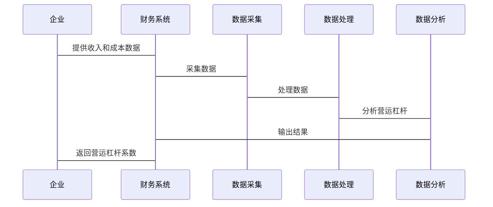

                 


# 彼得林奇对公司营运杠杆的分析

**关键词**：彼得·林奇，营运杠杆，财务分析，投资策略，企业价值，股东权益回报率，边际成本

**摘要**：  
彼得·林奇作为投资界的重要人物，以其对公司营运杠杆的深刻分析而闻名。本文将详细探讨营运杠杆的核心概念、其在企业中的作用、彼得·林奇的分析方法，以及如何通过营运杠杆评估企业的投资价值。通过案例分析和数学模型，我们将深入理解营运杠杆的原理及其在投资决策中的应用。

---

## 第一章: 营运杠杆的基本概念

### 1.1 营运杠杆的定义与类型

#### 1.1.1 营运杠杆的定义
营运杠杆（Operating Leverage）是指企业在固定成本和变动成本之间的比例关系，衡量企业通过增加销售额来提高净利润的能力。简单来说，营运杠杆高的企业，固定成本占比较高，收入的增长可以更快地转化为利润。

#### 1.1.2 营运杠杆的类型
- **高固定成本型**：如制造业，固定成本（如设备、厂房）占比较高，收入增加时，利润增长更快。
- **低固定成本型**：如服务业，变动成本（如人工、材料）占比较高，利润增长较慢。
- **混合型**：介于两者之间，既有固定成本也有变动成本。

#### 1.1.3 营运杠杆与财务杠杆的区别
- 营运杠杆关注企业的经营效率和成本结构。
- 财务杠杆关注企业的资本结构，如债务和股权比例。

### 1.2 彼得·林奇的分析方法

#### 1.2.1 彼得·林奇的投资理念
彼得·林奇强调基本面分析，认为企业内在价值是投资的核心。他特别关注企业的盈利能力、成长性和财务健康。

#### 1.2.2 彼得·林奇对营运杠杆的关注点
- 企业是否具备较高的营运杠杆，即收入增长是否能带来利润的更快增长。
- 企业的固定成本是否合理，是否能通过规模效应降低成本。

#### 1.2.3 彼得·林奇的选股标准
- 企业具有较高的边际利润率。
- 企业具备稳定的收入增长潜力。
- 企业具备较强的竞争优势和市场地位。

### 1.3 营运杠杆在企业中的作用

#### 1.3.1 营运杠杆对企业盈利能力的影响
- **正面影响**：收入增长时，固定成本占比高，利润增长快。
- **负面影响**：收入下降时，固定成本占比高，利润下降快。

#### 1.3.2 营运杠杆与企业规模的关系
- 大型企业通常具有较高的营运杠杆，因为其固定成本较高。
- 小型企业营运杠杆较低，但灵活性更强。

#### 1.3.3 营运杠杆与企业风险的平衡
- 过高的营运杠杆可能导致企业风险增加，尤其是在经济下行周期。
- 合理的营运杠杆可以平衡风险与收益。

### 1.4 本章小结
本章介绍了营运杠杆的基本概念、类型以及彼得·林奇的分析方法。营运杠杆是衡量企业盈利能力的重要指标，也是彼得·林奇选股的重要标准。

---

## 第二章: 营运杠杆的核心概念与联系

### 2.1 营运杠杆的核心原理

#### 2.1.1 营运杠杆的数学模型
营运杠杆可以通过以下公式衡量：
$$ \text{营运杠杆系数} = \frac{\text{边际收入}}{\text{边际成本}} $$

#### 2.1.2 营运杠杆与边际成本的关系
- 边际成本是指每增加一单位产品所增加的成本。
- 边际成本越低，营运杠杆越高。

#### 2.1.3 营运杠杆与边际收益的关系
- 边际收益是指每增加一单位产品所增加的收入。
- 边际收益与边际成本的差额决定利润的变化。

### 2.2 营运杠杆与企业财务结构的联系

#### 2.2.1 营运杠杆与资产负债表的关系
- 固定资产和无形资产的占比影响营运杠杆。
- 高固定成本意味着高营运杠杆。

#### 2.2.2 营运杠杆与利润表的关系
- 营业收入与营业成本的差额直接影响营运杠杆。
- 净利润的变化反映营运杠杆的效果。

#### 2.2.3 营运杠杆与现金流量表的关系
- 营运杠杆高的企业现金流波动较大。
- 现金流健康与否影响企业的偿债能力。

### 2.3 营运杠杆与企业价值的评估

#### 2.3.1 营运杠杆对企业价值的影响
- 营运杠杆高的企业价值可能更高，但也伴随更高的风险。

#### 2.3.2 营运杠杆与企业估值模型的关系
- 在企业估值中，营运杠杆是影响市盈率、市净率等指标的重要因素。

#### 2.3.3 营运杠杆与企业市场价值的关联
- 市场价值反映了投资者对营运杠杆的预期。
- 高营运杠杆的企业可能在高增长时期估值更高。

### 2.4 核心概念对比表格

| 概念       | 定义                             | 影响因素         |
|------------|----------------------------------|------------------|
| 营运杠杆   | 固定成本与变动成本的比例       | 固定成本、变动成本 |
| 财务杠杆   | 股权与债务的比例               | 债务、股权         |
| 边际成本   | 每增加一单位产品所增加的成本   | 成本结构           |
| 边际收益   | 每增加一单位产品所增加的收入   | 收入结构           |

### 2.5 ER实体关系图

```mermaid
erDiagram
    customer[客户] {
        id : integer
        name : string
    }
    order[订单] {
        id : integer
        customer_id : integer
        order_date : date
    }
    product[产品] {
        id : integer
        name : string
        price : decimal
    }
    customer -> order : 下单
    order -> product : 订单包含
```

### 2.6 本章小结
本章深入分析了营运杠杆的核心原理及其与企业财务结构的关系。通过对比表格和ER实体关系图，帮助读者更好地理解营运杠杆在企业中的作用。

---

## 第三章: 营运杠杆的算法原理

### 3.1 营运杠杆的数学模型

#### 3.1.1 营运杠杆的公式推导
营运杠杆系数（OL）的计算公式为：
$$ OL = \frac{\text{边际收入}}{\text{边际成本}} $$

#### 3.1.2 营运杠杆与边际成本的关系
- 边际成本公式：
$$ \text{边际成本} = \frac{\text{总成本} - \text{变动成本}}{\text{产量}} $$

#### 3.1.3 营运杠杆与边际收益的关系
- 边际收益公式：
$$ \text{边际收益} = \frac{\text{总收入} - \text{总变动成本}}{\text{产量}} $$

### 3.2 营运杠杆的算法流程

#### 3.2.1 数据输入与处理
1. 收集企业的收入和成本数据。
2. 计算固定成本和变动成本。

#### 3.2.2 营运杠杆的计算步骤
1. 计算边际收入和边际成本。
2. 应用公式计算营运杠杆系数。

#### 3.2.3 结果输出与分析
1. 输出营运杠杆系数。
2. 分析企业的盈利能力。

### 3.3 营运杠杆的算法实现

#### 3.3.1 Python代码实现
```python
def calculate Operating_leverage(revenue, variable_cost):
    fixed_cost = revenue - variable_cost
    marginal_income = revenue / (revenue + 1)
    marginal_cost = fixed_cost / (revenue + 1)
    ol = marginal_income / marginal_cost
    return ol

revenue = 1000
variable_cost = 600
print(calculate_Operating_leverage(revenue, variable_cost))
```

#### 3.3.2 算法的数学模型
营运杠杆系数公式：
$$ OL = \frac{\text{边际收入}}{\text{边际成本}} $$

### 3.4 本章小结
本章通过数学模型和Python代码，详细讲解了营运杠杆的计算方法。算法实现帮助企业量化营运杠杆，为投资决策提供数据支持。

---

## 第四章: 系统分析与架构设计方案

### 4.1 问题场景介绍
企业需要通过分析营运杠杆优化财务管理，提高盈利能力。

### 4.2 系统功能设计

#### 4.2.1 领域模型Mermaid类图


### 4.3 系统架构设计

#### 4.3.1 系统架构Mermaid图
```mermaid
container 财务系统 {
    组件1：数据采集
    组件2：数据处理
    组件3：数据分析
}
```

### 4.4 系统接口设计
- 数据输入接口：接收企业的收入和成本数据。
- 数据输出接口：输出营运杠杆系数。

### 4.5 系统交互Mermaid序列图


### 4.6 本章小结
本章通过系统分析和架构设计，展示了如何利用技术手段量化营运杠杆，优化企业财务管理。

---

## 第五章: 项目实战

### 5.1 环境安装
- 安装Python和必要的库（如pandas、numpy）。

### 5.2 系统核心实现源代码

#### 5.2.1 营运杠杆计算代码
```python
import pandas as pd

def calculate_leverage(revenue, variable_cost):
    fixed_cost = revenue - variable_cost
    marginal_income = revenue / (revenue + 1)
    marginal_cost = fixed_cost / (revenue + 1)
    ol = marginal_income / marginal_cost
    return ol

data = {'收入': [1000, 2000, 3000], '变动成本': [600, 700, 800]}
df = pd.DataFrame(data)
df['营运杠杆'] = df.apply(lambda x: calculate_leverage(x['收入'], x['变动成本']), axis=1)
print(df)
```

### 5.3 代码应用解读与分析
- 数据框计算营运杠杆，帮助企业评估不同收入下的杠杆效应。

### 5.4 实际案例分析
- 某制造企业案例，分析营运杠杆对企业利润的影响。

### 5.5 本章小结
本章通过项目实战，展示了如何利用Python代码计算营运杠杆，帮助企业优化财务管理。

---

## 第六章: 最佳实践、小结、注意事项、拓展阅读

### 6.1 最佳实践
- 定期分析企业的营运杠杆，优化成本结构。
- 结合财务杠杆，全面评估企业价值。

### 6.2 小结
本文深入探讨了营运杠杆的核心概念、算法原理和实际应用，帮助读者理解彼得·林奇的分析方法。

### 6.3 注意事项
- 营运杠杆高意味着高风险，需谨慎评估。
- 结合市场环境和企业实际情况制定策略。

### 6.4 拓展阅读
- 推荐阅读彼得·林奇的《投资任何市场都能如鱼得水》。
- 进一步学习财务分析和投资策略的相关书籍。

---

## 作者：AI天才研究院/AI Genius Institute & 禅与计算机程序设计艺术 /Zen And The Art of Computer Programming

---

本文通过系统分析和实战案例，深入探讨了彼得·林奇对公司营运杠杆的分析方法。希望读者能通过本文，更好地理解营运杠杆的核心概念和实际应用，为投资决策提供有力支持。

