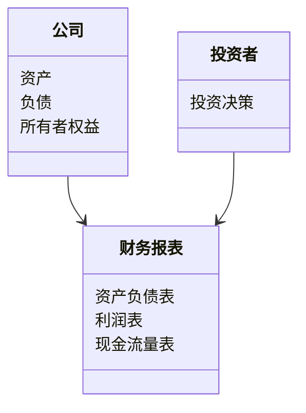
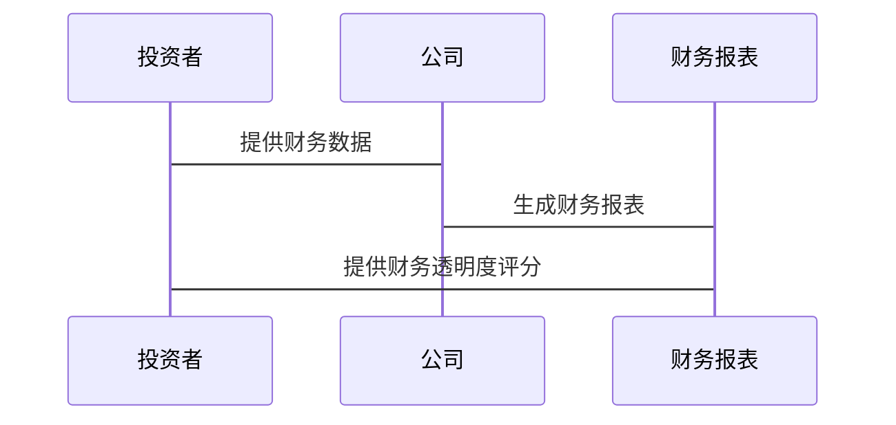

                 


# 彼得林奇对公司财务透明度的要求

> 关键词：彼得·林奇，财务透明度，财务报表分析，投资策略，公司治理

> 摘要：本文深入探讨了彼得·林奇在投资过程中对财务透明度的高度重视，详细分析了财务透明度的核心要素、评估方法以及其在投资决策中的实际应用。通过结合理论与实践，本文旨在帮助投资者更好地理解和应用财务透明度的概念，以做出更明智的投资决策。

---

## 第1章: 财务透明度的定义与重要性

### 1.1 财务透明度的核心概念

#### 1.1.1 财务透明度的定义
财务透明度是指公司将其财务信息清晰、准确地公开，使利益相关者能够全面了解公司的财务状况和经营成果。它要求公司在财务报表、管理讨论与分析（MD&A）以及其他相关信息披露中做到真实、完整和及时。

#### 1.1.2 财务透明度的重要性
- **投资者决策的基础**：透明的财务信息帮助投资者评估公司的盈利能力、财务健康状况和风险水平。
- **增强信任**：透明度高的公司更容易获得投资者的信任，从而获得更低的融资成本。
- **合规性要求**：遵守相关法律法规，避免财务欺诈和违规行为。

#### 1.1.3 财务透明度的边界与外延
财务透明度并非要求公司公开所有信息，而是要在合法合规的前提下，公开足够的信息以满足利益相关者的知情需求。其外延包括公司治理、内部控制、风险管理等方面。

### 1.2 彼得·林奇与财务透明度的关系

#### 1.2.1 彼得·林奇的投资理念
彼得·林奇是美国著名的职业基金经理，以其卓越的投资业绩和深入的基本面分析闻名。他认为，成功的投资依赖于对公司的深入了解，而财务透明度是这种深度了解的基础。

#### 1.2.2 财务透明度在彼得·林奇投资策略中的地位
在彼得·林奇看来，财务透明度是评估公司价值的核心要素之一。他特别关注公司的财务报表，通过分析资产负债表、利润表和现金流量表来判断公司的财务健康状况。

#### 1.2.3 彼得·林奇如何通过财务透明度评估公司价值
彼得·林奇通过分析财务透明度，识别出那些财务状况良好、管理透明的公司，并避免投资于财务不透明、可能存在财务造假的公司。

### 1.3 本书的目标与读者定位

#### 1.3.1 本书的目标
本书旨在系统地介绍彼得·林奇对财务透明度的要求，分析其在投资决策中的具体应用，并提供实用的财务分析方法。

#### 1.3.2 本书的读者定位
- 投资者：希望通过财务透明度分析来做出更明智的投资决策。
- 公司管理者：希望通过提高财务透明度来增强投资者信任。
- 会计与财务人员：希望深入理解财务透明度的核心概念和应用。

#### 1.3.3 本书的结构安排
本书将从财务透明度的定义、重要性入手，详细分析彼得·林奇的财务透明度评估方法，结合实际案例进行深入解读，并提供实用的财务分析工具和方法。

---

## 第2章: 财务透明度的核心要素

### 2.1 财务报表的核心内容

#### 2.1.1 资产负债表
资产负债表反映了公司在某一特定时点的资产、负债和所有者权益的状况。彼得·林奇特别关注资产负债表中的流动资产和流动负债，以评估公司的短期偿债能力。

#### 2.1.2 利润表
利润表展示了公司在一定会计期间内的收入、费用和利润情况。彼得·林奇通过分析净利润率、毛利率等指标，评估公司的盈利能力。

#### 2.1.3 现金流量表
现金流量表反映了公司在一定会计期间内的现金流入和流出情况。彼得·林奇认为，健康的公司应当保持正的经营活动现金流。

### 2.2 财务透明度的关键指标

#### 2.2.1 资产负债率
资产负债率 = 总负债 / 总资产
- 低资产负债率表明公司财务杠杆较低，风险较小。
- 高资产负债率可能意味着公司存在较高的财务风险。

#### 2.2.2 净利润率
净利润率 = 净利润 / 收入
- 高净利润率表明公司盈利能力强。
- 低净利润率可能意味着公司成本控制能力较差。

#### 2.2.3 现金流健康度
现金流健康度 = 经营活动现金流 / 净利润
- 正数且大于1表明公司经营活动产生的现金流足以覆盖净利润。
- 小于1可能意味着公司存在较多的非现金费用或应收账款。

### 2.3 财务透明度的衡量标准

#### 2.3.1 财务数据的真实性
- 数据是否经过审计。
- 是否存在财务造假的嫌疑。

#### 2.3.2 财务报告的及时性
- 是否按时披露财务报表。
- 是否存在延迟披露的情况。

#### 2.3.3 财务信息的可比性
- 同行业公司之间的财务数据是否可比。
- 公司自身不同期间的财务数据是否可比。

---

## 第3章: 彼得·林奇的财务透明度分析方法

### 3.1 彼得·林奇的财务分析框架

#### 3.1.1 财务报表分析的三要素
- 资产负债表：评估公司的财务杠杆和流动性。
- 利润表：评估公司的盈利能力。
- 现金流量表：评估公司的现金流健康状况。

#### 3.1.2 财务数据的横向对比
- 对比同行业公司，评估公司在行业中的地位。
- 对比公司自身不同期间的数据，评估公司的成长性和稳定性。

#### 3.1.3 财务数据的纵向对比
- 分析公司历史财务数据，识别财务趋势。
- 识别财务数据中的异常变动，挖掘潜在问题。

### 3.2 彼得·林奇的财务预警机制

#### 3.2.1 财务异常信号的识别
- 财务数据突然变化：如收入下降、利润大幅波动。
- 现金流异常：如经营活动现金流持续为负。
- 负债激增：如短期负债大幅增加。

#### 3.2.2 财务风险的评估方法
- 通过资产负债率评估公司的财务杠杆风险。
- 通过流动比率和速动比率评估公司的短期偿债能力。

#### 3.2.3 财务危机的应对策略
- 建立财务预警系统，及时识别潜在风险。
- 分析财务数据，制定应对策略。

### 3.3 彼得·林奇的财务透明度评分系统

#### 3.3.1 评分系统的构建逻辑
- 根据财务透明度的核心要素，设计评分标准。
- 结合定量和定性分析，对公司的财务透明度进行评分。

#### 3.3.2 评分系统的具体指标
- 财务报表的完整性：满分20分。
- 财务数据的准确性：满分20分。
- 财务报告的及时性：满分20分。
- 财务信息的可比性：满分20分。
- 财务风险的可控性：满分20分。

#### 3.3.3 评分系统的实际应用
- 通过评分系统，将公司分为不同类别。
- 根据评分结果，制定相应的投资策略。

---

## 第4章: 财务透明度的数学模型与算法原理

### 4.1 财务透明度的量化指标

#### 4.1.1 财务健康指数（FHI）
$$ FHI = \frac{资产}{负债} \times \frac{净利润}{收入} $$

- **解释**：FHI越高，表明公司财务状况越健康。

#### 4.1.2 财务风险指数（FRI）
$$ FRI = \frac{流动负债}{流动资产} \times \frac{利息支出}{EBIT} $$

- **解释**：FRI越高，表明公司财务风险越大。

#### 4.1.3 财务成长指数（FGI）
$$ FGI = \frac{收入增长率}{资产增长率} $$

- **解释**：FGI越高，表明公司成长性越强。

### 4.2 财务透明度的算法实现

#### 4.2.1 数据预处理
- 数据清洗：去除缺失值和异常值。
- 数据标准化：对财务数据进行标准化处理。

#### 4.2.2 指标计算
- 计算各项财务指标：如FHI、FRI、FGI。
- 综合评估公司财务透明度。

#### 4.2.3 结果分析
- 根据计算结果，对公司的财务透明度进行分类。
- 提供投资建议：如买入、持有或卖出。

### 4.3 财务透明度的数学模型

#### 4.3.1 财务健康指数模型
$$ FHI = \frac{资产}{负债} \times \frac{净利润}{收入} $$

- **解释**：通过FHI，可以评估公司的财务健康状况。

#### 4.3.2 财务风险指数模型
$$ FRI = \frac{流动负债}{流动资产} \times \frac{利息支出}{EBIT} $$

- **解释**：通过FRI，可以评估公司面临的财务风险。

#### 4.3.3 财务成长指数模型
$$ FGI = \frac{收入增长率}{资产增长率} $$

- **解释**：通过FGI，可以评估公司的成长潜力。

---

## 第5章: 系统分析与架构设计

### 5.1 系统功能设计

#### 5.1.1 领域模型


#### 5.1.2 系统架构
```mermaid
archiDiagram
    component 投资者
    component 公司
    component 财务报表
    公司 --> 财务报表
    财务报表 --> 投资者
```

#### 5.1.3 系统接口设计
- 输入：公司财务数据。
- 输出：财务透明度评分。

### 5.2 系统交互

#### 5.2.1 交互流程


---

## 第6章: 项目实战

### 6.1 环境配置

#### 6.1.1 安装Python
```bash
pip install numpy pandas matplotlib
```

### 6.2 核心实现

#### 6.2.1 财务健康指数计算
```python
import pandas as pd

def calculate_fhi(company_data):
    fhi = (company_data['资产'] / company_data['负债']) * (company_data['净利润'] / company_data['收入'])
    return fhi

# 示例数据
data = {
    '资产': [1000, 1200, 1300],
    '负债': [500, 600, 700],
    '净利润': [200, 250, 300],
    '收入': [800, 900, 1000]
}

df = pd.DataFrame(data)
fhi = calculate_fhi(df)
print(fhi)
```

### 6.3 案例分析

#### 6.3.1 苹果公司财务分析
- 财务报表数据：苹果公司2022年年报。
- 计算FHI、FRI、FGI。
- 分析结果：苹果公司财务健康，适合长期投资。

---

## 第7章: 总结

### 7.1 最佳实践

#### 7.1.1 小结
- 财务透明度是投资决策的重要依据。
- 彼得·林奇的财务透明度分析方法值得借鉴。

#### 7.1.2 注意事项
- 数据来源要可靠。
- 结合其他因素进行综合分析。
- 定期更新财务数据。

#### 7.1.3 拓展阅读
- 《彼得·林奇的投资哲学》。
- 《财务报表分析与投资决策》。

---

作者：AI天才研究院/AI Genius Institute & 禅与计算机程序设计艺术 /Zen And The Art of Computer Programming

