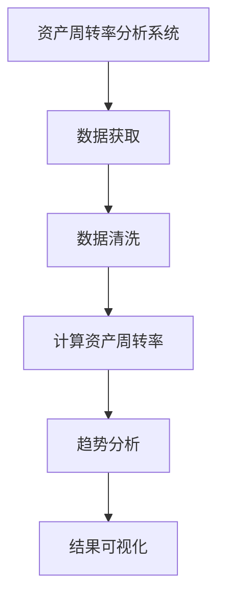
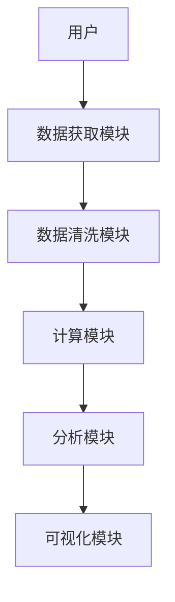

                 


# 彼得林奇对公司资产周转率趋势的分析

## 关键词：彼得林奇，资产周转率，投资分析，公司评估，财务指标

## 摘要：  
本文深入分析了彼得·林奇如何利用资产周转率这一关键财务指标来评估公司的投资价值。通过详细阐述资产周转率的定义、计算方法及其在投资分析中的应用，本文揭示了彼得·林奇独特的企业评估方法，并探讨了资产周转率在不同行业和市场周期中的表现。通过实际案例分析和数学模型的构建，本文为读者提供了如何通过资产周转率趋势预测企业绩效和投资价值的实用指南。

---

## 第一部分: 公司资产周转率的基础知识

### 第1章: 资产周转率的定义与计算

#### 1.1 资产周转率的定义与概念
资产周转率（Asset Turnover Ratio）是衡量公司资产使用效率的重要指标，反映了公司在一定时间内利用资产创造销售收入的能力。简单来说，资产周转率越高，说明公司利用资产的效率越高，盈利能力可能越强。

#### 1.2 资产周转率的公式与计算方法
资产周转率的计算公式为：
$$ \text{资产周转率} = \frac{\text{销售收入}}{\text{平均资产总额}} $$  
其中，平均资产总额为年初资产总额和年末资产总额的平均值。

通过以下步骤可以计算资产周转率：
1. 计算公司某一会计期间的销售收入。
2. 计算该期间的平均资产总额。
3. 将销售收入除以平均资产总额，得到资产周转率。

#### 1.3 资产周转率与企业绩效的关系
资产周转率与企业绩效密切相关。一般来说，资产周转率高的公司，其资产使用效率较高，能够更快地将资产转化为收入和利润。然而，资产周转率过低可能意味着公司资产利用效率低下，可能需要进一步优化资产结构。

---

### 第2章: 彼得·林奇的投资策略与分析方法

#### 2.1 彼得·林奇的投资理念
彼得·林奇是美国著名投资经理人，以其独特的投资策略和长期投资理念闻名。他认为，成功的投资需要深入研究公司的基本面，尤其是公司的资产质量和盈利能力。

#### 2.2 资产周转率在彼得·林奇分析中的作用
资产周转率是彼得·林奇评估公司的重要指标之一。他认为，资产周转率高的公司通常具有更强的盈利能力和成长潜力。在选股过程中，彼得·林奇倾向于选择那些资产周转率稳定且持续增长的公司。

#### 2.3 彼得·林奇如何分析资产周转率趋势
彼得·林奇通过分析资产周转率的长期趋势来判断公司的经营状况。他认为，资产周转率的持续增长表明公司资产利用效率提高，而资产周转率的下降可能意味着公司管理不善或行业竞争加剧。

---

### 第3章: 资产周转率的行业分析与趋势预测

#### 3.1 不同行业的资产周转率特点
不同行业的资产周转率差异较大。例如，制造业的资产周转率通常较高，而服务业的资产周转率可能较低。这是因为不同行业的资产构成和经营模式存在显著差异。

#### 3.2 资产周转率的周期性与趋势预测
资产周转率受经济周期的影响较大。在经济繁荣时期，资产周转率通常较高；而在经济衰退时期，资产周转率可能下降。通过分析资产周转率的周期性变化，可以更好地预测其未来趋势。

---

## 第二部分: 资产周转率的数学模型与算法

### 第4章: 资产周转率的数学模型

#### 4.1 资产周转率的基本公式
资产周转率的基本公式为：
$$ \text{资产周转率} = \frac{\text{销售收入}}{\text{平均资产总额}} $$  
其中，销售收入和平均资产总额是公司财务报表中的关键数据。

#### 4.2 资产周转率与企业绩效的关系模型
资产周转率与企业绩效的关系可以通过以下公式表示：
$$ \text{净利润} = \text{销售收入} \times \text{净利润率} $$  
$$ \text{股东权益回报率} = \frac{\text{净利润}}{\text{股东权益}} $$  
通过分析资产周转率与这些指标的关系，可以更好地评估公司的整体绩效。

#### 4.3 资产周转率的数学模型与公式
资产周转率的数学模型可以表示为：
$$ \text{资产周转率} = \frac{\text{销售收入}}{\text{平均资产总额}} $$  
其中，销售收入和平均资产总额是公司财务报表中的关键数据。

---

### 第5章: 资产周转率的算法实现

#### 5.1 资产周转率的计算算法
以下是计算资产周转率的Python代码示例：

```python
def calculate_asset_turnover(revenue, average_assets):
    return revenue / average_assets

# 示例数据
revenue = 1000000  # 销售收入
assets_2022 = 500000  # 2022年资产
assets_2023 = 600000  # 2023年资产
average_assets = (assets_2022 + assets_2023) / 2  # 平均资产

turnover = calculate_asset_turnover(revenue, average_assets)
print(f"资产周转率为：{turnover:.2f}")
```

#### 5.2 资产周转率的趋势分析算法
以下是资产周转率趋势分析的Python代码示例：

```python
import pandas as pd
import matplotlib.pyplot as plt

# 示例数据
data = {
    'year': [2018, 2019, 2020, 2021, 2022],
    'assets_turnover': [1.5, 1.6, 1.4, 1.7, 1.6]
}
df = pd.DataFrame(data)

# 绘制资产周转率趋势图
plt.figure(figsize=(10, 6))
plt.plot(df['year'], df['assets_turnover'], marker='o', linestyle='-', color='blue')
plt.title('资产周转率趋势图')
plt.xlabel('年份')
plt.ylabel('资产周转率')
plt.grid(True)
plt.show()
```

---

## 第三部分: 系统分析与架构设计

### 第6章: 系统分析与架构设计

#### 6.1 系统功能设计
以下是资产周转率分析系统的功能模块设计：



#### 6.2 系统架构设计
以下是资产周转率分析系统的架构设计：



---

## 第四部分: 项目实战

### 第7章: 项目实战

#### 7.1 环境安装
需要安装的环境包括Python和相关库（如Pandas、Matplotlib）。

#### 7.2 核心代码实现
以下是资产周转率分析的核心代码：

```python
import pandas as pd
import matplotlib.pyplot as plt

# 示例数据
data = {
    'year': [2018, 2019, 2020, 2021, 2022],
    'assets_turnover': [1.5, 1.6, 1.4, 1.7, 1.6]
}
df = pd.DataFrame(data)

# 绘制资产周转率趋势图
plt.figure(figsize=(10, 6))
plt.plot(df['year'], df['assets_turnover'], marker='o', linestyle='-', color='blue')
plt.title('资产周转率趋势图')
plt.xlabel('年份')
plt.ylabel('资产周转率')
plt.grid(True)
plt.show()
```

---

## 第五部分: 小结与展望

### 第8章: 小结与展望

#### 8.1 最佳实践
在实际投资分析中，建议结合其他财务指标（如净利润率、股东权益回报率）进行综合评估。

#### 8.2 注意事项
资产周转率分析需要结合公司所处行业和市场环境，不能孤立使用。

#### 8.3 拓展阅读
推荐阅读《彼得·林奇的成功投资》等书籍，深入了解彼得·林奇的投资理念。

---

## 附录

### 附录A: 术语表
- 资产周转率：资产周转率 = 销售收入 / 平均资产总额

### 附录B: 参考文献
1. 彼得·林奇，《彼得·林奇的成功投资》
2. 财务管理相关文献

---

## 作者：AI天才研究院/AI Genius Institute & 禅与计算机程序设计艺术 /Zen And The Art of Computer Programming

