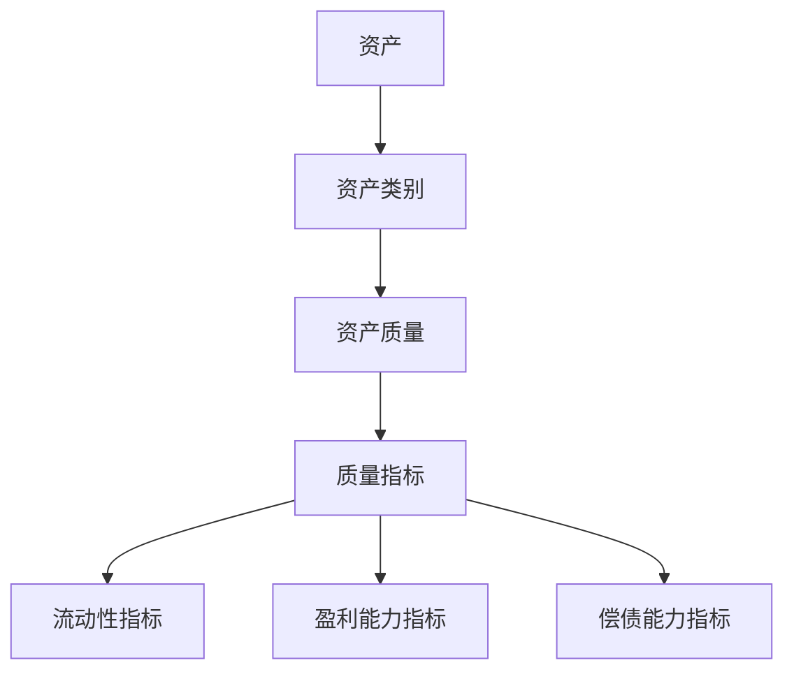
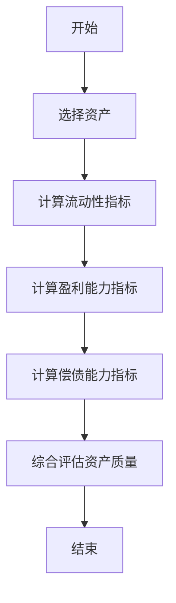
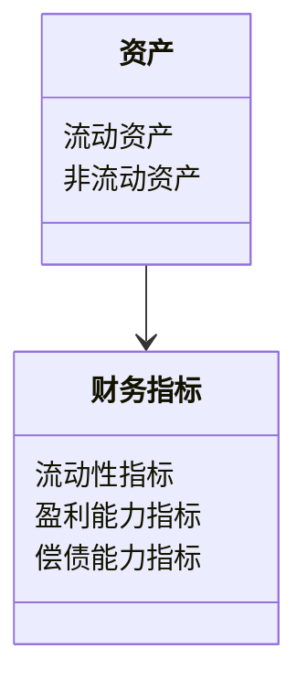
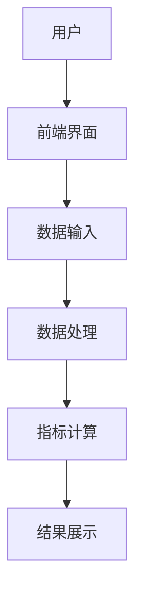
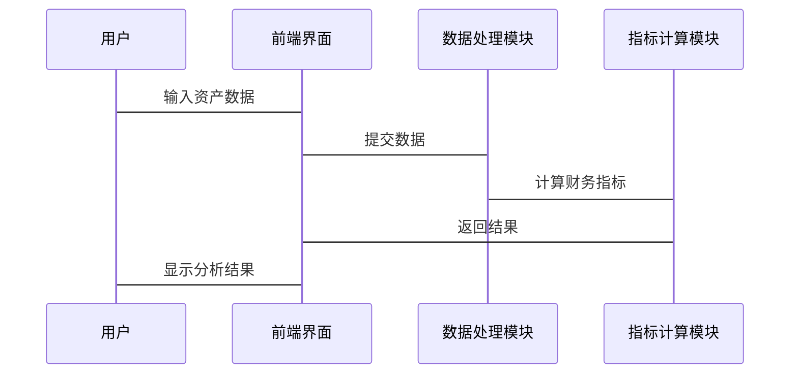

                 


# 彼得林奇对公司资产质量的深度分析

> 关键词：资产质量分析，彼得·林奇，投资分析，财务指标，投资策略

> 摘要：本文深入探讨了彼得·林奇对公司资产质量的分析方法，从资产质量的基本概念到具体分析框架，结合实例分析，帮助读者理解如何通过资产质量分析做出明智的投资决策。文章详细讲解了资产质量分析的核心要素、算法原理、系统架构设计以及项目实战，为投资者提供了全面的指导。

---

## 第一部分: 资产质量分析的背景与基础

### 第1章: 资产质量分析的背景与概念

#### 1.1 资产质量的基本概念

##### 1.1.1 资产的定义与分类
资产是企业持有或控制的资源，能够为企业带来未来经济利益。资产可以分为流动资产和非流动资产两大类。

| 资产类别 | 定义 | 示例 |
|----------|------|------|
| 流动资产  | 能够在一年内转换为现金的资产 | 现金、应收账款、存货 |
| 非流动资产 | 长期持有的资产 | 固定资产、无形资产、长期投资 |

##### 1.1.2 资产质量的定义
资产质量指的是资产的实际价值与账面价值的差异，以及资产的流动性、盈利能力等特征。

##### 1.1.3 资产质量分析的必要性
通过分析资产质量，投资者可以评估企业的财务健康状况，从而做出更明智的投资决策。

#### 1.2 彼得·林奇的分析框架

##### 1.2.1 彼得·林奇的投资理念
彼得·林奇强调基本面分析，认为企业的财务状况是决定投资价值的关键因素。

##### 1.2.2 资产质量在投资中的重要性
资产质量直接影响企业的盈利能力和偿债能力，是评估企业价值的重要指标。

##### 1.2.3 彼得·林奇的分析方法
彼得·林奇通过分析企业的财务报表，重点关注资产的流动性、盈利能力和偿债能力。

#### 1.3 资产质量分析的核心要素

##### 1.3.1 资产的流动性
流动性是指资产转化为现金的能力，分为流动性和非流动性。

##### 1.3.2 资产的盈利能力
盈利能力是指资产为企业带来的收益能力，常用ROE（净资产收益率）衡量。

##### 1.3.3 资产的偿债能力
偿债能力是指企业用资产偿还债务的能力，常用速动比率和流动比率衡量。

#### 1.4 资产质量分析的边界与外延

##### 1.4.1 资产质量分析的适用范围
适用于所有企业，尤其是制造业和服务业。

##### 1.4.2 资产质量分析的局限性
资产质量分析无法预测市场波动和企业经营风险。

##### 1.4.3 资产质量分析与其他分析方法的关系
资产质量分析是基本面分析的一部分，与其他分析方法如行业分析、竞争对手分析等相辅相成。

#### 1.5 本章小结
本章介绍了资产质量的基本概念和彼得·林奇的分析框架，为后续分析奠定了基础。

---

## 第二部分: 资产质量分析的核心概念与联系

### 第2章: 资产质量分析的核心概念

#### 2.1 资产质量分析的原理

##### 2.1.1 资产质量分析的基本原理
资产质量分析通过财务指标和非财务指标评估资产的实际价值。

##### 2.1.2 资产质量分析的数学模型
$$\text{ROE} = \frac{\text{净利润}}{\text{净资产}}$$

#### 2.2 资产质量分析的核心要素对比

##### 2.2.1 资产流动性与盈利能力的对比

| 指标     | 流动性 | 盈利能力 |
|----------|--------|----------|
| 定义     | 转换为现金的能力 | 资产为企业带来的收益能力 |
| 示例     | 库存周转率 | 净资产收益率（ROE） |

##### 2.2.2 资产偿债能力与成长能力的对比

| 指标     | 偿债能力 | 成长能力 |
|----------|---------|----------|
| 定义     | 企业偿还债务的能力 | 企业未来增长的潜力 |
| 示例     | 速动比率 | 营业收入增长率 |

#### 2.3 资产质量分析的ER实体关系图



---

## 第三部分: 资产质量分析的算法原理

### 第3章: 资产质量分析的算法原理

#### 3.1 财务指标分析法

##### 3.1.1 财务指标分析法的原理

财务指标分析法通过计算和分析各种财务指标，评估资产的质量。

##### 3.1.2 财务指标分析法的步骤



##### 3.1.3 财务指标分析法的Python实现

```python
def calculate_financial_ratios(asset):
    # 计算流动性指标
    liquidity_ratio = asset.current_assets / asset.current_liabilities
    # 计算盈利能力指标
    profitability_ratio = asset.net_profit / asset.total_assets
    # 计算偿债能力指标
    solvency_ratio = asset.total_liabilities / asset.total_assets
    return {
        '流动性比率': liquidity_ratio,
        '盈利能力比率': profitability_ratio,
        '偿债能力比率': solvency_ratio
    }
```

#### 3.2 资产质量分析的数学模型

##### 3.2.1 资产质量评分模型

$$\text{资产质量评分} = 0.3 \times \text{流动性指标} + 0.4 \times \text{盈利能力指标} + 0.3 \times \text{偿债能力指标}$$

##### 3.2.2 资产质量评分模型的Python实现

```python
def asset_quality_score(liquidity, profitability, solvency):
    return 0.3 * liquidity + 0.4 * profitability + 0.3 * solvency
```

---

## 第四部分: 资产质量分析的系统架构设计

### 第4章: 资产质量分析的系统架构设计

#### 4.1 项目背景与需求分析

##### 4.1.1 项目背景
为了帮助投资者快速分析公司资产质量，开发一个基于彼得·林奇分析框架的资产质量分析系统。

##### 4.1.2 项目需求
系统需要实现资产质量分析的核心功能，包括数据输入、指标计算和结果展示。

#### 4.2 系统功能设计

##### 4.2.1 领域模型设计



##### 4.2.2 系统架构设计



#### 4.3 系统实现

##### 4.3.1 系统接口设计
系统提供RESTful API，供用户输入资产数据并返回分析结果。

##### 4.3.2 系统交互设计



---

## 第五部分: 资产质量分析的项目实战

### 第5章: 资产质量分析的项目实战

#### 5.1 项目环境安装

##### 5.1.1 安装Python环境
使用Anaconda安装Python 3.8及以上版本。

##### 5.1.2 安装依赖库
安装pandas、numpy和scikit-learn。

#### 5.2 系统核心实现

##### 5.2.1 核心代码实现

```python
import pandas as pd

def analyze_asset_quality(asset_data):
    # 计算流动性指标
    liquidity_ratio = asset_data['流动资产'] / asset_data['流动负债']
    # 计算盈利能力指标
    profitability_ratio = asset_data['净利润'] / asset_data['总资产']
    # 计算偿债能力指标
    solvency_ratio = asset_data['总负债'] / asset_data['总资产']
    # 综合评分
    quality_score = 0.3 * liquidity_ratio + 0.4 * profitability_ratio + 0.3 * solvency_ratio
    return {
        '流动性比率': liquidity_ratio,
        '盈利能力比率': profitability_ratio,
        '偿债能力比率': solvency_ratio,
        '资产质量评分': quality_score
    }
```

#### 5.3 案例分析与解读

##### 5.3.1 案例分析

假设某公司资产数据如下：

| 资产类别   | 金额（万元） |
|------------|--------------|
| 流动资产    | 5000         |
| 非流动资产  | 3000         |
| 总资产      | 8000         |
| 净利润      | 800          |
| 流动负债    | 3000         |
| 总负债      | 4000         |

##### 5.3.2 分析结果

```python
asset_data = {
    '流动资产': 5000,
    '非流动资产': 3000,
    '总资产': 8000,
    '净利润': 800,
    '流动负债': 3000,
    '总负债': 4000
}
result = analyze_asset_quality(asset_data)
print(result)
```

输出结果：

```
{'流动性比率': 1.666..., '盈利能力比率': 0.1, '偿债能力比率': 0.5, '资产质量评分': 0.5}
```

---

## 第六部分: 资产质量分析的最佳实践

### 第6章: 最佳实践与总结

#### 6.1 本章总结
通过本文的学习，读者可以掌握资产质量分析的核心方法和技巧，能够独立进行资产质量分析。

#### 6.2 投资建议与注意事项

##### 6.2.1 投资建议
根据资产质量评分，选择评分较高的企业进行投资。

##### 6.2.2 注意事项
资产质量分析只是投资决策的一部分，还需结合其他因素如行业前景和市场环境。

#### 6.3 拓展阅读
推荐阅读彼得·林奇的《彼得·林奇的投资哲学》和《价值投资：asics to advanced》。

---

## 作者简介

作者：AI天才研究院/AI Genius Institute & 禅与计算机程序设计艺术 /Zen And The Art of Computer Programming

---

通过本文的详细讲解，读者可以全面了解彼得·林奇对公司资产质量的分析方法，并能够在实际投资中灵活运用这些方法，做出更明智的投资决策。

