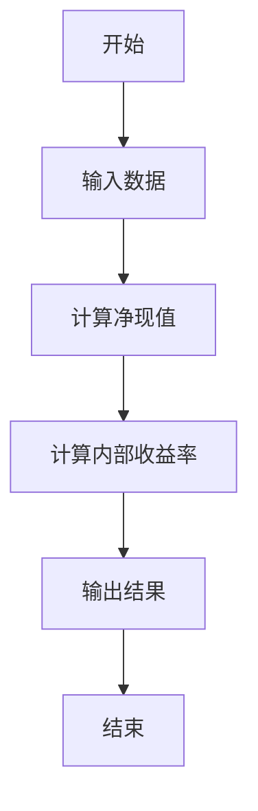
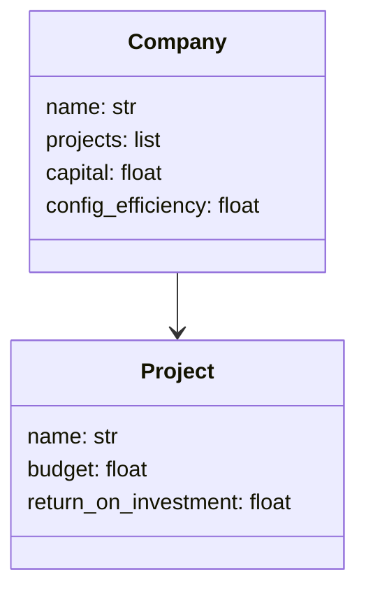
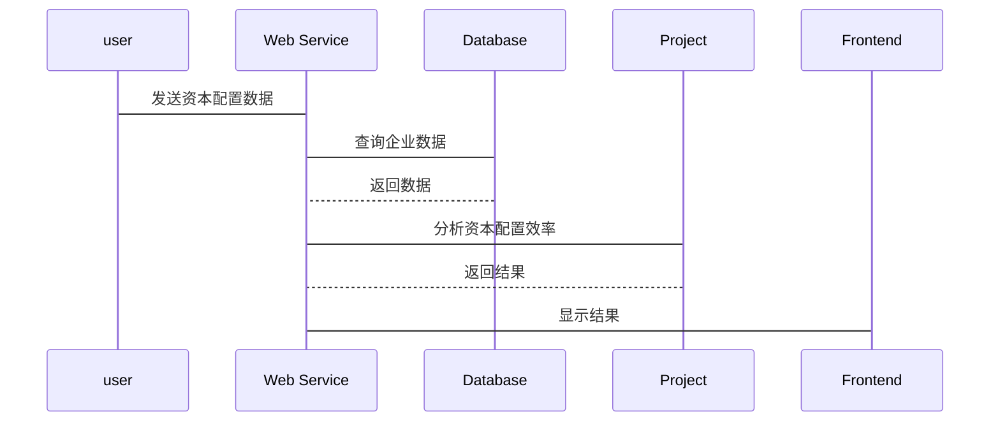

                 


# 彼得林奇对公司资本配置效率的历史分析

**关键词**：资本配置效率，彼得·林奇，投资分析，企业价值，资本预算

**摘要**：本文通过分析彼得·林奇对公司资本配置效率的历史研究，探讨其投资哲学和方法论，揭示资本配置效率对企业价值的影响。结合实际案例和数学模型，深入剖析资本配置效率的核心概念、算法原理及其在企业中的应用，为企业管理者和投资者提供实践指导。

---

# 第一部分: 资本配置效率与投资分析基础

## 第1章: 资本配置效率概述

### 1.1 资本配置效率的定义与核心概念

#### 1.1.1 资本配置效率的定义
资本配置效率是指企业在一定资源条件下，将资金分配到不同项目或资产中，以实现最大价值的能力。它衡量了企业利用资本创造收益的效率。

#### 1.1.2 资本配置效率的核心要素
- **资本预算**：决定哪些项目值得投资。
- **资本结构**：企业负债与股权的比例。
- **投资决策**：选择最优的投资组合。

#### 1.1.3 资本配置效率的边界与外延
资本配置效率不仅关注短期收益，还涉及长期战略目标。其外延包括风险管理、市场环境变化等因素。

### 1.2 彼得·林奇的投资哲学

#### 1.2.1 彼得·林奇的生平简介
彼得·林奇是富达投资的传奇经理，以长期投资和深入研究著称。他的成功基于对公司资本配置效率的深入分析。

#### 1.2.2 林奇的投资理念与方法
林奇强调基本面分析，注重企业内在价值和管理层能力。他通过分析资本配置效率，识别出具有成长潜力的企业。

#### 1.2.3 林奇分析方法的核心步骤
1. 评估企业的资本预算决策。
2. 分析资本结构的合理性。
3. 评估投资项目的收益与风险。

### 1.3 资本配置效率与企业价值的关系

#### 1.3.1 资本配置效率对企业价值的影响
高效配置资本能提升企业盈利能力，增强市场竞争力。反之，低效配置可能导致资源浪费和价值流失。

#### 1.3.2 企业价值评估的核心指标
- 净资产收益率（ROE）
- 投资回报率（ROI）
- 股东权益增长率

#### 1.3.3 资本配置效率与企业成长的关系
资本配置效率高，企业能更快扩张，实现持续增长。反之，可能导致企业停滞不前或衰退。

## 第2章: 资本配置效率的核心概念与联系

### 2.1 资本配置效率的原理

#### 2.1.1 资本预算模型
资本预算模型是评估投资项目可行性的核心工具，常用净现值（NPV）和内部收益率（IRR）进行评估。

#### 2.1.2 资本结构优化
通过调整负债与股权比例，优化资本成本，提升整体资本配置效率。

#### 2.1.3 投资决策的数学模型
数学模型如CAPM（资本资产定价模型）帮助评估投资项目的风险与收益。

### 2.2 核心概念对比分析

#### 2.2.1 资本配置效率与资本回报率的对比
资本配置效率关注资源的整体利用，资本回报率关注单项目收益。两者共同影响企业整体价值。

#### 2.2.2 资本配置效率与资产周转率的对比
资产周转率衡量资产使用效率，资本配置效率关注资金分配的合理性。两者结合，全面评估企业运营效率。

#### 2.2.3 资本配置效率与企业规模的关系
中小企业资本配置效率受规模限制较大，大型企业因资源丰富，配置效率更高。

### 2.3 ER实体关系图与资本配置效率

#### 2.3.1 实体关系图的构建
ER图展示企业各实体及其关系，帮助理解资本流动和配置。

#### 2.3.2 实体关系图与资本配置效率的关系
通过ER图分析，识别关键节点，优化资本流动路径，提升配置效率。

#### 2.3.3 实体关系图的优化
根据实际业务流程，调整实体关系，消除冗余，提高整体效率。

## 第3章: 资本配置效率的算法原理

### 3.1 资本预算模型的算法原理

#### 3.1.1 净现值（NPV）模型

##### NPV定义
$$ NPV = \sum_{t=0}^{n} \frac{C_t}{(1 + r)^t} $$
其中，\( C_t \)是第t年的现金流，\( r \)是贴现率。

##### NPV计算步骤
1. 确定各年的现金流。
2. 选择适当的贴现率。
3. 计算各年现金流的现值。
4. 求和得到NPV。

#### 3.1.2 内部收益率（IRR）模型

##### IRR定义
IRR是使净现值为零的贴现率：
$$ NPV = 0 \Rightarrow r = IRR $$

##### IRR计算步骤
1. 列出各年现金流。
2. 使用试算法或内插法计算IRR。

#### 3.1.3 资本预算模型的优缺点
优点：考虑了时间价值，提供决策依据。缺点：依赖假设，可能忽视风险因素。

### 3.2 资本配置效率的数学模型

#### 3.2.1 资本配置效率的数学表达式
$$ CE = \frac{\sum (R_i - W_i)}{\sum W_i} $$
其中，\( R_i \)是第i个项目的回报率，\( W_i \)是投入的权重。

#### 3.2.2 资本配置效率的计算公式
通过加权平均计算整体回报率，评估配置效率。

#### 3.2.3 资本配置效率的优化算法
动态调整各项目的权重，最大化整体回报率。

### 3.3 算法流程图与代码实现

#### 3.3.1 算法流程图（mermaid）


#### 3.3.2 Python代码实现
```python
def calculate_npv(cash_flows, discount_rate):
    return sum(cf / (1 + discount_rate)**i for i, cf in enumerate(cash_flows))

def calculate_irr(cash_flows):
    from scipy import interpolate
    # 使用试算法计算IRR
    # 这里简化处理，实际应用中需使用数值方法或库函数
    return ...

cash_flows = [100, 200, 300, 400]
discount_rate = 0.05
npv = calculate_npv(cash_flows, discount_rate)
print(f"NPV: {npv}")
```

---

# 第四部分: 系统分析与架构设计

## 第4章: 系统分析与架构设计

### 4.1 问题场景介绍
分析一个企业的资本配置效率，优化资源配置，提升整体价值。

### 4.2 系统功能设计

#### 4.2.1 领域模型（mermaid类图）


#### 4.2.2 系统架构设计（mermaid架构图）
```mermaid
container Database {
    User Data
    Project Data
}
container Web Service {
    API Endpoints
    Business Logic
}
container Frontend {
    UI Components
    User Interaction
}
Database --> Web Service
Web Service --> Frontend
```

### 4.3 系统接口设计
API接口定义数据输入输出，确保系统模块化和可扩展性。

### 4.4 系统交互设计（mermaid序列图）


---

# 第五部分: 项目实战

## 第5章: 项目实战

### 5.1 环境安装
安装Python、NumPy、Pandas等库，搭建数据分析环境。

### 5.2 系统核心实现

#### 5.2.1 代码实现
```python
import numpy as np

def calculate_capital_efficiency(projects):
    total_investment = sum(p['budget'] for p in projects)
    total_return = sum(p['roi'] * p['budget'] for p in projects)
    return total_return / total_investment

projects = [
    {'name': '项目1', 'budget': 100, 'roi': 0.2},
    {'name': '项目2', 'budget': 200, 'roi': 0.15}
]
efficiency = calculate_capital_efficiency(projects)
print(f"资本配置效率: {efficiency}")
```

### 5.3 代码应用解读与分析
解释代码逻辑，说明如何计算资本配置效率，评估企业资源配置的合理性。

### 5.4 实际案例分析
分析具体企业的资本配置效率，评估其投资决策的合理性。

### 5.5 项目小结
总结项目实现过程，提出改进建议，展望未来优化方向。

---

# 第六部分: 最佳实践

## 第6章: 最佳实践

### 6.1 小结
资本配置效率是企业价值的关键影响因素，彼得·林奇的方法提供了有效的分析工具。

### 6.2 注意事项
- 数据准确性
- 方法适用性
- 风险管理

### 6.3 拓展阅读
推荐相关书籍和论文，建议读者深入研究资本配置理论。

---

# 结语

通过本文的系统分析，读者可以全面理解彼得·林奇的资本配置效率分析方法，并将其应用于实际投资决策中。资本配置效率的优化不仅能提升企业价值，还能为企业创造更大的利润。

**作者：AI天才研究院/AI Genius Institute & 禅与计算机程序设计艺术 /Zen And The Art of Computer Programming**

