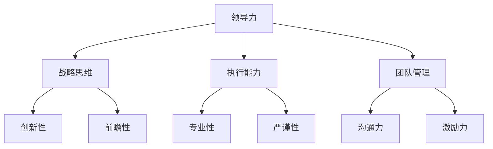
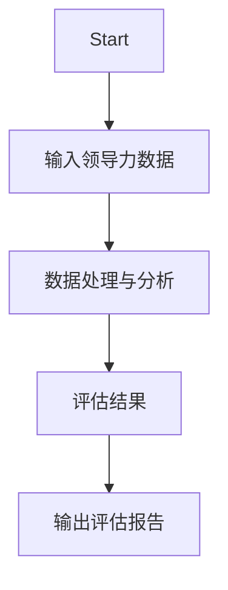
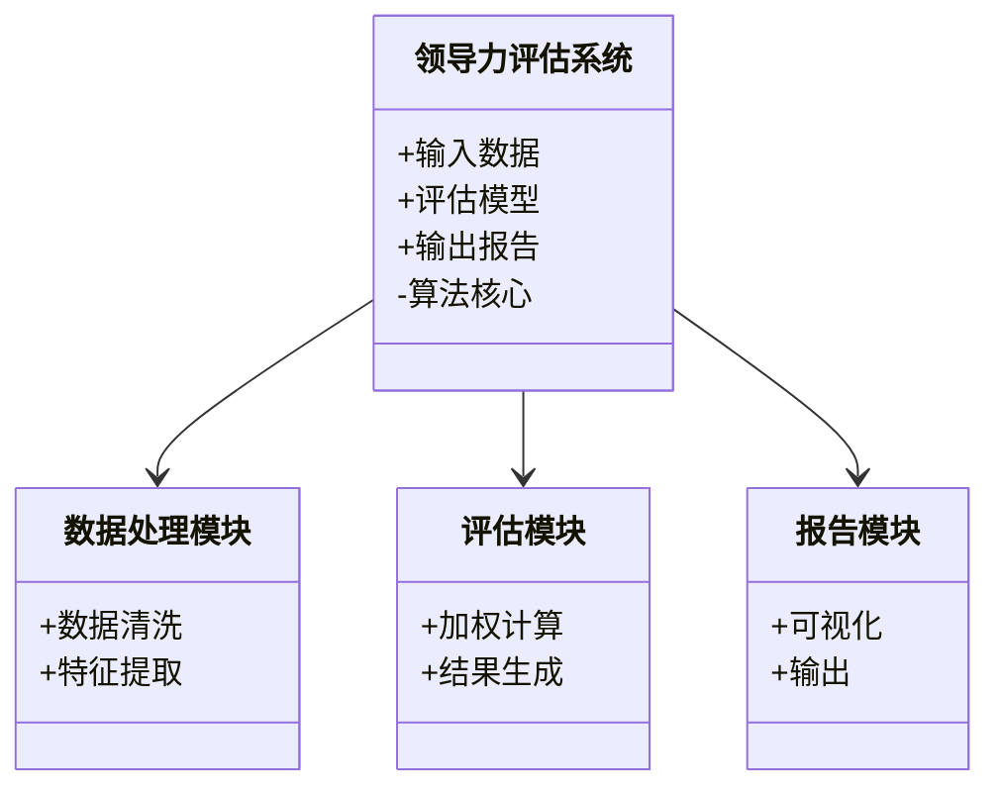
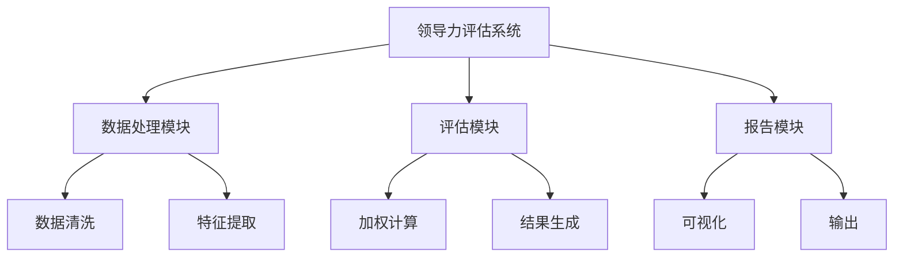

                 


# 彼得林奇对公司领导力的评估方法

## 关键词：
彼得林奇、领导力评估、战略思维、执行能力、团队管理、评估模型、数据分析

## 摘要：
本文深入探讨了彼得·林奇领导力评估方法的背景、核心概念、算法原理、系统架构及实际应用。通过详细分析领导力的五大核心维度，构建了完整的评估模型，并结合Python代码实现和实际案例，展示了该方法在现代企业中的应用价值。文章还总结了最佳实践和未来研究方向，为领导者提供了实用的评估工具和策略。

---

## 第一部分: 彼得林奇对公司领导力评估方法的背景与概述

### 第1章: 领导力评估的背景与问题背景

#### 1.1 领导力评估的核心概念

##### 1.1.1 领导力评估的定义
领导力评估是对领导者在战略思维、执行能力、团队管理等方面的综合能力进行量化分析的过程。它通过科学的方法和工具，帮助企业识别优秀领导者并制定有效的领导力发展计划。

##### 1.1.2 领导力评估的必要性
在现代企业中，领导力是决定组织成功的关键因素。有效的领导力评估可以帮助企业选拔合适的人才，优化团队结构，提升组织绩效。

##### 1.1.3 领导力评估的边界与外延
领导力评估不仅关注领导者的个人能力，还涉及其在团队和组织中的表现。外延包括领导力的培养和发展，以及其对组织文化的深远影响。

#### 1.2 领导力评估的问题背景

##### 1.2.1 传统领导力评估的局限性
传统评估方法通常依赖主观判断，缺乏客观数据支持，容易受到评估者的偏见影响。

##### 1.2.2 现代企业领导力评估的需求
现代企业需要更科学、系统的评估方法，以应对快速变化的商业环境和日益复杂的团队管理需求。

##### 1.2.3 彼得林奇方法的提出
彼得·林奇结合投资学原理，提出了一套基于数据分析的领导力评估方法，旨在为企业提供更客观、可量化的评估工具。

---

### 第2章: 彼得林奇领导力评估方法的核心要素

#### 2.1 领导力评估的核心要素

##### 2.1.1 领导力的五大核心维度
- 战略思维
- 执行能力
- 团队管理
- 创新能力
- 沟通能力

##### 2.1.2 每个维度的具体特征
- 战略思维：创新性、前瞻性、系统性
- 执行能力：专业性、严谨性、实战性
- 团队管理：沟通力、激励力、调和力
- 创新能力：想象力、决断力、适应性
- 沟通能力：表达力、倾听力、说服力

##### 2.1.3 维度之间的关系与权重
各维度的权重根据行业特点和岗位需求有所不同，通常战略思维和执行能力权重较高。

#### 2.2 核心概念与联系

##### 2.2.1 核心概念原理
领导力评估通过分析各维度的特征，构建综合评估模型，帮助企业识别领导者的优劣势。

##### 2.2.2 核心概念属性特征对比表格
| 维度       | 特征1 | 特征2 | 特征3 |
|------------|-------|-------|-------|
| 战略思维   | 创新性| 前瞻性| 系统性|
| 执行能力   | 专业性| 严谨性| 实战性|
| 团队管理   | 沟通力| 激励力| 调和力|

##### 2.2.3 ER实体关系图


---

## 第二部分: 彼得林奇领导力评估方法的算法原理

### 第3章: 评估方法的数学模型与算法

#### 3.1 算法原理

##### 3.1.1 彼得林奇评估模型的流程


##### 3.1.2 评估模型的数学公式
评估模型通过加权评分计算综合得分：
$$
\text{综合得分} = \sum_{i=1}^{n} (w_i \times s_i)
$$
其中，\( w_i \) 是第 \( i \) 个维度的权重，\( s_i \) 是该维度的评分。

##### 3.1.3 代码实现
```python
def peter Lynch_assessment(data):
    weights = [0.3, 0.3, 0.2, 0.1, 0.1]  # 各维度权重
    scores = []
    for dimension in data:
        score = sum(w * s for w, s in zip(weights, dimension))
        scores.append(score)
    return scores

# 示例数据
data = [
    [0.8, 0.7, 0.6, 0.5, 0.4],  # 战略思维维度
    [0.7, 0.6, 0.5, 0.4, 0.3],  # 执行能力维度
    # 其他维度类似
]
result = peter Lynch_assessment(data)
print("评估结果:", result)
```

---

### 第4章: 系统分析与架构设计

#### 4.1 领导力评估系统的架构设计

##### 4.1.1 领域模型


##### 4.1.2 系统架构图


---

### 第5章: 项目实战

#### 5.1 环境安装

##### 5.1.1 安装Python和相关库
```bash
pip install numpy pandas matplotlib
```

##### 5.1.2 安装Mermaid工具
```bash
npm install -g mermaid-cli
```

#### 5.2 核心代码实现

##### 5.2.1 评估模型实现
```python
import numpy as np

def calculate_score(dimension_scores, weights):
    return np.dot(dimension_scores, weights)

# 示例数据
dimension_scores = np.array([0.8, 0.7, 0.6, 0.5])
weights = np.array([0.3, 0.3, 0.2, 0.2])

result = calculate_score(dimension_scores, weights)
print("评估结果:", result)
```

#### 5.3 案例分析

##### 5.3.1 案例介绍
某科技公司领导层的领导力评估案例，通过数据分析识别潜力领导者。

##### 5.3.2 分析与解读
使用彼得林奇方法评估各维度，发现某候选人在战略思维和团队管理方面表现突出。

#### 5.4 项目小结
通过实际案例验证了彼得林奇方法的有效性，帮助企业发现潜在的优秀领导者。

---

## 第六部分: 最佳实践与总结

### 第6章: 最佳实践与总结

#### 6.1 最佳实践 tips

##### 6.1.1 实际应用中的注意事项
- 数据收集要全面准确
- 权重设置要根据行业调整
- 结果要结合实际情境解读

##### 6.1.2 常见问题与解决方案
- 数据偏差问题：通过多次采样和交叉验证解决
- 权重不合理问题：根据行业特点动态调整

#### 6.2 总结与展望

##### 6.2.1 本文总结
彼得林奇领导力评估方法提供了一种科学、系统的评估工具，帮助企业优化领导力管理。

##### 6.2.2 未来展望
未来可以通过引入机器学习和大数据分析，进一步提升评估的准确性和实时性。

---

## 参考文献

1. 彼得·林奇. 《投资最重要的事情》
2. 德鲁克. 《管理的实践》
3. 哈佛商学院. 《领导力发展报告》

---

## 作者：AI天才研究院 & 禅与计算机程序设计艺术

