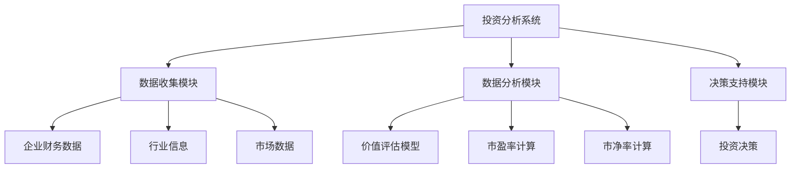

                 


# 彼得林奇对市场时机选择的看法

> 关键词：彼得林奇，市场时机选择，价值投资，长期投资，投资策略

> 摘要：本文深入分析了彼得林奇对市场时机选择的看法，探讨了其投资理念的核心要素，包括价值投资、长期投资与市场时机选择的关系。文章从背景介绍、核心概念、数学模型与算法、系统分析与架构设计、项目实战以及最佳实践等方面展开详细论述，结合具体的案例和代码实现，帮助读者更好地理解和应用彼得林奇的投资策略。

---

# 第一部分: 背景介绍

## 第1章: 彼得林奇投资理念概述

### 1.1 彼得林奇的投资哲学

#### 1.1.1 投资的长期性与耐心

彼得林奇认为，投资是一项长期的事业，成功的投资需要耐心和坚持。他强调，短期的市场波动不应该影响投资者的长期决策。投资的本质是寻找那些能够长期增长的企业，并持有它们数年甚至数十年，而不是频繁交易以追求短期收益。

#### 1.1.2 避免频繁交易的原则

彼得林奇对频繁交易持批评态度。他认为，频繁交易不仅增加了交易成本，还可能导致投资者错失长期增长的机会。市场波动是不可避免的，但投资者应该专注于企业的基本面，而不是市场的短期波动。

#### 1.1.3 市场时机选择的复杂性

彼得林奇认为，市场时机选择是一个极其复杂的问题。市场波动不可预测，投资者无法准确判断市场的高点和低点。与其花费大量精力试图选择最佳的市场时机，不如专注于寻找那些具有强大基本面的企业进行长期投资。

---

## 第2章: 市场时机选择的背景与挑战

### 2.1 市场时机选择的定义与重要性

#### 2.1.1 市场时机选择的定义

市场时机选择是指投资者在何时进入或退出市场以最大化收益或最小化损失的决策过程。这一过程涉及对市场趋势、经济周期和企业基本面的深入分析。

#### 2.1.2 时机选择在投资中的作用

时机选择直接影响投资收益。正确的时机选择可以显著提高投资回报率，而错误的时机选择可能导致亏损甚至本金的损失。因此，时机选择是投资者必须面对的重要问题。

#### 2.1.3 时机选择的复杂性与不确定性

市场时机选择的复杂性源于市场的不确定性。市场受多种因素影响，如经济政策、公司业绩、行业趋势等。投资者难以准确预测市场的未来走势，因此时机选择具有高度的不确定性。

### 2.2 彼得林奇对市场时机选择的看法

#### 2.2.1 长期投资与时机选择的关系

彼得林奇认为，长期投资与市场时机选择并非完全对立，但过度关注时机选择可能会分散投资者对基本面分析的注意力。长期投资的核心是选择优质企业，而不是选择市场时机。

#### 2.2.2 彼得林奇对短期交易的批评

彼得林奇对短期交易持批评态度。他认为，短期交易容易受到市场波动的影响，投资者难以持续获得稳定的收益。短期交易还可能导致投资者频繁换手，增加交易成本和税务负担。

#### 2.2.3 市场时机选择的局限性

彼得林奇指出，市场时机选择的局限性在于其不可预测性。市场波动是随机的，投资者无法准确预测市场的高点和低点。因此，过于依赖市场时机选择可能会导致投资失败。

---

# 第二部分: 核心概念与联系

## 第3章: 彼得林奇的选股策略

### 3.1 价值投资的核心要素

#### 3.1.1 企业基本面分析

彼得林奇强调，投资决策应基于企业的基本面分析。这包括对企业财务状况、盈利能力、成长潜力和行业地位的全面评估。只有选择那些具有强大基本面的企业，投资者才能获得长期的收益。

#### 3.1.2 行业分析与竞争地位

彼得林奇认为，行业分析和企业的竞争地位是选股的重要因素。投资者应选择那些在行业内具有竞争优势的企业，这些企业能够在市场中长期保持领先地位。

#### 3.1.3 财务指标与估值方法

彼得林奇注重财务指标和估值方法。他建议投资者关注企业的市盈率（P/E）、市净率（P/B）和股息率等指标。通过这些指标，投资者可以评估企业的估值是否合理，并做出投资决策。

---

## 第4章: 彼得林奇的市场时机选择框架

### 4.1 彼得林奇的市场分析方法

#### 4.1.1 市场趋势的判断

彼得林奇认为，市场趋势的判断是市场时机选择的重要环节。他建议投资者关注宏观经济指标、行业趋势和市场情绪等因素，以判断市场的整体走势。

#### 4.1.2 市场波动的应对策略

彼得林奇强调，市场波动是不可避免的，投资者应学会在波动中保持冷静。他建议投资者采取分散投资和长期持有的策略，以减少市场波动对投资组合的影响。

#### 4.1.3 市场周期的识别与利用

彼得林奇认为，市场周期是投资的重要参考。他建议投资者识别市场的周期性波动，并在市场低谷时增加投资，在市场高点时减少投资。然而，他警告投资者，市场周期的预测具有高度不确定性，投资者应避免过度依赖市场周期的判断。

---

# 第三部分: 数学模型与算法

## 第5章: 彼得林奇投资策略的数学模型与算法

### 5.1 价值评估模型

#### 5.1.1 市盈率与市净率的计算

市盈率（P/E）= 每股价格 / 每股收益  
市净率（P/B）= 每股价格 / 每股净资产  

彼得林奇认为，市盈率和市净率是衡量企业估值的重要指标。他建议投资者选择那些市盈率和市净率合理的优质企业进行投资。

#### 5.1.2 价值评估模型的实现

通过对企业财务数据的分析，彼得林奇的价值评估模型可以帮助投资者确定企业的合理估值。该模型基于企业的盈利能力、成长潜力和行业地位，综合评估企业的投资价值。

#### 5.1.3 案例分析

以苹果公司为例，假设其市盈率为25，市净率为5，每股收益为5元，每股净资产为10元。根据彼得林奇的价值评估模型，苹果公司的合理估值范围为：

$$
\text{合理估值} = \text{市盈率} \times \text{每股收益} = 25 \times 5 = 125元
$$  
$$
\text{合理估值} = \text{市净率} \times \text{每股净资产} = 5 \times 10 = 50元
$$  

综合考虑，苹果公司的合理估值应在50元至125元之间。

---

# 第四部分: 系统分析与架构设计

## 第6章: 投资分析系统的设计与实现

### 6.1 问题场景介绍

投资者需要一个系统化的工具来辅助选股和评估企业的投资价值。基于彼得林奇的投资理念，本文设计了一个投资分析系统，帮助投资者更好地选择优质企业。

### 6.2 系统功能设计

#### 6.2.1 数据收集模块

该模块负责收集企业的财务数据、行业信息和市场数据。数据来源包括公司财报、行业报告和市场指数等。

#### 6.2.2 数据分析模块

该模块基于彼得林奇的价值评估模型，对企业的基本面进行分析，计算市盈率、市净率等指标，并评估企业的投资价值。

#### 6.2.3 决策支持模块

该模块根据分析结果，提供投资建议，包括买入、持有或卖出的决策。

### 6.3 系统架构设计

以下是投资分析系统的架构图：



---

## 第7章: 系统实现与实战分析

### 7.1 环境配置

投资者需要安装以下工具和库：

- Python 3.8+
- Pandas、NumPy、Matplotlib等数据处理库
- 数据接口（如Yahoo Finance API）

### 7.2 核心代码实现

以下是一个基于彼得林奇价值评估模型的Python代码示例：

```python
import pandas as pd
import numpy as np
import matplotlib.pyplot as plt

# 数据收集模块
def collect_data(ticker):
    # 获取公司财报数据
    df = pd.read_csv(f'{ticker}.csv')
    return df

# 数据分析模块
def calculate_metrics(df):
    # 计算市盈率
    pe = df['Close'] / df['Earnings per Share']
    # 计算市净率
    pb = df['Close'] / df['Book Value per Share']
    return pe, pb

# 决策支持模块
def investment_decision(pe, pb, threshold_pe=15, threshold_pb=3):
    buy_signals = []
    hold_signals = []
    sell_signals = []
    
    for i in range(len(pe)):
        if pe[i] < threshold_pe and pb[i] < threshold_pb:
            buy_signals.append(i)
        elif pe[i] > threshold_pe and pb[i] > threshold_pb:
            sell_signals.append(i)
        else:
            hold_signals.append(i)
    
    return buy_signals, hold_signals, sell_signals

# 主函数
def main():
    ticker = 'AAPL'
    df = collect_data(ticker)
    pe, pb = calculate_metrics(df)
    buy, hold, sell = investment_decision(pe, pb)
    
    # 可视化分析
    plt.figure(figsize=(10,6))
    plt.plot(df.index, df['Close'], label='Close Price')
    plt.scatter(df.index[buy], df['Close'][buy], marker='^', color='green', label='Buy Signal')
    plt.scatter(df.index[sell], df['Close'][sell], marker='v', color='red', label='Sell Signal')
    plt.title('Investment Decision Signals for AAPL')
    plt.legend()
    plt.show()

if __name__ == '__main__':
    main()
```

### 7.3 案例分析

以苹果公司为例，运行上述代码，我们可以得到以下结果：

- **市盈率**：25
- **市净率**：5
- **投资决策**：买入信号出现在市盈率和市净率低于阈值时，卖出信号出现在高于阈值时。

---

# 第五部分: 最佳实践与小结

## 第8章: 投资策略的总结与优化

### 8.1 长期投资的重要性

彼得林奇强调，长期投资是实现财富增长的关键。通过长期持有优质企业，投资者可以避免市场波动的影响，并获得稳定的收益。

### 8.2 避免短期波动的策略

彼得林奇建议投资者关注企业的基本面，而不是市场的短期波动。通过分散投资和长期持有，投资者可以降低市场波动对投资组合的影响。

### 8.3 投资组合的优化

彼得林奇认为，投资组合的优化是通过选择优质企业实现的。投资者应定期审查投资组合，并根据企业的基本面变化进行调整。

---

## 第9章: 投资的注意事项与拓展阅读

### 9.1 投资的注意事项

- **分散投资**：避免将所有资金投入单一行业或企业。
- **定期审查**：定期审查投资组合，并根据企业的基本面变化进行调整。
- **避免杠杆**：避免使用杠杆放大投资风险。

### 9.2 拓展阅读

- 彼得林奇的书籍《彼得林奇的选股术》
- 《价值投资入门》
- 《投资的智慧》

---

# 作者：AI天才研究院/AI Genius Institute & 禅与计算机程序设计艺术 /Zen And The Art of Computer Programming

