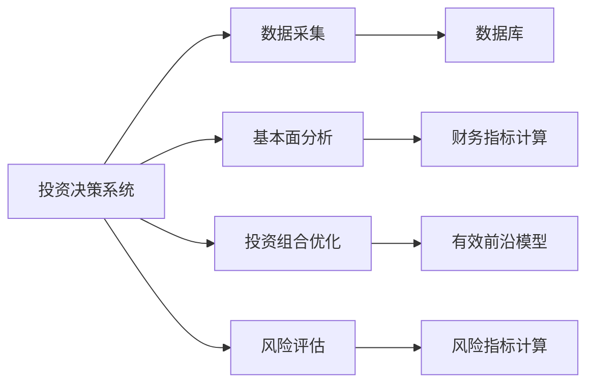

                 


# 彼得林奇对新兴市场投资的看法

---

## 关键词：
- 彼得林奇
- 新兴市场
- 投资策略
- 价值投资
- 风险管理
- 市场分析

---

## 摘要：
本文深入分析了彼得林奇对新兴市场投资的看法，结合其投资理念，探讨了新兴市场的特点、投资策略、风险管理方法以及具体的数学模型和系统架构。通过案例分析和项目实战，本文为投资者提供了在新兴市场中应用彼得林奇投资策略的详细指导，并总结了最佳实践和注意事项。

---

## 第一部分：彼得林奇及其投资理念概述

### 第1章：彼得林奇的背景与投资风格

#### 1.1 彼得林奇的生平简介
彼得·林奇（Peter Lynch）是美国著名的投资经理人和作家，以其在富达投资管理公司（Fidelity Management）的长期成功而闻名。他于1977年至2004年担任麦哲伦基金（Fidelity Magellan Fund）的经理，期间基金年平均回报率达到29%，远超市场平均水平。林奇的投资风格以价值投资为核心，注重基本面分析和长期持有优质股票。

#### 1.2 彼得林奇的投资理念与风格
林奇的投资理念可以总结为以下几点：
1. **价值投资**：寻找市场价格低于其内在价值的股票。
2. **成长投资**：投资于具有持续增长潜力的公司。
3. **分散投资**：通过多样化投资降低风险。
4. **长期投资**：避免短期市场波动，关注公司长期价值。

#### 1.3 新兴市场的特点与投资机会
新兴市场通常指那些经济发展迅速、市场规模较小但增长潜力巨大的国家，如中国、印度、巴西等。这些市场具有以下特点：
- **高增长潜力**：新兴市场的GDP增速通常高于发达市场。
- **市场波动性大**：新兴市场的股票价格波动较大，但这也意味着潜在的高回报。
- **行业多样性**：新兴市场中通常存在多个快速发展的行业，如科技、消费、金融等。

---

### 第2章：彼得林奇的新兴市场投资策略

#### 2.1 价值投资与成长投资
林奇认为，新兴市场中存在许多被低估的股票，这些股票往往具有较高的增长潜力。在新兴市场中，投资者可以通过以下方式结合价值投资和成长投资：
- **价值投资**：寻找市盈率（P/E）或市净率（P/B）低于行业平均水平的公司。
- **成长投资**：投资于收入增长率和净利润增长率高于行业平均水平的公司。

#### 2.2 投资组合管理与风险管理
在新兴市场中，风险管理尤为重要。林奇强调以下几点：
1. **分散投资**：避免将所有资金投入到单一市场或行业。
2. **监控市场波动**：定期评估投资组合的表现，并根据市场变化进行调整。
3. **长期持有**：新兴市场的短期波动较大，但长期趋势往往与公司基本面相关。

#### 2.3 新兴市场的行业分析与公司分析
在新兴市场中，行业分析和公司分析是投资决策的关键。林奇建议投资者关注以下行业：
- **科技行业**：新兴市场的科技公司通常具有较高的增长潜力。
- **消费行业**：随着中产阶级的崛起，消费行业往往具有较高的增长空间。
- **金融行业**：新兴市场的金融行业通常具有较高的增长潜力，但也需要关注监管风险。

---

### 第3章：彼得林奇对新兴市场的风险与机遇

#### 3.1 新兴市场的风险分析
新兴市场投资面临以下风险：
1. **政治风险**：新兴市场的政治环境可能不稳定，导致市场波动。
2. **经济波动风险**：新兴市场的经济周期波动较大，可能对股价产生重大影响。
3. **市场流动性风险**：新兴市场的流动性可能较低，导致买卖价差较大。

#### 3.2 应对风险的策略与技巧
为了应对新兴市场的风险，林奇建议投资者采取以下策略：
1. **选择优质公司**：投资于具有强大基本面和良好管理的公司。
2. **分散投资**：通过投资于不同行业和地区的公司来降低风险。
3. **长期投资**：避免短期波动，关注公司的长期增长潜力。

---

## 第二部分：彼得林奇投资策略的数学模型与算法

### 第4章：投资组合优化的数学模型

#### 4.1 Markowitz有效前沿模型
Markowitz有效前沿模型是一种经典的资产配置模型，用于确定在给定风险水平下能够获得最高预期收益的投资组合。公式如下：

$$ \text{收益} = \sum_{i=1}^{n} w_i \times r_i $$
$$ \text{风险} = \sqrt{\sum_{i=1}^{n} \sum_{j=1}^{n} w_i w_j \sigma_i \sigma_j } $$

其中，\( w_i \) 是第 \( i \) 资产的投资权重，\( r_i \) 是第 \( i \) 资产的预期收益率，\( \sigma_i \) 是第 \( i \) 资产的收益率标准差。

---

### 第5章：系统分析与架构设计方案

#### 5.1 系统功能设计
在新兴市场投资中，可以构建一个基于彼得林奇投资策略的投资决策系统，其功能模块包括：
1. **数据采集**：获取新兴市场的股票数据。
2. **基本面分析**：计算市盈率、市净率等财务指标。
3. **投资组合优化**：基于有效前沿模型优化投资组合。
4. **风险评估**：评估投资组合的风险。

#### 5.2 系统架构设计
以下是系统的架构图：



---

### 第6章：项目实战

#### 6.1 环境安装
为了实现投资决策系统，需要安装以下工具：
- **Python**：用于数据分析和计算。
- **Pandas**：用于数据处理。
- **NumPy**：用于数值计算。
- **Matplotlib**：用于数据可视化。

#### 6.2 核心实现源代码
以下是投资组合优化的Python代码示例：

```python
import numpy as np
import pandas as pd

# 假设我们有5只股票的数据
returns = pd.DataFrame({
    '股票1': [0.1, 0.05, -0.02, 0.03, 0.07],
    '股票2': [0.08, 0.03, -0.05, 0.02, 0.04],
    '股票3': [0.06, 0.04, -0.01, 0.05, 0.06],
    '股票4': [0.05, 0.02, -0.03, 0.04, 0.05],
    '股票5': [0.07, 0.01, -0.04, 0.06, 0.08]
})

# 计算协方差矩阵
cov_matrix = returns.cov()

# 计算有效前沿
def portfolio_return(weights):
    return np.sum(weights * returns.mean())

def portfolio_risk(weights):
    return np.sqrt(np.dot(weights.T, np.dot(cov_matrix, weights)))

# 优化投资组合
from scipy.optimize import minimize

def min_variance_port(weights, cov_matrix):
    return portfolio_risk(weights), portfolio_return(weights)

# 使用优化算法求解
initial_weights = [0.2, 0.2, 0.2, 0.2, 0.2]
result = minimize(lambda w: portfolio_risk(w), initial_weights, method='SLSQP', 
                 constraints={'type': 'eq', 'fun': lambda w: sum(w) - 1})

print("最小风险组合权重:", result.x)
print("对应的收益:", portfolio_return(result.x))
```

---

## 第三部分：结论与建议

### 第7章：结论与最佳实践

#### 7.1 总结
彼得林奇的投资策略在新兴市场中仍然具有重要的指导意义。新兴市场的高增长潜力和多样化的行业为投资者提供了丰富的投资机会，但同时也伴随着较高的风险。通过结合价值投资和成长投资，投资者可以在新兴市场中获得长期稳定的收益。

#### 7.2 最佳实践
1. **选择优质公司**：投资于具有强大基本面和良好管理的公司。
2. **分散投资**：通过投资于不同行业和地区的公司来降低风险。
3. **长期投资**：避免短期波动，关注公司的长期增长潜力。
4. **持续学习**：新兴市场环境复杂多变，投资者需要不断学习和更新知识。

---

## 作者：
AI天才研究院/AI Genius Institute  
禅与计算机程序设计艺术 /Zen And The Art of Computer Programming

