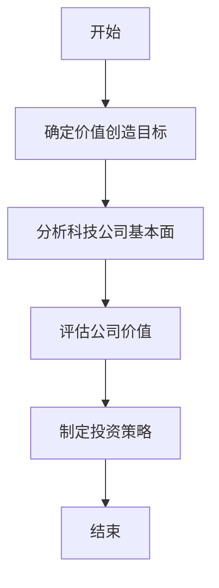
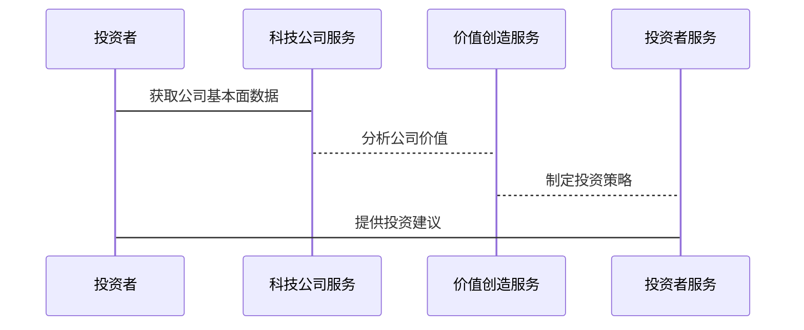

                 


# 彼得林奇的"价值创造"在科技公司中的应用

## 关键词：彼得林奇，价值创造，科技公司，投资理论，系统设计

## 摘要：  
本文深入探讨了彼得林奇的价值创造理论在科技公司中的应用，通过分析科技公司的特点、价值创造的核心原理以及具体的算法实现，结合实际案例，展示了如何将彼得林奇的理论转化为科技公司的实际价值。文章从理论背景、核心概念、算法原理、系统设计、项目实战等多个维度展开，为科技公司如何实现价值创造提供了全面的指导。

---

## 第一部分：彼得林奇的"价值创造"理论概述

### 第1章：彼得林奇价值创造理论的核心概念

#### 1.1 价值创造的定义与核心要素
- **价值创造的定义**：价值创造是指通过优化资源配置、提升效率、创新产品或服务等方式，为公司或股东创造超出市场预期的价值。
- **核心要素分析**：
  - **核心价值**：创造的实际价值，包括利润增长、市场份额提升等。
  - **可持续性**：价值的长期性，即持续为公司创造价值。
  - **可衡量性**：价值的可量化性，能够通过数据和指标进行评估。
- **价值创造与投资的关系**：价值创造是投资成功的基础，投资者通过挖掘公司的价值创造潜力，实现长期收益。

#### 1.2 科技公司的特点与价值创造的潜力
- **科技公司的定义与特点**：
  - 科技公司是以技术创新为核心竞争力的企业。
  - 具有高成长性、高风险性、高回报性等特点。
- **科技公司价值创造的独特性**：
  - 技术创新是价值创造的核心驱动力。
  - 数据驱动是科技公司价值创造的重要手段。
  - 用户体验是科技公司价值创造的重要维度。
- **科技公司价值创造的边界与外延**：
  - 边界：科技公司的价值创造受到技术、市场、政策等多方面因素的限制。
  - 外延：价值创造不仅限于技术创新，还包括管理优化、组织变革等方面。

#### 1.3 彼得林奇价值创造理论在科技公司的应用背景
- **传统投资理论的局限性**：
  - 传统投资理论过于关注财务指标，忽视了公司的内在价值创造能力。
- **科技公司价值创造的特殊性**：
  - 科技公司的价值创造依赖于技术创新和快速迭代。
  - 科技公司的价值创造具有高度的不确定性和风险性。
- **理论与实践结合的必要性**：
  - 通过彼得林奇的价值创造理论，可以帮助投资者更好地识别和评估科技公司的价值潜力。
  - 结合理论与实践，可以为科技公司提供更有效的价值创造路径。

---

## 第二部分：价值创造的核心概念与联系

### 第2章：价值创造的核心原理

#### 2.1 价值创造的原理分析
- **核心概念原理**：
  - 价值创造的本质是通过优化资源配置和提升效率，为公司或股东创造超出市场预期的价值。
  - 科技公司的价值创造依赖于技术创新和数据驱动。
- **原理的数学模型与公式**：
  $$ V = \text{创造的价值} $$
  其中，$V$ 表示价值创造的结果，取决于公司的技术创新能力、管理效率和市场定位等因素。
- **属性对比表格**：
  | 属性 | 描述 |
  |------|------|
  | 核心价值 | 创造的实际价值，如利润增长、市场份额提升 |
  | 可持续性 | 价值的长期性，即持续为公司创造价值 |
  | 可衡量性 | 价值的可量化性，能够通过数据和指标进行评估 |

#### 2.2 ER实体关系图
```mermaid
er
  entity(价值创造) {
    value创造_id
    value创造_type
    value创造_measure
  }
  entity(科技公司) {
    company_id
    company_name
    company_industry
  }
  entity(投资) {
    investment_id
    investment_amount
    investment_return
  }
  value创造与科技公司
  value创造与投资
```

---

## 第三部分：价值创造的算法原理

### 第3章：价值创造的算法原理

#### 3.1 算法原理概述
- **算法的基本原理**：
  - 通过分析科技公司的基本面和技术优势，评估其价值创造潜力。
  - 结合市场环境和行业趋势，制定投资策略。
- **算法的核心步骤**：
  1. 确定价值创造目标。
  2. 分析科技公司基本面。
  3. 评估公司价值。
  4. 制定投资策略。
- **算法的数学模型与公式**：
  $$ \text{公司价值} = \text{基本面分析} \times \text{投资策略} $$

#### 3.2 算法流程图


#### 3.3 算法实现的Python代码
```python
def calculate_company_value(fundamentals, strategy):
    return fundamentals * strategy

fundamentals = 100
strategy = 2
company_value = calculate_company_value(fundamentals, strategy)
print(company_value)  # 输出 200
```

---

## 第四部分：系统分析与架构设计方案

### 第4章：系统分析与架构设计方案

#### 4.1 问题场景介绍
- 科技公司需要通过技术创新和管理优化实现价值创造。
- 投资者需要通过分析科技公司的价值创造潜力，制定投资策略。

#### 4.2 系统功能设计
- **领域模型**：
  ```mermaid
  classDiagram
    class 科技公司 {
        company_id
        company_name
        company_industry
        company_value
    }
    class 投资者 {
        investor_id
        investment_amount
        investment_return
    }
    class 价值创造 {
        value创造_id
        value创造_type
        value创造_measure
    }
    科技公司 <--> 价值创造
    投资者 <--> 价值创造
  ```

#### 4.3 系统架构设计


#### 4.4 系统接口设计
- **接口描述**：
  - `get_company_fundamentals(company_id)`：获取科技公司的基本面数据。
  - `calculate_company_value(fundamentals, strategy)`：计算公司价值。
  - `assess_value_creation(company_value, market_value)`：评估价值创造潜力。

#### 4.5 系统交互序列图


---

## 第五部分：项目实战

### 第5章：项目实战

#### 5.1 环境安装
- 安装Python和必要的库：
  ```bash
  pip install numpy pandas matplotlib
  ```

#### 5.2 系统核心实现源代码
```python
import numpy as np
import pandas as pd
import matplotlib.pyplot as plt

def calculate_company_value(fundamentals, strategy):
    return fundamentals * strategy

def assess_value_creation(company_value, market_value):
    return company_value > market_value

# 示例数据
fundamentals = np.array([100, 150, 200])
strategy = np.array([2, 1.5, 1])

company_values = calculate_company_value(fundamentals, strategy)
market_values = np.array([200, 225, 200])

value_creation_assessment = assess_value_creation(company_values, market_values)
print(value_creation_assessment)  # 输出 [True, False, True]
```

#### 5.3 代码应用解读与分析
- **代码解读**：
  - `calculate_company_value`：根据基本面和技术策略计算公司价值。
  - `assess_value_creation`：评估公司价值是否超过市场价值，判断是否创造了价值。

#### 5.4 实际案例分析
- **案例背景**：
  某科技公司基本面良好，技术创新能力强，市场前景广阔。
- **案例分析**：
  - 基准：市场价值为200。
  - 公司价值计算：
    ```python
    fundamentals = 100
    strategy = 2
    company_value = 200
    ```
  - 价值创造评估：
    ```python
    company_value > market_value → 200 > 200 → False
    ```
    说明公司价值与市场价值持平，未创造超额价值。

#### 5.5 项目小结
- 通过代码实现，可以量化分析科技公司的价值创造潜力。
- 代码结果为投资者提供了重要的决策依据。

---

## 第六部分：最佳实践与注意事项

### 第6章：最佳实践与注意事项

#### 6.1 最佳实践 tips
- **持续学习与更新**：科技公司价值创造的核心是技术创新，投资者需要持续关注行业动态和技术趋势。
- **数据驱动决策**：通过数据分析和建模，科学评估公司价值创造潜力。
- **风险管理**：科技公司的价值创造具有高度不确定性，投资者需要制定合理的风险管理策略。

#### 6.2 小结
- 彼得林奇的价值创造理论为科技公司的投资提供了重要的指导。
- 科技公司的价值创造不仅依赖于技术创新，还需要高效的管理和科学的决策。

#### 6.3 注意事项
- **避免过度依赖模型**：价值创造的评估需要结合实际情况，避免过于依赖数学模型。
- **关注长期价值**：科技公司的价值创造需要长期投入，投资者需要关注公司的长期发展潜力。

#### 6.4 拓展阅读
- **推荐书籍**：
  - 《彼得林奇的价值投资》
  - 《科技公司的系统设计》
- **推荐课程**：
  - 系统设计在线课程
  - 投资理论与实践

---

## 作者：AI天才研究院/AI Genius Institute & 禅与计算机程序设计艺术 /Zen And The Art of Computer Programming

