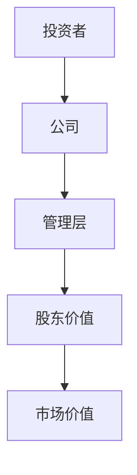
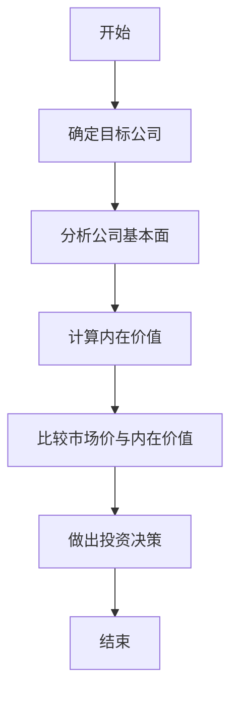
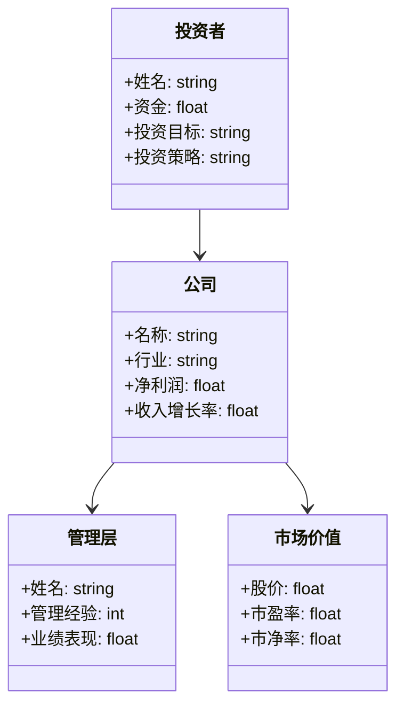

                 


# 彼得林奇的"价值创造"投资理念

> 关键词：价值创造，彼得·林奇，投资理念，基本面分析，长期投资

> 摘要：本文深入探讨了彼得·林奇的“价值创造”投资理念，从理论基础、数学模型、系统设计到实际案例分析，全面解读了这一理念的核心思想及其在投资实践中的应用。文章结合技术语言和专业分析，为投资者提供了从理论到实践的完整指导。

---

## 第一部分：价值创造投资理念的背景与基础

### 第1章：价值创造投资理念概述

#### 1.1 价值创造投资理念的定义与核心要素

##### 1.1.1 什么是价值创造
价值创造是指通过投资于那些能够持续创造超越市场平均水平的经济价值的企业，从而实现长期资本增值的投资理念。彼得·林奇认为，价值创造的核心在于识别那些具有强大竞争优势、优秀管理层和良好财务状况的公司。

##### 1.1.2 价值创造的核心要素
- **竞争优势**：公司是否在行业内具有独特的竞争优势（如成本优势、技术壁垒等）。
- **管理层能力**：公司管理层的决策能力和战略眼光。
- **财务状况**：公司的财务健康状况，包括盈利能力、资产负债情况等。

##### 1.1.3 价值创造与投资的关系
价值创造是投资成功的基石。通过投资于能够持续创造价值的公司，投资者可以在长期获得超越市场的回报。

---

#### 1.2 彼得·林奇与价值创造投资理念

##### 1.2.1 彼得·林奇的背景介绍
彼得·林奇是美国著名的基金经理，曾管理富达麦哲伦基金，创造了长期稳定的超额回报。他的投资理念以基本面分析和长期投资著称。

##### 1.2.2 彼得·林奇的投资理念
- 以企业基本面分析为基础，寻找具有长期增长潜力的公司。
- 避免短期市场波动，注重长期价值。
- 通过深入研究公司财务和管理层，识别具有价值创造能力的企业。

##### 1.2.3 彼得·林奇的价值创造投资方法
- 从财务报表中识别企业的真实价值。
- 通过横向和纵向比较，发现被市场低估的公司。
- 长期持有优质股票，分享企业成长的成果。

---

#### 1.3 价值创造投资理念的重要性

##### 1.3.1 投资者为何需要价值创造理念
- 帮助投资者避免短期市场波动的干扰。
- 通过长期持有优质资产，实现财富的稳定增长。
- 降低投资决策的随意性，提高投资的科学性。

##### 1.3.2 价值创造理念在投资中的作用
- 作为投资决策的核心依据。
- 帮助投资者识别具有长期增长潜力的企业。
- 提供一套系统化的企业估值方法。

##### 1.3.3 价值创造理念的现代发展
随着金融市场的发展，价值创造理念不断 evolve，结合现代金融理论和技术创新，形成了更加完善的理论体系。

---

### 第2章：价值创造的核心概念与联系

#### 2.1 核心概念原理

##### 2.1.1 价值创造的定义与属性
- 价值创造是通过投资于能够持续创造经济价值的公司，实现资本增值的过程。
- 其本质是通过基本面分析，识别企业的内在价值。

##### 2.1.2 价值创造的关键要素分析
- **企业盈利能力**：净利润率、ROE（净资产收益率）等指标。
- **企业成长性**：收入增长率、净利润增长率等。
- **财务健康状况**：资产负债率、现金流状况等。

---

#### 2.2 核心概念特征对比表格

| 特征       | 价值创造投资理念 | 价值投资 | 成长股投资 |
|------------|-------------------|----------|------------|
| 核心目标   | 寻找价值低估企业 | 寻找价值低估企业 | 寻找高成长企业 |
| 重点分析   | 市盈率、市净率等估值指标 | 估值指标 | 成长性指标 |
| 投资策略   | 长期持有 | 长期持有 | 长期持有 |

---

#### 2.3 ER实体关系图（Mermaid流程图）



---

### 第3章：价值创造的数学模型与算法原理

#### 3.1 数学模型与公式

##### 3.1.1 价值创造的数学表达式
$$ V = \frac{E}{K} $$
其中，\( V \) 表示每股权价值，\( E \) 表示公司净利润，\( K \) 表示资本成本。

##### 3.1.2 内在价值的计算公式
$$ V = \sum_{t=1}^{n} \frac{CF_t}{(1 + r)^t} $$
其中，\( CF_t \) 表示第 \( t \) 年的现金流，\( r \) 表示折现率。

---

#### 3.2 算法原理与流程图



---

### 第4章：系统分析与架构设计方案

#### 4.1 问题场景介绍

##### 4.1.1 投资者如何选择价值创造型公司
- 通过基本面分析，识别具有长期增长潜力的企业。
- 比较市场价与内在价值，寻找被低估的投资标的。

##### 4.1.2 系统如何辅助价值创造投资决策
- 系统提供企业基本面数据的自动化分析。
- 通过算法模型计算内在价值，辅助投资决策。

---

#### 4.2 系统功能设计

##### 4.2.1 领域模型（Mermaid类图）



---

#### 4.3 系统架构设计（Mermaid架构图）


---

## 第二部分：项目实战与最佳实践

### 第5章：项目实战

#### 5.1 环境安装与配置
- 安装Python和相关金融分析库（如Pandas、NumPy）。
- 下载相关金融数据（如股票价格、财务报表）。

#### 5.2 系统核心实现源代码

```python
import pandas as pd
import numpy as np

# 示例：计算公司内在价值
def calculate_intrinsic_value(eps, growth_rate, discount_rate):
    # 假设净利润将以固定增长率增长
    g = growth_rate
    r = discount_rate
    # 计算永续年金的现值
    PV = eps / (r - g)
    return PV

# 示例：比较市场价与内在价值
def main():
    eps = 10  # 净利润
    growth_rate = 0.1  # 净利润增长率
    discount_rate = 0.08  # 折现率
    iv = calculate_intrinsic_value(eps, growth_rate, discount_rate)
    print(f"内在价值: {iv:.2f}")
    market_price = 50  # 市场价格
    if market_price < iv:
        print("投资建议：买入")
    else:
        print("投资建议：卖出")

if __name__ == "__main__":
    main()
```

---

#### 5.3 代码应用解读与分析
- 上述代码通过计算公司的内在价值，与市场价格进行比较，得出投资建议。
- 其中，`calculate_intrinsic_value`函数基于净利润增长率和折现率，计算公司的内在价值。
- `main`函数通过比较市场价格与内在价值，给出投资建议。

---

#### 5.4 实际案例分析
以苹果公司为例：
- 通过基本面分析，计算其内在价值。
- 比较市场价与内在价值，判断是否值得投资。

---

### 第6章：最佳实践 tips、小结、注意事项、拓展阅读

#### 6.1 小结
- 彼得·林奇的价值创造理念通过基本面分析，寻找具有长期增长潜力的企业。
- 投资者应注重企业的财务状况、管理层能力和竞争优势。

#### 6.2 注意事项
- 避免短期市场波动的干扰，注重长期投资。
- 定期复盘，调整投资组合。

#### 6.3 拓展阅读
- 《彼得·林奇的选股术》
- 《投资学原理》

---

## 作者：AI天才研究院/AI Genius Institute & 禅与计算机程序设计艺术 /Zen And The Art of Computer Programming

