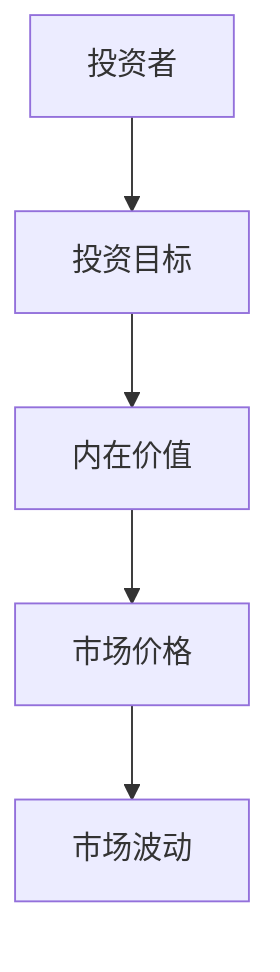
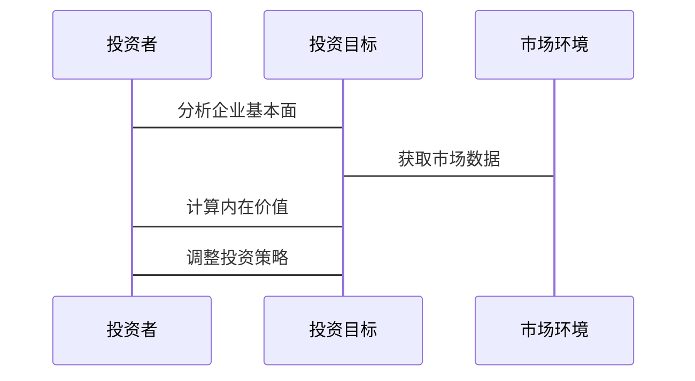

                 


# 彼得林奇的"价值投资"在不同经济周期的应用

> 关键词：价值投资，彼得林奇，经济周期，投资策略，风险管理

> 摘要：本文系统地探讨了彼得林奇的“价值投资”理念在不同经济周期中的应用策略。通过分析经济繁荣、衰退、复苏和稳定期的特点，结合价值投资的核心原则，提出在不同经济周期下如何调整投资策略的具体方法。文章从价值投资的基本概念、核心理念、风险管理等方面展开，结合实际案例和系统架构设计，为投资者提供实用的投资指南。

---

# 第一部分：价值投资与经济周期概述

## 第1章：价值投资的基本概念

### 1.1 价值投资的定义与核心理念

#### 1.1.1 价值投资的起源与发展

价值投资是一种长期投资策略，起源于20世纪初。本杰明·格雷厄姆和戴维·多德是这一理念的奠基人。彼得·林奇作为格雷厄姆的忠实追随者，进一步发展了这一理论，强调通过深入研究企业基本面，寻找被市场低估的投资标的。

#### 1.1.2 彼得·林奇的投资理念

彼得·林奇认为，成功的投资取决于对企业基本面的深入分析和对市场估值的准确判断。他强调以下几点：

1. **长期投资**：避免短期市场波动的干扰，关注企业的长期价值。
2. **选择优秀企业**：投资于具有强大竞争优势、良好管理和稳定现金流的企业。
3. **分散投资**：通过分散投资降低风险，避免过度集中。

#### 1.1.3 价值投资的核心要素

价值投资的核心在于寻找市场价低于内在价值的企业。内在价值是基于对企业未来现金流的折现计算得出的。公式如下：

$$
\text{内在价值} = \sum_{t=1}^{n} \frac{\text{现金流}}{(1 + r)^t}
$$

其中，\( r \) 是折现率，\( t \) 是时间。

### 1.2 经济周期的基本类型

#### 1.2.1 经济周期的定义与阶段划分

经济周期通常分为四个阶段：繁荣期、衰退期、复苏期和稳定期。

- **繁荣期**：经济增长迅速，市场情绪高涨。
- **衰退期**：经济增速放缓，甚至出现负增长。
- **复苏期**：经济开始逐步恢复，市场逐渐企稳。
- **稳定期**：经济保持温和增长，市场波动较小。

#### 1.2.2 不同经济周期的特点与影响

- **繁荣期**：企业盈利增长，市场估值偏高，但优质企业的内在价值可能被高估。
- **衰退期**：企业盈利下降，市场估值偏低，但可能存在被低估的优质企业。
- **复苏期**：企业盈利逐步恢复，市场估值逐渐回升，是布局优质企业的良好时机。
- **稳定期**：企业盈利稳定，市场估值合理，适合长期持有优质企业。

#### 1.2.3 价值投资与经济周期的关系

价值投资在不同经济周期中的表现受到市场情绪和企业基本面的影响。在繁荣期，市场情绪高涨可能导致短期收益过高，但长期来看，优质企业的内在价值会逐步显现。在衰退期，市场情绪低落，但可能隐藏着被低估的投资机会。

---

## 第2章：彼得·林奇的价值投资策略

### 2.1 彼得·林奇的投资哲学

#### 2.1.1 长期投资与耐心的价值

彼得·林奇强调长期投资的重要性。他认为，短期市场波动无法预测，而长期来看，企业的基本面才是决定股价的关键因素。

#### 2.1.2 避免短期市场波动的干扰

市场短期波动往往受情绪影响，但长期来看，市场会回归理性。因此，投资者应避免因短期波动而做出错误决策。

#### 2.1.3 选择优秀企业的标准

彼得·林奇认为，优秀企业应具备以下特征：

1. **强大的竞争优势**：企业在行业内具有领先地位。
2. **良好的管理团队**：管理层具有战略眼光和执行力。
3. **稳定的现金流**：企业具备持续盈利的能力。
4. **合理的估值**：市场价低于内在价值。

### 2.2 彼得·林奇的投资组合管理

#### 2.2.1 分散投资的重要性

分散投资可以降低风险。彼得·林奇建议投资者将资金分配到不同行业和企业，避免过度集中。

#### 2.2.2 个股选择与权重分配

在选择个股时，应注重企业的基本面和估值。权重分配应根据企业的潜在回报和风险进行调整。

#### 2.2.3 定期审视与调整策略

投资者应定期审视投资组合的表现，根据市场变化和企业基本面调整投资策略。

---

## 第3章：不同经济周期下的投资策略

### 3.1 经济繁荣期的投资策略

#### 3.1.1 繁荣期的市场特征

在繁荣期，市场情绪高涨，企业盈利增长迅速，但市场估值可能偏高。

#### 3.1.2 价值投资的机会与挑战

繁荣期的机会在于寻找具有强大竞争优势的企业，但挑战在于市场估值可能过高，优质企业可能被高估。

#### 3.1.3 高质量企业的识别与投资

在繁荣期，投资者应选择具有强大竞争优势和稳定现金流的企业，避免追高。

### 3.2 经济衰退期的投资策略

#### 3.2.1 衰退期的市场特征

在衰退期，市场情绪低落，企业盈利下降，但优质企业可能被低估。

#### 3.2.2 寻找被低估的价值股

衰退期是寻找被低估优质企业的良好时机。投资者应关注具有强大竞争优势和稳定现金流的企业。

#### 3.2.3 风险管理与投资纪律

在衰退期，投资者应注重风险管理，避免过度集中投资，保持投资纪律。

### 3.3 经济复苏期的投资策略

#### 3.3.1 复苏期的市场特征

在复苏期，市场情绪逐渐企稳，企业盈利逐步恢复。

#### 3.3.2 价值投资的逐步布局

复苏期是逐步布局优质企业的良好时机。投资者应关注行业龙头和具有强大竞争优势的企业。

#### 3.3.3 行业选择与投资时机

在复苏期，投资者应选择具有较高增长潜力的行业，合理把握投资时机。

### 3.4 经济稳定期的投资策略

#### 3.4.1 稳定期的市场特征

在稳定期，市场情绪较为平稳，企业盈利保持稳定增长。

#### 3.4.2 价值投资的长期布局

稳定期是长期持有优质企业的良好时期。投资者应关注企业的长期增长潜力。

#### 3.4.3 优质企业的持续跟踪

在稳定期，投资者应持续跟踪优质企业的基本面，及时调整投资组合。

---

## 第4章：价值投资的核心概念与联系

### 4.1 核心概念原理

#### 4.1.1 价值投资的内在价值计算

内在价值是基于对企业未来现金流的折现计算得出的。公式如下：

$$
\text{内在价值} = \sum_{t=1}^{n} \frac{\text{现金流}}{(1 + r)^t}
$$

其中，\( r \) 是折现率，\( t \) 是时间。

#### 4.1.2 市场价格与内在价值的差异

市场价格受市场情绪影响，可能高于或低于内在价值。价值投资的核心在于寻找市场价格低于内在价值的企业。

#### 4.1.3 时间的玫瑰与复利的力量

长期来看，复利的力量可以使投资收益最大化。公式如下：

$$
\text{复利收益} = \left(1 + \frac{\text{年化收益率}}{n}\right)^{nt} - 1
$$

其中，\( n \) 是每年的复利次数，\( t \) 是投资时间。

### 4.2 核心概念对比表格

| 比较维度 | 价值投资 | 其他投资策略 |
|----------|-----------|--------------|
| 投资理念 | 长期持有，寻找低估企业 | 短期交易，追逐市场波动 |
| 风险管理 | 分散投资，注重企业基本面 | 高风险，杠杆操作 |
| 估值方法 | 基于内在价值 | 基于市场趋势 |

### 4.3 ER实体关系图（Mermaid流程图）



---

## 第5章：系统分析与架构设计

### 5.1 系统功能设计（领域模型Mermaid类图）


### 5.2 系统架构设计（Mermaid架构图）

```mermaid
container 价值投资系统 {
    投资者
    投资目标
    市场环境
}
```

### 5.3 系统交互设计（Mermaid序列图）



---

## 第6章：项目实战

### 6.1 投资模拟环境

#### 6.1.1 环境安装

需要安装以下工具：

- Python编程语言
- 数据分析库（Pandas、NumPy）
- 图表库（Matplotlib、Seaborn）
- Mermaid工具

#### 6.1.2 核心实现源代码

以下是价值投资策略的Python代码实现：

```python
import pandas as pd
import numpy as np
import matplotlib.pyplot as plt

# 示例数据：企业基本面
data = {
    '企业': ['企业A', '企业B', '企业C'],
    '收入': [100, 200, 150],
    '利润': [20, 30, 25],
    '现金流': [15, 25, 20]
}

df = pd.DataFrame(data)

# 计算内在价值
def calculate_intrinsic_value(row):
    # 假设现金流增长率为5%
    cash_flow = row['现金流']
    growth_rate = 0.05
    discount_rate = 0.08
    return cash_flow / (1 + discount_rate) + cash_flow * (1 + growth_rate) / (1 + discount_rate)**2

df['内在价值'] = df.apply(calculate_intrinsic_value, axis=1)

print(df)
```

#### 6.1.3 代码应用解读

上述代码计算了每家企业的内在价值。通过分析企业基本面，投资者可以判断市场价格是否低于内在价值。

#### 6.1.4 案例分析与解读

以企业A为例，计算得出的内在价值为：

$$
\text{内在价值} = \frac{15}{1.08} + \frac{15 \times 1.05}{1.08^2} \approx 13.89 + 14.06 = 27.95
$$

如果企业A的市场价格低于27.95，则具有投资价值。

---

## 第7章：最佳实践、小结与注意事项

### 7.1 最佳实践

1. **长期投资**：避免短期市场波动的干扰。
2. **分散投资**：降低投资风险。
3. **深入研究**：分析企业基本面和市场估值。
4. **风险管理**：定期审视和调整投资策略。

### 7.2 小结

彼得·林奇的价值投资理念强调长期投资和基本面分析。在不同经济周期中，投资者应根据市场特点和企业基本面调整投资策略，寻找被低估的优质企业。

### 7.3 注意事项

1. **市场波动**：避免过度依赖市场短期波动。
2. **企业研究**：深入分析企业基本面，避免盲目投资。
3. **风险管理**：合理分散投资，控制风险。

---

## 第8章：拓展阅读

1. 《彼得·林奇的成功投资》
2. 《价值投资实战手册》
3. 《投资最重要的少数法则》

---

作者：AI天才研究院/AI Genius Institute & 禅与计算机程序设计艺术/Zen And The Art of Computer Programming

