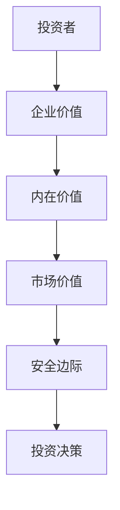
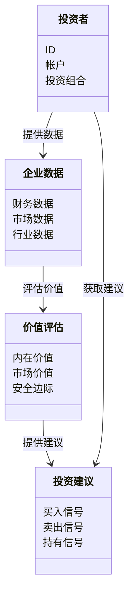
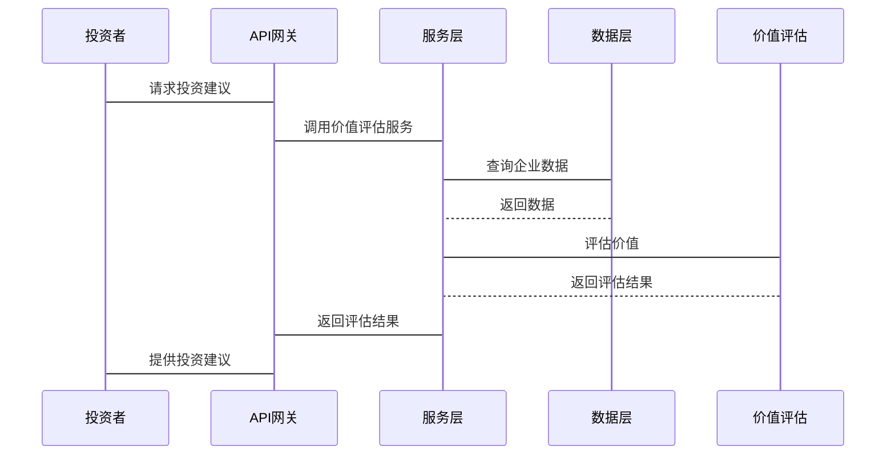

                 


# 彼得林奇的"价值投资"在数字经济时代的重新定义

## 关键词
- 价值投资
- 彼得·林奇
- 数字经济
- 投资策略
- 数字技术

## 摘要
在数字经济时代，彼得·林奇的价值投资理念需要重新定义。本文分析了数字技术对传统投资策略的影响，探讨了如何利用数据驱动的方法和现代技术工具，如机器学习和大数据分析，来优化投资决策。通过构建系统架构和项目实战案例，本文展示了如何在数字时代将价值投资理念与现代技术手段相结合，提供了实际应用的建议和注意事项。

---

# 第一部分：价值投资的背景与核心理念

## 第1章：价值投资的定义与核心要素

### 1.1 价值投资的起源与核心理念
- **1.1.1 价值投资的起源与发展**  
  价值投资是一种以企业内在价值为核心的投资策略，起源于20世纪，由本杰明·格雷厄姆和多萝西娅·多德提出，并被彼得·林奇发扬光大。核心理念是寻找市场低估的股票，长期持有，等待其价值回归。

- **1.1.2 彼得·林奇的价值投资策略**  
  彼得·林奇以其独特的选股方法闻名，强调深入研究公司基本面，关注企业的盈利能力、管理团队和行业地位。他主张分散投资，避免过度集中，同时注重企业的竞争优势和成长潜力。

- **1.1.3 价值投资的核心要素与概念结构**  
  价值投资的核心要素包括内在价值、市场价值、安全边际和竞争优势。内在价值是企业未来现金流的现值，市场价值是股票的市场价格，安全边际是内在价值与市场价格的差额，竞争优势是企业长期盈利能力的保障。

### 1.2 价值投资与数字经济时代的结合
- **1.2.1 数字经济时代的定义与特征**  
  数字经济是以数字技术为核心驱动力的经济形态，特征包括数据化、智能化、网络化和平台化。数字技术改变了企业的运营模式、市场结构和价值创造方式。

- **1.2.2 数字经济对传统价值投资的影响**  
  数字经济使得数据成为关键生产要素，企业价值的评估不再仅依赖于传统财务指标，还需考虑数据资产、技术壁垒和数字化转型能力。此外，算法交易和高频交易的普及使得市场波动性增加，价值投资需要适应新的市场环境。

- **1.2.3 数字经济时代价值投资的新维度**  
  在数字经济时代，价值投资需要关注企业的数字化转型能力、数据资产的价值、技术壁垒的可持续性以及管理层的数字化战略能力。同时，投资者需要利用大数据和人工智能技术来辅助分析和决策。

---

# 第二部分：价值投资的核心概念与联系

## 第2章：价值投资的核心概念与属性特征

### 2.1 核心概念原理
- **2.1.1 内在价值与市场价值的对比**  
  内在价值是企业未来现金流的现值，反映企业的实际价值；市场价值是股票的市场价格，受市场情绪和短期因素影响。内在价值是长期投资的基础，而市场价值是波动的。

- **2.1.2 安全边际的定义与作用**  
  安全边际是内在价值与市场价格的差额，是投资的安全垫。在数字经济时代，安全边际需要考虑数据波动和技术风险。

- **2.1.3 股东权益与企业价值的关系**  
  股东权益是企业价值的重要组成部分，包括资产、负债和所有者权益。在数字经济时代，数据资产的评估成为股东权益的重要内容。

### 2.2 核心概念属性特征对比表格
| 概念       | 特征1       | 特征2       | 特征3       |
|------------|-------------|-------------|-------------|
| 内在价值   | 稳定性       | 可计算性     | 长期性       |
| 市场价值   | 波动性       | 不可预测性   | 短期性       |
| 安全边际   | 保护性       | 可衡量性     | 风险控制性   |

### 2.3 ER实体关系图架构（Mermaid流程图）


---

# 第三部分：价值投资的算法原理与数学模型

## 第3章：价值投资的算法原理与数学模型

### 3.1 价值投资的量化分析方法
- **3.1.1 量化分析的基本原理**  
  量化分析通过数学模型和算法，利用大数据和机器学习技术，对市场数据进行分析，寻找投资机会。价值投资的量化分析包括对企业基本面的量化评估和市场情绪的量化分析。

- **3.1.2 价值投资的数学模型与公式**
  - 内在价值公式：
    $$ V = \frac{E}{1 + r} $$
    其中，\( E \) 是企业的未来现金流，\( r \) 是折现率。
  - 安全边际公式：
    $$ \text{安全边际} = V - P $$
    其中，\( V \) 是内在价值，\( P \) 是市场价格。

### 3.2 价值投资的机器学习模型与代码实现
- **3.2.1 机器学习模型的构建**
  - 数据预处理：收集企业的财务数据、市场数据和行业数据。
  - 特征工程：提取关键特征，如市盈率、市净率、ROE等。
  - 模型训练：使用回归模型或分类模型，预测股票的价值。
- **3.2.2 代码实现（Python）**
  ```python
  import pandas as pd
  import numpy as np
  from sklearn.linear_model import LinearRegression

  # 数据加载
  df = pd.read_csv('stock_data.csv')

  # 特征与目标变量分离
  X = df[['市盈率', '市净率', 'ROE']]
  y = df['内在价值']

  # 模型训练
  model = LinearRegression()
  model.fit(X, y)

  # 预测
  predictions = model.predict(X)
  ```

---

# 第四部分：系统分析与架构设计

## 第4章：系统分析与架构设计

### 4.1 问题场景介绍
- 数字经济时代，投资者需要一个智能化的价值投资系统，能够实时分析企业的数据，评估其内在价值和市场价值，提供投资建议。

### 4.2 系统功能设计（领域模型Mermaid类图）


### 4.3 系统架构设计（Mermaid架构图）


### 4.4 系统接口设计
- 数据接口：提供企业数据的导入和查询功能。
- 分析接口：提供价值评估和预测功能。
- 投资建议接口：提供基于分析结果的投资建议。

### 4.5 系统交互（Mermaid序列图）


---

# 第五部分：项目实战

## 第5章：项目实战

### 5.1 环境安装
- 安装Python和相关库：
  ```bash
  pip install pandas numpy scikit-learn
  ```

### 5.2 系统核心实现源代码
```python
import pandas as pd
import numpy as np
from sklearn.linear_model import LinearRegression

# 数据加载
df = pd.read_csv('stock_data.csv')

# 特征工程
X = df[['市盈率', '市净率', 'ROE']]
y = df['内在价值']

# 模型训练
model = LinearRegression()
model.fit(X, y)

# 预测与评估
predictions = model.predict(X)
print("预测结果：", predictions)
print("均方误差：", np.mean((y - predictions) ** 2))
```

### 5.3 代码应用解读与分析
- 数据加载：从CSV文件中加载股票数据。
- 特征工程：选择市盈率、市净率和ROE作为特征。
- 模型训练：使用线性回归模型训练模型。
- 预测与评估：输出预测结果和均方误差，评估模型的准确性。

### 5.4 实际案例分析
- 案例：分析某科技公司的股票，评估其内在价值和市场价值，提供投资建议。

### 5.5 项目小结
- 项目实现了价值投资的量化分析，利用机器学习模型辅助投资决策。
- 数字技术的应用提高了分析的准确性和效率，为投资者提供了新的工具。

---

# 第六部分：最佳实践、小结、注意事项与拓展阅读

## 第6章：最佳实践与小结

### 6.1 最佳实践 tips
- 结合技术与基本面分析，避免单一依赖某一种方法。
- 定期更新模型，适应市场变化。
- 重视风险管理，控制投资组合的风险。

### 6.2 小结
- 数字经济时代，价值投资需要重新定义，结合数字技术的应用，投资者可以更高效地进行分析和决策。
- 通过系统架构和算法模型的优化，价值投资在数字时代焕发出新的活力。

### 6.3 注意事项
- 数据质量是分析的基础，需确保数据的准确性和完整性。
- 模型的可解释性是关键，避免过度依赖黑箱模型。
- 风险管理是投资的核心，需合理分散投资组合。

### 6.4 拓展阅读
- 《彼得·林奇的选股艺术》
- 《算法交易：像计算机一样交易》
- 《大数据投资策略》

---

# 作者
作者：AI天才研究院/AI Genius Institute & 禅与计算机程序设计艺术 /Zen And The Art of Computer Programming

