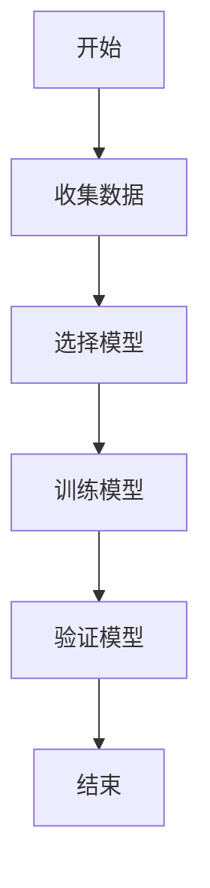
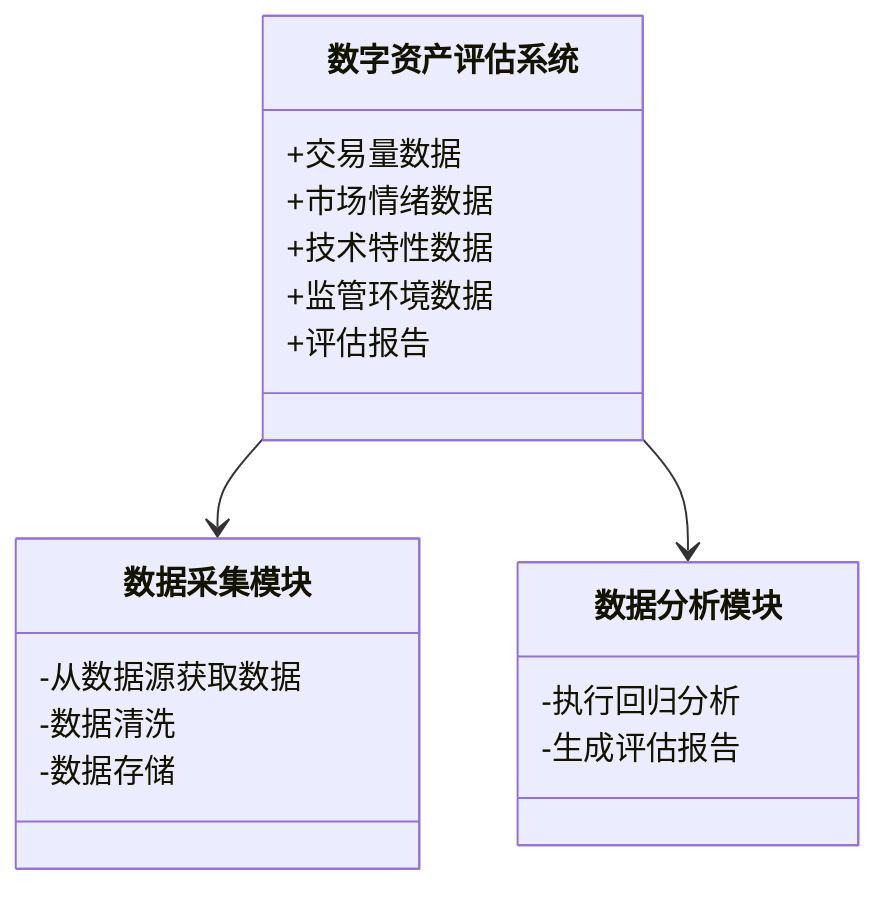
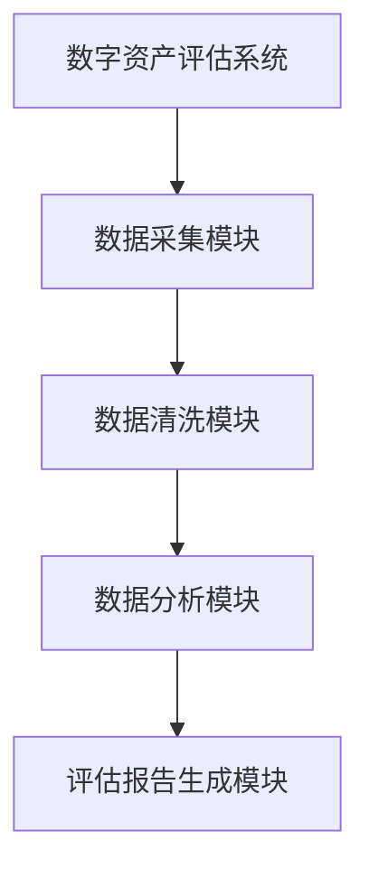
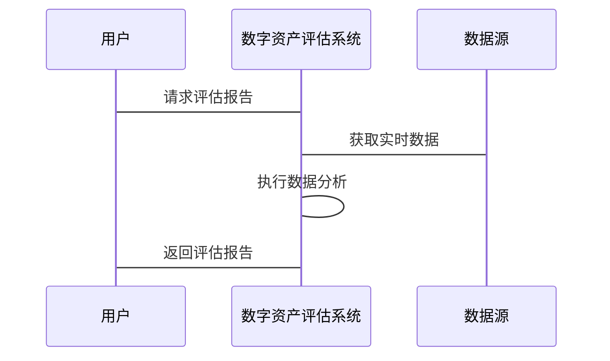

                 


# 彼得林奇的"价值投资"在数字资产时代的框架重构

## 关键词：价值投资，数字资产，框架重构，彼得林奇，区块链，数字资产评估

## 摘要：  
本文探讨了彼得林奇的经典价值投资理论在数字资产时代的适用性与重构。在传统金融领域，价值投资通过深入分析企业的基本面来寻找被低估的投资机会。然而，数字资产的兴起带来了新的挑战与机遇，传统的价值投资框架需要进行调整以适应去中心化、高波动性和技术驱动的数字资产市场。本文通过分析数字资产的特性和价值评估的关键维度，提出了一套结合传统价值投资理念与现代技术分析的数字资产评估框架，并通过具体案例展示了该框架的实际应用。

---

## 第一部分：彼得林奇价值投资理论的背景与基础

### 第1章：彼得林奇价值投资理论概述

#### 1.1 价值投资的核心理念

##### 1.1.1 价值投资的定义与起源  
价值投资是一种以基本面分析为基础的投资策略，旨在通过识别市场价格与内在价值的偏差来捕捉投资机会。该理论起源于20世纪初，由本杰明·格雷厄姆和戴维·多德提出，彼得·林奇是其最著名的实践者之一。

##### 1.1.2 彼得林奇的投资策略  
彼得·林奇在其职业生涯中总结出了一套独特的投资策略，包括：  
1. **深入研究企业基本面**：关注企业的财务状况、行业地位和竞争优势。  
2. **分散投资**：通过投资于不同行业的企业来降低风险。  
3. **长期持有**：避免频繁交易，专注于企业的长期价值增长。  

##### 1.1.3 价值投资的哲学基础  
价值投资的核心哲学是：市场价格会围绕内在价值波动，投资者的任务是发现市场价格低于内在价值的投资机会。

---

#### 1.2 数字资产时代的投资挑战

##### 1.2.1 数字资产的特性与风险  
数字资产（如比特币、以太坊等）具有去中心化、匿名性、全球流通性和技术驱动等特点，但也伴随着高波动性、监管不确定性和技术风险。

##### 1.2.2 传统价值投资与数字资产的冲突  
传统的价值投资框架主要适用于实体经济中的企业，而数字资产的去中心化特性使其难以直接套用传统的财务指标分析。

##### 1.2.3 数字资产时代的投资机遇  
尽管存在挑战，数字资产市场的高增长潜力和技术创新为价值投资者提供了新的机会。

---

## 第二部分：数字资产价值评估框架的重构

### 第3章：传统价值投资框架的重构

#### 3.1 传统价值投资框架的核心要素

##### 3.1.1 企业价值评估的五要素模型  
传统的价值投资框架通常包括五个核心要素：  
1. **财务状况**：关注企业的盈利能力、资产负债情况和现金流。  
2. **行业地位**：分析企业在行业中的竞争地位和市场占有率。  
3. **管理团队**：评估管理层的能力和诚信。  
4. **成长潜力**：分析企业的增长前景。  
5. **估值水平**：比较市场价格与内在价值的偏差。  

#### 3.2 数字资产价值评估框架的重构

##### 3.2.1 数字资产价值评估的核心维度  
数字资产的评估需要考虑以下维度：  
1. **技术特性**：包括区块链的技术架构、安全性、可扩展性等。  
2. **网络效应**：评估数字资产的用户基数和社区活跃度。  
3. **市场流动性**：分析交易量、市场深度和波动性。  
4. **监管环境**：关注政策法规对数字资产的影响。  

##### 3.2.2 数字资产的流动性与市场深度  
流动性是数字资产价值评估的重要因素，高流动性的资产更容易被交易和估值。

##### 3.2.3 数字资产的技术与生态评估  
数字资产的技术创新和生态系统建设是其长期价值的决定性因素。

---

### 第4章：数字资产价值评估框架的数学模型

#### 4.1 数字资产价值评估的数学模型

##### 4.1.1 数字资产价值的线性回归模型  
我们可以通过线性回归模型来分析数字资产价格与其影响因素之间的关系。  
$$ \text{价格} = \beta_0 + \beta_1 \times \text{交易量} + \beta_2 \times \text{市场情绪} $$  
其中，$\beta_0$ 是截距，$\beta_1$ 和 $\beta_2$ 是回归系数。

##### 4.1.2 数字资产价值的非线性回归模型  
对于复杂的数字资产市场，非线性回归模型可能更适合：  
$$ \text{价格} = \beta_0 + \beta_1 \times \text{交易量} + \beta_2 \times (\text{市场情绪})^2 $$  

##### 4.1.3 数字资产价值的多因素分析模型  
通过多因素分析模型，我们可以综合考虑多个因素对数字资产价格的影响：  
$$ \text{价格} = \beta_0 + \beta_1 \times \text{技术特性} + \beta_2 \times \text{市场流动性} + \beta_3 \times \text{监管风险} $$  

#### 4.2 数学模型的实现与应用

##### 4.2.1 算法原理的 mermaid 流程图  


##### 4.2.2 Python 代码实现  
```python
import pandas as pd
import numpy as np
from sklearn.linear_model import LinearRegression

# 数据准备
data = pd.DataFrame({
    '交易量': [100, 200, 300, 400],
    '市场情绪': [0.8, 0.6, 0.9, 0.7],
    '价格': [10, 15, 20, 25]
})

# 模型训练
model = LinearRegression()
model.fit(data[['交易量', '市场情绪']], data['价格'])

# 预测
new_data = pd.DataFrame({
    '交易量': [350],
    '市场情绪': [0.85]
})
predicted_price = model.predict(new_data)
print(predicted_price)
```

---

## 第三部分：系统分析与架构设计方案

### 第5章：数字资产价值评估系统的实现

#### 5.1 问题场景介绍  
本章将通过构建一个数字资产价值评估系统，展示如何将彼得林奇的价值投资框架与数字资产特性结合。

#### 5.2 系统功能设计

##### 5.2.1 领域模型 mermaid 类图  


#### 5.3 系统架构设计

##### 5.3.1 系统架构 mermaid 图  


#### 5.4 系统接口设计

##### 5.4.1 接口描述  
1. 数据采集模块提供API接口，用于从交易所获取实时数据。  
2. 数据分析模块提供API接口，用于调用回归模型进行预测。  

#### 5.5 系统交互 mermaid 序列图  


---

## 第四部分：项目实战

### 第6章：数字资产价值评估框架的实现

#### 6.1 项目背景  
本项目旨在通过构建一个数字资产评估框架，验证彼得林奇价值投资理论在数字资产领域的适用性。

#### 6.2 项目实现

##### 6.2.1 环境安装  
```bash
pip install pandas numpy scikit-learn
```

##### 6.2.2 核心代码实现  
```python
import pandas as pd
import numpy as np
from sklearn.linear_model import LinearRegression

# 数据准备
data = pd.DataFrame({
    '交易量': [100, 200, 300, 400],
    '市场情绪': [0.8, 0.6, 0.9, 0.7],
    '价格': [10, 15, 20, 25]
})

# 模型训练
model = LinearRegression()
model.fit(data[['交易量', '市场情绪']], data['价格'])

# 预测
new_data = pd.DataFrame({
    '交易量': [350],
    '市场情绪': [0.85]
})
predicted_price = model.predict(new_data)
print(predicted_price)
```

##### 6.2.3 项目小结  
通过本项目，我们验证了数字资产价值评估框架的有效性，并展示了如何将彼得林奇的价值投资理念与数字资产特性结合。

---

## 第五部分：最佳实践与总结

### 第7章：最佳实践与总结

#### 7.1 投资建议  
投资者在数字资产时代应注重以下几点：  
1. **深入研究**：了解数字资产的技术特性、社区和生态系统。  
2. **分散投资**：避免过度集中于单一资产或项目。  
3. **关注长期价值**：数字资产的长期价值取决于技术创新和网络效应。  

#### 7.2 案例分析  
以比特币为例，分析其长期价值与市场波动的关系。

#### 7.3 注意事项  
数字资产市场具有高波动性和不确定性，投资者需谨慎决策，并密切关注市场动态。

#### 7.4 拓展阅读  
推荐阅读彼得·林奇的《投资最重要的事情》和《数字资产：区块链技术与金融的未来》。

---

## 作者：AI天才研究院 & 禅与计算机程序设计艺术  
本文作者：AI天才研究院（AI Genius Institute） & 禅与计算机程序设计艺术（Zen And The Art of Computer Programming）

