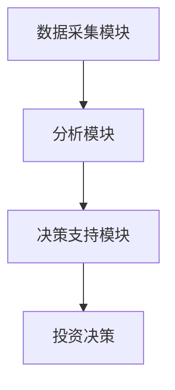

                 


```markdown
# 彼得林奇的"价值投资"在数字资产时代的重新定义

> 关键词：价值投资，数字资产，区块链，彼得·林奇，投资策略

> 摘要：本文探讨了彼得·林奇的经典价值投资理论在数字资产时代的应用与演变。通过分析数字资产的特性、价值评估体系及投资策略，结合技术分析与系统架构设计，重新定义了价值投资在数字资产领域的实践方法。文章结合实际案例，详细阐述了如何在数字资产领域运用价值投资理念，帮助投资者在数字资产市场中做出更明智的投资决策。

---

## 第1章: 价值投资的背景与基础

### 1.1 价值投资的核心理念

价值投资是一种以基本面分析为基础的投资策略，强调以低于内在价值的价格购买优质资产，长期持有，等待市场的合理估值。彼得·林奇作为价值投资的代表人物，其核心理念包括：

1. **注重基本面分析**：关注企业的财务状况、行业地位和竞争优势。
2. **长期投资**：避免频繁交易，耐心持有优质资产。
3. **逆向投资**：在市场恐慌时寻找被低估的投资标的。

### 1.2 数字资产的基本概念

数字资产是基于区块链技术的虚拟资产，具有去中心化、可分割性和不可篡改等特点。数字资产的分类包括：

1. **加密货币**：如比特币、以太坊，用于价值转移和存储。
2. **代币**：用于特定平台或项目的数字权益证明。
3. **NFT**：非同质化代币，用于表示独特的数字资产。

### 1.3 数字资产的市场现状与发展趋势

数字资产市场具有高波动性、去中心化和技术创新等特点。随着区块链技术的成熟，数字资产的应用场景不断扩展，从金融领域延伸至供应链管理、智能合约等领域。

---

## 第2章: 数字资产的特点与价值评估体系

### 2.1 数字资产的独特属性

数字资产的独特属性包括：

1. **去中心化**：基于区块链技术，无须中央机构的干预。
2. **不可篡改性**：通过区块链技术确保数据的安全性和不可篡改性。
3. **通证经济**：通过代币激励机制，推动生态系统的建设和扩展。

### 2.2 数字资产的价值评估体系

数字资产的价值评估体系包括以下维度：

1. **技术评估**：包括区块链的技术架构、共识机制、安全性等。
2. **市场评估**：包括市场规模、市场流动性、市场参与者等。
3. **团队与社区评估**：包括开发团队的背景、社区活跃度等。

---

## 第3章: 价值投资策略在数字资产中的应用

### 3.1 价值投资策略的重新定义

在数字资产时代，价值投资需要结合技术分析和市场分析，重新定义评估标准。以下是关键点：

1. **技术分析的重要性**：数字资产的内在价值与其技术实现密切相关，需要通过技术分析来评估项目的可行性。
2. **市场情绪的影响**：数字资产市场的波动性较高，市场情绪对价格影响显著，需要通过情绪分析来优化投资决策。

### 3.2 数字资产投资的实战策略

数字资产投资的实战策略包括：

1. **项目选择与风险评估**：选择有技术创新、团队可靠、市场需求大的项目。
2. **投资组合的构建与管理**：分散投资，合理配置不同类型和风险级别的资产。
3. **长期持有与价值发现**：坚持价值投资理念，长期持有优质资产，耐心等待价值实现。

---

## 第4章: 技术分析与价值评估的结合

### 4.1 技术分析的基本原理

技术分析通过分析历史价格数据和市场行为，预测未来的价格走势。常用的技术指标包括：

1. **移动平均线（MA）**：用于判断价格趋势的方向。
2. **相对强弱指数（RSI）**：用于判断价格超买或超卖状态。
3. **MACD指标**：用于判断价格趋势的强度和方向。

### 4.2 价值评估与技术分析的结合

结合价值评估和技术分析，可以制定更科学的投资策略。以下是实现步骤：

1. **基本面分析**：通过分析项目的财务状况、行业地位等，确定其内在价值。
2. **技术分析**：通过分析价格走势和市场行为，判断市场的短期波动。
3. **综合评估**：结合基本面和技术分析，制定投资决策。

---

## 第5章: 系统分析与架构设计方案

### 5.1 系统分析与架构设计方案

为了实现数字资产的价值投资，需要构建一个完整的投资系统，包括数据采集、分析、决策支持等功能。以下是系统架构设计方案：

1. **数据采集模块**：采集数字资产的市场价格、交易数据、项目信息等。
2. **分析模块**：包括技术分析、价值评估、风险评估等功能。
3. **决策支持模块**：根据分析结果，提供投资建议和策略优化。

### 5.2 系统架构图



### 5.3 系统接口设计

系统接口设计包括：

1. 数据接口：与数据源（如交易所API）对接，获取实时数据。
2. 用户接口：提供用户友好的操作界面，展示分析结果和投资建议。

---

## 第6章: 项目实战

### 6.1 项目选择与分析

选择一个具体的数字资产项目，例如比特币，进行详细分析：

1. **项目背景**：比特币是第一个去中心化的加密货币，具有较高的市场认可度。
2. **技术分析**：通过分析比特币的价格走势，判断其市场趋势。
3. **价值评估**：评估比特币的内在价值，包括其技术实现、市场需求等。

### 6.2 投资组合管理

根据分析结果，制定投资组合管理策略：

1. **分散投资**：将资金分配到不同类型和风险级别的数字资产中。
2. **定期评估**：定期评估投资组合的表现，及时调整投资策略。

---

## 第7章: 最佳实践、小结与拓展阅读

### 7.1 最佳实践

1. **持续学习**：保持对数字资产市场的关注，学习新的技术和投资策略。
2. **风险控制**：合理分散投资，设置止损点，降低投资风险。
3. **长期持有**：坚持价值投资理念，长期持有优质资产。

### 7.2 小结

本文重新定义了彼得·林奇的价值投资理念在数字资产时代中的应用，结合技术分析和价值评估，提出了一套适用于数字资产投资的策略和方法。通过系统的分析和实战案例，为投资者提供了科学的投资指导。

### 7.3 注意事项

1. **市场风险**：数字资产市场波动较大，投资者需谨慎操作。
2. **技术风险**：技术分析和价值评估需要结合实际情况，避免过于依赖单一指标。
3. **合规性**：遵守相关法律法规，选择合法合规的数字资产项目。

### 7.4 拓展阅读

1. 《彼得·林奇的投资智慧》
2. 《区块链技术与数字资产》
3. 《技术分析实战指南》

---

## 作者信息

作者：AI天才研究院/AI Genius Institute & 禅与计算机程序设计艺术 /Zen And The Art of Computer Programming
```

