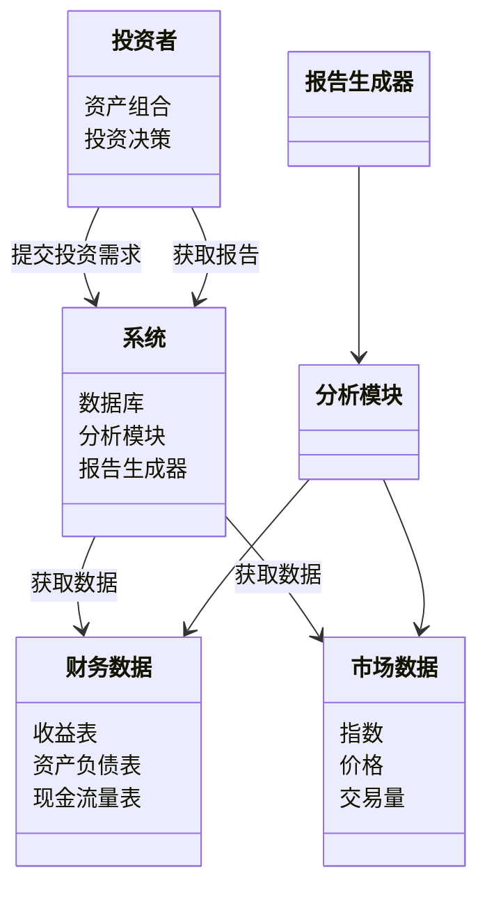

                 


# 彼得林奇的"价值投资"在新兴市场的应用

**关键词：** 价值投资，彼得·林奇，新兴市场，投资策略，风险管理

**摘要：** 本文探讨了彼得·林奇的价值投资理念在新兴市场的应用，分析了新兴市场的特点、投资机会与挑战，并提出了适用于新兴市场的投资框架和策略。通过结合理论与实际案例，本文为投资者提供了在新兴市场中运用价值投资的实践指南。

---

## 第1章: 价值投资的核心理念

### 1.1 价值投资的基本概念

#### 1.1.1 价值投资的定义与核心要素

价值投资是一种以基本面分析为基础的投资策略，强调以低于内在价值的价格购买优质资产。其核心要素包括：

- **内在价值**：资产在市场中的真实价值，不完全依赖市场报价。
- **安全边际**：购买价格低于内在价值，以降低风险。
- **长期视角**：关注长期收益，而非短期波动。

#### 1.1.2 彼得·林奇的价值投资策略

彼得·林奇作为价值投资的代表人物，强调以下几点：

- **深入研究**：通过分析财务报表、行业地位等因素，选择具有竞争优势的企业。
- **长期持有**：避免频繁交易，降低交易成本。
- **分散投资**：通过多样化投资降低风险。

#### 1.1.3 价值投资的基本原则与框架

价值投资的基本原则包括：

1. **买入优秀企业**：选择具有持续盈利能力、良好管理和强大竞争优势的企业。
2. **关注长期价值**：忽略短期市场波动，关注企业的长期增长潜力。
3. **安全边际**：确保买入价格低于企业的真实价值。

---

### 1.2 新兴市场的特点与投资机会

#### 1.2.1 新兴市场的定义与分类

新兴市场是指那些经济增长迅速、但市场机制尚不完善的国家或地区。常见的新兴市场包括中国、印度、巴西等。

#### 1.2.2 新兴市场的投资机会与风险

新兴市场具有以下特点：

- **高增长潜力**：新兴市场通常经济增长快，投资回报率高。
- **高波动性**：市场波动剧烈，风险较高。
- **信息不透明**：企业财务信息和市场数据可能不够透明。

#### 1.2.3 新兴市场与成熟市场的对比分析

与成熟市场相比，新兴市场具有以下优势和劣势：

| 特性         | 成熟市场           | 新兴市场           |
|--------------|--------------------|--------------------|
| 市场波动      | 低                 | 高                 |
| 增长潜力      | 有限               | 高                 |
| 信息透明度    | 高                 | 低                 |
| 投资机会      | 少                 | 多                 |

---

### 1.3 价值投资在新兴市场的适用性

#### 1.3.1 价值投资在新兴市场的可行性

尽管新兴市场存在波动性和信息不对称的问题，但价值投资的核心理念仍然适用。通过深入研究和长期持有，投资者可以挖掘到具有成长潜力的企业。

#### 1.3.2 新兴市场中的价值投资策略

在新兴市场中，价值投资者需要特别注意以下几点：

- **选择优质企业**：重点关注那些具有强大竞争优势、良好管理和增长潜力的企业。
- **关注估值**：确保买入价格低于企业的内在价值。
- **分散投资**：通过多样化投资降低市场波动带来的风险。

#### 1.3.3 价值投资与新兴市场环境的结合

将价值投资应用于新兴市场时，需要结合市场特点进行调整。例如，更注重企业的成长性，同时关注行业趋势和政策环境。

---

## 第2章: 彼得·林奇投资理念的核心要素

### 2.1 彼得·林奇的投资哲学

#### 2.1.1 彼得·林奇的投资理念概述

彼得·林奇强调：

- **深入研究**：通过调研和分析，了解企业的基本面。
- **长期持有**：避免短期交易，降低交易成本。
- **分散投资**：通过多样化降低风险。

#### 2.1.2 彼得·林奇的投资策略与方法

彼得·林奇的投资策略包括：

- **买入并持有**：长期持有优质资产。
- **关注竞争优势**：选择具有竞争优势的企业。
- **分散投资**：通过投资不同类型的企业降低风险。

#### 2.1.3 彼得·林奇的投资成功案例分析

彼得·林奇管理的麦哲伦基金取得了显著的业绩，部分得益于其价值投资策略。

---

### 2.2 价值投资的核心要素

#### 2.2.1 企业基本面分析

基本面分析包括：

- **财务报表分析**：分析企业的盈利能力、财务状况等。
- **行业分析**：了解企业的行业地位和竞争环境。
- **管理层分析**：评估管理层的能力和诚信。

#### 2.2.2 财务报表分析与估值方法

常见的估值方法包括：

- **市盈率（P/E）**：衡量股价与每股收益的关系。
- **市净率（P/B）**：衡量股价与每股净资产的关系。
- **股息率**：衡量股票的分红能力。

#### 2.2.3 行业分析与竞争优势评估

行业分析包括：

- **行业生命周期**：分析行业所处的阶段（幼稚期、成长期、成熟期、衰退期）。
- **行业结构**：分析行业的竞争格局和进入壁垒。

---

### 2.3 彼得·林奇的投资框架

#### 2.3.1 投资决策的逻辑与流程

彼得·林奇的投资流程包括：

1. **初步筛选**：通过行业分析和财务指标筛选出候选企业。
2. **深入研究**：通过调研和访谈进一步了解企业。
3. **评估价值**：计算企业的内在价值。
4. **决定投资**：根据安全边际决定是否买入。

#### 2.3.2 投资组合的构建与管理

投资组合管理包括：

- **分散投资**：通过投资不同类型的企业降低风险。
- **定期调整**：根据市场变化和企业情况调整投资组合。

#### 2.3.3 投资风险的识别与控制

风险控制包括：

- **分散投资**：避免过度集中。
- **设定止损**：在市场下跌时及时止损。

---

## 第3章: 新兴市场的投资环境与挑战

### 3.1 新兴市场的经济与金融环境

#### 3.1.1 经济结构与增长模式

新兴市场的经济结构通常以制造业和服务业为主，增长模式以出口导向和内需驱动为主。

#### 3.1.2 金融市场的特点与发展趋势

新兴市场的金融市场通常发展迅速，但可能存在以下问题：

- **流动性不足**：某些市场交易量小，流动性差。
- **波动性高**：市场容易受到外部因素的影响。

#### 3.1.3 政治与政策风险分析

新兴市场可能存在以下政治和政策风险：

- **政策变化**：政府政策的变化可能影响市场。
- **政治稳定性**：政治不稳定可能导致市场波动。

---

### 3.2 新兴市场的行业分析与投资机会

#### 3.2.1 主要行业的投资价值分析

新兴市场的主要行业包括：

- **科技行业**：高增长潜力，但竞争激烈。
- **消费行业**：受益于人口增长和消费升级。
- **金融行业**：随着金融改革的推进，具有增长潜力。

#### 3.2.2 新兴行业的成长潜力与风险

新兴行业通常具有高增长潜力，但也伴随着较高的风险。

#### 3.2.3 行业竞争格局与市场进入壁垒

分析行业竞争格局，选择具有竞争优势的企业。

---

### 3.3 新兴市场的投资挑战与应对策略

#### 3.3.1 市场波动性与流动性风险

应对策略：

- **分散投资**：降低市场波动的影响。
- **选择流动性好的资产**：避免流动性不足带来的损失。

#### 3.3.2 信息不对称与透明度问题

应对策略：

- **加强调研**：通过实地调研获取更多信息。
- **依赖第三方数据**：利用专业机构的研究报告。

#### 3.3.3 投资策略的调整与优化

根据市场环境的变化，及时调整投资策略。

---

## 第4章: 价值投资在新兴市场的应用框架

### 4.1 投资决策的逻辑与流程

在新兴市场中，价值投资的流程需要结合市场特点进行调整。

#### 4.1.1 筛选候选企业

- 通过行业分析筛选出具有增长潜力的企业。
- 通过财务指标筛选出估值合理的企业。

#### 4.1.2 深入研究

- 进行实地调研，了解企业的真实情况。
- 与管理层沟通，评估管理团队的能力。

#### 4.1.3 评估价值

- 使用多种估值方法，计算企业的内在价值。
- 结合市场环境，确定买入价格。

#### 4.1.4 决定投资

- 根据安全边际原则，决定是否买入。

---

### 4.2 投资组合的构建与管理

在新兴市场中，投资组合的管理需要特别注意：

#### 4.2.1 分散投资

- 通过投资不同类型的企业降低风险。
- 选择不同行业的资产分散风险。

#### 4.2.2 动态调整

- 定期评估投资组合的表现。
- 根据市场变化调整资产配置。

#### 4.2.3 风险控制

- 设定止损点，避免过大损失。
- 保持足够的流动性，应对市场波动。

---

## 第5章: 数学模型与算法的应用

### 5.1 市场预测模型

#### 5.1.1 CAPM模型

CAPM模型用于计算资产的预期收益：

$$ E(r_i) = r_f + \beta_i (r_m - r_f) $$

其中，$r_f$ 是无风险利率，$r_m$ 是市场预期收益率，$\beta_i$ 是资产的贝塔系数。

---

## 第6章: 系统分析与架构设计

### 6.1 系统功能设计

#### 6.1.1 领域模型（Mermaid类图）



---

## 第7章: 项目实战

### 7.1 环境安装与配置

#### 7.1.1 安装Python

```bash
# 在终端中运行以下命令安装Python
sudo apt-get install python3
```

---

### 7.2 核心实现源代码

#### 7.2.1 计算CAPM模型的Python代码

```python
def calculate_capm(risk_free_rate, beta, market_return):
    return risk_free_rate + beta * (market_return - risk_free_rate)
```

---

### 7.3 案例分析

#### 7.3.1 印度市场的投资策略

以印度市场为例，分析如何应用价值投资策略选择优质企业。

---

## 第8章: 最佳实践与小结

### 8.1 投资策略的最佳实践

- **长期视角**：关注企业的长期增长潜力。
- **深入研究**：通过调研和分析了解企业基本面。
- **分散投资**：降低市场波动带来的风险。

### 8.2 小结与展望

总结全文，展望未来的研究方向。

---

## 第9章: 注意事项与拓展阅读

### 9.1 投资注意事项

- **风险提示**：新兴市场存在高波动性和高风险。
- **信息获取**：确保获取准确和及时的市场信息。

### 9.2 拓展阅读

- **推荐书籍**：《彼得·林奇的选股术》、《新兴市场投资指南》。
- **在线资源**：关注财经网站和投资博客，获取最新市场信息。

---

## 第10章: 作者信息

作者：AI天才研究院/AI Genius Institute & 禅与计算机程序设计艺术/Zen And The Art of Computer Programming

---

通过以上内容，本文系统地探讨了彼得·林奇的价值投资理念在新兴市场的应用，结合理论与实践，为投资者提供了实用的指导和建议。

