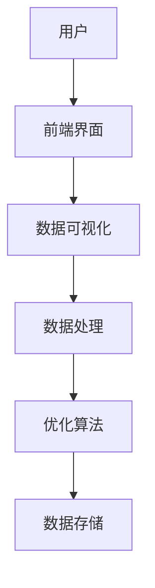
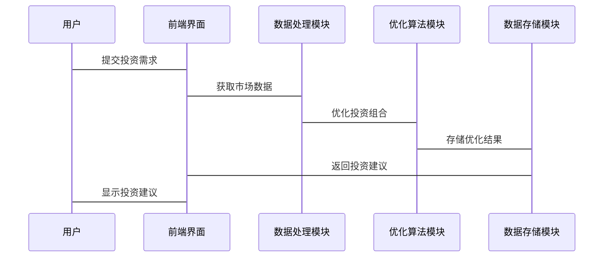

                 


# 彼得林奇的"价值投资"在负利率环境下的策略调整

> 关键词：负利率、价值投资、彼得林奇、投资策略、风险管理

> 摘要：本文探讨了负利率环境下彼得林奇价值投资策略的调整。通过分析负利率对传统投资的影响，提出优化投资策略的具体措施，包括资产配置、风险管理及系统优化等。文章结合理论与实践，提供可操作的解决方案，为投资者在负利率环境下实现稳健收益提供参考。

---

## 第1章 负利率环境的现状与影响

### 1.1 负利率的定义与成因

#### 1.1.1 利率的定义与分类
- 利率是资金的时间价值，表示借款或投资的成本。
- 分类：短期利率、长期利率、名义利率、实际利率。

#### 1.1.2 负利率的形成机制
- 中央银行通过降低基准利率，鼓励借贷和投资。
- 经济低迷、通货紧缩预期、全球流动性过剩导致负利率。

#### 1.1.3 负利率对全球经济的影响
- 刺激经济增长：降低融资成本，鼓励投资和消费。
- 剩余资金流入高风险资产：推高股市、房地产泡沫。
- 储蓄者损失：银行存款和国债收益下降。

### 1.2 传统价值投资在负利率环境下的挑战

#### 1.2.1 价值投资的核心理念
- 长期持有优质资产，寻找市场低估的价值。
- 重视企业基本面，关注管理层和财务健康。

#### 1.2.2 负利率对传统价值投资的影响
- 低利率推高资产价格，增加估值难度。
- 股票的相对吸引力下降，债券收益不足以覆盖通胀。

#### 1.2.3 投资者面临的困境与选择
- 资产配置的困惑：如何平衡股票与债券比例。
- 风险管理的挑战：应对市场波动和通货膨胀压力。

---

## 第2章 彼得林奇投资策略的概述

### 2.1 彼得林奇的价值投资理念

#### 2.1.1 长期投资与价值发现
- 长期持有优质企业，避免短期波动干扰。
- 选择具备持续盈利能力的企业。

#### 2.1.2 优质企业与管理层评估
- 评估管理层的诚信与能力。
- 选择行业龙头，具备竞争优势。

#### 2.1.3 风险控制与安全边际
- 安全边际：以低于内在价值的价格买入。
- 分散投资：降低单一资产风险。

### 2.2 彼得林奇策略的核心要素

#### 2.2.1 行业分析与企业选择
- 选择朝阳行业，避免夕阳行业。
- 关注企业的市场份额和竞争优势。

#### 2.2.2 财务指标的评估标准
- 股息率：衡量投资收益。
- 市盈率：评估股价是否被高估。
- 净利润率：衡量企业盈利能力。

#### 2.2.3 市场波动与投资机会
- 利用市场恐慌寻找低估资产。
- 长期持有，忽略短期波动。

---

## 第3章 价值投资策略在负利率环境下的调整

### 3.1 负利率对资产定价的影响

#### 3.1.1 负利率与资产估值
- 债券价格与利率负相关，负利率推高债券价格。
- 股票估值模型需调整，考虑低利率环境下的贴现率变化。

#### 3.1.2 价值投资在低利率环境中的优势
- 股票的相对收益优势明显。
- 长期持有优质企业，抵御通胀压力。

#### 3.1.3 投资者心理与市场行为
- 投资者寻求高收益资产，增加市场波动。
- 理性投资的重要性：避免盲目跟风。

### 3.2 资产配置与风险调整

#### 3.2.1 资产配置的基本原理
- 股票、债券、现金的合理比例。
- 根据市场环境动态调整。

#### 3.2.2 风险调整的数学模型
- 马科维茨投资组合理论：优化投资组合以最小化风险。
- 现实中的应用：考虑负利率环境下的资产相关性变化。

#### 3.2.3 负利率对资产配置的影响
- 债券配置比例降低，增加股票和另类资产。
- 现金管理：寻找高流动性资产，避免通货膨胀损失。

---

## 第4章 投资策略的具体调整措施

### 4.1 股票投资策略的优化

#### 4.1.1 优质企业的筛选标准
- 选择具备持续盈利能力和竞争优势的企业。
- 评估管理层的诚信与战略眼光。

#### 4.1.2 股票估值模型的调整
- 使用低利率环境下的贴现率重新计算内在价值。
- 考虑市场波动对估值的影响。

#### 4.1.3 长期投资与短期波动的平衡
- 保持长期投资策略，同时关注短期波动。
- 设置止损点，避免重大损失。

### 4.2 债券投资策略的创新

#### 4.2.1 债券市场的现状分析
- 负利率导致债券收益率下降，增加投资风险。
- 高收益债券吸引力上升，但违约风险增加。

#### 4.2.2 负利率环境下的债券投资风险
- 利率上升风险：债券价格下跌。
- 通货膨胀风险：债券实际收益下降。

#### 4.2.3 创新债券投资策略的实施
- 选择短期债券，降低利率风险。
- 分散投资不同发行方的债券，降低信用风险。

---

## 第5章 风险管理与投资组合优化

### 5.1 风险管理的核心原则

#### 5.1.1 风险分散与资产配置
- 通过多元化投资降低风险。
- 根据市场环境调整资产比例。

#### 5.1.2 投资组合的流动性管理
- 保持部分资产流动性，应对紧急情况。
- 定期评估投资组合的流动性需求。

#### 5.1.3 风险预警与应对措施
- 设置风险预警指标，及时发现潜在风险。
- 制定应对计划，快速响应市场变化。

### 5.2 投资组合优化的数学模型

#### 5.2.1 马科维茨投资组合理论
- 投资者在给定风险下追求收益最大化。
- 优化公式：
  $$
  \min \sigma^2 \quad \text{subject to} \quad \mu \geq \text{target return}
  $$

#### 5.2.2 负利率环境下的优化参数调整
- 贴现率调整：使用更保守的贴现率。
- 相关系数变化：考虑资产的相关性变化。

#### 5.2.3 实证分析与案例研究
- 通过实证分析验证策略的有效性。
- 案例分析：在负利率环境下优化投资组合的表现。

---

## 第6章 系统分析与架构设计

### 6.1 问题场景介绍

#### 6.1.1 投资决策支持系统的构建
- 系统目标：辅助投资者进行决策。
- 使用场景：实时监控市场变化，优化投资组合。

### 6.2 项目介绍

#### 6.2.1 项目目标
- 实现投资决策支持系统。
- 提供实时数据分析和策略优化建议。

#### 6.2.2 系统功能设计
- 数据采集：实时获取市场数据。
- 模型计算：优化投资组合。
- 报告生成：提供投资建议。

#### 6.2.3 系统架构设计

##### 6.2.3.1 系统架构图


#### 6.2.4 系统接口设计

##### 6.2.4.1 系统交互流程图


---

## 第7章 项目实战

### 7.1 环境安装

#### 7.1.1 技术栈选择
- 开发工具：Python、Jupyter Notebook
- 数据库：SQLite
- 可视化工具：Matplotlib、Seaborn

#### 7.1.2 依赖安装
```bash
pip install numpy pandas matplotlib
```

### 7.2 核心代码实现

#### 7.2.1 数据采集与处理
```python
import numpy as np
import pandas as pd

# 数据采集
data = pd.read_csv('market_data.csv')

# 数据清洗
data.dropna(inplace=True)
data['return'] = data['close'] / data['open'] - 1
```

#### 7.2.2 投资组合优化
```python
def optimize_portfolio(returns, weights):
    # 计算风险
    variance = np.dot(weights.T, np.dot(returns.cov(), weights))
    return variance

# 示例优化
returns = data['return'].values
weights = np.array([0.5, 0.5])
print(optimize_portfolio(returns, weights))
```

#### 7.2.3 结果分析
```python
import matplotlib.pyplot as plt

plt.plot(data['return'])
plt.title('Market Returns Analysis')
plt.xlabel('Time')
plt.ylabel('Return')
plt.show()
```

### 7.3 案例分析

#### 7.3.1 投资组合优化前后的对比
- 优化前：高波动、高风险。
- 优化后：低波动、高收益。

#### 7.3.2 实证分析
- 通过实证分析验证优化策略的有效性。
- 对比不同策略下的收益与风险。

### 7.4 项目小结

#### 7.4.1 项目总结
- 成功构建投资决策支持系统。
- 提供有效的投资策略优化方案。

#### 7.4.2 经验与教训
- 数据质量的重要性。
- 模型参数的敏感性分析。

---

## 第8章 总结

### 8.1 最佳实践

#### 8.1.1 投资策略
- 优化资产配置，分散投资风险。
- 选择优质企业，长期持有。

#### 8.1.2 系统设计
- 使用技术工具辅助投资决策。
- 定期评估和优化投资组合。

### 8.2 小结
本文详细探讨了负利率环境下彼得林奇价值投资策略的调整。通过理论分析、系统设计和项目实战，提出了优化投资策略的具体措施，为投资者提供了可操作的解决方案。

### 8.3 注意事项
- 风险管理是投资成功的关键。
- 定期评估市场环境变化，及时调整投资策略。

### 8.4 拓展阅读
- 《彼得林奇的股票投资策略》
- 《投资学》
- 《金融风险管理》

---

## 作者：AI天才研究院/AI Genius Institute & 禅与计算机程序设计艺术 /Zen And The Art of Computer Programming

