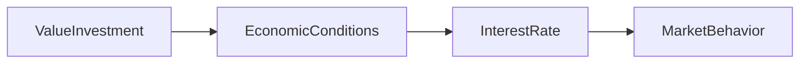

                 


# 彼得林奇的"价值投资"在零利率时代的挑战

## 关键词：价值投资、彼得林奇、零利率时代、投资策略、经济分析

## 摘要：本文探讨了彼得林奇的价值投资理念在零利率环境下的挑战与应对策略。通过分析价值投资的核心概念、算法原理、系统架构设计以及实际案例，本文为投资者提供了在低利率环境下调整投资策略的深入见解。

---

## 第1章：价值投资的定义与核心理念

### 1.1 价值投资的基本概念

#### 1.1.1 价值投资的起源与发展

价值投资是一种以公司基本面分析为基础的投资策略，起源于20世纪初。本杰明·格雷厄姆和戴维·多德是这一理论的奠基者。格雷厄姆提出的“安全边际”概念强调以低于内在价值的价格买入股票，以降低投资风险。彼得·林奇作为格雷厄姆的忠实追随者，在20世纪70年代管理麦哲伦基金期间，进一步发展了价值投资理论，并取得了显著的投资业绩。

#### 1.1.2 彼得·林奇的投资理念

林奇强调深入研究公司基本面，寻找那些具有强大竞争优势、管理优秀且估值合理的公司。他主张长期投资，避免短期市场波动的干扰，并关注行业地位、财务状况和管理团队等因素。林奇的价值投资理念以“烟屁股”公司闻名，即那些具有强大护城河、管理优秀且估值被市场低估的企业。

#### 1.1.3 价值投资的核心原则

价值投资的核心原则包括：
1. **安全边际**：买入价格远低于内在价值。
2. **长期持有**：避免频繁交易，减少交易成本和税收。
3. **深入研究**：对投资标的进行详细的基本面分析。
4. **分散投资**：通过投资多个标的分散风险。

### 1.2 零利率时代的经济背景

#### 1.2.1 零利率的定义与特征

零利率时代指的是中央银行将基准利率降至接近零的水平，以刺激经济增长。这种低利率环境通常伴随着通货膨胀率的降低和经济下行压力。零利率政策通过降低借款成本，鼓励企业和个人投资和消费，从而刺激经济复苏。

#### 1.2.2 零利率时代对全球经济的影响

零利率时代对全球经济产生了深远影响，包括：
1. **资产价格泡沫**：低利率可能导致房地产和股市的过度投机，引发资产泡沫。
2. **市场扭曲**：低利率环境可能扭曲市场定价，影响金融市场的稳定性。
3. **通货膨胀压力**：虽然低利率有助于刺激经济增长，但也可能引发通货膨胀压力。

#### 1.2.3 零利率环境下的投资挑战

在零利率环境下，价值投资面临以下挑战：
1. **估值偏差**：低利率可能导致市场对收益的要求降低，影响股票估值。
2. **资产配置难度**：债券收益率下降，投资者转向高风险资产，可能增加投资组合的风险。
3. **市场波动加剧**：低利率环境可能导致市场波动加剧，增加投资难度。

---

## 第2章：价值投资与零利率时代的概念对比

### 2.1 核心概念对比

#### 2.1.1 价值投资与零利率的定义对比

| 属性       | 价值投资                  | 零利率                  |
|------------|---------------------------|-------------------------|
| 定义       | 基于公司基本面的投资策略    | 中央银行设定的基准利率    |
| 影响因素   | 公司财务、管理、行业地位    | 经济状况、通胀率         |
| 目标       | 获取长期超额收益           | 刺激经济增长             |
| 风险       | 市场波动、估值偏差          | 通货膨胀、资产泡沫       |

#### 2.1.2 实体关系图（Mermaid流程图）



### 2.2 价值投资在零利率时代的冲突与融合

#### 2.2.1 冲突点分析

1. **安全边际挑战**：低利率可能导致市场对收益的要求降低，影响价值投资的安全边际概念。
2. **资产配置挑战**：债券收益率下降，可能导致投资者转向高风险资产，增加投资组合的风险。
3. **估值偏差**：低利率环境下，债券收益率下降，可能影响股票的相对估值。

#### 2.2.2 融合策略

1. **调整评估模型**：考虑利率变化对股票估值的影响，调整价值评估模型。
2. **动态资产配置**：在资产配置中加入更多防御性资产，平衡风险。
3. **关注现金流**：在低利率环境下，现金流稳定的公司可能更具吸引力。

---

## 第3章：价值投资的算法原理

### 3.1 价值投资的评估方法

#### 3.1.1 市盈率模型

市盈率（P/E）= 股价 / 每股收益  
低市盈率通常意味着股价被低估。

#### 3.1.2 市净率模型

市净率（P/B）= 股价 / 每股净资产  
低市净率可能意味着资产被低估。

#### 3.1.3 股息率模型

股息率 = 每股股息 / 股价  
高股息率可能意味着收益稳定，但需考虑行业和公司的具体情况。

### 3.2 投资组合优化算法

#### 3.2.1 马科维茨的有效前沿理论

马科维茨提出，通过优化投资组合可以最大化收益并最小化风险。有效前沿表示在给定风险下收益最高的组合，或给定收益下风险最低的组合。

#### 3.2.2 优化模型

使用均值-方差优化模型，考虑资产的预期收益、方差和协方差。

```python
import numpy as np
from scipy.optimize import minimize

def portfolio_var(weights, covariance_matrix):
    return np.sqrt(np.dot(weights.T, np.dot(covariance_matrix, weights)))

def optimize_portfolio(returns, covariance_matrix):
    n = len(returns)
    constraints = [{'type': 'eq', 'fun': lambda w: sum(w) - 1}]
    bounds = [(0, 1) for _ in range(n)]
    result = minimize(portfolio_var, np.ones(n)/n, args=(covariance_matrix,), constraints=constraints, bounds=bounds)
    return result.x

returns = [0.1, 0.15, 0.08]
covariance_matrix = [[0.05, 0.02, 0.01],
                     [0.02, 0.1, 0.03],
                     [0.01, 0.03, 0.06]]
optimal_weights = optimize_portfolio(returns, covariance_matrix)
print(optimal_weights)
```

---

## 第4章：系统分析与架构设计

### 4.1 问题场景与系统设计

#### 4.1.1 问题场景描述

在零利率环境下，传统的价值投资策略面临挑战，需要重新评估和调整。投资者需要实时监控市场变化，动态调整投资组合。

#### 4.1.2 系统功能设计

- **领域模型Mermaid类图**
  
  ```mermaid
  classDiagram
  class MarketConditions {
      InterestRate
      InflationRate
  }
  class InvestmentStrategy {
      ValueInvestment
      PortfolioManagement
  }
  class RiskAssessment {
      RiskMetrics
  }
  MarketConditions --> InvestmentStrategy
  InvestmentStrategy --> RiskAssessment
  ```

- **系统架构Mermaid架构图**
  
  ```mermaid
  graph LR
  MarketData --> InvestmentStrategy
  InvestmentStrategy --> PortfolioOptimizer
  PortfolioOptimizer --> RiskManager
  RiskManager --> InvestorDashboard
  ```

- **系统交互Mermaid序列图**
  
  ```mermaid
  sequenceDiagram
  Investor -> MarketData: Query market conditions
  MarketData -> InvestmentStrategy: Provide real-time data
  InvestmentStrategy -> PortfolioOptimizer: Optimize portfolio
  PortfolioOptimizer -> RiskManager: Assess risk
  RiskManager -> InvestorDashboard: Display results
  ```

---

## 第5章：项目实战与案例分析

### 5.1 项目实战

#### 5.1.1 环境安装与数据收集

使用Python、Pandas、NumPy、Matplotlib等库进行数据处理和分析。数据来源包括历史股价、财务数据和宏观经济指标。

#### 5.1.2 核心算法实现

- **价值评估模型的Python代码**

  ```python
  import pandas as pd
  import numpy as np

  df = pd.read_csv('stock_data.csv')
  df['PE'] = df['Price'] / df['EPS']
  df['ValueScore'] = 1 / df['PE'] * df['ROE']
  df.sort_values('ValueScore', ascending=False)
  ```

- **投资组合优化的代码实现**

  ```python
  import numpy as np
  from scipy.optimize import minimize

  def portfolio_var(weights, covariance_matrix):
      return np.sqrt(np.dot(weights.T, np.dot(covariance_matrix, weights)))

  def optimize_portfolio(returns, covariance_matrix):
      n = len(returns)
      constraints = [{'type': 'eq', 'fun': lambda w: sum(w) - 1}]
      bounds = [(0, 1) for _ in range(n)]
      result = minimize(portfolio_var, np.ones(n)/n, args=(covariance_matrix,), constraints=constraints, bounds=bounds)
      return result.x

  returns = [0.1, 0.15, 0.08]
  covariance_matrix = [[0.05, 0.02, 0.01],
                      [0.02, 0.1, 0.03],
                      [0.01, 0.03, 0.06]]
  optimal_weights = optimize_portfolio(returns, covariance_matrix)
  print(optimal_weights)
  ```

#### 5.1.3 实际案例分析

选取某公司，分析其市盈率、市净率、ROE等指标，评估其投资价值，并结合市场利率变化，调整投资策略。

---

## 第6章：最佳实践与总结

### 6.1 最佳实践

#### 6.1.1 小结

价值投资在零利率时代需要灵活调整策略，结合利率变化和市场环境进行动态评估。强调基本面分析的同时，应关注宏观经济指标和利率变化对投资组合的影响。

#### 6.1.2 注意事项

- 避免过度依赖单一指标，结合多种评估方法进行综合判断。
- 定期审视和调整投资组合，以应对市场变化。

#### 6.1.3 拓展阅读

- 阅读彼得·林奇的《投资之道》和《巴菲特的思考》，深入理解价值投资的精髓。
- 关注宏观经济分析和利率政策的研究，了解其对投资策略的影响。

---

## 作者：AI天才研究院/AI Genius Institute & 禅与计算机程序设计艺术 /Zen And The Art of Computer Programming

