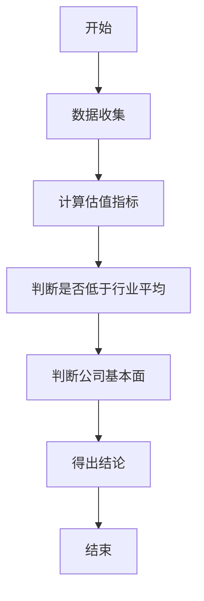
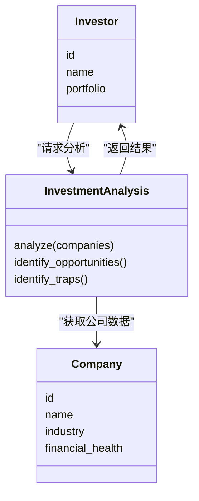

                 


# 彼得林奇的"价值陷阱"vs"价值机会"

## 关键词：价值陷阱，价值机会，彼得林奇，投资分析，金融风险管理，价值投资策略

## 摘要：本文深入探讨了彼得林奇提出的“价值陷阱”与“价值机会”两个概念，分析了它们在投资中的表现、识别方法及应对策略。通过对比分析，结合数学模型和系统架构设计，详细讲解了如何在实际投资中避免价值陷阱，抓住价值机会。文章内容涵盖背景介绍、分析方法、算法原理、系统设计、项目实战等，最后提供最佳实践和小结。

---

## 第一部分: 彼得林奇的"价值陷阱"与"价值机会"概述

### 第1章: 彼得林奇投资理论基础

#### 1.1 彼得林奇的基本投资理念
- **核心思想**：彼得林奇主张长期投资优质公司，避免短期市场波动的干扰。他认为，市场波动为投资者提供了廉价买入优秀公司的机会。
- **投资风格**：以基本面分析为核心，注重公司财务状况、行业地位和竞争优势。
- **理论演变**：从早期的“烟屁股”投资策略，到后期对成长型企业的关注，彼得林奇的投资理念不断完善。

#### 1.2 价值陷阱与价值机会的概念
- **价值陷阱**：指那些看似便宜但实际存在严重问题（如财务恶化、行业衰退）的股票。投资者误以为其便宜，实际上可能进一步下跌。
- **价值机会**：指被市场暂时低估，但公司基本面良好，具有长期增长潜力的股票。这些股票价格因市场忽视而被低估，是投资者的好机会。

### 第2章: 价值陷阱与价值机会的对比分析

#### 2.1 价值陷阱与价值机会的对比表格
| 特性                | 价值陷阱                          | 价值机会                          |
|---------------------|------------------------------------|------------------------------------|
| 定价                | 过低（看似便宜）                   | 过低（实际价值未被发现）             |
| 公司基本面          | 财务恶化、竞争力下降                | 财务健康、竞争优势明显              |
| 市场情绪            | 被忽视或恐慌性抛售                 | 被忽视或市场误判                    |
| 长期前景            | 逐渐恶化，可能退市或持续亏损       | 增长潜力大，未来表现良好            |
| 投资风险            | 高（隐藏风险）                     | 中等（市场重新评估后可能上升）      |

#### 2.2 价值陷阱与价值机会的ER实体关系图
```mermaid
erDiagram
    company {
        id
        name
        industry
        financial_health
        market_price
    }
    investor {
        id
        name
        portfolio
        risk_tolerance
    }
    investment_opportunity {
        id
        company_id
        valuation
        risk_level
        potential_return
    }
    investment_trap {
        id
        company_id
        valuation
        risk_level
        potential_loss
    }
    investor --> investment_opportunity : "识别价值机会"
    investor --> investment_trap : "识别价值陷阱"
    investment_opportunity --> company : "基于公司基本面"
    investment_trap --> company : "基于公司基本面"
```

---

## 第二部分: 价值陷阱与价值机会的识别方法

### 第4章: 价值陷阱的识别与规避

#### 4.1 数据分析法
- **财务指标分析法**：通过分析市盈率（P/E）、市净率（P/B）、ROE等指标，识别公司是否被市场低估或高估。
- **行业趋势分析**：研究公司所在行业的景气度，判断是否存在行业衰退风险。

#### 4.2 技术分析法
- **趋势分析**：通过股价走势判断股票是否处于下行通道。
- **成交量分析**：成交量低迷可能表明市场对公司不看好。

#### 4.3 风险规避策略
- **分散投资**：避免将所有资金投入单一股票，降低风险。
- **设置止损点**：在股价下跌到一定程度时及时止损。

---

### 第5章: 价值机会的挖掘与捕捉

#### 5.1 数据分析法
- **低估识别**：通过对比行业平均市盈率，寻找低于行业平均水平的公司。
- **成长性分析**：关注净利润增长率、营业收入增长率等指标。

#### 5.2 行业分析法
- **朝阳行业**：选择处于成长期的行业，寻找龙头企业。
- **政策支持行业**：政府政策支持的行业可能有较好的发展前景。

---

## 第三部分: 价值投资的数学模型与算法

### 第6章: 数学模型与算法原理

#### 6.1 价值陷阱识别模型


#### 6.2 价值机会识别模型


#### 6.3 Python代码实现
```python
import pandas as pd
import numpy as np

def calculate_pe_ratio(df):
    df['PE'] = df['股价'] / df['每股收益']
    return df

def identify_value_traps(df, industry_avg_pe):
    df['是否价值陷阱'] = df['PE'] < industry_avg_pe
    return df

# 示例数据
data = {
    '公司': ['A', 'B', 'C'],
    '股价': [10, 20, 15],
    '每股收益': [2, 1, 3],
    '行业平均PE': [15, 15, 15]
}
df = pd.DataFrame(data)

result = identify_value_traps(data, 15)
print(result)
```

---

## 第四部分: 投资分析系统的架构设计

### 第7章: 系统架构设计

#### 7.1 系统功能设计


#### 7.2 系统架构设计
```mermaid
graph TD
    A[投资者] --> B[投资分析系统]
    B --> C[数据采集模块]
    B --> D[数据分析模块]
    B --> E[结果输出模块]
    C --> D : 数据传输
    D --> E : 分析结果
    E --> A : 结果展示
```

---

## 第五部分: 项目实战

### 第8章: 环境安装与代码实现

#### 8.1 环境安装
- **Python**：安装Anaconda或Pyenv
- **数据工具**：安装Pandas、NumPy、Matplotlib

#### 8.2 核心代码实现
```python
import pandas as pd
import numpy as np

def identify_opportunity(df, industry_avg_pe, threshold=0.2):
    df['PE'] = df['股价'] / df['每股收益']
    df['是否低于行业'] = df['PE'] < industry_avg_pe
    df['是否价值机会'] = df['PE'] < industry_avg_pe * (1 - threshold)
    return df

data = {
    '公司': ['A', 'B', 'C'],
    '股价': [10, 20, 15],
    '每股收益': [2, 1, 3],
    '行业平均PE': [15, 15, 15]
}
df = pd.DataFrame(data)
result = identify_opportunity(df, 15, 0.2)
print(result)
```

---

## 第六部分: 最佳实践与小结

### 第9章: 最佳实践

- **定期复盘**：定期检查投资组合，评估是否偏离初衷。
- **分散投资**：避免将所有资金投入单一股票或行业。
- **持续学习**：关注市场动态，学习新的投资知识和策略。

### 第10章: 小结

彼得林奇的“价值陷阱”与“价值机会”提醒我们，在投资中要保持清醒的头脑，避免被市场的短期波动迷惑。通过系统的分析和科学的决策，我们可以更好地识别价值机会，规避价值陷阱，实现长期稳健的投资回报。

---

## 作者信息

作者：AI天才研究院/AI Genius Institute & 禅与计算机程序设计艺术 /Zen And The Art of Computer Programming

---

这篇文章详细介绍了彼得林奇的价值投资理论，并通过系统化的分析和案例研究，帮助读者识别价值陷阱和价值机会。通过结合数学模型和系统架构设计，文章为投资者提供了实用的投资策略和工具。

