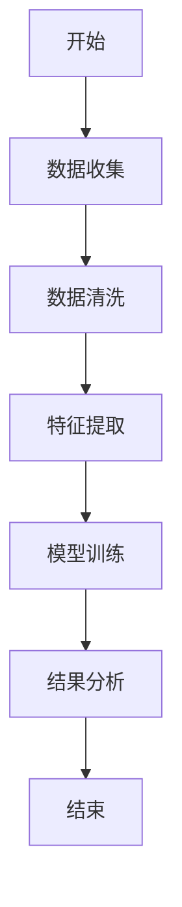
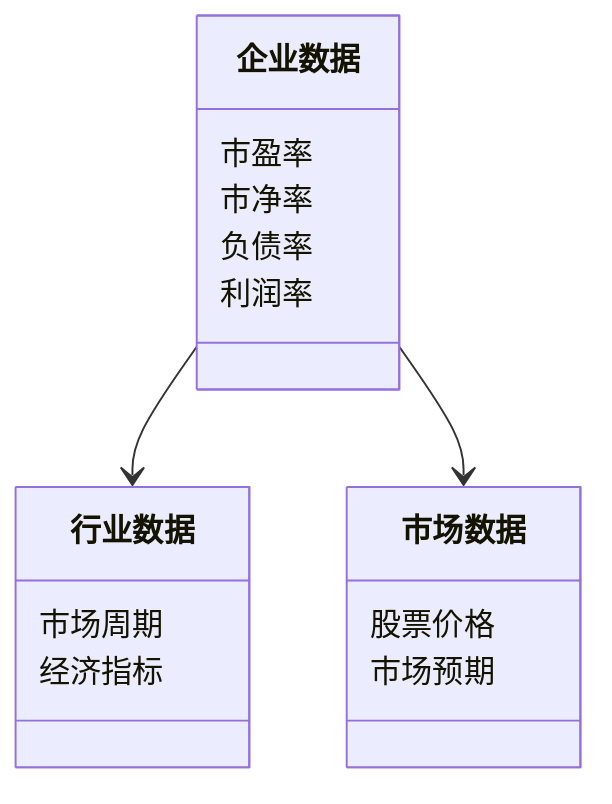
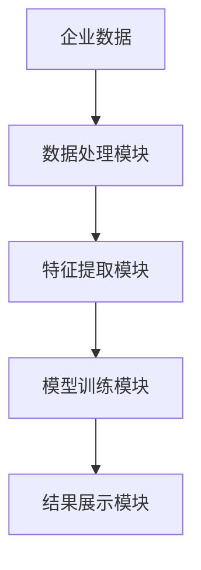
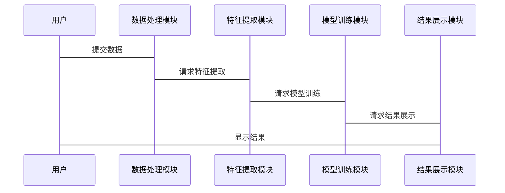

                 


# 彼得林奇的"价值陷阱"在周期性行业的识别

> 关键词：价值陷阱，周期性行业，投资策略，风险管理，彼得林奇，价值评估

> 摘要：本文将深入探讨彼得林奇的“价值陷阱”概念，并分析其在周期性行业中的识别方法。通过系统的分析和实际案例，本文旨在帮助投资者避免陷入价值陷阱，制定有效的投资策略。

---

# 第一部分: 价值陷阱的定义与特点

## 第1章: 价值陷阱的定义与特点

### 1.1 价值陷阱的定义
- **价值陷阱的定义**：价值陷阱是指那些表面上看似具有投资价值，但实际上存在隐藏问题或风险的企业或行业。投资者可能会因为表面的低估值而误判，导致投资亏损。
- **价值陷阱的核心特征**：
  - 低估值但高风险
  - 行业周期性波动大
  - 财务数据虚假或不透明
- **价值陷阱与周期性行业的关系**：周期性行业由于其固有的波动性，更容易成为价值陷阱的高发区。例如，经济衰退时，周期性行业的企业可能因为需求下降而陷入困境，但其低估值可能会吸引投资者，形成价值陷阱。

### 1.2 周期性行业的特点
- **周期性行业的定义**：周期性行业是指其业绩表现与经济周期高度相关的行业，如制造业、建筑业、能源行业等。
- **周期性行业的波动性分析**：
  - 繁荣期：需求激增，企业盈利上升。
  - 衰退期：需求骤减，企业盈利大幅下降。
  - 波动性对企业估值的影响：周期性行业的估值在不同周期阶段差异显著。
- **周期性行业与价值陷阱的关系**：周期性行业的波动性使其在某些阶段容易形成价值陷阱，尤其是在衰退期，企业可能因需求下降而估值被高估。

### 1.3 价值陷阱与周期性行业的联系
- **价值陷阱在周期性行业中的表现**：
  - 在衰退期，企业可能因需求下降而利润大幅减少，但股价可能因为低估值而被高估。
  - 在复苏期，企业可能因为市场预期好转而股价上涨，但实际上企业基本面并未改善。
- **周期性行业中的常见价值陷阱类型**：
  - 低市盈率但高负债的企业。
  - 表面高利润率但实际市场需求不足的企业。
  - 周期性行业中隐藏的财务问题，如应收账款过高或存货积压。
- **价值陷阱对投资者的影响**：
  - 投资者可能因为短期低估值而误判企业价值，导致长期亏损。
  - 周期性行业的波动性可能导致投资者在错误的时机进入或退出市场。

---

# 第二部分: 价值陷阱的识别方法

## 第2章: 价值陷阱的核心概念

### 2.1 核心概念原理
- **价值陷阱的识别标准**：
  - 行业周期分析：判断行业所处的周期阶段。
  - 财务数据分析：评估企业的财务健康状况。
  - 市场预期分析：分析市场对企业的预期是否合理。
- **价值陷阱的识别流程**：
  - 数据收集：收集企业的财务数据和行业数据。
  - 数据清洗：剔除异常数据，确保数据质量。
  - 特征提取：提取关键的财务指标和市场指标。
  - 模型训练：使用机器学习算法训练识别模型。
  - 结果分析：分析模型输出的结果，判断是否存在价值陷阱。

### 2.2 核心概念属性对比表
- **价值陷阱与非价值陷阱的对比**：
  | 属性 | 价值陷阱 | 非价值陷阱 |
  |------|---------|----------|
  | 行业周期性 | 高 | 低 |
  | 财务健康度 | 低 | 高 |
  | 市场预期 | 过高 | 合理 |
- **周期性行业与非周期性行业的对比**：
  | 属性 | 周期性行业 | 非周期性行业 |
  |------|----------|------------|
  | 收入波动性 | 高 | 低 |
  | 利润波动性 | 高 | 低 |
  | 估值波动性 | 高 | 低 |

### 2.3 ER实体关系图
- **实体关系图的构建**：
  - 实体：企业、行业、市场数据。
  - 关系：企业属于某个行业，市场数据反映行业周期。
- **实体关系图的分析**：
  - 通过ER图可以清晰地看到企业与行业之间的关系，以及市场数据如何影响企业的估值。

## 第3章: 价值陷阱的识别算法

### 3.1 算法原理
- **算法概述**：使用机器学习算法，结合行业周期分析和财务数据分析，识别价值陷阱。
- **算法流程图（使用 mermaid）**：


### 3.2 算法实现
- **Python源代码实现**：
```python
def identify_value_traps(data):
    # 数据预处理
    data_cleaned = data.dropna()
    
    # 特征提取
    features = data_cleaned[['市盈率', '市净率', '负债率', '利润率']]
    
    # 模型训练
    from sklearn.ensemble import RandomForestClassifier
    model = RandomForestClassifier()
    model.fit(features, data_cleaned['是否价值陷阱'])
    
    # 结果分析
    result = model.predict(features)
    return result
```

### 3.3 数学模型与公式
- **市盈率计算公式**：
  $$市盈率 = \frac{股票价格}{每股收益}$$
- **市净率计算公式**：
  $$市净率 = \frac{股票价格}{每股净资产}$$
- **周期性行业波动分析公式**：
  $$波动率 = \frac{标准差}{平均值}$$

### 3.4 算法案例分析
- **案例背景介绍**：以某周期性行业（如制造业）为例，分析如何识别价值陷阱。
- **数据分析与处理**：收集该行业的财务数据和市场数据，进行数据清洗和特征提取。
- **算法实现与结果解读**：使用上述算法训练模型，输出识别结果，并解释结果的意义。
- **案例总结与启示**：总结案例分析的发现，提出避免价值陷阱的策略。

---

# 第三部分: 价值陷阱的风险管理

## 第4章: 风险管理策略

### 4.1 风险识别
- **风险管理的核心概念**：
  - 风险识别：识别周期性行业中的潜在风险。
  - 风险评估：评估风险对企业估值的影响。
  - 风险应对：制定应对风险的策略。

### 4.2 风险管理工具
- **风险管理工具**：
  - 财务指标分析工具：如市盈率、市净率等。
  - 市场周期分析工具：如经济指标分析。
  - 投资组合分散化工具：通过分散投资降低风险。

### 4.3 风险管理策略
- **风险管理策略**：
  - 避免单一行业集中投资。
  - 在周期性行业低谷时避免投资。
  - 结合宏观经济分析进行投资决策。

### 4.4 风险管理案例分析
- **案例背景介绍**：以某周期性行业为例，分析如何进行风险管理。
- **风险管理策略实施**：制定具体的风险管理计划，并实施。
- **案例总结与启示**：总结风险管理的经验，提出改进建议。

---

# 第四部分: 价值陷阱的系统分析

## 第5章: 系统分析与架构设计方案

### 5.1 问题场景介绍
- **问题场景**：周期性行业中存在大量价值陷阱，如何系统性地识别和管理这些风险。

### 5.2 系统功能设计
- **领域模型**：使用 mermaid 绘制领域模型类图，展示系统的核心功能模块。


### 5.3 系统架构设计
- **系统架构图**：


### 5.4 系统接口设计
- **接口设计**：
  - 数据输入接口：接收企业数据和行业数据。
  - 数据处理接口：对数据进行清洗和转换。
  - 模型调用接口：调用机器学习模型进行预测。
  - 结果输出接口：展示模型预测结果。

### 5.5 系统交互设计
- **交互序列图**：


---

# 第五部分: 价值陷阱的项目实战

## 第6章: 项目实战

### 6.1 环境安装
- **环境要求**：
  - Python 3.6及以上版本
  - 安装必要的库：pandas, numpy, scikit-learn, mermaid

### 6.2 核心实现
- **代码实现**：
```python
import pandas as pd
import numpy as np
from sklearn.ensemble import RandomForestClassifier

# 数据加载
data = pd.read_csv('周期性行业数据.csv')

# 数据清洗
data_cleaned = data.dropna()

# 特征提取
features = data_cleaned[['市盈率', '市净率', '负债率', '利润率']]
target = data_cleaned['是否价值陷阱']

# 模型训练
model = RandomForestClassifier()
model.fit(features, target)

# 预测结果
result = model.predict(features)
print(result)
```

### 6.3 实际案例分析
- **案例背景介绍**：以某周期性行业为例，分析如何应用上述算法识别价值陷阱。
- **数据收集与分析**：收集该行业的财务数据和市场数据，进行初步分析。
- **算法实现与结果解读**：运行上述代码，解读预测结果，判断哪些企业是价值陷阱。
- **项目总结与反思**：总结项目实施的经验和教训，提出改进建议。

---

# 第六部分: 总结与展望

## 第7章: 总结与展望

### 7.1 最佳实践 tips
- **投资建议**：
  - 在周期性行业中，投资者应避免仅根据低估值进行投资。
  - 结合宏观经济分析和行业周期分析，制定合理的投资策略。
- **风险管理**：
  - 避免单一行业集中投资。
  - 在周期性行业低谷时，谨慎投资。

### 7.2 小结
- **小结**：通过本文的分析，读者可以了解如何识别周期性行业中的价值陷阱，并制定有效的投资策略。

### 7.3 注意事项
- **注意事项**：
  - 周期性行业的波动性较高，投资者应保持警惕。
  - 风险管理是投资成功的关键，投资者应合理分散投资风险。

### 7.4 拓展阅读
- **拓展阅读**：
  - 彼得林奇的《投资学入门：_stock_投资手册》
  - 布鲁克·霍尔特曼的《价值投资实战》

---

作者：AI天才研究院/AI Genius Institute & 禅与计算机程序设计艺术/Zen And The Art of Computer Programming

