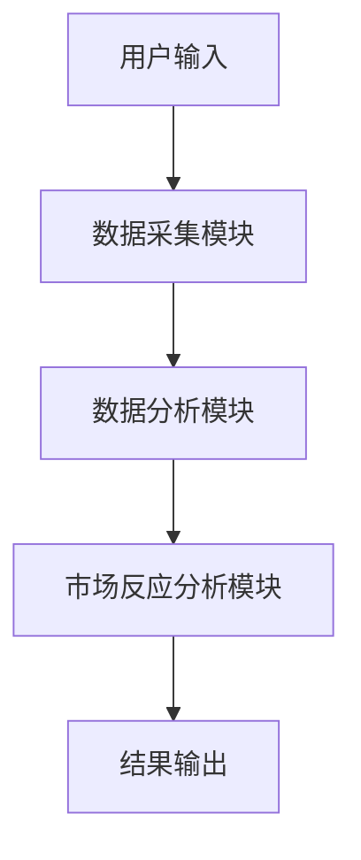
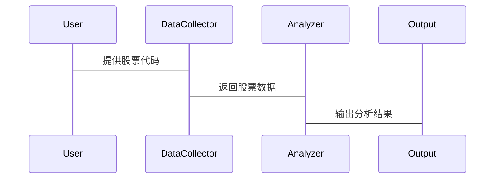

                 


# 彼得林奇的"价值陷阱"在新兴市场中的识别技巧

## 关键词：价值陷阱，新兴市场，彼得林奇，投资策略，风险识别，数据分析，系统架构

## 摘要：  
本文深入探讨了彼得·林奇提出的“价值陷阱”概念在新兴市场中的识别技巧。通过结合技术分析、财务指标评估和系统架构设计，文章详细阐述了如何在新兴市场中识别和规避价值陷阱，提供了从理论到实践的系统性解决方案。文章内容涵盖价值陷阱的定义、识别方法、系统架构设计、数据分析算法以及实际案例分析，旨在帮助投资者在新兴市场中做出更加明智的投资决策。

---

## 第1章: 价值陷阱的核心概念

### 1.1 价值陷阱的定义与背景  
价值陷阱是指那些表面上看似具有投资价值，但实际上存在隐藏风险或问题的企业或资产。在新兴市场中，由于市场波动大、信息不透明以及企业基本面复杂，价值陷阱尤为常见。投资者如果未能识别这些陷阱，可能会遭受重大损失。

**表1-1: 价值陷阱与非价值陷阱的对比**  

| 属性         | 价值陷阱               | 非价值陷阱             |
|--------------|------------------------|------------------------|
| 估值         | 明显低于内在价值        | 接近或高于内在价值      |
| 市场反应      | 市场反应冷淡             | 市场反应积极             |
| 风险         | 高                     | 低                     |
| 投资回报      | 长期回报不确定           | 长期回报可预期           |

### 1.2 价值陷阱的特征与分类  
价值陷阱的核心特征包括：  
1. 估值异常低，但公司基本面持续恶化。  
2. 市场对公司的负面信息反应不足。  
3. 公司所在行业处于衰退期或竞争激烈。  

**图1-1: 价值陷阱的实体关系图（ER图）**  

```mermaid
erd
actor:Investor
actor:Market
actor:Company
actor:Analyst
```

---

## 第2章: 价值陷阱的识别方法

### 2.1 数据分析方法  
识别价值陷阱的关键在于数据分析。以下是常用的数据分析方法：  

1. **财务指标评估**  
   - **市盈率（P/E）**：P/E < 市场平均值。  
   - **市净率（P/B）**：P/B < 行业平均值。  
   - **ROE（净资产收益率）**：ROE < 同行业公司。  

2. **估值模型**  
   - 使用DCF模型（现金流折现法）评估企业的真实价值。  
   - 比较企业的内在价值与市场估值，如果市场估值远低于内在价值，需警惕价值陷阱。  

3. **市场反应分析**  
   - 通过分析市场对公司的反应，判断市场是否已经消化了负面信息。  

**代码示例2-1: Python中的财务指标计算**  

```python
import pandas as pd

# 假设df为包含财务数据的DataFrame
def calculate_pe(df):
    pe = df['股价'] / df['每股收益']
    return pe

def calculate_pb(df):
    pb = df['股价'] / df['每股净资产']
    return pb

def calculate_roe(df):
    roe = (df['净利润'] / df['所有者权益']) * 100
    return roe

# 示例数据
data = {
    '股价': [10, 20, 30],
    '每股收益': [2, 3, 4],
    '每股净资产': [5, 6, 7],
    '净利润': [100, 200, 300],
    '所有者权益': [500, 600, 700]
}

df = pd.DataFrame(data)
pe = calculate_pe(df)
pb = calculate_pb(df)
roe = calculate_roe(df)

print("市盈率:", pe)
print("市净率:", pb)
print("ROE:", roe)
```

---

## 第3章: 价值陷阱识别的系统架构设计

### 3.1 系统功能设计  
为了自动化识别价值陷阱，我们可以设计一个基于Python的系统架构。以下是系统功能设计：  

1. **数据采集模块**  
   - 从多个数据源（如Yahoo Finance、本地数据库）获取股票数据。  

2. **数据分析模块**  
   - 计算财务指标（P/E、P/B、ROE）。  
   - 使用DCF模型评估内在价值。  

3. **市场反应分析模块**  
   - 分析市场对公司的反应，判断市场是否已经消化负面信息。  

**图3-1: 系统架构图（Mermaid）**  



### 3.2 数据接口设计  
- 数据接口定义：  
  ```python
  class DataInterface:
      def get_stock_data(self, ticker):
          pass
  ```

- 接口交互流程：  
  1. 用户输入股票代码。  
  2. 数据采集模块调用接口获取数据。  
  3. 数据分析模块处理数据并返回结果。  

### 3.3 系统交互设计  
- 序列图：  



---

## 第4章: 项目实战与案例分析

### 4.1 环境安装与配置  
- 安装Python和必要的库：  
  ```bash
  pip install pandas numpy matplotlib
  ```

### 4.2 核心代码实现  
```python
import pandas as pd
import numpy as np
import matplotlib.pyplot as plt

# 示例数据
data = {
    '股票代码': ['AAPL', 'GOOGL', 'MSFT'],
    '股价': [150, 200, 300],
    '每股收益': [10, 15, 20],
    '每股净资产': [50, 60, 70],
    '净利润': [10000, 15000, 20000],
    '所有者权益': [50000, 60000, 70000]
}

df = pd.DataFrame(data)

# 计算财务指标
pe = df['股价'] / df['每股收益']
pb = df['股价'] / df['每股净资产']
roe = (df['净利润'] / df['所有者权益']) * 100

# 画图
plt.figure(figsize=(10,6))
plt.plot(pe, label='市盈率')
plt.plot(pb, label='市净率')
plt.legend()
plt.title('财务指标对比图')
plt.show()
```

### 4.3 案例分析  
以某新兴市场中的公司为例，分析其是否为价值陷阱：  

1. **数据采集**：获取该公司的股价、每股收益、每股净资产等数据。  
2. **计算指标**：计算P/E、P/B、ROE。  
3. **对比分析**：与行业平均水平对比，判断是否存在估值异常。  
4. **市场反应**：分析市场对公司的反应，判断市场是否已经消化负面信息。  

---

## 第5章: 总结与展望

### 5.1 总结  
本文详细介绍了彼得·林奇的“价值陷阱”在新兴市场中的识别技巧，从理论到实践，提供了系统性的解决方案。通过数据分析、财务指标评估和系统架构设计，我们可以有效识别和规避价值陷阱，做出更加明智的投资决策。

### 5.2 投资策略建议  
1. 在新兴市场中，投资者应更加注重基本面分析。  
2. 使用自动化工具辅助识别价值陷阱。  
3. 定期复盘，调整投资策略。  

### 5.3 未来展望  
随着人工智能和大数据技术的不断发展，未来我们可以开发更加智能化的价值陷阱识别系统，帮助投资者在新兴市场中做出更加精准的投资决策。

---

## 作者：AI天才研究院/AI Genius Institute & 禅与计算机程序设计艺术 /Zen And The Art of Computer Programming

