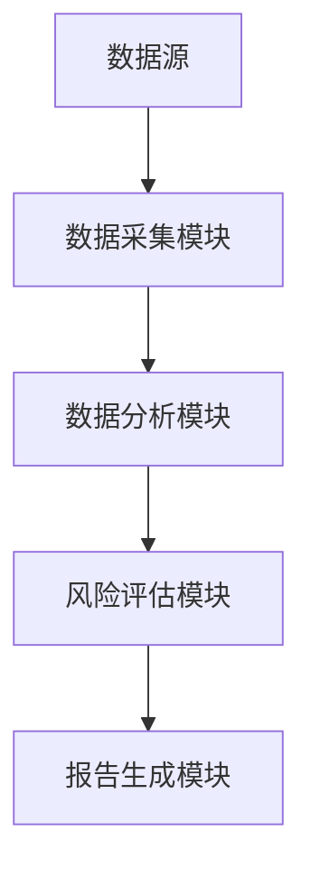

                 


# 彼得林奇的"价值陷阱"识别方法

> 关键词：价值陷阱，彼得·林奇，价值投资，投资策略，风险管理

> 摘要：本文详细探讨了彼得·林奇提出的“价值陷阱”概念，分析了其识别方法和相关策略。通过系统化的分析，结合实际案例和数学模型，本文为投资者提供了一套识别和规避价值陷阱的有效方法，帮助他们在投资决策中避免潜在风险，实现长期稳健的投资回报。

---

## 第1章: 价值陷阱识别的背景与概念

### 1.1 价值投资的基石
- 价值投资的基本原则
- 彼得·林奇的投资理念
- 价值陷阱的概念与内涵

### 1.2 价值陷阱的定义与特征
- 价值陷阱的定义
- 价值陷阱的核心特征
- 价值陷阱与价值投资的区别

### 1.3 识别价值陷阱的重要性
- 投资者为何需要识别价值陷阱
- 价值陷阱对投资组合的影响
- 价值陷阱的常见表现形式

---

## 第2章: 价值陷阱的识别标准

### 2.1 市盈率（P/E）分析
- 市盈率的基本公式
$$ P/E = \frac{\text{股票价格}}{\text{每股收益}} $$
- 市盈率在识别价值陷阱中的应用
- 不同行业市盈率的差异

### 2.2 市净率（P/B）分析
- 市净率的基本公式
$$ P/B = \frac{\text{股票价格}}{\text{每股净资产}} $$
- 市净率与市盈率的区别与联系
- 市净率在识别价值陷阱中的应用

### 2.3 资产负债率分析
- 资产负债率的基本公式
$$ \text{资产负债率} = \frac{\text{总负债}}{\text{总资产}} $$
- 高负债企业在投资中的风险
- 资产负债率与价值陷阱的关系

### 2.4 盈利能力分析
- 净利润率与ROE分析
$$ \text{净利润率} = \frac{\text{净利润}}{\text{营业收入}} $$
$$ \text{ROE} = \frac{\text{净利润}}{\text{股东权益}} $$
- 盈利能力与价值陷阱的关系
- 企业盈利能力的持续性评估

### 2.5 行业分析与企业生命周期
- 不同行业中的价值陷阱风险
- 企业生命周期与价值陷阱的关系
- 行业周期性对投资决策的影响

---

## 第3章: 价值陷阱的识别流程

### 3.1 数据收集与初步筛选
- 数据来源与可靠性评估
- 企业财务报表的初步分析
- 初步筛选的指标与标准

### 3.2 企业基本面评估
- 财务健康状况的全面评估
- 管理层能力与企业战略分析
- 企业竞争优势的评估

### 3.3 价值陷阱的识别与确认
- 综合评估模型的应用
- 多指标交叉验证法
- 价值陷阱的最终确认标准

### 3.4 风险管理与投资策略
- 风险分散与投资组合优化
- 价值陷阱的规避策略
- 投资决策中的风险管理原则

---

## 第4章: 价值陷阱识别的系统架构

### 4.1 系统功能设计
- 数据采集模块：实时数据获取与处理
- 数据分析模块：多指标评估与可视化
- 风险评估模块：综合评分与预警系统
- 报告生成模块：分析报告与投资建议

### 4.2 系统架构图


### 4.3 接口设计与数据流
- 数据接口的设计与实现
- 数据流的处理与优化
- 系统模块间的交互流程

### 4.4 系统实现案例
- 使用Python进行数据处理
```python
import pandas as pd

# 示例数据加载
data = pd.read_csv('stock_data.csv')

# 计算市盈率
data['P/E'] = data['Price'] / data['EPS']

# 筛选出潜在价值陷阱
value_traps = data[data['P/E'] > data['行业平均P/E']]
```

---

## 第5章: 价值陷阱识别的项目实战

### 5.1 项目背景与目标
- 项目目标
- 数据来源与获取方法
- 实施步骤与预期成果

### 5.2 代码实现与解读
- 数据清洗与预处理
```python
import pandas as pd
import numpy as np

# 数据清洗
data = pd.read_csv('stock_data.csv')
data = data.dropna()
data = data[data['Revenue'] > 0]
```

- 指标计算与分析
```python
data['P/E'] = data['Price'] / data['EPS']
data['P/B'] = data['Price'] / data['Book Value per Share']
```

- 案例分析与结果解读
- 投资决策中的应用

### 5.3 案例分析
- 具体案例的背景与数据
- 识别过程与结果展示
- 投资建议与策略调整

### 5.4 项目小结
- 项目总结与成果
- 实施中的常见问题与解决方法
- 未来优化方向

---

## 第6章: 最佳实践与投资策略

### 6.1 投资中的风险管理
- 风险管理的基本原则
- 价值陷阱识别中的风险管理策略
- 投资组合的优化与分散

### 6.2 彼得·林奇的总结与启示
- 彼得·林奇的经验总结
- 对现代投资者的启示
- 投资心态与长期策略

### 6.3 价值陷阱识别的注意事项
- 数据的准确性和及时性
- 模型的局限性与改进方向
- 人性因素对投资决策的影响

### 6.4 拓展阅读与学习资源
- 推荐书籍与文献
- 在线资源与工具
- 进一步学习的方向

---

## 作者：AI天才研究院/AI Genius Institute & 禅与计算机程序设计艺术 /Zen And The Art of Computer Programming

---

通过以上目录结构，我们可以系统地学习和应用彼得·林奇的价值陷阱识别方法，帮助投资者在复杂的市场环境中做出更加明智的投资决策。

