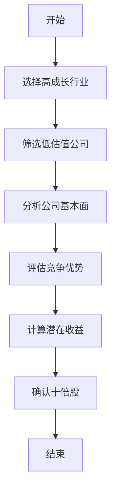
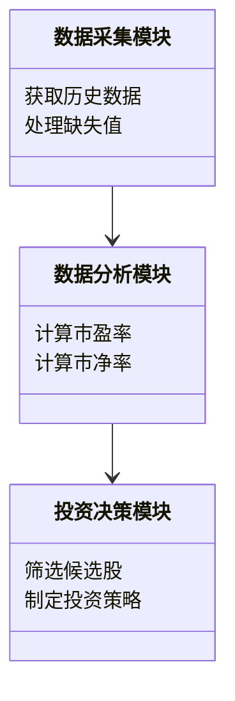
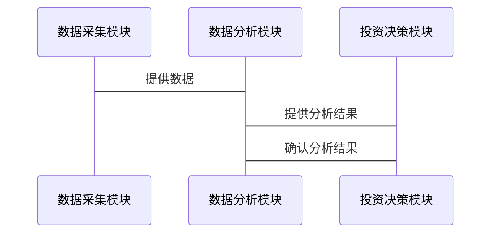

                 


# 彼得林奇的"十倍股"识别方法

> 关键词：彼得林奇，十倍股，股票投资，价值投资，财务分析，成长股

> 摘要：本文深入探讨了彼得林奇的十倍股识别方法，从投资理念、核心概念、数学模型、系统架构到项目实战，全面分析了如何在股票市场中识别和投资十倍股。通过理论与实践结合，帮助投资者掌握彼得林奇的价值投资策略，实现长期稳健的投资收益。

---

# 第一部分：十倍股识别的核心理念与背景

## 第1章：投资与十倍股的基本概念

### 1.1 投资的基本概念

#### 1.1.1 投资的定义与分类
投资是将资金投入各种资产（如股票、债券、房地产等）以获取未来收益的行为。根据风险和收益的不同，投资可以分为保守型、稳健型和激进型。

- **保守型投资**：如债券、货币基金，风险低，收益稳定。
- **稳健型投资**：如蓝筹股、房地产，风险适中，收益相对稳定。
- **激进型投资**：如成长股、创业公司投资，风险高，收益潜力大。

#### 1.1.2 股票投资的基本原理
股票投资是通过购买公司股份，成为股东，从而分享公司成长的收益。股票的收益包括股息收益和资本增值收益。

- **股息收益**：公司定期向股东分配的利润部分。
- **资本增值收益**：股价上涨带来的资本利得。

#### 1.1.3 十倍股的定义与特征
十倍股是指在一定时间内（如5-10年）股价上涨10倍以上的股票。其主要特征包括：

- **高成长性**：公司收入和利润持续高速增长。
- **低估值**：市盈率（P/E）和市净率（P/B）低于行业平均水平。
- **竞争优势**：公司在行业内具有独特的竞争优势，如技术壁垒、品牌优势等。
- **管理团队**：优秀的管理层能够带领公司持续创新和扩张。

### 1.2 彼得林奇的投资理念

#### 1.2.1 彼得林奇的生平简介
彼得·林奇（Peter Lynch）是美国著名的股票投资人，曾任富达麦哲伦基金的经理，创造了年均29%的惊人回报率。他以深入的行业研究和对公司基本面的分析而闻名。

#### 1.2.2 彼得林奇的投资哲学
彼得林奇强调“价值投资”，即寻找那些被市场低估的优秀公司。他认为，投资的关键在于选择那些具有持续增长潜力的公司，并长期持有。

#### 1.2.3 彼得林奇对十倍股的定义
彼得林奇认为，十倍股通常是那些在某个细分市场中占据主导地位的公司。这些公司具有强大的竞争优势和增长潜力，能够在未来几年内实现业绩的高速增长。

### 1.3 十倍股的市场背景

#### 1.3.1 十倍股的市场周期
十倍股的出现往往与经济周期密切相关。在经济复苏和增长阶段，成长股更容易实现高增长。

#### 1.3.2 十倍股的行业分布
十倍股通常出现在高增长行业，如科技、互联网、医疗等。这些行业的公司具有较高的成长潜力。

#### 1.3.3 十倍股的经济环境分析
在低利率和通货膨胀率较低的经济环境中，投资者更倾向于寻找高收益的投资标的，这为十倍股的出现提供了良好的环境。

## 1.4 本章小结
本章介绍了投资的基本概念，分析了十倍股的定义和特征，并详细阐述了彼得林奇的投资理念。通过理解这些基本概念，投资者可以更好地把握十倍股的投资机会。

---

## 第2章：十倍股识别的核心要素

### 2.1 企业基本面分析

#### 2.1.1 企业财务报表分析
企业财务报表是分析公司基本面的核心工具，主要包括资产负债表、利润表和现金流量表。

- **资产负债表**：反映公司的资产、负债和所有者权益。
- **利润表**：反映公司的收入、成本和利润。
- **现金流量表**：反映公司现金的流入和流出情况。

#### 2.1.2 市盈率与市净率的计算
市盈率（P/E）和市净率（P/B）是衡量公司估值的重要指标。

- **市盈率**：股价除以每股收益（EPS）。
- **市净率**：股价除以每股净资产（BPS）。

#### 2.1.3 企业盈利能力分析
盈利能力分析包括净利润率、毛利率和ROE（净资产收益率）等指标。

- **净利润率**：净利润 / 收入。
- **毛利率**：（收入 - 成本） / 收入。
- **ROE**：净利润 / 净资产。

### 2.2 行业分析与竞争优势

#### 2.2.1 行业生命周期分析
行业生命周期分为导入期、成长期、成熟期和衰退期。

- **导入期**：行业刚刚起步，增长潜力大。
- **成长期**：行业快速扩张，公司收入增长快。
- **成熟期**：行业增长稳定，竞争激烈。
- **衰退期**：行业增长放缓，公司利润下降。

#### 2.2.2 企业竞争优势分析
竞争优势包括成本优势、技术优势、品牌优势和市场优势。

- **成本优势**：公司具有更低的生产成本。
- **技术优势**：公司掌握核心技术或专利。
- **品牌优势**：公司品牌具有较高的市场认知度。
- **市场优势**：公司在目标市场中占据领先地位。

#### 2.2.3 行业集中度分析
行业集中度高意味着市场由少数几家大公司主导，竞争压力较小。

### 2.3 市场情绪与估值分析

#### 2.3.1 市场情绪的周期性
市场情绪受投资者情绪影响，具有周期性波动。

- **牛市**：市场情绪乐观，股价上涨。
- **熊市**：市场情绪悲观，股价下跌。

#### 2.3.2 估值的合理性分析
估值合理性分析包括市盈率、市净率和股息率等指标。

- **股息率**：每股股息 / 股价。

#### 2.3.3 十倍股的估值区间
十倍股的估值区间通常低于行业平均水平，具有较高的安全边际。

### 2.4 本章小结
本章详细分析了十倍股识别的核心要素，包括企业基本面分析、行业分析和市场情绪分析。通过这些分析，投资者可以更好地判断公司的投资价值。

---

## 第3章：十倍股识别的数学模型与算法

### 3.1 十倍股识别的数学模型

#### 3.1.1 股票估值公式
股票的合理估值可以通过DCF（现金流折现法）模型进行估算。

$$
\text{股票价值} = \sum_{t=1}^{n} \frac{\text{现金流}_t}{(1 + r)^t} + \frac{\text{终值}}{(1 + r)^n}
$$

其中，$r$ 是折现率，$n$ 是预测年数，$\text{现金流}_t$ 是第$t$年的现金流，$\text{终值}$ 是终值假设。

#### 3.1.2 十倍股潜在收益模型
十倍股的潜在收益可以通过以下公式计算：

$$
\text{潜在收益} = \text{当前股价} \times 10
$$

#### 3.1.3 市场波动对十倍股的影响
市场波动会影响股价，但十倍股的长期增长潜力不受短期波动的影响。

### 3.2 基于彼得林奇理念的算法实现

#### 3.2.1 数据采集与处理
数据采集包括历史股价、财务数据和行业信息。可以使用Python的pandas库进行数据处理。

```python
import pandas as pd

# 假设data是一个包含股价和财务数据的DataFrame
data = pd.read_csv('stock_data.csv')
data['市盈率'] = data['股价'] / data['每股收益']
data['市净率'] = data['股价'] / data['每股净资产']
```

#### 3.2.2 算法逻辑图（Mermaid流程图）



#### 3.2.3 算法实现代码（Python）
以下是一个简单的十倍股筛选算法：

```python
def find_ten_bagger(stocks):
    ten_baggers = []
    for stock in stocks:
        if stock['市盈率'] < 15 and stock['市净率'] < 2 and stock['净利润率'] > 10%:
            ten_baggers.append(stock)
    return ten_baggers

# 假设stocks是一个包含多只股票数据的列表
ten_baggers = find_ten_bagger(stocks)
```

### 3.3 算法的验证与优化

#### 3.3.1 算法验证方法
通过历史数据验证算法的有效性，比较筛选出的十倍股与实际表现的差异。

#### 3.3.2 算法优化策略
根据验证结果调整筛选条件，例如放宽市盈率或市净率的限制。

#### 3.3.3 算法的局限性分析
算法的局限性包括市场波动、数据质量等。

### 3.4 本章小结
本章介绍了十倍股识别的数学模型和算法实现，通过代码示例和流程图展示了具体的实现步骤。

---

## 第4章：十倍股识别的系统架构设计

### 4.1 系统功能设计

#### 4.1.1 数据采集模块
数据采集模块负责从股票数据库中获取历史数据。

- **数据源**：包括股票代码、股价、财务数据等。
- **数据清洗**：处理缺失值和异常值。

#### 4.1.2 数据分析模块
数据分析模块负责对数据进行处理和分析。

- **财务分析**：计算市盈率、市净率等指标。
- **行业分析**：分析行业生命周期和集中度。

#### 4.1.3 投资决策模块
投资决策模块根据分析结果生成投资建议。

- **筛选候选股**：根据算法筛选出潜在的十倍股。
- **制定投资策略**：根据市场情况调整投资组合。

### 4.2 系统架构设计

#### 4.2.1 系统功能模块图（Mermaid类图）



#### 4.2.2 系统交互图（Mermaid序列图）



### 4.3 本章小结
本章详细描述了十倍股识别系统的架构设计，包括功能模块和系统交互图。

---

## 第5章：十倍股识别的项目实战

### 5.1 项目环境与工具安装

#### 5.1.1 环境配置
- 操作系统：Windows/Mac/Linux
- 开发工具：Jupyter Notebook、VS Code
- 数据库：MySQL/SQLite

#### 5.1.2 工具安装
- Python：pip install numpy pandas matplotlib
- 数据库连接工具：pip install SQLAlchemy

### 5.2 核心实现

#### 5.2.1 数据采集与清洗
从数据库中读取股票数据，并清洗数据。

```python
import pandas as pd
from sqlalchemy import create_engine

engine = create_engine('sqlite:///stock.db')
data = pd.read_sql('SELECT * FROM stock_data', engine)
data.dropna(inplace=True)
```

#### 5.2.2 数据分析与建模
计算市盈率和市净率，并筛选出潜在的十倍股。

```python
data['市盈率'] = data['股价'] / data['每股收益']
data['市净率'] = data['股价'] / data['每股净资产']
ten_baggers = data[(data['市盈率'] < 15) & (data['市净率'] < 2)]
```

#### 5.2.3 投资策略制定
根据筛选结果制定投资策略。

```python
for stock in ten_baggers:
    print(f"股票名称：{stock['股票名称']}, 市盈率：{stock['市盈率']}, 市净率：{stock['市净率']}")
```

### 5.3 案例分析

#### 5.3.1 案例背景
假设我们关注科技行业，寻找具有高成长潜力的公司。

#### 5.3.2 数据分析
分析某科技公司的财务数据和行业地位。

#### 5.3.3 投资决策
根据分析结果，决定是否投资该公司。

### 5.4 本章小结
本章通过一个实际项目展示了十倍股识别的全过程，从数据采集到投资决策，帮助读者更好地理解理论与实践的结合。

---

## 第6章：总结与展望

### 6.1 总结
本文详细探讨了彼得林奇的十倍股识别方法，从投资理念、核心概念到系统架构，全面分析了十倍股的识别与投资策略。

### 6.2 投资中的注意事项
- **分散投资**：避免将所有资金投入一只股票。
- **长期持有**：耐心持有优质股票，避免频繁交易。
- **风险控制**：设定止损点，控制投资风险。

### 6.3 拓展阅读
- 《彼得林奇选股术》
- 《投资学原理》
- 《股票投资实战技巧》

### 6.4 本章小结
本章总结了全文的主要内容，并提出了进一步阅读和研究的方向。

---

# 作者：AI天才研究院 & 禅与计算机程序设计艺术

