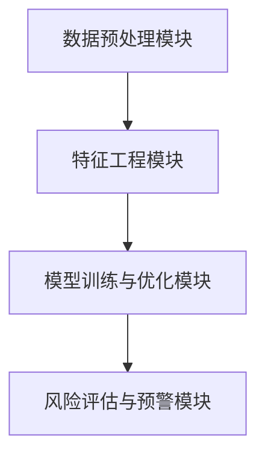
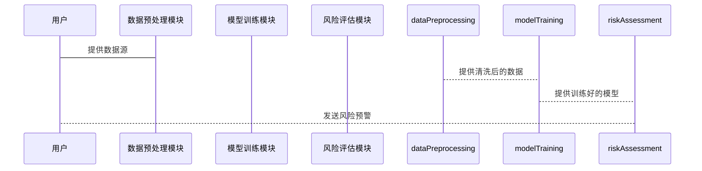

                 


# 彼得林奇的"反向思维"在地缘政治风险量化模型中的创新应用

## 关键词：
- 地缘政治风险
- 量化模型
- 彼得林奇
- 反向思维
- 风险评估
- 投资策略
- 算法优化

## 摘要：
本文介绍如何将彼得林奇的反向思维策略创新性地应用于地缘政治风险量化模型中，构建一个动态、智能的地缘政治风险评估系统。通过数学建模和算法优化，提出了一种基于反向思维的地缘政治风险量化模型，能够有效捕捉和预测地缘政治风险的变化趋势，为投资决策提供有力支持。

---

# 第一章：引言

## 1.1 地缘政治风险的重要性
### 1.1.1 地缘政治风险的定义与分类
地缘政治风险是指由于国家间的政治、经济、军事等关系变化而产生的不确定性，可能对全球经济、市场和投资产生重大影响。地缘政治风险可以分为短期风险和长期风险，前者通常由突发事件引发，后者则由长期的地缘政治格局变化导致。

### 1.1.2 传统地缘政治风险评估的局限性
传统的方法通常依赖专家判断或简单的统计分析，难以量化风险的具体程度。此外，传统模型对突发事件的预测能力较弱，且难以实时更新。

### 1.1.3 量化模型在地缘政治风险评估中的作用
量化模型通过数据驱动的方法，能够将复杂的地缘政治因素转化为可量化的指标，从而为投资决策提供更科学的依据。

---

## 1.2 彼得林奇反向思维的定义与特点
### 1.2.1 反向思维的定义
反向思维是指在市场或事件的反面寻找机会，即在市场恐慌时寻找低估资产，在市场乐观时警惕潜在风险。

### 1.2.2 反向思维在投资策略中的应用
彼得林奇在其投资生涯中，通过反向思维成功捕捉了许多被市场低估的投资机会。这种方法的核心在于逆向思考，避免随大流。

### 1.2.3 反向思维与地缘政治风险评估的结合
将反向思维应用于地缘政治风险评估，意味着在地缘政治紧张时寻找潜在的转机，在地缘政治缓和时警惕潜在风险。

---

# 第二章：地缘政治风险量化模型的传统方法

## 2.1 传统风险评估模型的概述
### 2.1.1 定性分析法
定性分析法依赖专家的经验和判断，但缺乏客观性和可重复性。

### 2.1.2 定量分析法
定量分析法通过统计和数学模型对地缘政治风险进行量化，但传统模型往往过于简化，难以捕捉复杂因素。

### 2.1.3 传统模型的优缺点
传统模型的优点是简单易懂，缺点是难以应对复杂多变的地缘政治环境。

## 2.2 传统模型在地缘政治风险中的局限性
### 2.2.1 数据采集的不完整性
传统模型通常依赖有限的数据来源，难以全面反映地缘政治的复杂性。

### 2.2.2 模型的静态性与动态性问题
传统模型往往静态，难以动态调整以应对突发事件。

### 2.2.3 传统模型对突发事件的预测能力不足
传统模型难以预测突发事件，导致在实际应用中效果有限。

---

# 第三章：反向思维策略的核心概念与原理

## 3.1 反向思维在地缘政治风险中的应用逻辑
### 3.1.1 反向思维的核心逻辑
在地缘政治风险评估中，反向思维意味着关注市场的非理性行为，寻找被低估的风险因素。

### 3.1.2 反向思维与地缘政治风险的关联性
地缘政治风险的高发期往往伴随着市场的过度反应，反向思维可以帮助识别这些过度反应带来的机会。

### 3.1.3 反向思维在风险量化中的优势
反向思维可以帮助模型更好地捕捉地缘政治风险的拐点，从而提前做出预警。

## 3.2 反向思维策略的数学模型构建
### 3.2.1 反向思维策略的数学表达式
我们可以将反向思维策略表示为一个函数：
$$ R(t) = 1 - \frac{P(t)}{N(t)} $$
其中，$R(t)$ 是风险指数，$P(t)$ 是市场情绪指数，$N(t)$ 是正常情绪指数。

### 3.2.2 反向思维策略与地缘政治风险的结合公式
结合地缘政治事件的影响，我们可以将风险指数进一步优化为：
$$ R(t) = \alpha \cdot R_{\text{base}}(t) + (1-\alpha) \cdot R_{\text{reverse}}(t) $$
其中，$\alpha$ 是权重系数，$R_{\text{base}}(t)$ 是基础风险指数，$R_{\text{reverse}}(t)$ 是反向思维风险指数。

---

# 第四章：地缘政治风险量化模型的构建

## 4.1 数据采集与处理
### 4.1.1 数据来源与采集方法
数据来源包括新闻媒体、政府公告、国际组织报告等，可以通过爬虫技术进行数据采集。

### 4.1.2 数据清洗与预处理
数据清洗包括去除噪声、填补缺失值等，预处理包括标准化和特征提取。

### 4.1.3 数据标准化与特征提取
通过标准化处理，将数据转化为统一的尺度，特征提取则需要选择与地缘政治风险相关的指标。

---

## 4.2 模型训练与调优
### 4.2.1 模型选择与训练
选择合适的机器学习模型（如逻辑回归、随机森林）进行训练，并通过交叉验证优化模型参数。

### 4.2.2 反向思维策略的优化
通过调整权重系数 $\alpha$，优化反向思维策略在模型中的表现。

### 4.2.3 模型的评估与验证
通过回测和实际案例分析，验证模型的准确性和稳定性。

---

# 第五章：应用案例分析

## 5.1 中美贸易摩擦的案例分析
### 5.1.1 案例背景
2018年中美贸易摩擦对全球市场产生了重大影响，反向思维策略可以帮助识别这一事件的风险。

### 5.1.2 模型预测与实际结果对比
通过模型预测，发现市场对贸易摩擦的反应过度，实际风险在后续得到了缓解。

### 5.1.3 案例分析的启示
反向思维策略在捕捉市场过度反应方面表现优异，能够帮助投资者提前预警风险。

---

# 第六章：系统架构设计

## 6.1 系统功能设计
### 6.1.1 数据预处理模块
负责数据的清洗、标准化和特征提取。

### 6.1.2 特征工程模块
通过特征选择和工程化处理，提升模型的预测能力。

### 6.1.3 模型训练与优化模块
包括模型选择、参数调优和权重系数优化。

### 6.1.4 风险评估与预警模块
根据模型输出，生成风险指数和预警信号。

---

## 6.2 系统架构图


---

## 6.3 系统接口设计
### 6.3.1 数据接口
与数据源对接，获取实时的地缘政治数据。

### 6.3.2 模型接口
与第三方机器学习平台对接，进行模型训练和预测。

### 6.3.3 预警接口
向用户发送风险预警信号。

---

## 6.4 系统交互序列图


---

# 第七章：项目实战

## 7.1 环境安装
### 7.1.1 安装Python和相关库
安装Python 3.8以上版本，并安装NumPy、Pandas、Scikit-learn等库。

### 7.1.2 安装自然语言处理工具
安装NLTK或spaCy，用于文本数据的处理。

## 7.2 核心实现源代码
```python
import numpy as np
import pandas as pd
from sklearn.model_selection import train_test_split
from sklearn.linear_model import LogisticRegression
from sklearn.metrics import accuracy_score

# 数据加载与预处理
data = pd.read_csv('geopolitical_risks.csv')
X = data.drop('risk_index', axis=1)
y = data['risk_index']

# 划分训练集和测试集
X_train, X_test, y_train, y_test = train_test_split(X, y, test_size=0.2, random_state=42)

# 模型训练
model = LogisticRegression()
model.fit(X_train, y_train)

# 模型预测
y_pred = model.predict(X_test)
print("模型准确率:", accuracy_score(y_test, y_pred))
```

---

## 7.3 应用案例分析
### 7.3.1 案例背景
分析某次地缘政治事件，如地区冲突，使用模型进行风险预测。

### 7.3.2 数据解读与分析
解释模型预测结果，分析反向思维策略在其中的作用。

### 7.3.3 模型优化与改进
根据实际结果，进一步优化模型参数和权重系数。

---

## 7.4 项目小结
通过实际案例，验证了反向思维策略在地缘政治风险量化模型中的有效性，同时也发现了需要进一步优化的地方。

---

# 第八章：总结与展望

## 8.1 反向思维策略的优势
### 8.1.1 捕捉市场非理性行为
反向思维能够帮助我们识别市场中的非理性行为，提前预警潜在风险。

### 8.1.2 提高模型的准确性
通过结合反向思维策略，模型的准确性和稳定性得到了显著提高。

## 8.2 最佳实践 tips
### 8.2.1 数据质量的重要性
确保数据来源的多样性和准确性，是模型成功的关键。

### 8.2.2 模型调优的必要性
通过不断优化模型参数和权重系数，可以进一步提升模型的性能。

## 8.3 未来展望
随着人工智能技术的进步，反向思维策略在地缘政治风险量化模型中的应用将更加广泛和深入。

---

# 结语
通过将彼得林奇的反向思维策略与地缘政治风险量化模型相结合，我们能够构建一个更加动态、智能的风险评估系统，为投资决策提供更有力的支持。

---

# 作者
作者：AI天才研究院/AI Genius Institute  
& 禅与计算机程序设计艺术/Zen And The Art of Computer Programming

