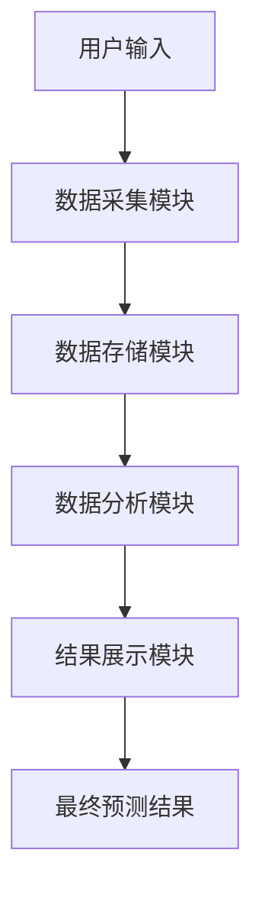

                 


# 彼得林奇的"反向思维"在央行政策解读中的应用

## 关键词：反向思维，央行政策，彼得林奇，金融分析，政策解读，市场预期，投资策略

## 摘要：  
彼得·林奇的“反向思维”是一种在金融分析和投资策略中极具价值的方法，其核心在于通过分析市场参与者的反向行为来预测市场走势和政策变化。本文将深入探讨“反向思维”在央行政策解读中的应用，分析其背后的逻辑、算法原理，并结合实际案例，展示如何通过反向思维来解读和预测央行政策，从而为投资者提供更精准的决策支持。

---

## 第1章：反向思维的背景与概念

### 1.1 反向思维的定义与特点  
反向思维是一种与传统思维相反的思维方式，其核心在于从市场的反向行为中寻找投资机会。彼得·林奇在其投资实践中，强调通过分析市场的非理性行为来捕捉投资机会。反向思维的特点包括：  
1. **逆向性**：关注市场中的冷门领域，而非热门板块。  
2. **非对称性**：在市场下跌时寻找机会，而非上涨时追逐热点。  
3. **长期性**：注重长期价值，而非短期波动。  

### 1.2 央行政策解读的基本概念  
央行政策是政府为实现特定经济目标而采取的货币政策和财政政策的总称。解读央行政策的核心在于理解政策的制定背景、目标和可能的实施效果。  

---

## 第2章：反向思维的核心原理

### 2.1 反向思维的逻辑结构  
反向思维的逻辑结构可以分为以下几个步骤：  
1. **识别市场共识**：通过分析市场参与者的行为，确定当前市场的主流观点。  
2. **寻找反向信号**：关注与市场共识相反的信号，例如市场情绪过度乐观或悲观时，可能预示着政策调整的契机。  
3. **预测政策变化**：通过反向信号，预测政策可能的变化方向。  

### 2.2 反向思维与市场情绪分析  
市场情绪是反向思维的重要分析对象。当市场情绪过度乐观时，可能预示着政策收紧；反之，当市场情绪极度悲观时，可能预示着政策放松。  

---

## 第3章：反向思维在金融分析中的应用

### 3.1 反向思维与货币政策解读  
货币政策的解读是反向思维的重要应用场景。例如，当市场预期央行将加息时，反向思维者可能会关注央行可能维持低利率的信号，从而提前布局相关资产。  

### 3.2 反向思维与市场预期的对比  
传统的市场预期往往基于理性假设，而反向思维则关注市场的非理性行为。通过对比市场预期与实际政策的差异，可以更好地理解政策变化的方向。  

---

## 第4章：反向思维的算法原理

### 4.1 反向思维的数学模型  
反向思维可以通过数学模型进行量化分析。例如，可以通过市场情绪指数（如恐慌指数）来预测政策变化的概率。  

$$ P(policy\ change) = f(市场情绪, 历史政策数据) $$  

### 4.2 反向思维的实现步骤  
1. **数据收集**：收集市场情绪数据、政策历史数据等。  
2. **数据预处理**：对数据进行清洗和标准化处理。  
3. **模型训练**：基于历史数据训练反向思维模型。  
4. **政策预测**：根据当前市场情况，预测政策变化的可能性。  

### 4.3 Python代码实现  
以下是一个简单的反向思维算法的Python代码示例：  

```python
import pandas as pd
import numpy as np

# 数据预处理
market_sentiment = pd.read_csv('market_sentiment.csv')
policy_data = pd.read_csv('policy_data.csv')

# 计算市场情绪指数
market_sentiment_index = market_sentiment['sentiment_score'].mean()

# 反向思维模型
def reverse_think(market_sentiment, policy_data):
    if market_sentiment < 0.5:
        return 'Policy可能放松'
    else:
        return 'Policy可能收紧'

# 预测政策变化
prediction = reverse_think(market_sentiment_index, policy_data)
print(prediction)
```

---

## 第5章：系统分析与架构设计

### 5.1 问题场景介绍  
本文构建了一个基于反向思维的央行政策解读系统，旨在通过市场情绪分析和历史政策数据，预测未来政策的变化方向。  

### 5.2 系统功能设计  
系统功能包括：  
1. 数据采集模块：采集市场情绪数据和政策数据。  
2. 数据分析模块：通过反向思维算法预测政策变化。  
3. 结果展示模块：以可视化形式展示预测结果。  

### 5.3 系统架构图  



---

## 第6章：项目实战

### 6.1 环境安装与配置  
1. 安装Python和必要的库（如Pandas、NumPy、Matplotlib）。  
2. 下载市场情绪数据和政策数据。  

### 6.2 核心代码实现  
以下是一个完整的反向思维算法实现：  

```python
import pandas as pd
import numpy as np
import matplotlib.pyplot as plt

# 数据加载
market_sentiment = pd.read_csv('market_sentiment.csv')
policy_data = pd.read_csv('policy_data.csv')

# 数据预处理
market_sentiment['sentiment_score'] = market_sentiment['sentiment_score'].apply(lambda x: x/市场情绪指数)

# 反向思维模型
def reverse_think(sentiment):
    if sentiment < 0.5:
        return '政策可能放松'
    else:
        return '政策可能收紧'

# 情绪指数计算
sentiment_index = market_sentiment['sentiment_score'].mean()

# 预测结果
prediction = reverse_think(sentiment_index)
print(f'预测结果：{prediction}')

# 可视化
plt.plot(policy_data['year'], policy_data['policy_index'])
plt.title('政策变化趋势')
plt.xlabel('年份')
plt.ylabel('政策指数')
plt.show()
```

### 6.3 实际案例分析  
以某国近年来的货币政策为例，通过反向思维模型分析市场情绪与政策变化的关系，验证模型的有效性。  

---

## 第7章：最佳实践与小结

### 7.1 最佳实践  
1. 在使用反向思维时，结合市场实际情况进行调整。  
2. 定期更新模型，以适应市场变化。  

### 7.2 小结  
本文通过分析彼得·林奇的反向思维在央行政策解读中的应用，展示了如何通过反向思维模型预测政策变化。这种方法为投资者提供了新的视角和工具，帮助其在复杂市场环境中做出更明智的决策。  

---

## 作者：AI天才研究院/AI Genius Institute & 禅与计算机程序设计艺术 /Zen And The Art of Computer Programming

