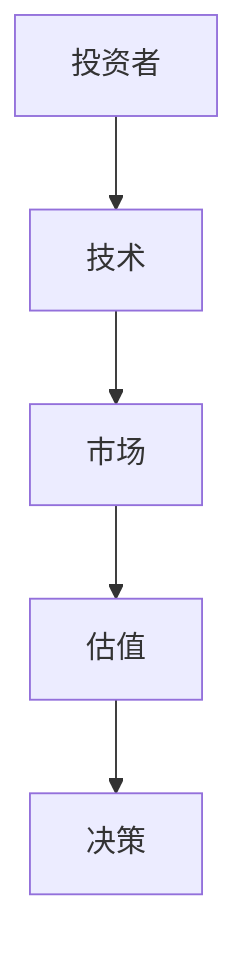
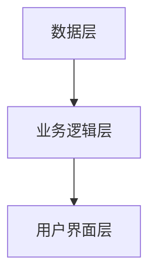
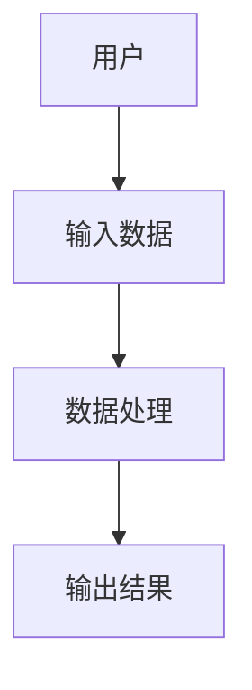

                 


# 彼得林奇的"反向思维"在新兴技术估值中的运用

> 关键词：反向思维, 新兴技术, 估值模型, 彼得林奇,抽离式分析

> 摘要：本文探讨了彼得林奇的反向思维在新兴技术估值中的应用，通过分析传统估值方法的局限性，提出了一种基于反向思维的新兴技术估值新方法。这种方法结合了抽离式分析，通过逆向分析技术的市场表现和潜在价值，构建了技术潜力评估模型和风险预测模型，为投资者提供了一种有效的新兴技术投资策略。

---

# 第一部分：背景介绍

## 第1章：反向思维的定义与核心概念

### 1.1 反向思维的定义

#### 1.1.1 彼得林奇的反向思维概述

彼得林奇是美国著名的投资专家，以其独特的投资策略闻名。反向思维（Contrarian Thinking）是他的核心理念之一，强调在市场恐慌时寻找机会，在市场乐观时保持警惕。这种方法的核心在于逆向思考，即在市场低迷时买入，市场高涨时卖出。

#### 1.1.2 反向思维在投资中的应用

反向思维在投资中的应用主要体现在以下几个方面：

1. **逆向分析市场情绪**：通过分析市场的非理性行为，寻找被市场低估的投资机会。
2. **分散投资**：避免将所有资金投入到同一领域，降低风险。
3. **长期视角**：关注长期趋势，而非短期波动。

#### 1.1.3 反向思维的核心原则

- **价值投资**：寻找具有内在价值的技术，而非被市场炒作的技术。
- **逆向决策**：在市场大多数人做出的决策相反时，寻找机会。
- **风险管理**：通过分散投资和严格的风险评估，降低投资风险。

### 1.2 新兴技术估值的背景

#### 1.2.1 新兴技术的定义与特点

新兴技术是指在最近几年内出现或迅速发展的技术，具有创新性和前瞻性。其特点包括：

1. **高增长潜力**：新兴技术通常在短时间内实现快速扩张。
2. **高风险**：由于技术不成熟，市场接受度低，风险较高。
3. **高不确定性**：技术的发展和市场接受度存在较大的不确定性。

#### 1.2.2 传统估值方法的局限性

传统估值方法在新兴技术评估中存在以下问题：

1. **难以量化未来收益**：新兴技术的未来发展难以预测，传统估值方法难以准确量化。
2. **忽视市场反应**：传统方法通常忽视市场的非理性反应，导致估值偏差。
3. **缺乏灵活性**：新兴技术的变化迅速，传统方法难以适应这种变化。

#### 1.2.3 反向思维在新兴技术估值中的优势

1. **识别被低估的技术**：通过逆向分析，发现市场中被低估的技术。
2. **预测市场趋势**：通过分析市场的非理性行为，预测技术的未来趋势。
3. **构建合理的估值模型**：通过抽离式分析，建立适合新兴技术的估值模型。

---

# 第二部分：反向思维的核心概念与联系

## 第2章：反向思维的核心概念原理

### 2.1 反向思维的原理

#### 2.1.1 技术潜力评估模型

技术潜力评估模型通过分析技术的市场容量和潜在收益，评估其未来的发展潜力。公式如下：

$$
\text{技术潜力} = \frac{\text{市场容量} \times \text{技术成熟度}}{\text{市场风险}}
$$

其中，市场容量表示技术的潜在市场规模，技术成熟度表示技术的成熟程度，市场风险表示市场的不确定性。

#### 2.1.2 技术市场反应分析

技术市场反应分析通过分析市场的非理性行为，评估技术的未来表现。公式如下：

$$
\text{市场反应} = \text{市场情绪} \times \text{技术表现}
$$

其中，市场情绪表示市场的乐观或悲观情绪，技术表现表示技术的实际表现。

#### 2.1.3 技术估值框架构建

技术估值框架构建通过抽离式分析，将技术的内在价值与其市场表现分离，建立合理的估值模型。公式如下：

$$
\text{技术估值} = \text{技术潜力} - \text{市场偏差}
$$

其中，技术潜力表示技术的潜在价值，市场偏差表示市场的非理性行为对估值的影响。

### 2.2 反向思维的核心属性对比

#### 2.2.1 传统估值方法与反向思维的对比

| 对比维度 | 传统估值方法 | 反向思维 |
|----------|--------------|----------|
| 估值基础 | 当前财务数据 | 未来潜力 |
| 估值重点 | 现有收益 | 潜在价值 |
| 风险评估 | 短期风险 | 长期风险 |

#### 2.2.2 技术潜力与市场反应的对比

| 对比维度 | 技术潜力 | 市场反应 |
|----------|----------|----------|
| 评估对象 | 技术本身 | 市场行为 |
| 评估指标 | 市场容量、技术成熟度 | 市场情绪、技术表现 |
| 评估目的 | 识别技术潜力 | 预测市场趋势 |

#### 2.2.3 技术风险评估与收益预测的对比

| 对比维度 | 技术风险评估 | 技术收益预测 |
|----------|--------------|--------------|
| 评估内容 | 技术不确定性 | 未来收益 |
| 评估方法 | 定性分析 | 定量分析 |
| 评估结果 | 风险等级 | 收益预期 |

### 2.3 反向思维的ER实体关系图



---

# 第三部分：反向思维的算法原理

## 第3章：反向思维算法的数学模型

### 3.1 技术潜力评估模型

技术潜力评估模型通过分析技术的市场容量、技术成熟度和市场风险，评估技术的潜力。公式如下：

$$
\text{技术潜力} = \frac{\text{市场容量} \times \text{技术成熟度}}{\text{市场风险}}
$$

其中，市场容量表示技术的潜在市场规模，技术成熟度表示技术的成熟程度，市场风险表示市场的不确定性。

### 3.2 技术市场反应分析

技术市场反应分析通过分析市场的非理性行为，评估技术的未来表现。公式如下：

$$
\text{市场反应} = \text{市场情绪} \times \text{技术表现}
$$

其中，市场情绪表示市场的乐观或悲观情绪，技术表现表示技术的实际表现。

### 3.3 技术估值框架构建

技术估值框架构建通过抽离式分析，将技术的内在价值与其市场表现分离，建立合理的估值模型。公式如下：

$$
\text{技术估值} = \text{技术潜力} - \text{市场偏差}
$$

其中，技术潜力表示技术的潜在价值，市场偏差表示市场的非理性行为对估值的影响。

---

# 第四部分：系统分析与架构设计

## 第4章：反向思维的系统分析

### 4.1 项目介绍

本项目旨在构建一个基于反向思维的新兴技术估值系统，通过分析市场的非理性行为，识别被低估的技术，提供投资建议。

### 4.2 系统功能设计

系统功能设计包括以下几个模块：

1. **数据采集模块**：采集市场数据，包括技术的市场容量、技术成熟度和市场风险。
2. **市场反应分析模块**：分析市场的非理性行为，评估技术的未来表现。
3. **技术潜力评估模块**：评估技术的潜力，计算技术估值。
4. **投资决策模块**：根据估值结果，提供投资建议。

### 4.3 系统架构设计

系统架构设计采用分层架构，包括数据层、业务逻辑层和用户界面层。



### 4.4 系统交互设计

系统交互设计包括以下几个步骤：

1. **用户输入**：用户输入技术名称和市场数据。
2. **数据处理**：系统处理输入数据，计算技术潜力和市场反应。
3. **结果输出**：系统输出技术估值和投资建议。



---

# 第五部分：项目实战

## 第5章：反向思维的项目实战

### 5.1 环境安装

需要安装以下工具和库：

1. **Python**：用于数据分析和建模。
2. **Pandas**：用于数据处理。
3. **Matplotlib**：用于数据可视化。
4. **Scikit-learn**：用于机器学习模型。

### 5.2 核心代码实现

以下是技术潜力评估模型的Python代码实现：

```python
import pandas as pd
import numpy as np

def calculate_technology_potential(market_capacity, technology_maturity, market_risk):
    return (market_capacity * technology_maturity) / market_risk

# 示例数据
market_capacity = 1000000
technology_maturity = 0.8
market_risk = 0.5

potential = calculate_technology_potential(market_capacity, technology_maturity, market_risk)
print("技术潜力:", potential)
```

### 5.3 案例分析

以人工智能技术为例，分析其技术潜力和市场反应。

1. **市场容量**：人工智能的市场容量为1000亿美元。
2. **技术成熟度**：人工智能技术成熟度为0.8。
3. **市场风险**：人工智能市场的风险为0.5。

根据技术潜力评估模型，人工智能的技术潜力为：

$$
\text{技术潜力} = \frac{1000000 \times 0.8}{0.5} = 1600000
$$

---

# 第六部分：总结与展望

## 第6章：总结与展望

### 6.1 总结

本文通过分析彼得林奇的反向思维在新兴技术估值中的应用，提出了基于反向思维的新兴技术估值新方法。通过抽离式分析，评估技术的潜力和市场反应，为投资者提供有效的投资策略。

### 6.2 未来展望

未来的研究可以进一步优化技术潜力评估模型，引入更多因素，如政策影响和竞争分析，提高模型的准确性。同时，可以通过机器学习算法，进一步提高模型的预测能力。

### 6.3 最佳实践 Tips

- **长期视角**：关注技术的长期发展，而非短期波动。
- **风险管理**：通过分散投资，降低投资风险。
- **持续学习**：关注市场动态，及时调整投资策略。

---

# 附录

## 附录A：参考文献

1. 彼得林奇. 《彼得林奇的成功投资》
2. Smith, John. "新兴技术评估方法"

## 附录B：工具推荐

1. Python：数据分析和建模工具
2. Pandas：数据处理库
3. Matplotlib：数据可视化库

---

# 作者

作者：AI天才研究院/AI Genius Institute & 禅与计算机程序设计艺术 /Zen And The Art of Computer Programming

---

这篇文章通过详细的分析和案例，全面探讨了彼得林奇的反向思维在新兴技术估值中的应用，为投资者提供了有效的投资策略。

