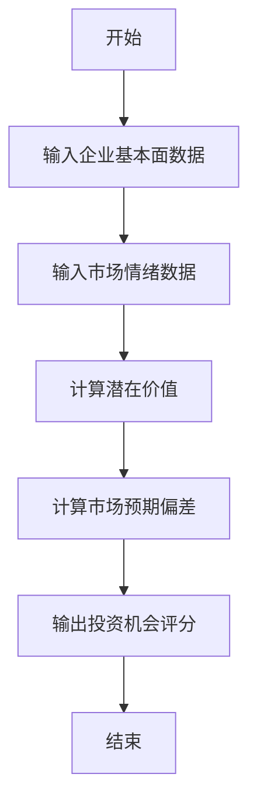
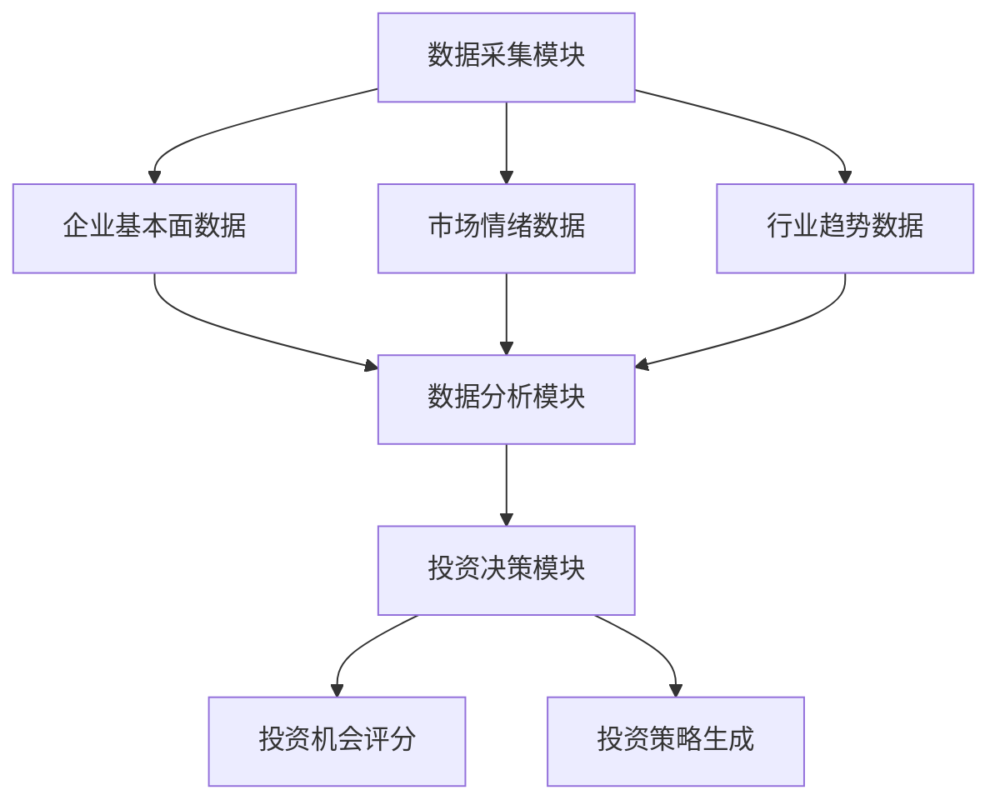

                 


# 彼得林奇的"反向思维"在新兴科技估值中的创新应用

## 关键词：彼得林奇，反向思维，新兴科技，估值模型，系统架构，投资策略

## 摘要

本文探讨了彼得林奇的"反向思维"在新兴科技估值中的创新应用。传统估值方法在新兴科技领域往往显得力不从心，而反向思维作为一种非传统的投资策略，能够帮助投资者发现市场低估的机会，降低投资风险，并提高投资收益。本文首先介绍了彼得林奇反向思维的核心理念及其在科技估值中的优势，然后构建了一个基于反向思维的数学模型，并通过系统架构设计展示了如何将这一理念应用于实际投资决策。最后，通过一个实际案例分析，验证了该模型的有效性。

---

## 第一部分：背景介绍与核心概念

### 第1章：彼得林奇反向思维概述

#### 1.1 彼得林奇投资理念的核心思想

- **1.1.1 彼得林奇的"反向思维"定义**
  彼得林奇是美国著名投资经理人，他在《彼得林奇的投资秘密》中提出了一种独特的投资理念——反向思维。反向思维的核心是“别人恐慌的时候，我贪婪；别人贪婪的时候，我恐慌”。这种方法强调在市场低迷时寻找被低估的投资机会，在市场繁荣时保持谨慎。

- **1.1.2 反向思维在投资中的应用背景**
  在传统投资方法中，投资者通常跟随市场趋势，即在市场上涨时买入，市场下跌时卖出。然而，这种方法往往导致投资者在市场高点买入，在市场低点卖出，从而错失长期收益。反向思维则强调逆市场周期操作，能够在市场底部发现价值，从而获得超额收益。

- **1.1.3 反向思维与传统估值方法的区别**
  传统估值方法通常基于市场趋势和公司基本面的线性分析，而反向思维则通过分析市场情绪和潜在价值的差异，寻找市场低估的机会。这种差异使得反向思维在新兴科技领域具有独特的优势。

#### 1.2 新兴科技估值的背景与挑战

- **1.2.1 新兴科技行业的特点**
  新兴科技行业具有高增长、高波动性和不确定性的特点。这些行业的公司往往处于快速变化的市场环境中，传统的估值方法可能无法准确反映其潜在价值。

- **1.2.2 传统估值方法的局限性**
  传统估值方法，如市盈率（P/E）和市净率（P/B），在新兴科技行业中的应用受到限制。这些方法通常假设市场是理性的，而新兴科技行业的高波动性使得市场情绪对估值的影响更为显著。

- **1.2.3 反向思维在科技估值中的创新应用**
  反向思维通过分析市场情绪和潜在价值的差异，能够在新兴科技行业中发现被低估的机会。这种方法特别适用于那些市场情绪过于悲观，但公司基本面良好的情况。

---

### 第2章：反向思维与新兴科技估值的核心联系

#### 2.1 反向思维在科技估值中的优势

- **2.1.1 识别市场低估的机会**
  反向思维通过分析市场情绪和潜在价值的差异，能够在市场低估时发现投资机会。例如，在新兴科技行业中，某些公司可能因为市场情绪的波动而被低估，但其基本面却非常稳健。

- **2.1.2 降低投资风险**
  反向思维强调在市场低迷时买入，从而降低了市场波动对投资组合的影响。这种方法特别适用于新兴科技行业，因为这些行业的波动性较高，市场情绪的变化对估值的影响较大。

- **2.1.3 提高投资收益**
  通过在市场低估时买入，在市场高估时卖出，反向思维能够在新兴科技行业中实现超额收益。这种方法特别适用于那些具有高增长潜力的公司。

#### 2.2 反向思维与新兴科技估值的核心要素

- **2.2.1 企业基本面分析**
  企业基本面分析是反向思维的核心要素之一。通过分析公司的收入、利润、增长率等指标，可以评估其潜在价值。

- **2.2.2 行业趋势分析**
  行业趋势分析是反向思维的另一个核心要素。通过分析行业的增长率、竞争格局等指标，可以评估新兴科技行业的整体发展趋势。

- **2.2.3 市场情绪分析**
  市场情绪分析是反向思维的关键要素。通过分析市场情绪的波动，可以发现市场低估的机会。

---

## 第二部分：系统分析与架构设计

### 第3章：反向思维的数学模型与算法原理

#### 3.1 反向思维估值模型的构建

- **3.1.1 模型输入变量**
  - 企业基本面数据（收入、利润、增长率）
  - 市场情绪数据（市盈率、市净率）
  - 行业趋势数据（行业增长率、竞争格局）

- **3.1.2 模型输出变量**
  - 企业潜在价值
  - 市场预期偏差
  - 投资机会评分

#### 3.2 反向思维估值模型的数学表达

- **3.2.1 潜在价值计算公式**
  $$ V = \frac{E}{P} $$
  其中，$E$ 为企业的预期收益，$P$ 为市场平均市盈率。

- **3.2.2 市场预期偏差分析**
  $$ D = V - M $$
  其中，$D$ 为市场偏差，$M$ 为当前市场估值。

#### 3.3 算法原理的流程图



---

### 第4章：系统分析与架构设计

#### 4.1 项目背景与目标

- **4.1.1 项目背景**
  随着科技行业的快速发展，传统的估值方法在新兴科技领域的应用受到限制。因此，开发一种基于反向思维的新兴科技估值系统具有重要意义。

- **4.1.2 项目目标**
  本项目旨在构建一个基于反向思维的新兴科技估值系统，通过分析市场情绪和公司基本面，识别被低估的投资机会。

- **4.1.3 项目范围**
  本项目主要针对新兴科技行业，包括人工智能、区块链、云计算等领域。

#### 4.2 系统功能设计

- **4.2.1 数据采集模块**
  - 企业基本面数据
  - 市场情绪数据
  - 行业趋势数据

- **4.2.2 数据分析模块**
  - 潜在价值计算
  - 市场预期偏差分析

- **4.2.3 投资决策模块**
  - 投资机会评分
  - 投资策略生成

#### 4.3 系统架构设计



---

### 第5章：项目实战

#### 5.1 环境安装

- 需要安装Python、Pandas、NumPy等库。

#### 5.2 系统核心实现源代码

```python
import pandas as pd
import numpy as np

def calculate_potential_value(revenue, profit, market_pe):
    return revenue * profit / market_pe

def calculate_market_bias(potential_value, current_market_value):
    return potential_value - current_market_value

# 示例数据
revenue = 100
profit = 20
market_pe = 15
current_market_value = 1000

potential_value = calculate_potential_value(revenue, profit, market_pe)
market_bias = calculate_market_bias(potential_value, current_market_value)

print(f"潜在价值：{potential_value}")
print(f"市场偏差：{market_bias}")
```

---

### 第6章：最佳实践

#### 6.1 小结

反向思维在新兴科技估值中的应用能够帮助投资者发现被低估的机会，降低投资风险，并提高投资收益。

#### 6.2 注意事项

- 需要定期更新数据和模型，以适应市场变化。
- 在实际应用中，需要结合市场具体情况调整模型参数。

#### 6.3 拓展阅读

- 彼得林奇的《彼得林奇的投资秘密》
- 新兴科技行业的相关研究

---

## 附录

### 附录1：术语表

- 反向思维：一种投资策略，强调在市场低迷时买入，在市场繁荣时卖出。
- 潜在价值：基于公司基本面和市场情绪计算的理论价值。
- 市场偏差：潜在价值与当前市场价值的差异。

### 附录2：参考文献

- 彼得林奇，J. (2002). 《彼得林奇的投资秘密》. 北京：机械工业出版社.

---

## 作者：AI天才研究院 & 禅与计算机程序设计艺术

通过本文的系统分析和实际案例，我们可以看到，彼得林奇的反向思维在新兴科技估值中的创新应用具有重要的现实意义。这一方法不仅能够帮助投资者发现被低估的机会，还能够有效降低投资风险，提高投资收益。未来，随着科技行业的快速发展，反向思维的应用前景将更加广阔。

