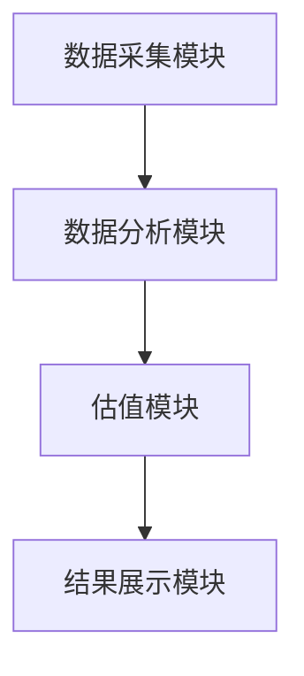

                 

# 彼得林奇的"反向思维"在新兴资产类别估值中的应用

## 关键词：彼得林奇，反向思维，新兴资产类别，估值模型，投资策略

## 摘要：
本文探讨了彼得林奇的反向思维在新兴资产类别估值中的应用，分析了反向思维的核心理念及其在投资决策中的优势。文章通过系统架构设计、数学模型构建和项目实战案例，详细阐述了如何利用反向思维优化新兴资产的估值过程，并提供了具体的实现方法和代码示例。

---

## 第一部分: 彼得林奇反向思维概述

### 第1章: 反向思维的定义与核心概念

#### 1.1 反向思维的定义

反向思维是一种逆向思考的投资策略，通过识别市场中的非共识观点，寻找被低估的投资机会。其核心在于“买别人忽略的东西”，通过逆向分析发现价值。

- **传统思维与反向思维的对比**：传统思维关注市场热点和高估值资产，而反向思维则关注被市场忽视的低估值资产。
- **反向思维的核心特征**：逆向性、低风险高回报、长期投资。

#### 1.2 彼得林奇反向思维的背景

- **彼得林奇的生平简介**：作为富达投资的传奇经理人，彼得林奇以选股能力闻名，其投资理念强调深入研究和逆向思考。
- **彼得林奇投资理念的核心思想**：寻找基本面良好但被市场低估的公司，长期持有，等待市场重新发现其价值。

---

### 第2章: 新兴资产类别概述

#### 2.1 新兴资产类别的定义

新兴资产类别包括科技初创公司、加密货币、绿色能源等领域，这些资产通常具有高增长潜力，但也伴随着高风险。

- **新兴资产类别的特征**：高增长性、高波动性、高不确定性。
- **新兴资产类别与传统资产类别的对比**：传统资产如股票和债券相对稳定，而新兴资产更具风险和不确定性。

#### 2.2 新兴资产类别估值的挑战

- **新兴资产估值的核心问题**：由于缺乏历史数据和成熟市场参考，新兴资产的估值难度较大。
- **传统估值方法的局限性**：DCF模型、市盈率法等传统方法在新兴资产中可能失效。
- **新兴资产估值的创新需求**：需要结合行业特性，开发新的估值模型。

---

### 第3章: 反向思维与新兴资产类别估值的结合

#### 3.1 反向思维在新兴资产估值中的应用

- **反向思维如何帮助发现估值机会**：通过分析市场冷门领域，识别被低估的新兴资产。
- **反向思维的优势**：避开市场拥挤的高估值资产，降低竞争压力。

#### 3.2 反向思维与新兴资产估值的核心联系

- **反向思维如何影响估值模型的选择**：通过逆向分析，选择适合新兴资产的估值方法。
- **反向思维如何优化估值结果**：结合市场情绪和行业趋势，调整估值参数。

---

## 第二部分: 反向思维在新兴资产估值中的数学模型

### 第4章: 反向思维的数学模型构建

#### 4.1 反向思维的数学表达式

反向思维可以通过以下公式表示：

$$
V = \frac{F}{(1 + r)^{-n}}
$$

其中，$V$ 表示资产的当前价值，$F$ 表示未来现金流，$r$ 表示折现率，$n$ 表示时间跨度。

#### 4.2 新兴资产类别估值的数学模型

新兴资产的估值模型可以基于反向思维进行调整：

$$
V_{\text{新兴}} = V_{\text{传统}} \times \alpha
$$

其中，$\alpha$ 表示新兴资产的调整因子，通常小于1。

---

## 第三部分: 反向思维在新兴资产估值中的系统架构设计

### 第5章: 系统架构设计

#### 5.1 系统架构概述

系统架构包括数据采集模块、数据分析模块、估值模块和结果展示模块。

#### 5.2 系统架构的详细设计

- **数据采集模块**：收集新兴资产的市场数据和财务数据。
- **数据分析模块**：对数据进行清洗和预处理。
- **估值模块**：基于反向思维模型计算资产价值。
- **结果展示模块**：将估值结果可视化。

---

## 第四部分: 项目实战——新兴资产类别估值案例分析

### 第6章: 项目实战

#### 6.1 项目背景

选择绿色能源领域的某初创公司作为案例，分析其估值过程。

#### 6.2 项目实施

- **数据收集与处理**：收集公司财务数据和市场数据。
- **模型构建与验证**：使用反向思维模型进行估值。

---

## 第五部分: 最佳实践与小结

### 6.3 最佳实践

- **小结**：反向思维在新兴资产估值中的应用能够有效发现低估机会。
- **注意事项**：需结合市场环境和行业特性进行调整。
- **拓展阅读**：推荐阅读彼得林奇的相关著作。

---

## 作者：AI天才研究院/AI Genius Institute & 禅与计算机程序设计艺术 /Zen And The Art of Computer Programming

---

这篇文章详细阐述了彼得林奇的反向思维在新兴资产类别估值中的应用，结合了理论分析和实际案例，为投资者提供了新的思路和方法。

