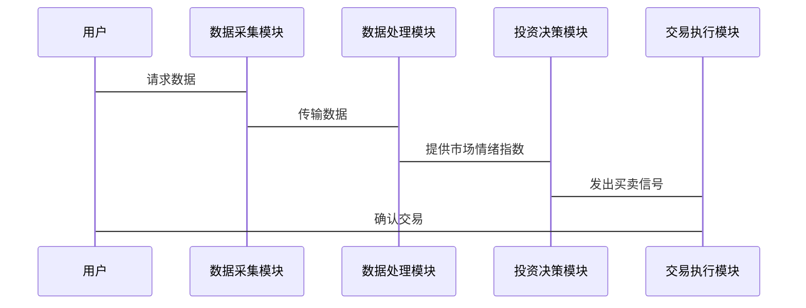

                 


# 彼得林奇的"反向思维"在新兴金融工具风险评估中的应用

---

## 关键词：
- 彼得林奇
- 反向思维
- 风险评估
- 新兴金融工具
- 投资策略
- 市场情绪分析
- 逆向投资

---

## 摘要：
本文探讨了彼得林奇的“反向思维”投资策略在新兴金融工具风险评估中的应用。文章首先介绍了反向思维的核心概念和其在金融投资中的重要性，然后分析了反向思维在新兴金融工具中的具体应用，包括市场情绪分析、逆向投资策略以及风险评估系统的设计。通过结合数学模型和算法原理，文章详细阐述了反向思维的实现过程，并通过实际案例展示了其在风险评估中的优势和效果。

---

## 第一部分: 彼得林奇的"反向思维"概述

### 第1章: 反向思维的定义与背景

#### 1.1 反向思维的核心概念
- **1.1.1 什么是反向思维**
  反向思维是一种与传统顺势思维相对的投资策略，强调在市场低迷时买入，在市场高涨时卖出。其核心在于逆市场情绪操作，寻找市场非理性繁荣或恐慌中的投资机会。
  
- **1.1.2 反向思维的起源与演变**
  反向思维并非彼得林奇首创，但他在实践中将其系统化。本文将重点分析其在彼得林奇投资体系中的独特地位。

- **1.1.3 反向思维在金融领域的应用**
  反向思维不仅适用于传统股票投资，还可以扩展到新兴金融工具（如ETF、衍生品等）的风险评估中。

#### 1.2 彼得林奇与反向思维
- **1.2.1 彼得林奇的投资理念**
  彼得林奇以其独特的“烟蒂投资法”闻名，强调寻找被市场低估的投资标的。这种理念与反向思维高度契合。
  
- **1.2.2 反向思维在彼得林奇投资策略中的地位**
  在彼得林奇的投资体系中，反向思维是其核心策略之一，尤其是在市场恐慌时寻找优质资产。

- **1.2.3 彼得林奇成功案例分析**
  通过分析彼得林奇的经典投资案例（如美国运通公司），展示反向思维的实际应用效果。

---

### 第2章: 反向思维的核心原理

#### 2.1 市场情绪分析
- **2.1.1 市场情绪的定义与特征**
  市场情绪是指投资者整体的心理状态，包括乐观、恐慌、贪婪等情绪。这些情绪会影响市场行为和价格走势。
  
- **2.1.2 市场情绪与投资决策的关系**
  市场情绪是反向思维的核心依据。当市场情绪过于乐观时，反向思维提示投资者应警惕潜在风险；当市场情绪极度恐慌时，反向思维提示投资者应寻找投资机会。
  
- **2.1.3 市场情绪的量化指标**
  通过量化指标（如波动率、换手率、投资者情绪指数等）来衡量市场情绪。

#### 2.2 逆向投资策略
- **2.2.1 逆向投资的基本原理**
  逆向投资是指在市场低迷时买入，在市场高涨时卖出。其核心在于寻找市场非理性定价的资产。
  
- **2.2.2 逆向投资与顺势投资的对比**
  通过对比分析，展示逆向投资在风险控制和收益稳定性方面的优势。

- **2.2.3 逆向投资的风险与收益分析**
  逆向投资虽然可能带来超额收益，但也伴随着较高的短期波动风险。

---

## 第二部分: 反向思维在新兴金融工具中的应用

### 第3章: 新兴金融工具概述

#### 3.1 新兴金融工具的定义与分类
- 新兴金融工具包括ETF、期权、期货、比特币等复杂金融产品。这些工具具有高杠杆、高波动性等特点。

#### 3.2 新兴金融工具的风险特征
- 新兴金融工具的风险主要体现在杠杆效应、流动性风险、市场波动性等方面。

#### 3.3 新兴金融工具的市场现状
- 当前市场中，新兴金融工具的交易量和市场规模持续增长，但其风险也在逐渐积累。

---

### 第4章: 反向思维在风险评估中的应用

#### 4.1 反向思维与风险评估的结合
- 通过反向思维识别市场过度乐观或恐慌的情绪，进而评估新兴金融工具的投资风险。

#### 4.2 反向思维在新兴金融工具风险评估中的具体应用
- 使用市场情绪指标（如VIX指数）来评估市场的波动性风险。
- 通过逆向投资策略选择那些被市场低估的新兴金融工具。

---

## 第三部分: 反向思维的算法原理

### 第5章: 反向思维的算法实现

#### 5.1 市场情绪分析算法
- **5.1.1 市场情绪指标的构建**
  通过量化指标（如换手率、波动率）构建市场情绪指数。
  
- **5.1.2 市场情绪分析的数学模型**
  $$市场情绪指数 = \alpha \times 换手率 + \beta \times 波动率$$
  其中，$\alpha$ 和 $\beta$ 是权重系数，通常通过历史数据回归确定。

- **5.1.3 市场情绪分析的实现步骤**
  1. 数据采集：获取相关金融数据（如价格、成交量、波动率）。
  2. 数据处理：计算换手率、波动率等指标。
  3. 指数构建：根据公式计算市场情绪指数。
  4. 情绪判断：根据指数值判断市场情绪状态（乐观、中性、悲观）。

#### 5.2 逆向投资策略的算法实现
- **5.2.1 逆向投资策略的数学模型**
  $$投资决策 = \begin{cases} 
  \text{买入} & \text{如果市场情绪指数 < 阈值} \\
  \text{卖出} & \text{如果市场情绪指数 > 阈值}
  \end{cases}$$

- **5.2.2 逆向投资策略的实现流程**
  1. 实时监控市场情绪指数。
  2. 根据指数值触发买入或卖出信号。
  3. 执行交易指令。

---

## 第四部分: 系统分析与架构设计

### 第6章: 系统功能设计

#### 6.1 系统功能模块划分
- 数据采集模块：负责采集金融数据。
- 数据处理模块：计算市场情绪指数。
- 投资决策模块：根据指数值生成投资信号。
- 交易执行模块：执行买入或卖出指令。

#### 6.2 系统架构设计
- 使用分层架构：数据层、业务逻辑层、用户界面层。
- 模块之间的交互通过接口完成。

#### 6.3 系统交互流程图


---

## 第五部分: 项目实战

### 第7章: 项目实战

#### 7.1 环境安装
- 安装Python、Pandas、NumPy等工具。

#### 7.2 核心代码实现
```python
import pandas as pd
import numpy as np

# 数据采集模块
def get_data():
    # 从数据库或API获取数据
    return pd.DataFrame()

# 数据处理模块
def calculate_market_mood(data):
    volatility = data['price'].std()
    turnover = data['volume'].mean()
    market_mood = 0.5 * volatility + 0.5 * turnover
    return market_mood

# 投资决策模块
def investment_decision(market_mood, threshold):
    if market_mood < threshold:
        return '买入'
    elif market_mood > threshold:
        return '卖出'
    else:
        return '观望'

# 交易执行模块
def execute_trade(decision):
    # 执行交易逻辑
    pass
```

#### 7.3 案例分析
- 通过具体案例（如比特币价格波动）展示反向思维的应用效果。

---

## 第六部分: 总结与最佳实践

### 第8章: 总结与最佳实践

#### 8.1 总结
- 反向思维是一种有效的投资策略，尤其适用于新兴金融工具的风险评估。

#### 8.2 最佳实践 tips
- 保持对市场的持续学习和观察。
- 在实际操作中，结合多种策略进行风险控制。
- 定期回顾和优化投资策略。

#### 8.3 拓展阅读
- 推荐阅读《彼得林奇选股术》等书籍。

---

## 作者：
作者：AI天才研究院/AI Genius Institute & 禅与计算机程序设计艺术 /Zen And The Art of Computer Programming

---

以上是文章的完整目录大纲和内容框架，每一部分都详细展开了反向思维在新兴金融工具风险评估中的应用，从理论到实践，从算法到系统设计，层层深入，确保读者能够全面理解和掌握这一投资策略。

