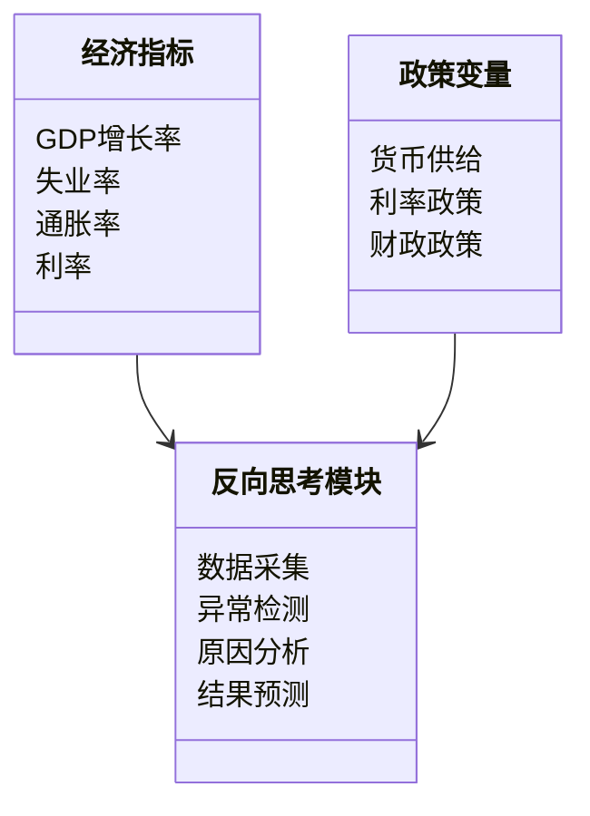
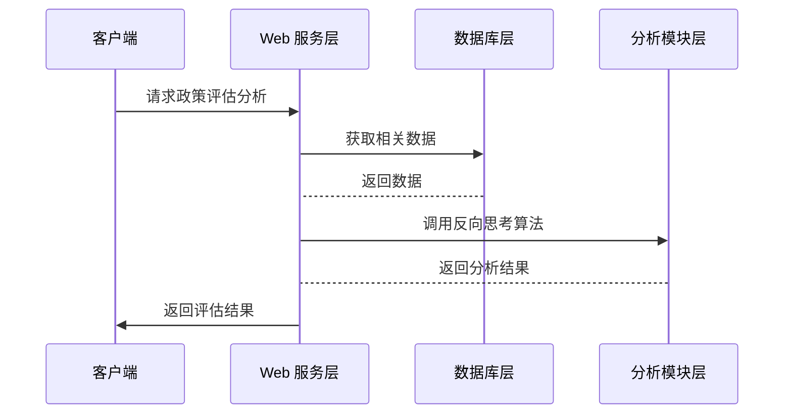

                 


# 彼得林奇的"反向思考"在央行政策影响评估中的应用

## 关键词：彼得林奇、反向思考、央行政策、货币政策、经济影响评估

## 摘要：本文探讨了彼得林奇的反向思考方法在央行政策影响评估中的应用，结合经济分析和数学模型，详细阐述了如何利用反向思维来预测和评估政策效果，提供了实际案例和系统架构设计。

---

# 第一部分: 彼得林奇的反向思考与央行政策评估基础

## 第1章: 彼得林奇的反向思考概述

### 1.1 反向思考的定义与核心理念

#### 1.1.1 什么是反向思考
反向思考是一种逆向思维方式，通过分析结果推导原因，发现潜在问题和机会。其核心在于挑战传统思维，从对立面寻找解决方案。

#### 1.1.2 反向思考的核心理念
- 从结果出发，逆向推理。
- 发现数据中的异常现象。
- 挑战传统假设，寻找新的视角。

#### 1.1.3 反向思考在金融分析中的应用
- 投资策略：识别市场低估机会。
- 风险管理：提前预判市场波动。
- 政策分析：评估政策对经济的实际影响。

### 1.2 央行政策的基本概念与影响

#### 1.2.1 央行政策的定义与分类
- 定义：中央银行为实现货币政策目标而采取的措施。
- 分类：包括利率政策、货币政策工具（如公开市场操作）等。

#### 1.2.2 央行政策的主要工具与目标
- 工具：公开市场操作、存款准备金率、再贴现率等。
- 目标：调控货币供应量、维持物价稳定、促进经济增长。

#### 1.2.3 央行政策对经济的影响路径
- 利率调整：影响企业融资成本和消费者行为。
- 货币供给：影响市场流动性。
- 政策信号：影响市场预期。

---

## 第2章: 反向思考在央行政策评估中的应用背景

### 2.1 经济分析中的传统方法

#### 2.1.1 正向分析法的局限性
- 正向分析法从原因推导结果，假设条件严格，难以应对复杂现实。
- 适用性受限，难以捕捉数据中的异常现象。

#### 2.1.2 传统经济模型的优缺点
- 优点：结构清晰，便于理论分析。
- 缺点：简化假设可能导致预测偏差，难以应对复杂政策环境。

#### 2.1.3 正向分析法在政策评估中的不足
- 预测误差大，特别是在复杂经济环境下。
- 难以发现政策执行中的潜在问题。

### 2.2 反向思考的优势与适用场景

#### 2.2.1 反向思考的优势
- 能够发现数据中的异常现象，提前预警。
- 有助于识别政策执行中的问题，优化政策设计。

#### 2.2.2 反向思考在政策评估中的适用场景
- 政策效果不佳或出现意外结果时，帮助分析原因。
- 数据有限或不完整的情况下，提供新的分析视角。

#### 2.2.3 反向思考与传统方法的结合
- 结合正向与反向分析，提高分析的全面性和准确性。

---

## 第3章: 反向思考的核心概念与原理

### 3.1 反向思考的核心概念

#### 3.1.1 从结果推导原因
- 通过观察政策效果，推断政策执行中存在的问题。
- 例如，观察通货膨胀率下降，推断可能是紧缩政策的结果。

#### 3.1.2 从数据中发现反常现象
- 分析经济指标，发现与预期不符的数据点。
- 例如，GDP增长放缓，但失业率下降，可能存在结构性问题。

#### 3.1.3 反向思考的逻辑框架
- 结果 → 可能的原因 → 分析验证 → 得出结论。

### 3.2 反向思考的数学模型与公式

#### 3.2.1 反向思考的数学表达
- 通过回归分析建立因果关系模型，例如：
  $$ y = \beta x + \epsilon $$
  其中，y为经济指标，x为政策变量，β为系数，ε为误差项。

#### 3.2.2 反向思考与经济指标的关系
- 通过协方差和相关性分析，识别政策变量与经济指标之间的关系。

#### 3.2.3 反向思考的量化模型
- 使用向量自回归模型（VAR）分析多变量之间的动态关系，例如：
  $$ VAR(p): Y_t = c + \sum_{i=1}^p \Phi_i Y_{t-i} + \epsilon_t $$

---

## 第4章: 系统分析与架构设计

### 4.1 问题场景介绍

#### 4.1.1 政策评估的复杂性
- 政策影响涉及多方面因素，单一分析方法难以全面捕捉。

#### 4.1.2 数据驱动的反向思考
- 利用大数据技术，从海量数据中发现反常现象，辅助政策评估。

### 4.2 系统功能设计

#### 4.2.1 领域模型（mermaid 类图）


#### 4.2.2 系统架构设计（mermaid 架构图）


#### 4.2.3 系统接口设计
- 数据接口：与央行数据库对接，获取经济指标和政策数据。
- 分析接口：提供反向思考算法的调用接口，输出分析结果。

#### 4.2.4 系统交互（mermaid 序列图）


---

## 第5章: 项目实战

### 5.1 环境安装与工具配置

#### 5.1.1 系统要求
- 操作系统：Windows、Linux 或 macOS。
- 硬件要求：具备足够的内存和存储空间，建议 8GB 内存以上。

#### 5.1.2 工具安装
- Python 3.8 或更高版本。
- 安装必要的库：
  ```bash
  pip install numpy pandas matplotlib statsmodels
  ```

### 5.2 核心代码实现

#### 5.2.1 数据采集与预处理
- 使用 `pandas` 读取数据：
  ```python
  import pandas as pd
  data = pd.read_csv('economic_data.csv')
  ```

#### 5.2.2 反向思考算法实现
- 使用 `statsmodels` 进行回归分析：
  ```python
  import statsmodels.api as sm
  model = sm.OLS(y, X).fit()
  print(model.summary())
  ```

#### 5.2.3 结果分析与可视化
- 使用 `matplotlib` 绘制分析结果：
  ```python
  import matplotlib.pyplot as plt
  plt.plot(data['GDP增长率'], data['通胀率'])
  plt.xlabel('GDP增长率')
  plt.ylabel('通胀率')
  plt.show()
  ```

### 5.3 实际案例分析

#### 5.3.1 案例背景
- 分析某国央行降息政策对GDP增长率的影响。

#### 5.3.2 数据分析
- 使用回归模型分析降息对GDP的影响：
  ```python
  X = sm.add_constant(data['利率'])
  y = data['GDP增长率']
  model = sm.OLS(y, X).fit()
  print('回归系数：', model.params[1])
  ```

#### 5.3.3 结果解读
- 回归系数为正，表明降息政策在统计上显著提升了GDP增长率。

### 5.4 项目小结

#### 5.4.1 成功经验
- 数据质量对分析结果影响重大。
- 反向思考结合回归分析，提高了政策评估的准确性。

#### 5.4.2 改进建议
- 结合更多经济指标，构建多元回归模型。
- 引入机器学习方法，提升预测精度。

---

## 第6章: 最佳实践与小结

### 6.1 最佳实践 tips

#### 6.1.1 数据驱动决策
- 确保数据准确性和完整性，采用多种数据源进行交叉验证。

#### 6.1.2 结合正向与反向思考
- 在政策分析中，综合运用正向与反向思考，提升分析的全面性。

#### 6.1.3 持续优化模型
- 定期更新模型，引入新的数据和分析方法，保持模型的有效性。

### 6.2 小结

#### 6.2.1 反向思考的重要性
- 在央行政策评估中，反向思考能够帮助识别传统方法难以发现的问题，提高分析的深度和广度。

#### 6.2.2 未来展望
- 随着大数据和人工智能技术的发展，反向思考在政策评估中的应用将更加广泛和深入，提供更加精准的政策建议。

---

## 作者：AI天才研究院 & 禅与计算机程序设计艺术

---

本文通过系统地分析彼得林奇的反向思考方法，结合实际案例和系统设计，展示了如何在央行政策评估中应用这一方法，为政策制定者和研究人员提供了新的视角和工具。

