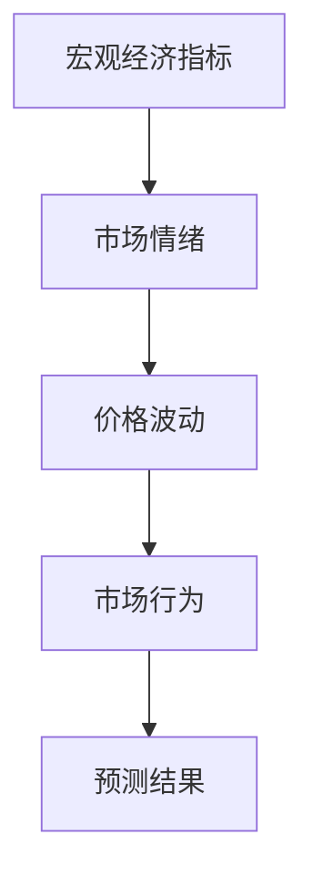
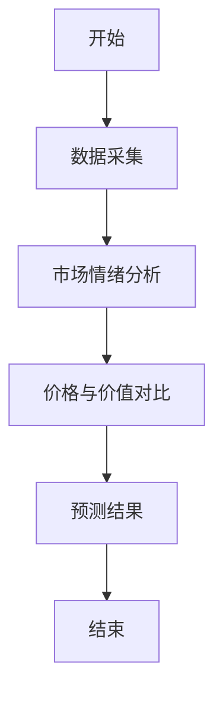
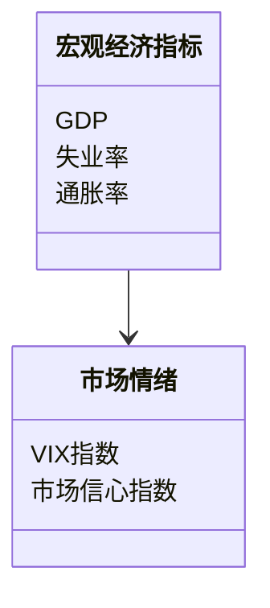
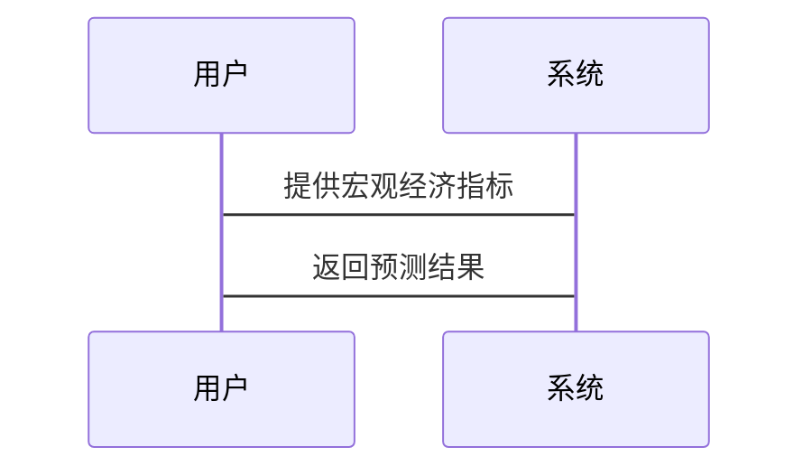

                 


# 彼得林奇的"反向思考"在宏观经济预测中的应用

> 关键词：宏观经济预测，彼得林奇，反向思考，时间序列分析，机器学习，系统架构设计

> 摘要：本文深入探讨了彼得林奇的反向思考方法在宏观经济预测中的应用，结合具体案例和系统架构设计，详细讲解了反向思考的核心原理、算法实现和实际应用。通过系统化的分析和设计，展示了如何利用反向思考来提高宏观经济预测的准确性和可靠性。

---

## 第一部分：宏观经济预测与反向思考概述

### 第1章：宏观经济预测的背景与挑战

#### 1.1 宏观经济预测的重要性
- 1.1.1 宏观经济预测的定义与作用
  宏观经济预测是通过对经济指标（如GDP、通胀率、失业率等）的分析，预测未来经济走势，为政策制定者、企业和个人提供决策依据。
  
- 1.1.2 宏观经济预测的常见挑战
  - 数据的复杂性和不完整性：宏观经济数据受多种因素影响，难以准确捕捉。
  - 模型的局限性：传统预测方法（如时间序列分析）在面对非线性关系时表现不佳。
  - 黑天鹅事件：极端事件（如疫情、战争）对预测结果的干扰。

- 1.1.3 宏观经济预测的边界与外延
  宏观经济预测不仅关注整体经济趋势，还包括对特定行业或市场的预测。

#### 1.2 彼得林奇的反向思考方法
- 1.2.1 反向思考的定义与核心要素
  反向思考是指从对立面出发，寻找市场的非共识观点。彼得林奇认为，市场的波动性为投资者提供了套利机会。
  
- 1.2.2 反向思考在投资中的应用
  - 市场情绪分析：通过分析市场情绪，寻找被低估的投资标的。
  - 逆向投资策略：在市场恐慌时买入，在市场狂热时卖出。

- 1.2.3 反向思考与宏观经济预测的结合
  将反向思考应用于宏观经济预测，可以发现市场预期的偏差，从而提高预测的准确性。

---

## 第二部分：反向思考在宏观经济预测中的核心概念

### 第2章：反向思考的原理与特征

#### 2.1 反向思考的原理
- 2.1.1 反向思考的核心概念
  反向思考的核心在于识别市场的非理性行为，发现价格与价值的偏离。

- 2.1.2 反向思考的逻辑框架
  - 市场情绪分析：通过指标（如VIX指数）衡量市场的恐慌程度。
  - 价格与价值对比：寻找被市场低估的资产。

- 2.1.3 反向思考与传统预测方法的对比
  表格：反向思考与传统预测方法的特征对比

| 特征              | 反向思考             | 传统预测方法         |
|-------------------|----------------------|----------------------|
| 数据来源          | 市场情绪、价格偏差   | 宏观经济指标         |
| 方法论            | 寻找市场非共识观点   | 基于历史数据的统计分析|
| 适用场景          | 市场波动较大时        | 数据充分且稳定的场景  |
| 优缺点            | 优点：捕捉市场机会；缺点：依赖市场情绪的准确性 | 优点：稳定性高；缺点：难以捕捉突发事件的影响 |

#### 2.2 反向思考的特征对比
- 图表：反向思考的ER实体关系图



---

## 第三部分：宏观经济预测的算法原理

### 第3章：宏观经济预测的算法原理

#### 3.1 算法原理概述
- 3.1.1 时间序列分析的数学模型
  - ARIMA模型：用于分析时间序列数据，预测未来趋势。
    $$ARIMA(p, d, q)$$
    其中，p为自回归阶数，d为差分阶数，q为移动平均阶数。

- 3.1.2 机器学习在宏观经济预测中的应用
  - 神经网络：通过训练模型捕捉非线性关系。
  - 支持向量机：用于分类和回归分析。

#### 3.2 反向思考算法的流程图
- 图表：反向思考算法的mermaid流程图



#### 3.3 数学模型与公式
- 3.3.1 时间序列分析的ARIMA模型
  $$ARIMA(p, d, q)$$
  其中，p为自回归阶数，d为差分阶数，q为移动平均阶数。

- 3.3.2 反向思考模型的数学表达式
  $$P(t) = -\sum_{i=1}^{n} w_i X_i(t)$$
  其中，P(t)为预测值，X_i(t)为输入变量，w_i为权重。

---

## 第四部分：系统分析与架构设计

### 第4章：宏观经济预测系统的架构设计

#### 4.1 系统功能设计
- 4.1.1 领域模型图：宏观经济预测系统的类图



#### 4.2 系统架构设计
- 图表：宏观经济预测系统的架构图


#### 4.3 系统接口设计
- 接口设计：定义输入和输出接口，如API接口。

#### 4.4 系统交互设计
- 图表：系统交互的mermaid序列图



---

## 第五部分：项目实战

### 第5章：项目实战

#### 5.1 环境安装
- 安装Python和相关库（如pandas、numpy、scikit-learn）。

#### 5.2 核心实现
- 使用Python代码实现反向思考算法：

```python
import pandas as pd
from sklearn.metrics import mean_squared_error

# 数据加载
data = pd.read_csv('macro_economy.csv')

# 市场情绪分析
def market_sentiment(data):
    # 示例：计算VIX指数的平均值
    return data['VIX'].mean()

# 反向思考模型
def reverse_thinking_model(data):
    sentiment = market_sentiment(data)
    # 计算价格与价值的偏离
    return -sentiment * data['GDP'].values

# 模型预测
predicted = reverse_thinking_model(data)
actual = data['GDP_forecast']

# 结果评估
mse = mean_squared_error(actual, predicted)
print(f'Mean Squared Error: {mse}')
```

#### 5.3 实际案例分析
- 以2020年新冠疫情为例，分析反向思考在宏观经济预测中的应用。

#### 5.4 项目小结
- 反向思考在宏观经济预测中的优势和局限性。

---

## 第六部分：最佳实践

### 第6章：小结与注意事项

#### 6.1 小结
- 反向思考为宏观经济预测提供了新的视角，但需结合传统方法使用。

#### 6.2 注意事项
- 数据的准确性和完整性对预测结果影响重大。
- 反向思考模型对突发事件的预测能力有限。

#### 6.3 拓展阅读
- 推荐阅读《彼得·林奇的成功投资》和《时间序列分析》。

---

作者：AI天才研究院/AI Genius Institute & 禅与计算机程序设计艺术 /Zen And The Art of Computer Programming

