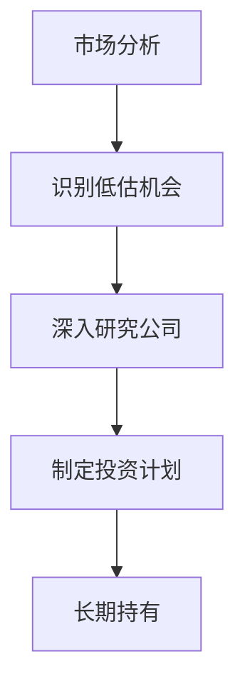
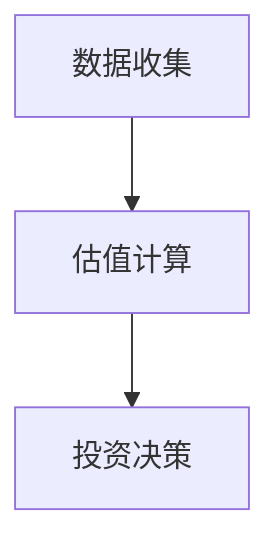

                 


# 彼得林奇的"反向思考"投资方法

## 关键词：彼得林奇，反向思考，投资策略，价值投资，市盈率，现金流折现模型

## 摘要：本文详细介绍了彼得林奇的“反向思考”投资方法，探讨了其核心概念、算法原理、系统架构设计以及实际案例分析，帮助读者理解如何在投资中应用这一策略。

---

## 第一部分：背景介绍

### 第1章：投资的基本概念

#### 1.1 投资的基本定义
- **定义**：投资是指将资金投入某个项目或资产，以期获得未来收益或资本增值。
- **分类**：包括股票、债券、房地产等多种形式。
- **目标**：实现资产增值，分散风险，追求长期收益。

#### 1.2 彼得林奇的生平简介
- **背景**：彼得·林奇是富达投资的传奇基金经理，管理过麦哲伦基金，创造了长期优异的业绩。
- **投资哲学**：强调深入研究公司基本面，寻找被市场低估的投资机会，注重长期价值而非短期波动。
- **成功案例**：如投资喜诗糖果和露露柠檬等公司，展现了其卓越的价值发现能力。

---

## 第二部分：核心概念与联系

### 第2章：反向思考投资方法的核心概念

#### 2.1 反向思考的定义与特点
- **定义**：反向思考是相对于市场趋势的逆向投资策略，寻找被市场低估的资产。
- **特点**：注重逆周期性，关注市场恐慌时期的低估机会，强调长期持有。

#### 2.2 反向思考与传统投资的对比
- **对比表格**：
| 投资方法 | 传统投资 | 反向思考 |
|----------|----------|----------|
| 策略 | 追踪趋势，顺势而为 | 逆市场趋势，寻找低估 |
| 风险 | 高波动性，可能追高 | 低波动性，风险较低 |
| 适用场景 | 市场繁荣 | 市场恐慌或低迷 |

- **流程图**：


---

## 第三部分：算法原理

### 第3章：反向思考的数学模型与公式

#### 3.1 市场估值模型
- **市盈率计算**：
  $$市盈率 = \frac{股价}{每股收益}$$
- **市净率计算**：
  $$市净率 = \frac{股价}{每股净资产}$$

#### 3.2 股票内在价值评估
- **现金流折现模型（DCF）**：
  $$V = \sum_{t=1}^{n} \frac{CF_t}{(1 + r)^t} + \frac{TV}{(1 + r)^n}$$
  其中，CF_t为第t年的现金流，r为折现率，TV为终值。

---

## 第四部分：系统分析与架构设计

### 第4章：系统架构设计

#### 4.1 系统功能设计
- **数据收集模块**：收集公司财务数据、市场数据。
- **估值计算模块**：计算市盈率、市净率，评估内在价值。

#### 4.2 系统架构图：


---

## 第五部分：项目实战

### 第5章：项目实战分析

#### 5.1 环境安装
- 安装Python，Pandas，Matplotlib等工具。

#### 5.2 核心代码实现
```python
import pandas as pd
import numpy as np

def calculate_pe(stock_price, eps):
    return stock_price / eps

def calculate_pfv(stock_price, free_cash_flow, discount_rate, years):
    pv = 0
    for t in range(years):
        cash_flow = free_cash_flow * (1 + 0.05)**t
        pv += cash_flow / (1 + discount_rate)**t
    return pv

# 示例数据
stock_price = 100
eps = 25
free_cash_flow = 1000000
discount_rate = 0.08
years = 5

pe = calculate_pe(stock_price, eps)
pv = calculate_pfv(stock_price, free_cash_flow, discount_rate, years)

print(f"市盈率：{pe}\n现值：{pv}")
```

---

## 第六部分：最佳实践与总结

### 第6章：投资策略与注意事项

#### 6.1 投资建议
- 保持耐心，长期持有优质资产。
- 定期复盘，调整投资组合。
- 避免情绪化决策，遵循价值。

#### 6.2 小结
反向思考是一种有效的投资策略，通过识别市场低估的机会，实现长期收益。投资者需深入研究，保持纪律，耐心持有。

---

作者：AI天才研究院/AI Genius Institute & 禅与计算机程序设计艺术 /Zen And The Art of Computer Programming

