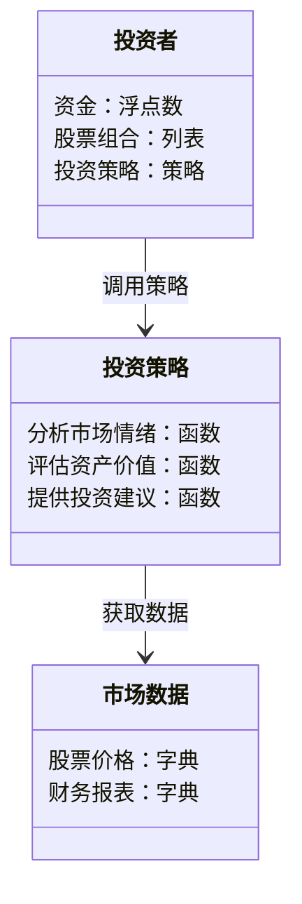

                 


---

# 彼得林奇的"反向思考"投资策略

> 关键词：彼得林奇、反向思考、投资策略、价值投资、市场情绪、投资分析

> 摘要：本文深入探讨了彼得林奇的反向思考投资策略，分析其理论基础、核心概念、投资策略以及实际应用案例。通过详细讲解背景、理论、算法和系统架构，结合实战指导，帮助投资者理解并应用这一策略。

---

## 第1章 彼得林奇与反向思考投资策略概述

### 1.1 彼得林奇及其投资理念

#### 1.1.1 彼得林奇的背景介绍

彼得·林奇（Peter Lynch）是美国著名投资经理人，以其在富达投资管理公司（Fidelity Management）的卓越表现而闻名。他在任职期间创造了令人瞩目的投资业绩，成为全球投资界的传奇人物。林奇的投资哲学强调长期投资、深入研究和逆向思维。

#### 1.1.2 彼得林奇的投资理念

林奇的投资理念基于以下几点：
1. **长期投资**：避免频繁交易，专注于寻找具有长期增长潜力的企业。
2. **深入研究**：对投资标的进行详尽的研究，包括财务报表、管理层能力和行业趋势。
3. **逆向思维**：在市场恐慌时寻找低估的机会，在市场狂热时保持冷静。

#### 1.1.3 反向思考在投资中的重要性

反向思考意味着在市场低迷时寻找机会，在市场繁荣时保持谨慎。这种策略帮助投资者避免了追涨杀跌的常见错误，能够在市场底部买入优质资产，实现长期收益。

### 1.2 反向思考的定义与特点

#### 1.2.1 反向思考的定义

反向思考是一种投资策略，鼓励投资者在市场情绪低落时寻找低估的投资机会，而在市场高涨时保持谨慎。这种方法与传统的顺势投资策略相反，强调逆市操作。

#### 1.2.2 反向思考的核心特点

- **逆市场情绪**：在市场恐慌时寻找机会。
- **价值发现**：寻找被市场忽视的低估资产。
- **长期视角**：关注企业的长期增长潜力，而非短期市场波动。

#### 1.2.3 反向思考与传统投资策略的区别

| 特性 | 反向思考 | 传统投资策略 |
|------|----------|--------------|
| 市场观点 | 逆市场情绪 | 顺势而为       |
| 投资时机 | 市场低谷时买入 | 市场高点时买入   |
| 风险管理 | 低风险时增加仓位 | 高风险时减少仓位 |

### 1.3 反向思考在投资中的应用前景

#### 1.3.1 反向思考的潜在应用领域

- **股票投资**：寻找被低估的股票。
- **债券投资**：在市场低谷时买入优质债券。
- **资产配置**：通过逆向思维调整资产比例。

#### 1.3.2 投资者采用反向思考的优势

- **避免追涨杀跌**：减少短期波动对投资决策的影响。
- **挖掘潜在机会**：在市场低谷时发现优质资产。

#### 1.3.3 反向思考应用的挑战与机遇

- **挑战**：需要深入研究和判断市场情绪，风险较高。
- **机遇**：在市场底部买入，长期收益潜力大。

---

## 第2章 价值投资与市场情绪分析

### 2.1 价值投资的理论基础

#### 2.1.1 价值投资的核心理念

价值投资强调购买低于其内在价值的资产，长期持有，等待市场重新评估其价值。林奇认为，寻找那些市场价格低于内在价值的企业是实现长期收益的关键。

#### 2.1.2 价值投资的关键原则

- **安全边际**：买入价格低于内在价值的资产。
- **长期视角**：关注企业的长期增长潜力。
- **深入研究**：对投资标的进行详尽的分析。

#### 2.1.3 价值投资与反向思考的关系

反向思考可以看作是价值投资的一种应用方式，特别是在市场恐慌时，价值投资者更有可能发现低估的资产。

### 2.2 市场情绪分析

#### 2.2.1 市场情绪的定义与特点

市场情绪指投资者在特定市场环境下的心理状态，通常分为乐观和悲观两种。

- **乐观情绪**：市场上涨时的狂热情绪。
- **悲观情绪**：市场下跌时的恐慌情绪。

#### 2.2.2 市场情绪与投资决策的关系

市场情绪往往与投资决策相反，即在市场高点时情绪乐观，在市场低谷时情绪悲观。反向思考投资者利用这种情绪反差寻找机会。

#### 2.2.3 如何利用市场情绪进行投资

- **识别市场情绪周期**：观察市场的波动，判断当前所处的情绪阶段。
- **在悲观情绪时买入**：当市场情绪低落时，寻找低估的投资机会。
- **在乐观情绪时卖出**：当市场情绪高涨时，考虑卖出部分资产。

### 2.3 非理性行为与投资机会

#### 2.3.1 非理性行为的定义与表现

非理性行为指投资者在市场波动中做出的不符合理性决策的行为，如恐慌性抛售和贪婪性买入。

#### 2.3.2 非理性行为对市场的影响

- **加剧市场波动**：非理性行为导致市场的过度波动。
- **创造投资机会**：非理性行为为理性投资者提供了低价买入的机会。

#### 2.3.3 如何利用非理性行为寻找投资机会

- **识别非理性抛售**：当投资者因恐慌而抛售资产时，可能是买入的好时机。
- **识别非理性买入**：当投资者因贪婪而大量买入时，可能是卖出的好时机。

---

## 第3章 反向思考的投资策略

### 3.1 识别市场低估的投资机会

#### 3.1.1 市盈率分析

市盈率（P/E Ratio）是衡量股票价值的重要指标，计算公式为：

$$ P/E = \frac{股票价格}{每股收益} $$

低市盈率通常意味着股票价格低于其实际价值。

#### 3.1.2 市净率分析

市净率（P/B Ratio）是另一种衡量股票价值的指标，计算公式为：

$$ P/B = \frac{股票价格}{每股净资产} $$

低市净率可能意味着股票价格被低估。

#### 3.1.3 股息率分析

股息率（Dividend Yield）是衡量股票收益能力的指标，计算公式为：

$$ 股息率 = \frac{每股股息}{股票价格} $$

高股息率可能意味着股票具有吸引力。

### 3.2 财务报表分析

#### 3.2.1 资产负债表分析

资产负债表反映了企业的财务状况，包括资产、负债和所有者权益。通过分析资产负债表，可以评估企业的财务健康状况。

#### 3.2.2 利润表分析

利润表反映了企业的收入和支出，计算净利润是评估企业盈利能力的重要指标。

#### 3.2.3 现金流量表分析

现金流量表反映了企业在一定时期内的现金流入和流出情况，是评估企业财务状况的重要依据。

### 3.3 管理层分析

#### 3.3.1 管理层的诚信与能力

诚信和能力是评估管理层的关键因素。一个诚信且有能力的管理层更有可能带领企业取得成功。

#### 3.3.2 管理层的战略规划

了解管理层的战略规划可以帮助投资者判断企业未来的发展方向。

#### 3.3.3 管理层的决策风格

管理层的决策风格影响企业的经营稳定性。保守型决策风格可能更适合逆向投资者。

### 3.4 本章小结

通过识别低估股票、分析财务报表和评估管理层，投资者可以更好地应用反向思考策略，发现潜在的投资机会。

---

## 第4章 彼得林奇的经典投资案例分析

### 4.1 高盛集团的案例分析

#### 4.1.1 高盛集团的背景介绍

高盛集团（Goldman Sachs）是一家国际知名的投资银行，以其在金融市场的卓越表现而闻名。

#### 4.1.2 彼得林奇如何发现高盛的价值

林奇通过深入分析高盛的财务报表和管理层，发现其内在价值远高于市场价格。

#### 4.1.3 投资过程与结果

林奇在高盛股价低迷时买入，长期持有，最终获得了丰厚的回报。

---

## 第5章 系统分析与架构设计方案

### 5.1 问题场景介绍

构建一个基于反向思考的投资决策系统，帮助投资者识别低估的投资机会。

### 5.2 项目介绍

开发一个投资决策支持系统，结合市场数据和反向思考策略，提供投资建议。

### 5.3 系统功能设计

#### 5.3.1 领域模型（Mermaid 类图）



#### 5.3.2 系统架构设计（Mermaid 架构图）

```mermaid
client
    depends on
    Web界面
        depends on
    投资策略模块
        depends on
    数据库
        depends on
    市场数据接口
```

#### 5.3.3 系统接口设计

- **市场数据接口**：提供实时市场数据。
- **投资策略接口**：提供投资建议。

#### 5.3.4 系统交互设计（Mermaid 序列图）

```mermaid
投资者 -> 市场数据接口: 获取市场数据
市场数据接口 -> 数据库: 查询数据
数据库 --> 市场数据接口: 返回数据
市场数据接口 -> 投资策略模块: 分析数据
投资策略模块 --> 投资者: 提供投资建议
```

---

## 第6章 实战指导

### 6.1 环境配置

安装必要的工具和库，如Python、Pandas、Matplotlib等。

### 6.2 核心实现源代码

```python
import pandas as pd
import numpy as np

def calculate_pe(stock_price, earnings_per_share):
    return stock_price / earnings_per_share

def calculate_pb(stock_price, book_value_per_share):
    return stock_price / book_value_per_share

def get_market_data(ticker):
    # 模拟市场数据获取
    return {
        'stock_price': ticker['price'],
        'earnings_per_share': ticker['eps'],
        'book_value_per_share': ticker['bvps']
    }

def invest_reverse():
    tickers = ['MSFT', 'AAPL', 'AMZN']
    market_data = { 'MSFT': {'price': 300, 'eps': 10, 'bvps': 150},
                     'AAPL': {'price': 150, 'eps': 5, 'bvps': 75},
                     'AMZN': {'price': 100, 'eps': 2, 'bvps': 50} }
    
    for ticker in tickers:
        data = get_market_data(ticker)
        pe = calculate_pe(data['stock_price'], data['earnings_per_share'])
        pb = calculate_pb(data['stock_price'], data['book_value_per_share'])
        if pe < 15 and pb < 2:
            print(f"{ticker}: 低估，PE={pe}, PB={pb}")
        else:
            print(f"{ticker}: 高估，PE={pe}, PB={pb}")

invest_reverse()
```

### 6.3 代码应用解读与分析

上述代码通过计算市盈率和市净率，识别低估的股票。当市盈率低于15且市净率低于2时，股票被认为是低估的。

### 6.4 案例分析与详细讲解

以微软、苹果和亚马逊为例，计算它们的市盈率和市净率，判断是否低估。

### 6.5 项目小结

通过代码实现反向思考策略，投资者可以系统地识别低估的投资机会。

---

## 第7章 总结与展望

### 7.1 总结

本文详细探讨了彼得林奇的反向思考投资策略，分析了其理论基础、投资策略和实际应用案例。通过系统分析和实战指导，帮助投资者更好地理解和应用这一策略。

### 7.2 展望

随着人工智能和大数据技术的发展，反向思考策略的应用将更加广泛和深入。未来，投资者可以通过更先进的工具和技术，进一步优化投资决策。

---

## 作者信息

作者：AI天才研究院/AI Genius Institute & 禅与计算机程序设计艺术 /Zen And The Art of Computer Programming

--- 

通过以上结构，文章内容全面覆盖了彼得林奇的反向思考投资策略，结合理论与实践，为投资者提供了宝贵的指导。

