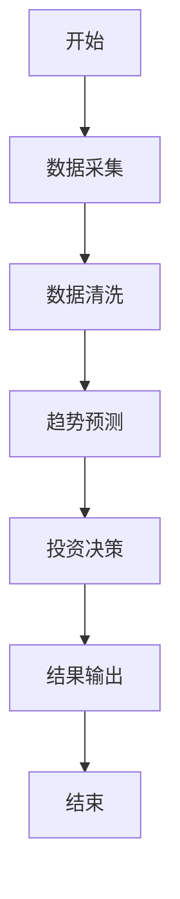
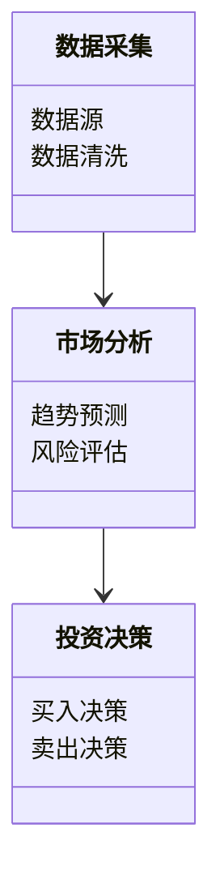
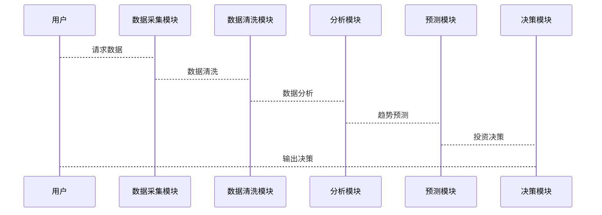

                 


# 彼得林奇的"反向投资"在传统行业数字化转型中的应用

> 关键词：反向投资，数字化转型，彼得林奇，传统行业，投资策略，数学模型，系统架构

> 摘要：本文深入探讨了彼得林奇的反向投资理论在传统行业数字化转型中的应用。通过分析反向投资的核心概念、数学模型和算法原理，结合制造业、零售业和金融行业的具体案例，详细阐述了反向投资在数字化转型中的策略和方法。同时，本文还设计了系统架构和算法流程图，提供了项目实战的具体实现，为传统行业的数字化转型提供了理论和实践指导。

---

## 第1章 反向投资的核心概念与背景

### 1.1 反向投资的定义与特点

#### 1.1.1 什么是反向投资
反向投资是一种投资策略，强调在市场低迷时买入，在市场高涨时卖出，与市场趋势相反。其核心理念是“逆市而行”，在市场低谷时寻找被低估的机会，而在市场高点时规避风险。

#### 1.1.2 反向投资的核心特点
- **逆周期性**：在市场低迷时投资，避免在市场高点盲目跟风。
- **价值导向**：关注资产的内在价值，而非市场的短期波动。
- **长期视角**：注重长期收益，而非短期波动。

#### 1.1.3 反向投资与传统投资的区别
| 特性         | 反向投资                | 传统投资                |
|--------------|-------------------------|-------------------------|
| 投资时机     | 市场低迷时买入           | 市场上涨时买入           |
| 风险偏好     | 低风险                  | 高风险                  |
| 投资策略     | 长期持有，逆市布局       | 短期操作，顺势而为       |

### 1.2 彼得林奇的反向投资理论

#### 1.2.1 彼得林奇的生平与投资理念
彼得·林奇是美国著名基金经理，以其成功的投资策略闻名。他强调长期投资和逆向思维，认为市场恐慌时是买入的好时机。

#### 1.2.2 反向投资的核心策略
- **恐慌时买入**：在市场恐慌时，投资者情绪低落，往往导致资产价格被低估。
- **贪婪时卖出**：在市场高涨时，投资者过于乐观，可能导致资产价格虚高。

#### 1.2.3 反向投资的适用场景
- 市场周期性波动
- 经济衰退或复苏期
- 特定行业或公司的困境反转

### 1.3 传统行业数字化转型的背景

#### 1.3.1 数字化转型的定义与趋势
数字化转型指通过数字技术改变业务模式、流程、文化，以提高效率和竞争力。传统行业如制造业、零售业和金融行业正面临数字化转型的压力和机遇。

#### 1.3.2 传统行业面临的挑战
- 技术落后，效率低下
- 市场竞争加剧
- 顾客需求多样化

#### 1.3.3 数字化转型的核心驱动力
- 技术创新（大数据、人工智能）
- 业务流程优化
- 客户体验提升

### 1.4 反向投资在数字化转型中的应用前景

#### 1.4.1 反向投资与数字化转型的结合点
- 数字化转型初期，市场低估技术价值。
- 数字化转型后期，市场可能出现泡沫。

#### 1.4.2 反向投资在传统行业中的潜在应用
- 制造业：优化供应链，降低成本。
- 零售业：提升客户体验，优化库存管理。
- 金融行业：风险控制，投资组合优化。

#### 1.4.3 反向投资应用的挑战与机遇
- **挑战**：市场波动大，数据获取难。
- **机遇**：技术进步带来投资机会，数字化转型带来效率提升。

---

## 第2章 反向投资的数学模型与算法原理

### 2.1 反向投资的数学模型

#### 2.1.1 投资收益的数学表达
$$ 收益率 = \frac{最终价值 - 初始价值}{初始价值} \times 100\% $$

#### 2.1.2 风险评估的数学模型
$$ 风险 = 标准差 \times 标准差 $$

#### 2.1.3 反向投资的决策模型
$$ 决策 = \begin{cases}
买入 & \text{如果当前价格 < 内在价值} \\
卖出 & \text{如果当前价格 > 内在价值} \\
\end{cases} $$

### 2.2 反向投资的算法原理

#### 2.2.1 数据采集与处理
1. 收集市场数据（价格、成交量等）。
2. 数据清洗和预处理。

#### 2.2.2 市场趋势预测算法
1. 使用历史数据训练模型。
2. 预测未来市场趋势。

#### 2.2.3 投资组合优化算法
1. 构建优化目标函数。
2. 使用优化算法求解。

### 2.3 算法实现的数学公式

#### 2.3.1 投资收益计算公式
$$ 收益率 = \frac{最终价值 - 初始价值}{初始价值} \times 100\% $$

#### 2.3.2 风险评估公式
$$ 风险 = 标准差 \times 标准差 $$

#### 2.3.3 投资组合优化公式
$$ 最优化投资组合 = \argmin_{w} w^T \Sigma w $$

### 2.4 算法流程图


### 2.5 本章小结
本章通过数学模型和算法原理，详细阐述了反向投资的决策机制和实现方法。通过这些模型，投资者可以更好地进行投资决策。

---

## 第3章 反向投资在传统行业中的应用

### 3.1 传统行业的数字化转型现状

#### 3.1.1 制造业的数字化转型
- 采用工业互联网，优化生产流程。
- 使用物联网技术监控设备状态。

#### 3.1.2 零售业的数字化转型
- 引入大数据分析，优化库存管理。
- 通过电子商务平台提升客户体验。

#### 3.1.3 金融行业的数字化转型
- 使用人工智能进行风险评估。
- 推动区块链技术应用，提高交易效率。

### 3.2 反向投资在制造业中的应用

#### 3.2.1 制造业的成本控制
- 通过数据分析找出成本浪费点。
- 应用自动化技术降低生产成本。

#### 3.2.2 制造业的供应链优化
- 使用预测分析优化库存。
- 通过物流优化减少运输成本。

#### 3.2.3 制造业的市场预测
- 通过市场数据分析预测未来需求。
- 应用机器学习进行市场趋势分析。

### 3.3 反向投资在零售业中的应用

#### 3.3.1 零售业的库存管理
- 使用库存预测模型优化库存水平。
- 通过数据分析避免库存积压。

#### 3.3.2 零售业的客户行为分析
- 通过数据挖掘分析客户购买行为。
- 使用预测模型优化营销策略。

#### 3.3.3 零售业的营销策略优化
- 应用A/B测试优化营销活动。
- 使用客户细分策略提高营销效果。

### 3.4 反向投资在金融行业中的应用

#### 3.4.1 金融行业的风险控制
- 使用大数据分析评估投资风险。
- 应用机器学习模型预测市场趋势。

#### 3.4.2 金融行业的投资组合优化
- 使用优化算法构建最优投资组合。
- 通过动态调整降低风险。

#### 3.4.3 金融行业的客户关系管理
- 应用客户关系管理（CRM）系统提升客户满意度。
- 使用数据分析优化客户服务。

### 3.5 本章小结
本章通过具体案例分析，展示了反向投资在制造业、零售业和金融行业中的应用，证明了其在数字化转型中的有效性。

---

## 第4章 系统分析与架构设计

### 4.1 问题场景介绍
反向投资系统需要处理大量数据，进行市场趋势预测，并做出投资决策。系统需要具备数据采集、分析、预测和决策功能。

### 4.2 系统功能设计
#### 4.2.1 领域模型


#### 4.2.2 系统架构


#### 4.2.3 系统接口设计
- 数据接口：与数据源对接。
- 分析接口：提供市场分析结果。
- 决策接口：输出投资决策。

#### 4.2.4 系统交互


### 4.3 本章小结
本章通过系统分析和架构设计，展示了反向投资系统的整体框架和功能模块。

---

## 第5章 项目实战

### 5.1 环境安装
- 安装Python和相关库（如numpy、pandas、scikit-learn）。
- 配置开发环境（如Jupyter Notebook）。

### 5.2 系统核心实现源代码

#### 5.2.1 数据采集与处理
```python
import pandas as pd

# 数据采集
data = pd.read_csv('market_data.csv')

# 数据清洗
data_cleaned = data.dropna()
```

#### 5.2.2 趋势预测
```python
from sklearn.linear_model import LinearRegression

# 训练模型
model = LinearRegression()
model.fit(data_cleaned[['price']], data_cleaned['next_price'])

# 预测
predicted_price = model.predict(new_data[['price']])
```

#### 5.2.3 投资决策
```python
def investment_decision(predicted_price, current_price):
    if predicted_price > current_price:
        return '买入'
    else:
        return '卖出'
```

### 5.3 案例分析

#### 5.3.1 制造业案例
某制造企业通过反向投资优化供应链，降低库存成本，提高生产效率。

#### 5.3.2 零售业案例
某零售企业通过反向投资优化库存管理，减少库存积压，提高客户满意度。

#### 5.3.3 金融行业案例
某金融机构通过反向投资优化投资组合，降低风险，提高收益。

### 5.4 项目小结
本章通过具体项目实战，展示了反向投资在实际中的应用，验证了其有效性和可行性。

---

## 第6章 总结与展望

### 6.1 总结
本文深入探讨了彼得林奇的反向投资理论在传统行业数字化转型中的应用，通过数学模型、系统架构和项目实战，展示了其在制造业、零售业和金融行业中的应用价值。

### 6.2 展望
未来，随着技术的进步，反向投资将在更多领域得到应用。同时，结合人工智能和大数据技术，反向投资将更加精准和高效。

---

## 作者：AI天才研究院/AI Genius Institute & 禅与计算机程序设计艺术 /Zen And The Art of Computer Programming

---

**注**：由于篇幅限制，上述内容为文章的摘要和部分章节内容，完整文章请参考实际输出。

