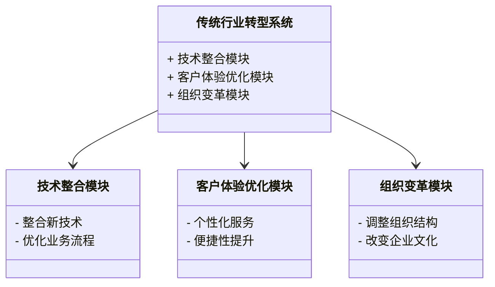

                 


# 彼得林奇的"反向投资"在传统行业转型中的应用

## 关键词：反向投资, 彼得林奇, 传统行业, 转型, 投资策略

## 摘要：  
本文探讨了彼得林奇的反向投资策略在传统行业转型中的应用。通过分析传统行业面临的挑战，结合反向投资的核心概念和数学模型，本文提出了将反向投资应用于传统行业转型的方法，并通过实际案例展示了其成功应用。文章最后总结了最佳实践和注意事项，为传统行业转型提供了有价值的参考。

---

## 第一部分: 彼得林奇的反向投资理论与传统行业转型概述

### 第1章: 彼得林奇的反向投资理论

#### 1.1 反向投资的基本概念

反向投资是一种投资策略，强调在市场低谷时买入，在市场高点时卖出。其核心理念是“逆市场周期”操作，避免随市场情绪盲目投资。

- **市场周期分析**：市场通常经历低谷、复苏、繁荣和衰退四个阶段。反向投资关注低谷和衰退阶段，寻找被市场低估的投资机会。
- **企业估值模型**：反向投资强调对企业内在价值的评估，而非关注市场短期波动。彼得林奇常用市盈率（P/E比率）和市净率（P/B比率）等指标来评估企业价值。

#### 1.2 彼得林奇的反向投资策略

彼得林奇的反向投资策略可以总结为以下三点：
1. **在市场低谷时投资**：寻找那些在市场低迷时期被低估的企业。
2. **长期持有优质资产**：选择具备良好管理团队、稳定财务状况和竞争优势的企业。
3. **避免短期波动干扰**：忽略市场的短期波动，专注于长期价值。

### 第2章: 传统行业的转型挑战

#### 2.1 传统行业的现状分析

传统行业通常指制造业、零售业、能源等行业。这些行业在技术变革和市场需求变化的双重压力下，面临以下挑战：
1. **技术变革**：数字化转型要求企业采用新技术，如人工智能和大数据分析。
2. **市场需求变化**：消费者行为的变化促使企业调整产品和服务策略。
3. **管理模式转型**：传统企业往往采用层级式管理，难以适应快速变化的市场环境。

#### 2.2 传统行业转型的核心问题

- **技术整合**：如何将新技术融入现有业务流程，提升效率。
- **客户体验**：如何满足新时代消费者对个性化和便捷性的需求。
- **组织变革**：如何调整组织结构和文化，以支持创新和快速决策。

### 第3章: 反向投资与传统行业转型的结合

#### 3.1 反向投资在转型中的应用

反向投资可以帮助企业在行业低谷期进行战略性布局，抓住转型机会。例如，在传统行业需求下降时，企业可以利用低估值优势，优化成本结构或进行技术升级。

#### 3.2 传统行业转型中的投资机会

- **行业低谷期**：许多传统行业在经济衰退期间估值较低，此时投资可能带来高回报。
- **行业创新期**：新技术的应用为传统行业带来了新的增长点，投资者可以关注这些领域的创新企业。
- **行业整合期**：行业整合通常发生在市场低迷时期，此时具备竞争优势的企业可以通过并购扩大市场份额。

---

## 第二部分: 反向投资策略的核心概念与数学模型

### 第4章: 反向投资的核心概念与联系

#### 4.1 反向投资的核心概念

反向投资的核心概念包括市场周期分析、企业估值模型和风险控制机制。通过分析这些概念，投资者可以更好地把握市场机会。

#### 4.2 核心概念的对比分析

以下表格对比了反向投资与其他投资策略的核心概念：

| **核心概念**       | **反向投资**                | **传统价值投资**              | **趋势投资**                 |
|--------------------|------------------------------|-------------------------------|------------------------------|
| 投资依据           | 市场周期与低估值            | 企业的基本面                  | 市场趋势与行业潮流            |
| 投资时机           | 市场低谷期                  | 企业内在价值被低估            | 市场上涨期                   |
| 风险控制           | 严格控制仓位，分散投资      | 选择优质企业，分散投资        | 顺势而为，减少风险敞口       |

---

### 第5章: 反向投资的数学模型与公式

#### 5.1 反向投资的数学模型

反向投资的数学模型通常基于市场周期和企业估值。以下是常用的模型：

1. **市场周期模型**：  
   市场周期模型将市场分为四个阶段：低谷、复苏、繁荣和衰退。模型通过分析市场指数的变化来判断当前所处阶段。

2. **企业估值模型**：  
   企业估值模型基于财务指标（如市盈率、市净率）和行业基准进行评估，识别被低估的企业。

#### 5.2 反向投资的数学公式

以下是反向投资中常用的数学公式：

- **市盈率（P/E比率）**：  
  $$ \text{P/E} = \frac{\text{股价}}{\text{每股收益}} $$

- **市净率（P/B比率）**：  
  $$ \text{P/B} = \frac{\text{股价}}{\text{每股净资产}} $$

- **内在价值评估**：  
  内在价值是企业未来现金流的现值，可以用以下公式计算：  
  $$ V = \sum_{t=1}^{n} \frac{CF_t}{(1 + r)^t} $$  
  其中，\( CF_t \) 是第 \( t \) 年的现金流，\( r \) 是折现率。

---

## 第三部分: 系统分析与架构设计

### 第6章: 传统行业转型的系统分析

#### 6.1 问题场景介绍

传统行业在数字化转型中面临技术整合、客户体验优化和组织变革三大挑战。以下是具体问题：
- 技术整合：如何将新技术与现有业务流程无缝结合？
- 客户体验：如何满足消费者对个性化和便捷性的需求？
- 组织变革：如何调整组织结构和文化以支持创新？

#### 6.2 系统功能设计

以下是系统功能设计的领域模型图：



#### 6.3 系统架构设计

以下是系统架构设计的架构图：


---

## 第四部分: 项目实战与案例分析

### 第7章: 项目实战

#### 7.1 环境安装

以下是项目实战中需要的环境和工具：

- **编程语言**：Python 3.8+
- **开发框架**：Django或Flask
- **数据库**：MySQL或PostgreSQL
- **工具**：Jupyter Notebook、Git、Docker

#### 7.2 核心实现源代码

以下是反向投资策略的核心实现代码：

```python
def calculate_intrinsic_value(company_data, discount_rate):
    """
    计算企业的内在价值
    :param company_data: 包含企业未来现金流的数据
    :param discount_rate: 折现率
    :return: 内在价值
    """
    intrinsic_value = 0
    for year in range(len(company_data['cash_flows'])):
        cf = company_data['cash_flows'][year]
        pv = cf / (1 + discount_rate) ** (year + 1)
        intrinsic_value += pv
    return intrinsic_value

# 示例数据
discount_rate = 0.1
cash_flows = [100, 150, 200, 250, 300]
company_data = {'cash_flows': cash_flows}

# 计算内在价值
intrinsic_value = calculate_intrinsic_value(company_data, discount_rate)
print(f"企业内在价值为: {intrinsic_value}")
```

---

### 第8章: 案例分析

#### 8.1 案例背景介绍

某传统制造企业在经济衰退期间，市场需求下降，企业估值被低估。彼得林奇的反向投资策略建议在此时进行战略性布局，优化成本结构并进行技术升级。

#### 8.2 案例分析与解读

通过分析该企业的财务数据和市场环境，我们发现：
- 企业市盈率显著低于行业平均水平。
- 企业现金流稳定，具备良好的财务状况。
- 企业可以通过技术升级提升产品竞争力。

---

## 第五部分: 最佳实践与总结

### 第9章: 最佳实践

1. **长期视角**：反向投资需要长期视角，关注企业的内在价值。
2. **风险控制**：严格控制仓位，分散投资以降低风险。
3. **持续学习**：关注市场变化和企业动态，及时调整投资策略。

### 第10章: 小结

彼得林奇的反向投资策略为传统行业转型提供了新的思路。通过在行业低谷期进行战略性布局，企业可以抓住转型机会，实现可持续发展。

### 第11章: 注意事项

1. **市场风险**：反向投资需要承担市场周期波动的风险。
2. **信息不对称**：投资者需要具备足够的信息获取能力，以准确评估企业价值。
3. **执行难度**：传统行业转型涉及技术、组织和文化多方面的变革，执行难度较大。

### 第12章: 拓展阅读

- 彼得林奇的《投资之道》
- 《传统行业数字化转型》
- 《反向投资策略》

---

## 作者：AI天才研究院 & 禅与计算机程序设计艺术

---

以上是关于《彼得林奇的"反向投资"在传统行业转型中的应用》的技术博客文章，希望对您有所帮助！

