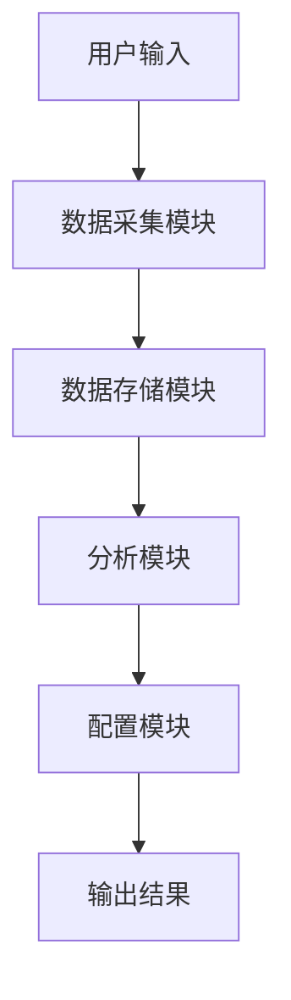

                 


# 彼得林奇的"反周期"投资在不同资产类别间的动态配置

> 关键词：反周期投资，彼得·林奇，资产配置，动态调整，经济周期

> 摘要：本文探讨彼得·林奇的反周期投资策略在不同资产类别间的动态配置。通过分析经济周期对资产的影响，介绍动态配置的数学模型、系统架构，并通过案例分析和代码实现，展示如何应用这些策略进行投资。

---

## 第一部分：反周期投资与动态资产配置概述

### 第1章：反周期投资的基本概念

#### 1.1 反周期投资的定义与背景
- **1.1.1 什么是反周期投资**  
  反周期投资是指在经济周期的不同阶段采取相反的策略，如在市场低谷时增加投资，在市场高点时减少投资。

- **1.1.2 反周期投资的背景与重要性**  
  经济周期波动对资产价格有显著影响，反周期投资有助于在不同阶段优化收益与风险。

- **1.1.3 彼得·林奇的投资理念**  
  林奇强调长期投资、价值投资和逆向思维，寻找被低估的资产。

#### 1.2 动态资产配置的核心思想
- **1.2.1 动态资产配置的定义**  
  根据市场变化调整资产比例，以适应不同经济周期阶段。

- **1.2.2 动态资产配置与静态配置的区别**  
  动态配置更具灵活性，而静态配置固定比例，不考虑市场变化。

- **1.2.3 反周期投资在动态配置中的应用**  
  在经济低谷增加风险资产，在高峰期减少风险资产，平衡风险与收益。

#### 1.3 不同资产类别间的配置策略
- **1.3.1 股票、债券、现金等主要资产类别**  
  股票高风险高回报，债券相对稳定，现金流动性高。

- **1.3.2 不同资产类别在经济周期中的表现**  
  经济衰退期债券表现较好，复苏期股票上涨，过热期现金保值。

- **1.3.3 资产类别间的相关性分析**  
  股票和债券通常负相关，分散投资可降低风险。

---

## 第二部分：彼得·林奇的反周期投资策略

### 第2章：彼得·林奇的投资哲学

#### 2.1 投资哲学
- **长期投资**：避免频繁交易，降低成本。
- **价值投资**：寻找被低估的资产。
- **逆向思维**：市场恐慌时买入，贪婪时卖出。

#### 2.2 反周期投资的核心原则
- **低谷增加投资**：在市场低谷时，资产价格被低估，长期收益高。
- **高峰减少投资**：市场高点时，风险增加，减少风险资产配置。
- **风险控制**：设置止损点，避免重大损失。

#### 2.3 投资组合管理
- **构建原则**：多样化配置，平衡风险和回报。
- **定期调整**：根据市场变化，每年或每季度调整配置。
- **止损策略**：设定止损点，及时退出亏损投资。

---

## 第三部分：经济周期与资产配置

### 第3章：经济周期的定义与阶段划分

#### 3.1 经济周期的四个阶段
- **衰退期**：GDP下降，失业率上升，企业盈利减少。
- **复苏期**：经济开始复苏，企业盈利回升。
- **过热期**：经济过热，通胀上升，央行可能加息。
- **滞胀期**：高通胀和高失业并存，经济增长停滞。

#### 3.2 不同阶段的资产表现
- **衰退期**：债券表现较好，股票可能下跌，现金保值。
- **复苏期**：股票开始上涨，债券收益率可能下降。
- **过热期**：股票和商品价格上涨，债券收益率上升。
- **滞胀期**：现金和抗通胀资产如黄金表现较好。

#### 3.3 资产类别间的动态调整
- **股票**：衰退期减少，复苏期增加。
- **债券**：衰退期增加，过热期减少。
- **现金**：滞胀期增加，作为避险资产。

---

## 第四部分：反周期投资的数学模型与算法

### 第4章：反周期投资的数学模型

#### 4.1 市场周期的数学建模
- 使用时间序列分析模型，如ARIMA，预测经济周期变化。

#### 4.2 资产回报率的预测模型
- 通过回归分析，预测不同资产在不同周期的回报。

#### 4.3 动态配置的优化算法
- 使用均值-方差优化，根据市场情况调整资产比例。

### 第5章：常用算法与工具

#### 5.1 均值回归模型
- 假设价格会回归平均值，识别超买或超卖机会。

#### 5.2 动量策略模型
- 基于价格动量，投资近期上涨的资产。

#### 5.3 风险平价模型
- 分散投资，平衡各资产的风险贡献。

### 第6章：算法实现与代码示例

#### 6.1 Python代码实现反周期投资策略
```python
import numpy as np
import pandas as pd
from sklearn.linear_model import LinearRegression

# 示例数据：假设市场指数
market_data = pd.DataFrame({
    'index': [100, 110, 90, 120, 85],
    'bond_yield': [5, 4.5, 5.5, 4, 6],
    'economic_cycle': ['recession', 'recession', 'recession', 'recovery', 'recession']
})

# 定义反周期策略函数
def counter_cycle_strategy(data):
    # 根据经济周期调整资产配置
    stock_weight = 0
    bond_weight = 0
    cash_weight = 0
    for cycle in data['economic_cycle']:
        if cycle == 'recession':
            stock_weight += 20
            bond_weight += 30
            cash_weight += 50
        else:
            stock_weight += 40
            bond_weight += 30
            cash_weight += 30
    return {'stock': stock_weight/len(data), 'bond': bond_weight/len(data), 'cash': cash_weight/len(data)}

# 应用策略并计算回报
weights = counter_cycle_strategy(market_data)
print(weights)
```

---

## 第五部分：系统分析与架构设计方案

### 第7章：系统架构设计

#### 7.1 系统功能设计
- 数据采集：收集市场数据和经济指标。
- 分析模块：使用统计模型和机器学习分析数据。
- 配置模块：根据分析结果调整资产配置。

#### 7.2 系统架构图


---

## 第六部分：项目实战

### 第8章：项目实战

#### 8.1 实战背景
- 选择2008年金融危机后的经济复苏期，应用反周期策略进行资产配置。

#### 8.2 核心实现
- 数据分析和模型应用，调整股票、债券和现金的比例。

#### 8.3 案例分析
- 在经济衰退期增加债券配置，衰退期后转向股票。

#### 8.4 代码实现与解读
```python
# 示例代码：根据市场周期调整配置
def adjust_allocation(cycle_phase):
    if cycle_phase == 'recession':
        return {'stocks': 20, 'bonds': 30, 'cash': 50}
    elif cycle_phase == 'recovery':
        return {'stocks': 40, 'bonds': 30, 'cash': 30}
    else:
        return {'stocks': 30, 'bonds': 25, 'cash': 45}

# 应用到具体周期阶段
current_phase = 'recession'
allocation = adjust_allocation(current_phase)
print(allocation)
```

---

## 第七部分：总结与展望

### 第9章：总结与展望

#### 9.1 总结
- 反周期投资通过逆向思维在不同经济阶段优化配置。
- 动态调整需结合数学模型和市场分析，分散风险。

#### 9.2 展望
- 引入机器学习优化配置模型。
- 结合实时数据，开发动态配置系统。

---

## 作者信息

作者：AI天才研究院/AI Genius Institute & 禅与计算机程序设计艺术 /Zen And The Art of Computer Programming

---

以上是文章的详细大纲，涵盖从基础概念到实际应用的各个方面，结合理论与实践，提供深入的分析和代码示例，帮助读者理解并应用彼得·林奇的反周期投资策略。

