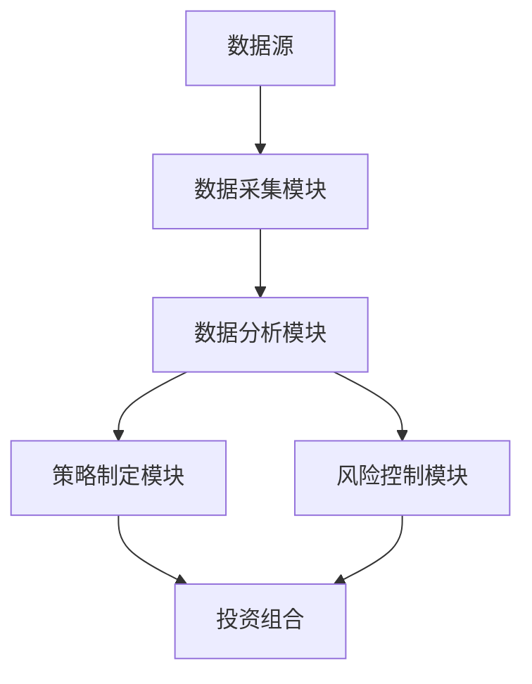

                 


# 彼得林奇的"反周期"投资在新兴与成熟市场间的配置策略

## 关键词：反周期投资，彼得林奇，新兴市场，成熟市场，投资策略，市场周期

## 摘要：  
本文深入探讨了彼得林奇的反周期投资理念，并分析了在新兴市场和成熟市场之间的配置策略。通过详细阐述市场周期的定义、特点以及两者之间的差异，结合数学建模和算法优化，为投资者提供了科学的投资决策依据。文章还通过实际案例和系统设计，展示了如何在不同市场环境下应用反周期投资策略，以实现长期稳健的投资收益。

---

## 第一部分：反周期投资概述

### 第1章：反周期投资的核心理念

#### 1.1 反周期投资的定义与特点  
反周期投资是一种在市场低谷期投资、在市场高峰期退出的投资策略。其核心理念是通过识别市场周期的波动，抓住低估值资产的投资机会，规避市场高点的风险。反周期投资的特点包括：  
- **逆向思维**：在市场恐慌时买入，在市场狂热时卖出。  
- **价值导向**：关注资产的内在价值，而非市场的短期波动。  
- **长期视角**：反周期投资注重资产的长期表现，而非短期收益。  

#### 1.2 彼得·林奇的投资理念  
彼得·林奇是反周期投资的代表人物之一。他强调：  
- **选股优先于选时**：彼得林奇认为，选择优质的资产是投资成功的关键。  
- **关注基本面**：他注重企业的财务状况、盈利能力和发展前景。  
- **逆周期布局**：在市场低谷期，彼得林奇倾向于投资那些被市场低估的优质资产。  

---

### 第2章：新兴市场与成熟市场的定义与特点  

#### 2.1 新兴市场的定义与特点  
新兴市场是指那些经济发展迅速、市场机制逐步完善但尚未成熟的国家或地区的金融市场。其特点包括：  
- **高增长性**：新兴市场的GDP增速通常高于成熟市场。  
- **高波动性**：新兴市场的股市和汇市波动较大。  
- **外部依赖性**：新兴市场往往依赖外部资本和技术。  

#### 2.2 成熟市场的定义与特点  
成熟市场是指那些经济稳定、市场机制完善、企业运作规范的国家或地区的金融市场。其特点包括：  
- **稳定性**：成熟市场的波动较小，市场参与者行为理性。  
- **防御性**：在经济衰退时，成熟市场的防御性行业（如公用事业、医疗保健）表现相对稳定。  
- **创新性**：成熟市场的企业创新能力较强，研发投入较高。  

---

## 第二部分：反周期投资策略的核心概念  

### 第3章：反周期投资的市场周期分析  

#### 3.1 市场周期的定义与阶段划分  
市场周期通常分为四个阶段：  
1. **复苏期**：市场从底部开始逐步回升。  
2. **上升期**：市场持续上涨，投资者情绪乐观。  
3. **高峰期**：市场达到顶点，投资者情绪极度乐观。  
4. **衰退期**：市场开始下跌，投资者情绪恐慌。  

#### 3.2 反周期投资的时机选择  
反周期投资的核心在于在市场周期的底部阶段布局，在顶部阶段退出。  
- **底部阶段**：市场估值处于历史低位，资产价格被低估。  
- **顶部阶段**：市场估值远高于历史平均水平，资产价格被高估。  

---

### 第4章：新兴与成熟市场的周期性对比  

#### 4.1 新兴市场的周期性特点  
- **波动性**：新兴市场的周期波动较大，受全球经济环境的影响显著。  
- **成长性**：新兴市场的成长性高于成熟市场，但风险也更高。  
- **外部依赖性**：新兴市场容易受到外部经济波动的冲击。  

#### 4.2 成熟市场的周期性特点  
- **稳定性**：成熟市场的周期波动较小，市场参与者行为较为理性。  
- **防御性**：在经济衰退时，成熟市场的防御性行业表现相对稳定。  
- **创新性**：成熟市场的企业创新能力较强，研发投入较高。  

---

## 第三部分：反周期投资策略的数学模型与算法  

### 第5章：反周期投资的数学模型  

#### 5.1 市场周期的数学建模  
市场周期的波动可以用以下模型表示：  
$$ r_t = \alpha + \beta(r_{t-1}) + \epsilon_t $$  
其中，\( r_t \) 表示第 \( t \) 期的市场收益，\( \alpha \) 是均值，\( \beta \) 是回归系数，\( \epsilon_t \) 是误差项。  

#### 5.2 反周期投资的优化算法  
反周期投资的优化算法可以通过以下步骤实现：  
1. 数据采集：收集新兴市场和成熟市场的历史数据。  
2. 数据清洗：去除异常值，填补缺失值。  
3. 数据分析：计算市场估值指标（如市盈率、市净率）和市场情绪指标。  
4. 模型构建：基于均值回归模型，判断市场的周期位置。  
5. 投资决策：根据模型结果，制定投资策略。  

---

### 第6章：反周期投资策略的系统架构设计  

#### 6.1 系统功能设计  
- **数据采集模块**：负责采集新兴市场和成熟市场的历史数据。  
- **数据分析模块**：对数据进行清洗和分析，计算市场估值和情绪指标。  
- **策略制定模块**：基于模型结果，制定投资策略。  
- **风险控制模块**：监控市场风险，调整投资组合。  

#### 6.2 系统架构设计  
以下是系统的架构图：



---

### 第7章：反周期投资策略的项目实战  

#### 7.1 环境安装  
- **工具安装**：安装Python、Pandas、Matplotlib等工具。  
- **数据源**：获取新兴市场和成熟市场的历史数据。  

#### 7.2 核心实现代码  
以下是反周期投资策略的核心代码示例：

```python
import pandas as pd
import matplotlib.pyplot as plt

# 数据加载
data = pd.read_csv('market_data.csv')

# 数据清洗
data.dropna()  # 去除缺失值
data = data[~data['value'].isnull()]  # 去除异常值

# 数据分析
data['PE'] = data['市盈率']
data['PB'] = data['市净率']
data['情绪指标'] = data['市场情绪']

# 反周期投资策略
def 反周期策略(data):
    data['投资建议'] = '买入'  # 默认建议
    data.loc[data['PE'] > 15, '投资建议'] = '卖出'
    return data

result = 反周期策略(data)
print(result)
```

---

### 第8章：最佳实践与注意事项  

#### 8.1 最佳实践  
- **风险管理**：在市场低谷期，适当增加防御性资产的配置。  
- **分散投资**：避免将所有资金投入单一市场或资产。  
- **持续学习**：关注市场动态，及时调整投资策略。  

#### 8.2 注意事项  
- **市场周期的不确定性**：市场周期的预测具有一定的难度，投资者需谨慎。  
- **情绪化投资**：避免因市场波动而做出情绪化决策。  
- **长期视角**：反周期投资需要耐心，市场复苏需要时间。  

---

## 结语  

彼得林奇的反周期投资策略在新兴与成熟市场间的配置，不仅需要对市场周期有深刻的理解，还需要结合具体的市场特点制定策略。通过科学的数学建模和系统的投资决策框架，投资者可以在不同市场环境下实现稳健的投资收益。

---

## 作者：AI天才研究院/AI Genius Institute & 禅与计算机程序设计艺术 /Zen And The Art of Computer Programming

