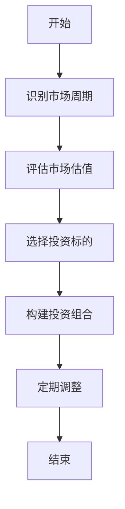
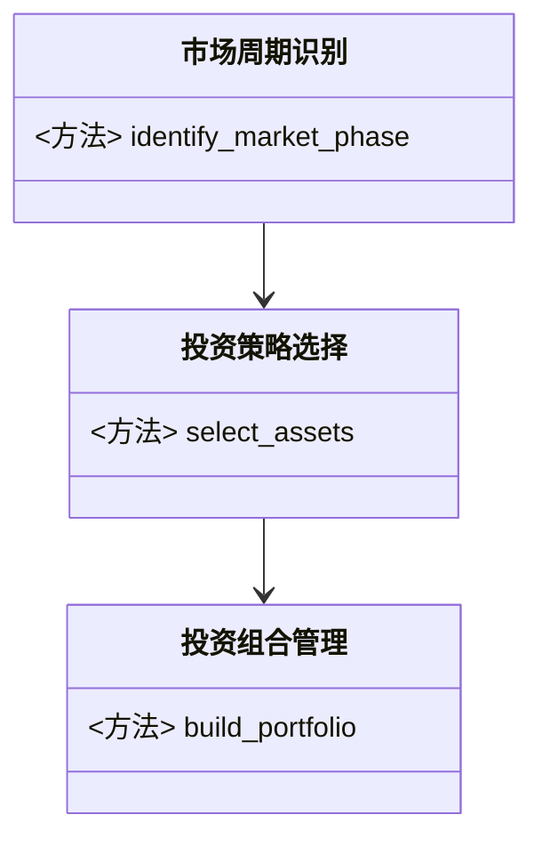

                 


# 彼得林奇的"反周期"投资在新兴市场与发达市场间的配置

## 关键词：
- 彼得·林奇
- 反周期投资
- 新兴市场
- 发达市场
- 投资策略

## 摘要：
本文将探讨彼得·林奇的反周期投资策略在新兴市场和发达市场中的配置与应用。通过分析市场周期、投资时机、投资组合构建等关键因素，结合实际案例和数学模型，为投资者提供系统的投资策略和方法。

---

# 第一部分: 引言

## 第1章: 反周期投资的基本概念与背景

### 1.1 反周期投资的定义与特点
#### 1.1.1 什么是反周期投资
反周期投资是一种在市场周期性波动中寻找投资机会的策略，与周期性投资相反，注重在市场低谷时买入，高点时卖出。

#### 1.1.2 反周期投资的核心特征
- 逆向思维：在市场低迷时寻找价值。
- 长期视角：关注长期趋势而非短期波动。
- 风险控制：通过分散投资降低风险。

#### 1.1.3 反周期投资与周期性投资的区别
| 特性 | 周期性投资 | 反周期投资 |
|------|------------|-------------|
| 时间选择 | 高点买入，低点卖出 | 低点买入，高点卖出 |
| 风险偏好 | 高风险偏好 | 低风险偏好 |
| 持股策略 | 短期操作 | 长期持有 |

### 1.2 彼得·林奇投资哲学的概述
#### 1.2.1 彼得·林奇的生平简介
彼得·林奇是美国著名投资者，以其在富达麦哲伦基金的卓越表现闻名，被誉为“共同基金之父”。

#### 1.2.2 彼得·林奇的投资理念
- 价值投资：寻找被市场低估的公司。
- 长期投资：避免频繁交易，关注公司基本面。
- 分散投资：通过多样化降低风险。

#### 1.2.3 彼得·林奇对反周期投资的贡献
林奇提出在市场低谷时投资优质公司，强调长期持有的理念。

### 1.3 新兴市场与发达市场的投资环境对比
#### 1.3.1 新兴市场的定义与特点
- 定义：经济快速增长，但制度不完善的国家。
- 特点：高增长潜力，高波动性。

#### 1.3.2 发达市场的定义与特点
- 定义：经济成熟，制度完善的国家。
- 特点：低波动性，高稳定性。

#### 1.3.3 两者在投资环境上的主要差异
- 市场波动性：新兴市场波动大，发达市场波动小。
- 投资风险：新兴市场高风险，发达市场低风险。
- 投资机会：新兴市场高增长，发达市场稳定增长。

---

## 第2章: 反周期投资的核心策略

### 2.1 反周期投资的基本原理
#### 2.1.1 市场周期的识别与分析
- 市场周期分为四个阶段：繁荣、衰退、萧条、复苏。
- 识别周期的方法：分析经济指标和市场数据。

#### 2.1.2 反周期投资的时机选择
- 在市场低谷时买入，在市场高点卖出。
- 关注宏观经济指标，如GDP增长率、失业率等。

#### 2.1.3 投资组合的构建与调整
- 分散投资：避免集中投资单一市场或资产。
- 定期调整：根据市场变化调整投资组合。

### 2.2 彼得·林奇的反周期投资策略
#### 2.2.1 林奇的市场分析方法
- 通过基本面分析寻找被低估的公司。
- 关注公司的财务状况和行业地位。

#### 2.2.2 林奇的投资组合管理策略
- 长期持有优质公司股票。
- 定期审视投资组合，及时调整。

#### 2.2.3 林奇对市场波动的应对策略
- 避免恐慌性抛售，坚持长期投资。
- 在市场恐慌时寻找投资机会。

### 2.3 反周期投资在不同市场中的应用
#### 2.3.1 新兴市场中的反周期投资策略
- 寻找被低估的新兴企业。
- 关注政策变化和经济指标。

#### 2.3.2 发达市场中的反周期投资策略
- 投资成熟企业的股票。
- 关注经济周期和政策变化。

#### 2.3.3 两者之间的异同点分析
- 相同点：寻找被低估的资产，长期投资。
- 不同点：新兴市场风险高，发达市场风险低。

---

## 第3章: 反周期投资的核心概念与联系

### 3.1 核心概念原理
#### 3.1.1 市场周期性与反周期性的关系
- 市场周期性：市场的波动性和周期性变化。
- 反周期性：与市场周期相反的投资策略。

### 3.2 核心概念的属性特征对比
| 特性 | 周期性投资 | 反周期投资 |
|------|------------|-------------|
| 时间选择 | 高点买入，低点卖出 | 低点买入，高点卖出 |
| 风险偏好 | 高风险偏好 | 低风险偏好 |
| 持股策略 | 短期操作 | 长期持有 |

### 3.3 实体关系图（ER图）
```mermaid
erDiagram
    class 市场周期 {
        <属性> 时间
        <属性> 指标
    }
    class 投资策略 {
        <属性> 时间选择
        <属性> 风险偏好
    }
    class 投资组合 {
        <属性> 资产
        <属性> 分散投资
    }
    市场周期 --> 投资策略 : 驱动
    投资策略 --> 投资组合 : 实施
```

---

## 第4章: 算法原理讲解

### 4.1 算法原理的数学模型
反周期投资的数学模型可以表示为：
$$
\text{投资收益} = \sum_{i=1}^{n} w_i \times r_i
$$
其中，\(w_i\) 是投资权重，\(r_i\) 是资产的收益。

### 4.2 算法实现步骤


### 4.3 核心代码实现
```python
def reverse_cycle_investment():
    # 识别市场周期
    market_phase = identify_market_phase()
    # 评估市场估值
    market_valuation = assess_valuation(market_phase)
    # 选择投资标的
    selected_assets = select_assets(market_valuation)
    # 构建投资组合
    portfolio = build_portfolio(selected_assets)
    # 定期调整
    adjusted_portfolio = adjust_portfolio(portfolio)
    return adjusted_portfolio

def identify_market_phase():
    # 分析经济指标和市场数据
    return "低谷" if market_data["指数"] < threshold else "高点"

def assess_valuation(phase):
    if phase == "低谷":
        return "低估"
    else:
        return "高估"

def select_assets(valuation):
    if valuation == "低估":
        return "新兴市场资产"
    else:
        return "发达市场资产"

def build_portfolio(selected_assets):
    # 分散投资
    return {"新兴市场": 0.6, "发达市场": 0.4}

def adjust_portfolio(portfolio):
    # 定期审视和调整
    return adjust_weights(portfolio)
```

---

## 第5章: 系统分析与架构设计方案

### 5.1 系统分析
- 问题场景：如何在新兴市场和发达市场中应用反周期投资策略。
- 项目介绍：构建一个反周期投资系统，实现市场周期识别、投资策略选择和投资组合管理。

### 5.2 系统功能设计
#### 5.2.1 领域模型


#### 5.2.2 系统架构


---

## 第6章: 项目实战

### 6.1 环境安装
- 数据源：市场数据、经济指标。
- 工具：Python、数据分析库（Pandas、NumPy）。

### 6.2 核心代码实现
```python
import pandas as pd
import numpy as np

def main():
    data = pd.read_csv("market_data.csv")
    phases = identify_market_phase(data)
    assets = select_assets(phases)
    portfolio = build_portfolio(assets)
    print("投资组合:", portfolio)

if __name__ == "__main__":
    main()
```

### 6.3 案例分析
- 新兴市场案例：投资科技公司。
- 发达市场案例：投资金融公司。

---

## 第7章: 最佳实践与总结

### 7.1 最佳实践
- 定期审视投资组合。
- 避免过度交易。
- 保持长期视角。

### 7.2 小结
反周期投资是一种有效的投资策略，尤其是在新兴市场和发达市场中应用广泛。通过彼得·林奇的投资哲学，投资者可以在不同市场中找到合适的投资机会。

### 7.3 注意事项
- 风险控制：分散投资，避免集中风险。
- 市场分析：关注宏观经济指标和市场数据。

### 7.4 拓展阅读
- 《彼得·林奇的成功投资》
- 《反周期投资策略》

---

## 作者：AI天才研究院/AI Genius Institute & 禅与计算机程序设计艺术 /Zen And The Art of Computer Programming

