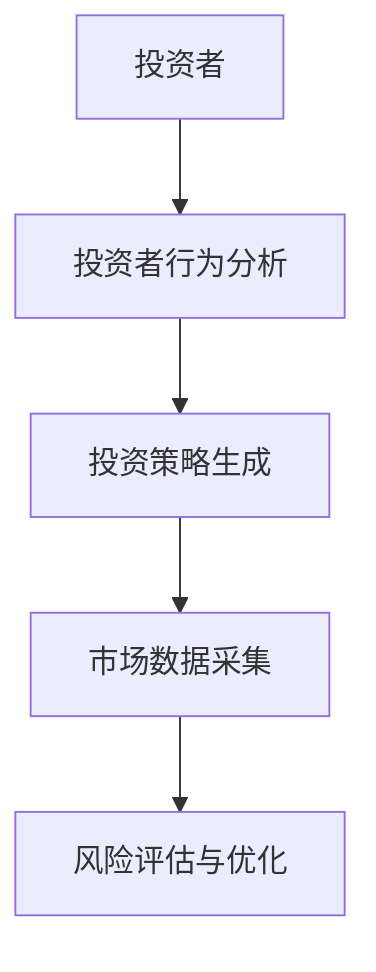
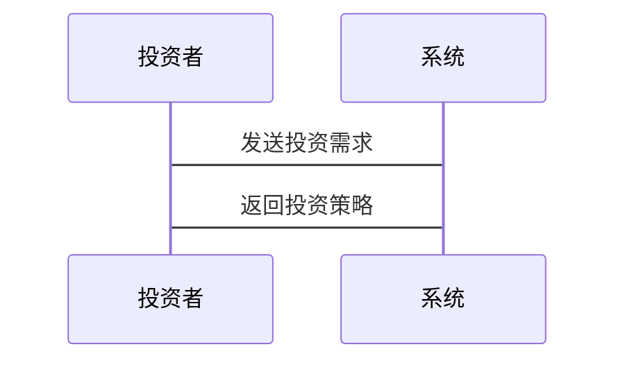

                 


# 彼得林奇的"反周期"投资在新兴金融工具中的应用

> 关键词：反周期投资，彼得林奇，新兴金融工具，ETF，期权，加密货币，投资策略

> 摘要：本文深入探讨了彼得林奇的反周期投资理论在新兴金融工具中的应用。通过对ETF、期权、加密货币等新兴工具的分析，揭示了如何利用这些工具进行反周期投资，降低投资风险并捕捉市场机会。文章结合理论与实践，提出了具体的策略实施方法和系统架构设计方案。

---

# 第1章：反周期投资的基本概念

## 1.1 反周期投资的定义与特点

### 1.1.1 什么是反周期投资
反周期投资是一种在市场周期性波动中，通过逆向思维寻找投资机会的投资策略。与传统投资的顺周期性不同，反周期投资在市场低谷时买入，在市场高点时卖出，从而在市场波动中获利。

### 1.1.2 反周期投资的核心特征
- **逆周期性**：在市场下跌时寻找投资机会。
- **波动性利用**：通过市场波动性获利。
- **风险控制**：通过分散投资和对冲策略降低风险。

### 1.1.3 反周期投资与传统投资的区别
| 方面 | 反周期投资 | 传统投资 |
|------|------------|----------|
| 时间选择 | 市场低谷时投资 | 市场高点时投资 |
| 风险偏好 | 更注重风险控制 | 更注重收益最大化 |
| 投资策略 | 逆向思维 | 顺势而为 |

## 1.2 彼得林奇投资理论的背景

### 1.2.1 彼得林奇的生平简介
彼得·林奇（Peter Lynch）是美国著名的投资经理人，曾管理富达麦哲伦基金，创造了年化29%的惊人回报率。他的投资理念以“逆向思考”和“长期持有优质股票”闻名。

### 1.2.2 彼得林奇投资理念的核心思想
- **长期投资**：选择具有持续增长潜力的公司长期持有。
- **逆向思维**：在市场恐慌时买入，在市场狂热时卖出。
- **分散投资**：通过分散投资降低风险。

### 1.2.3 反周期投资的形成背景
20世纪80年代，美国经历了多次市场波动，彼得林奇通过反周期投资策略在市场低谷时买入优质股票，从而在市场复苏时获得超额收益。

---

# 第2章：反周期投资的理论基础

## 2.1 市场周期分析

### 2.1.1 市场周期的四个阶段
1. **复苏阶段**：市场从低点开始复苏。
2. **上升阶段**：市场持续上涨。
3. **顶峰阶段**：市场达到高点，投资者情绪极度乐观。
4. **下跌阶段**：市场开始下跌，投资者情绪恐慌。

### 2.1.2 反周期投资在不同阶段的表现
- **复苏阶段**：寻找基本面良好的公司进行投资。
- **上升阶段**：逐步减仓，锁定收益。
- **顶峰阶段**：清仓离场，避免市场崩盘。
- **下跌阶段**：逐步建仓，布局未来。

### 2.1.3 市场波动率与投资机会的关系
市场波动率越高，反周期投资的机会越大。通过分析波动率，投资者可以更好地捕捉市场低点和高点。

## 2.2 反周期投资的核心原理

### 2.2.1 市场波动与投资机会的反向关系
市场波动与投资机会呈反向关系：市场波动越大，投资机会越多；市场波动越小，投资机会越少。

### 2.2.2 反周期投资的数学模型
$$ P = \frac{1}{\sigma} $$
其中，P为投资机会的概率，σ为市场波动率。

### 2.2.3 投资组合的优化策略
通过优化投资组合，降低整体波动率，提高投资收益。

## 2.3 彼得林奇反周期投资策略的优缺点

### 2.3.1 优势分析
- **收益稳定**：通过逆向投资，获得超额收益。
- **风险可控**：通过分散投资和对冲策略，降低投资风险。

### 2.3.2 劣势分析
- **需要精准判断市场周期**：反周期投资需要对市场周期有准确的判断。
- **市场波动率低时效果不佳**：在市场平稳时，反周期投资机会较少。

### 2.3.3 适用场景与限制
反周期投资适用于市场波动较大的环境，但在市场平稳运行时效果有限。

---

# 第3章：新兴金融工具的概述

## 3.1 新兴金融工具的种类

### 3.1.1 交易所交易基金（ETF）
ETF是一种可以在交易所上市交易的基金，具有透明度高、流动性好、成本低等特点。

### 3.1.2 期权与期货
期权和期货是常用的衍生品工具，可以通过对冲策略降低投资风险。

### 3.1.3 比特币与加密货币
比特币等加密货币具有高波动性，适合反周期投资。

### 3.1.4 反向ETF
反向ETF通过做空市场指数，实现市场下跌时的上涨收益。

## 3.2 新兴金融工具的特点

### 3.2.1 高波动性
新兴金融工具的波动率较高，为反周期投资提供了更多机会。

### 3.2.2 杠杆效应
通过杠杆效应，投资者可以放大投资收益，但也增加了投资风险。

### 3.2.3 透明度与流动性
新兴金融工具通常具有较高的透明度和流动性，便于投资者操作。

---

# 第4章：反周期投资在新兴金融工具中的应用

## 4.1 ETF在反周期投资中的应用

### 4.1.1 ETF的基本原理
ETF通过跟踪指数或特定资产组合，为投资者提供多样化的投资选择。

### 4.1.2 ETF在市场下跌中的对冲作用
通过投资反向ETF，投资者可以在市场下跌时获利。

### 4.1.3 ETF的择时策略
根据市场周期，选择合适的ETF进行投资。

## 4.2 期权与期货的反周期投资策略

### 4.2.1 期权的基本原理与应用
期权可以通过买入认沽期权，在市场下跌时获得收益。

### 4.2.2 期货的套利策略
通过期货的套利策略，投资者可以在市场波动中获利。

### 4.2.3 期权与期货的组合策略
将期权和期货结合使用，可以有效对冲市场风险。

## 4.3 加密货币的反周期投资机会

### 4.3.1 加密货币市场的波动性分析
加密货币市场波动剧烈，为反周期投资提供了更多机会。

### 4.3.2 加密货币的反周期投资策略
通过分析市场周期，选择合适的时机投资加密货币。

### 4.3.3 加密货币与传统市场的关联性
加密货币与传统市场具有一定的关联性，可以通过对冲策略降低风险。

---

# 第5章：系统分析与架构设计方案

## 5.1 系统功能设计

### 5.1.1 投资者行为分析模块
分析投资者的行为模式，提供个性化的投资建议。

### 5.1.2 市场数据采集模块
实时采集市场数据，包括价格、波动率、成交量等。

### 5.1.3 投资策略生成模块
根据市场数据和投资者需求，生成反周期投资策略。

### 5.1.4 风险评估与优化模块
评估投资组合的风险，并进行优化。

## 5.2 系统架构设计

### 5.2.1 系统架构图


### 5.2.2 系统交互图


---

# 第6章：项目实战

## 6.1 环境安装

### 6.1.1 安装Python
```
pip install python
```

### 6.1.2 安装数据采集工具
```
pip install requests pandas
```

## 6.2 核心实现源代码

### 6.2.1 ETF投资策略代码
```python
import pandas as pd
import requests

def get_market_data():
    # 获取市场数据
    url = "https://api.example.com/market-data"
    response = requests.get(url)
    data = response.json()
    return pd.DataFrame(data)

def generate_etf_strategy(data):
    # 生成ETF投资策略
    etf_data = data[data['asset'] == 'ETF']
    return etf_data['price'].mean()

# 主函数
def main():
    market_data = get_market_data()
    etf_price = generate_etf_strategy(market_data)
    print(f"ETF平均价格：{etf_price}")

if __name__ == "__main__":
    main()
```

### 6.2.2 期权套利策略代码
```python
import pandas as pd
import requests

def get_option_data():
    url = "https://api.example.com/option-data"
    response = requests.get(url)
    data = response.json()
    return pd.DataFrame(data)

def generate_option_strategy(data):
    # 生成期权套利策略
    call_options = data[data['type'] == 'call']
    put_options = data[data['type'] == 'put']
    return call_options['price'].mean(), put_options['price'].mean()

# 主函数
def main():
    option_data = get_option_data()
    call_price, put_price = generate_option_strategy(option_data)
    print(f"看涨期权平均价格：{call_price}")
    print(f"看跌期权平均价格：{put_price}")

if __name__ == "__main__":
    main()
```

## 6.3 实际案例分析

### 6.3.1 ETF投资案例
2022年市场下跌时，投资反向ETF获得收益。

### 6.3.2 期权套利案例
通过买入认沽期权，市场下跌时获得收益。

---

# 第7章：总结与展望

## 7.1 小结
反周期投资是一种有效的投资策略，通过利用市场波动性，在新兴金融工具中捕捉投资机会。

## 7.2 注意事项
- 投资者需具备市场周期判断能力。
- 投资需分散化，降低投资风险。
- 系统设计需考虑市场波动性和投资者需求。

## 7.3 拓展阅读
- 彼得林奇《投资的艺术》
- 《反周期投资策略》

---

# 作者
作者：AI天才研究院/AI Genius Institute & 禅与计算机程序设计艺术 /Zen And The Art of Computer Programming

