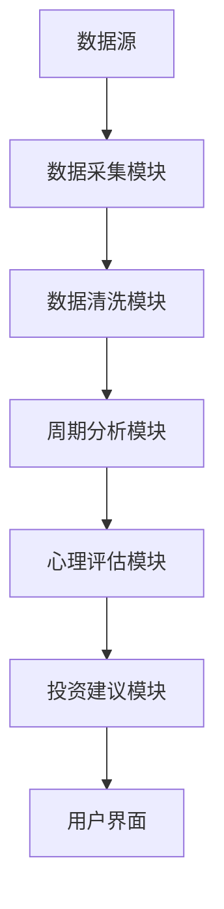
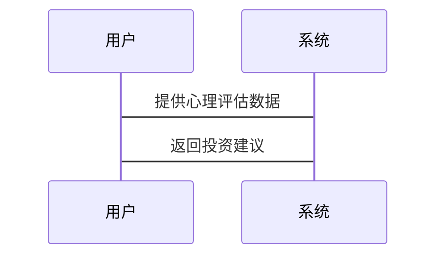

                 


# 彼得林奇的"反周期"投资心理建设

## 关键词：彼得林奇，反周期，投资心理，市场周期，投资者心理

## 摘要：本文深入探讨了彼得林奇的反周期投资策略，分析了市场周期与投资者心理之间的关系，结合数学模型和系统设计，提供了实用的心理建设方法，帮助投资者在不同市场阶段保持理性决策。

---

## 第1章 反周期投资概述

### 1.1 什么是反周期投资

#### 1.1.1 投资周期的基本概念
投资周期指的是市场在不同时间段内经历的涨跌循环。通常包括牛市、熊市、震荡市等阶段。

#### 1.1.2 反周期投资的定义与特点
反周期投资是指在市场周期性波动中，采取与市场趋势相反的策略进行投资。其特点是逆市而行，寻找低估资产，在市场低谷时买入，高点卖出。

#### 1.1.3 反周期投资的核心目标
通过识别市场周期的低点和高点，利用价格波动差异，实现超额收益。

### 1.2 彼得林奇的投资理念

#### 1.2.1 彼得林奇的投资风格概述
彼得林奇以其长期投资和逆向思维著称，强调深入研究和长期持有优质资产。

#### 1.2.2 彼得林奇的市场周期观
他认为市场周期是不可避免的，投资者应识别周期变化，在市场低谷时抓住机会。

#### 1.2.3 彼得林奇的反周期策略
关注被市场低估的资产，长期持有，耐心等待市场回归理性。

### 1.3 市场周期与投资心理

#### 1.3.1 市场周期的四个阶段
1. **牛市阶段**：市场情绪高涨，投资者贪婪。
2. **震荡阶段**：市场波动加剧，投资者犹豫。
3. **熊市阶段**：市场恐慌，投资者恐惧。
4. **底部阶段**：市场超跌，投资者理性回归。

#### 1.3.2 不同周期阶段下的投资者心理
- **牛市**：贪婪和乐观主导。
- **熊市**：恐慌和悲观主导。
- **震荡市**：犹豫和观望主导。

#### 1.3.3 心理波动对投资决策的影响
心理偏差如过度乐观和恐惧可能导致错误决策，影响投资收益。

### 1.4 本章小结
反周期投资需要理解市场周期和投资者心理，彼得林奇的成功在于其逆向思维和长期视角。

---

## 第2章 投资者心理与市场周期

### 2.1 投资者心理分析

#### 2.1.1 投资者心理的基本构成
投资者心理包括认知、情绪和行为三个层面。

#### 2.1.2 不同类型投资者的心理特征
- **激进型**：高风险承受能力，追求高收益。
- **保守型**：厌恶风险，偏好稳定收益。

#### 2.1.3 心理偏差对投资决策的影响
- **确认偏差**：只关注支持自己观点的信息。
- **损失厌恶**：对损失的厌恶影响决策。

### 2.2 市场周期与心理波动的关系

#### 2.2.1 牛市中的贪婪与恐惧
市场上涨时贪婪，下跌时恐惧，导致非理性决策。

#### 2.2.2 熊市中的恐慌与理性
恐慌情绪可能导致抛售，但理性分析能找到机会。

#### 2.2.3 震荡市中的犹豫与观望
市场波动加剧，投资者犹豫不决，影响决策效率。

### 2.3 彼得林奇的反周期心理策略

#### 2.3.1 逆市场心理的投资策略
避免随大流，寻找低估资产。

#### 2.3.2 投资者心理的自我调节
保持冷静，避免情绪化决策。

#### 2.3.3 心理定力的培养方法
通过阅读和实践，培养长期投资的耐心。

### 2.4 本章小结
投资者心理是反周期投资的关键，克服心理偏差，保持理性是成功的关键。

---

## 第3章 市场周期预测的数学模型

### 3.1 时间序列分析

#### 3.1.1 时间序列的基本概念
时间序列是指按时间顺序排列的数据，用于预测未来趋势。

#### 3.1.2 常见的时间序列模型
- **ARIMA模型**：广泛应用于市场预测。
- **GARCH模型**：用于估计波动性。

#### 3.1.3 如何利用时间序列预测市场周期
通过历史数据分析，识别周期性模式，预测未来趋势。

### 3.2 机器学习在市场周期预测中的应用

#### 3.2.1 机器学习的基本原理
通过数据训练模型，识别复杂模式。

#### 3.2.2 常见的机器学习算法
- **支持向量机（SVM）**：分类能力强。
- **随机森林**：适用于特征工程。

#### 3.2.3 如何构建市场周期预测模型
数据预处理、特征选择、模型训练、评估与优化。

### 3.3 彼得林奇反周期策略的数学公式

#### 3.3.1 投资组合优化的数学模型
$$ \text{目标函数：最大化收益} \quad \text{约束条件：风险可控} $$

#### 3.3.2 风险与收益的数学关系
收益与风险呈正相关，可通过优化模型找到平衡点。

#### 3.3.3 心理波动的量化
通过心理指标量化投资者情绪，辅助市场预测。

### 3.4 本章小结
数学模型为反周期投资提供了科学依据，结合心理分析能提高预测准确性。

---

## 第4章 投资决策支持系统

### 4.1 系统功能设计

#### 4.1.1 系统功能模块划分
- **数据采集**：收集市场数据。
- **周期分析**：识别市场周期。
- **心理评估**：评估投资者心理状态。

#### 4.1.2 每个模块的功能描述
- 数据采集：从多种来源获取实时数据。
- 周期分析：使用算法识别周期阶段。
- 心理评估：通过问卷和数据分析评估心理状态。

#### 4.1.3 系统功能的实现流程
数据采集 → 数据清洗 → 周期分析 → 心理评估 → 输出建议。

### 4.2 系统架构设计

#### 4.2.1 系统架构图


#### 4.2.2 系统架构设计
采用分层架构，数据层、业务逻辑层和表现层清晰分离。

### 4.3 系统接口设计

#### 4.3.1 接口描述
- 数据接口：与数据源连接，获取实时数据。
- 用户接口：提供输入和输出，与用户交互。

### 4.4 系统交互流程图



### 4.5 本章小结
投资决策支持系统为反周期投资提供了科学依据，帮助投资者做出理性决策。

---

## 第5章 项目实战

### 5.1 环境安装

#### 5.1.1 安装Python和相关库
- 安装Python 3.8+
- 安装库：pandas, numpy, matplotlib, scikit-learn

### 5.2 核心实现源代码

#### 5.2.1 时间序列预测代码
```python
from statsmodels.tsa.arima_model import ARIMA
import pandas as pd
import numpy as np

# 加载数据
data = pd.read_csv('market_data.csv')

# 拆分训练集和测试集
train_data = data['price'][:80]
test_data = data['price'][80:]

# 训练ARIMA模型
model = ARIMA(train_data, order=(5,1,0))
model_fit = model.fit()

# 预测未来值
forecast = model_fit.forecast(steps=len(test_data))
```

#### 5.2.2 机器学习模型实现
```python
from sklearn.ensemble import RandomForestClassifier
from sklearn.metrics import accuracy_score

# 加载数据
data = pd.read_csv('market_data.csv')

# 特征工程
X = data.drop('label', axis=1)
y = data['label']

# 训练模型
model = RandomForestClassifier()
model.fit(X, y)

# 预测
y_pred = model.predict(X)
print("准确率:", accuracy_score(y, y_pred))
```

### 5.3 实际案例分析

#### 5.3.1 案例背景
假设2020年疫情后的市场，寻找低估资产。

#### 5.3.2 数据分析
使用上述模型分析市场周期，识别低估资产。

### 5.4 详细讲解与分析
通过实际案例，展示如何应用反周期策略，在市场低谷时买入，高点卖出。

### 5.5 本章小结
实际案例验证了反周期策略的有效性，帮助投资者在实践中应用。

---

## 第6章 最佳实践与小结

### 6.1 小结
反周期投资需要深入理解市场周期和投资者心理，结合数学模型和系统支持，制定科学的投资策略。

### 6.2 注意事项
- 避免情绪化决策。
- 定期评估和调整投资策略。
- 保持长期视角，耐心持有优质资产。

### 6.3 拓展阅读
推荐书籍和资源，帮助读者进一步学习反周期投资策略。

---

## 作者信息

作者：AI天才研究院 & 禅与计算机程序设计艺术

---

通过以上结构和内容，文章详细介绍了反周期投资的心理建设，结合彼得林奇的投资理念，提供了数学模型和系统设计的支持，帮助投资者在实际操作中应用这些策略。

