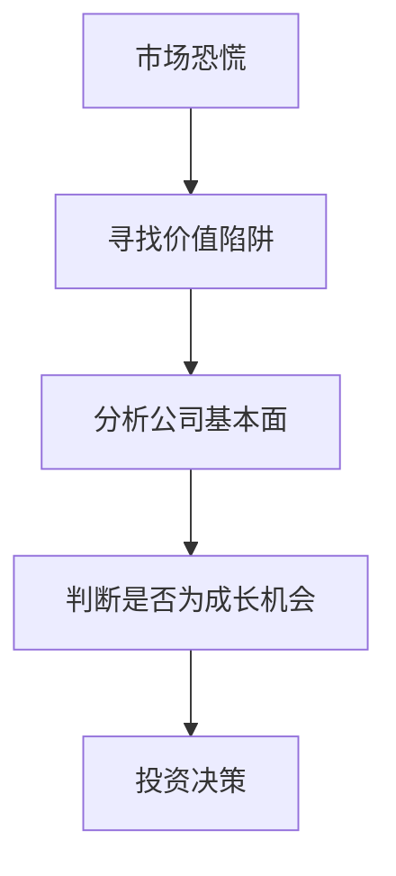
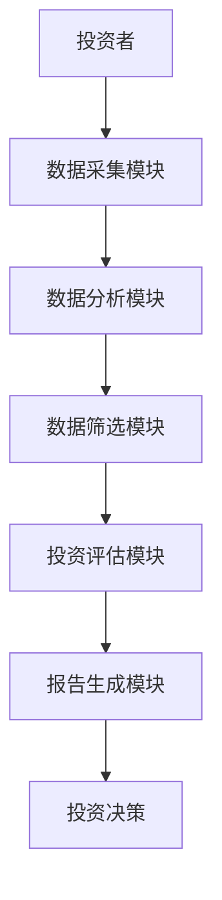

                 


```markdown
# 彼得林奇的"墓地投资法"

> 关键词：彼得林奇，投资策略，墓地投资法，价值陷阱，成长机会，市场周期，投资心理

> 摘要：本文深入分析了彼得林奇的“墓地投资法”，探讨其核心概念、算法原理、系统架构及实际应用。通过详细的案例分析和代码实现，揭示了该投资策略在实际操作中的应用价值和注意事项。

---

## 第1章：墓地投资法的背景与核心理念

### 1.1 投资市场的周期性与波动性
投资市场的周期性与波动性是投资者必须理解的基本概念。市场并非总是一直上涨，而是呈现周期性波动，包括牛市和熊市。在牛市中，投资者情绪高涨，市场价格被高估；在熊市中，市场恐慌，价格被低估。彼得林奇的“墓地投资法”正是基于这种市场周期性，寻找在市场低迷时期被忽视的投资机会。

#### 1.1.1 投资市场的基本周期
- 牛市：市场繁荣，投资者信心高涨，价格被高估。
- 熊市：市场恐慌，投资者抛售资产，价格被低估。
- 修正期：市场从牛市到熊市的过渡阶段，价格逐渐回归合理。

#### 1.1.2 市场波动的规律与特征
- 市场波动具有周期性，平均周期约为4-7年。
- 在市场恐慌时，投资者情绪往往主导价格，而非基本面因素。
- 市场波动与经济基本面密切相关，但短期波动可能与经济基本面脱节。

#### 1.1.3 墓地投资法的起源与背景
彼得林奇是著名的投资专家，他在职业生涯中总结出一套在市场低迷时期寻找投资机会的方法，即“墓地投资法”。这种方法的核心在于在市场恐慌时，许多优质资产被低价抛售，为投资者提供了买入的机会。

### 1.2 墓地投资法的核心理念
墓地投资法的核心理念是逆向投资，即在市场恐慌时寻找被低估的资产，而不是在市场繁荣时追逐高价资产。

#### 1.2.1 价值投资的基本原则
- 投资于具有强大基本面的公司。
- 在市场恐慌时，许多优质资产被低估，提供了买入的机会。
- 避免短期市场波动的影响，长期持有优质资产。

#### 1.2.2 市场恐慌与投资机会
- 市场恐慌时，投资者情绪低落，许多资产价格被低估。
- 此时是寻找价值陷阱和成长机会的最佳时机。

#### 1.2.3 墓地投资法的定义与特点
- 定义：在市场恐慌时，寻找被低估的资产进行投资。
- 特点：逆向投资，注重基本面分析，长期持有。

## 第2章：墓地投资法的核心概念与联系

### 2.1 核心概念原理
墓地投资法的核心概念在于区分价值陷阱和成长机会。

#### 2.1.1 价值陷阱与成长机会的对比
- 价值陷阱：表面价值高，实际价值低，市场恐慌时被抛售。
- 成长机会：表面价值低，实际价值高，市场恐慌时被忽视。

#### 2.1.2 核心概念属性特征对比表格
| 属性       | 价值陷阱                     | 成长机会                     |
|------------|------------------------------|------------------------------|
| 定义       | 表面价值高，实际价值低         | 表面价值低，实际价值高       |
| 市场表现   | 市场恐慌时被抛售，价格低于价值 | 市场低迷时被忽视，价格低于价值 |
| 投资策略   | 避免投资，等待价值回归         | 逆势投资，长期持有             |

#### 2.1.3 ER实体关系图
```mermaid
entity 投资者
entity 市场
entity 价值陷阱
entity 成长机会
```

## 第3章：墓地投资法的算法原理与数学模型

### 3.1 投资策略算法流程图


### 3.2 投资策略的数学模型
墓地投资法的数学模型基于CAPM（资本资产定价模型），用于评估资产的预期收益与风险。

#### 3.2.1 CAPM公式
$$ E(r_i) = r_f + \beta_i (E(r_m) - r_f) $$
其中：
- \( E(r_i) \)：资产i的预期收益率
- \( r_f \)：无风险利率
- \( \beta_i \)：资产i的beta系数
- \( E(r_m) \)：市场预期收益率
- \( r_f \)：无风险利率

#### 3.2.2 Python代码实现
```python
import pandas as pd
import numpy as np

# 示例数据：假设我们有几只股票的beta系数和市场预期收益率
beta = [1.2, 0.8, 1.5]
rf = 0.02
rm = 0.1

expected_return = [rf + b * (rm - rf) for b in beta]
print(expected_return)
```

### 3.3 投资策略的Python代码实现
```python
import pandas as pd
import numpy as np

# 示例数据：假设我们有几只股票的基本面数据和市场表现
data = {
    '公司名称': ['公司A', '公司B', '公司C'],
    '市值': [100, 200, 150],
    '净利润': [50, 60, 40],
    '行业': ['科技', '金融', '消费']
}

df = pd.DataFrame(data)

# 判断是否为成长机会
def is_growth_opportunity(row):
    if row['净利润'] > row['市值'] * 0.05:
        return '是'
    else:
        return '否'

df['成长机会'] = df.apply(is_growth_opportunity, axis=1)
print(df)
```

## 第4章：系统分析与架构设计

### 4.1 问题场景介绍
在当前市场环境下，许多投资者在市场波动时难以做出正确的决策。通过系统化的分析，我们可以帮助投资者识别价值陷阱和成长机会。

### 4.2 系统功能设计
- 数据采集：收集市场数据和公司基本面数据。
- 数据分析：使用算法识别价值陷阱和成长机会。
- 数据筛选：筛选出符合条件的资产。
- 投资评估：评估投资机会的预期收益和风险。
- 报告生成：生成投资报告，指导投资决策。

### 4.3 系统架构设计


## 第5章：项目实战与案例分析

### 5.1 环境安装
需要安装的库包括pandas和numpy。

### 5.2 核心实现
```python
import pandas as pd
import numpy as np

# 示例数据：假设我们有几只股票的基本面数据和市场表现
data = {
    '公司名称': ['公司A', '公司B', '公司C'],
    '市值': [100, 200, 150],
    '净利润': [50, 60, 40],
    '行业': ['科技', '金融', '消费']
}

df = pd.DataFrame(data)

# 判断是否为成长机会
def is_growth_opportunity(row):
    if row['净利润'] > row['市值'] * 0.05:
        return '是'
    else:
        return '否'

df['成长机会'] = df.apply(is_growth_opportunity, axis=1)
print(df)
```

### 5.3 案例分析
通过分析具体案例，我们可以看到墓地投资法在实际操作中的应用。

## 第6章：最佳实践与总结

### 6.1 总结
墓地投资法是一种有效的投资策略，但需要结合市场环境和公司基本面进行分析。

### 6.2 注意事项
- 避免盲目跟风
- 保持长期视角
- 结合多种投资策略

### 6.3 扩展阅读
推荐相关书籍和文章，帮助读者深入理解投资策略。

---

作者：AI天才研究院/AI Genius Institute & 禅与计算机程序设计艺术 /Zen And The Art of Computer Programming
```

