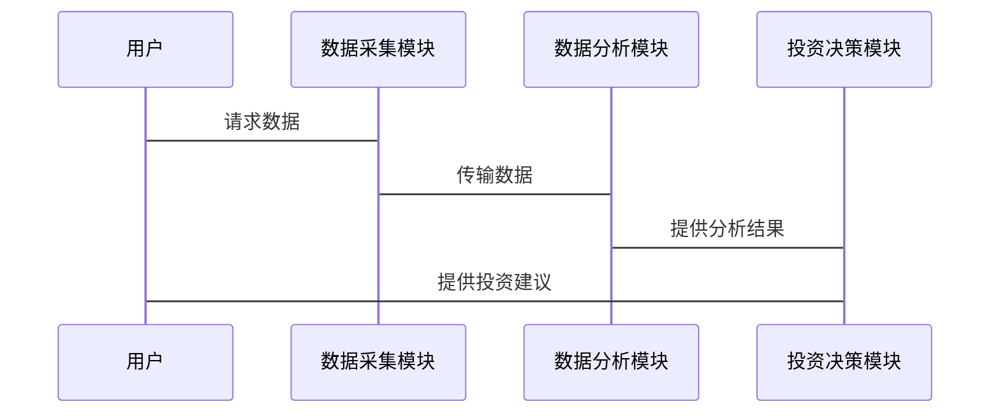

                 


# 彼得林奇的"实地调研"在虚拟经济时代的演变

## 关键词：虚拟经济、实地调研、投资策略、数据挖掘、机器学习

## 摘要：本文探讨了彼得林奇传统的实地调研方法在虚拟经济环境下的演变，分析了虚拟经济的特点及其对传统调研方法的影响，提出了基于数据挖掘和机器学习的虚拟经济实地调研新方法，详细讲解了算法原理、系统架构设计、项目实战案例，并总结了最佳实践。

---

## 第1章：彼得林奇的实地调研方法

### 1.1 实地调研的定义与核心要素

实地调研是投资决策中的重要环节，涉及对目标公司、行业及市场的深入考察。核心要素包括：

- 数据来源：公司财报、管理层访谈、行业报告等。
- 数据处理：收集、整理、分析数据，识别关键指标。
- 调研工具：财务模型、行业分析框架等。

### 1.2 虚拟经济的定义与特点

虚拟经济是以数字化资产和虚拟货币为基础的经济体系，具有以下特点：

- 数据驱动：交易活动基于大数据和算法。
- 实时性：虚拟市场的波动快速且频繁。
- 去中心化：部分虚拟经济活动依赖区块链等去中心化技术。

### 1.3 传统调研方法在虚拟经济中的局限性

- 数据复杂性：虚拟经济中的数据量大且动态性强，传统方法难以处理。
- 信息不对称：虚拟市场中的信息透明度低，增加了调研难度。
- 工具局限性：传统调研工具难以适应虚拟经济的快速变化。

---

## 第2章：虚拟经济中的实地调研

### 2.1 虚拟经济中的实地调研定义

在虚拟经济中，实地调研通过数据挖掘和算法分析，评估虚拟资产的真实价值。其核心在于从海量数据中提取有效信息，辅助投资决策。

### 2.2 虚拟经济中的实地调研特点

- 数据虚拟性：依赖数字资产和虚拟货币的数据。
- 信息不对称：虚拟市场的信息分布不均。
- 工具多样性：结合大数据分析、人工智能等技术。

### 2.3 虚拟经济中的实地调研与传统调研对比

| 对比维度 | 传统调研 | 虚拟经济中的调研 |
|----------|----------|-----------------|
| 数据来源 | 线下数据 | 线上数据       |
| 数据处理 | 人工为主 | 以算法为主      |
| 工具 | 财务模型 | 数据挖掘、机器学习 |

### 2.4 虚拟经济中的实地调研在投资中的价值

通过虚拟经济中的实地调研，投资者可以实时分析市场动态，识别投资机会，降低风险。

---

## 第3章：虚拟经济中的实地调研算法

### 3.1 算法概述

虚拟经济中的实地调研算法通过数据挖掘和机器学习，分析虚拟资产的市场行为。其核心步骤包括数据采集、清洗、建模和预测。

### 3.2 算法实现

```python
def virtual_survey():
    data = collect_data()
    cleaned_data = preprocess(data)
    model = build_model(cleaned_data)
    prediction = predict(model)
    return prediction
```

### 3.3 数学模型与公式

- 数据清洗公式：
  $$\text{cleaned\_data} = \frac{\text{original\_data}}{\text{outlier\_factor}}$$
  
- 预测模型：
  $$\text{predicted\_price} = \beta_0 + \beta_1 \times \text{market\_trend} + \epsilon$$

---

## 第4章：虚拟经济中的实地调研系统

### 4.1 系统架构设计

系统架构包括数据采集模块、数据分析模块和投资决策模块，各模块通过API进行交互。


### 4.2 系统交互设计



---

## 第5章：虚拟经济中的实地调研项目

### 5.1 项目概述

通过虚拟经济中的实地调研，分析数字资产的市场趋势，优化投资策略。

### 5.2 项目实战

案例分析：分析虚拟货币的价格波动，使用算法预测未来趋势。

---

## 第6章：总结与展望

### 6.1 最佳实践 tips

- 结合传统调研与虚拟调研方法，提高准确性。
- 定期更新算法模型，适应市场变化。

### 6.2 小结

虚拟经济中的实地调研是传统方法的延伸，通过数据挖掘和机器学习，为投资者提供更精准的支持。

### 6.3 注意事项

- 数据隐私风险需注意。
- 技术更新快，需持续学习。

### 6.4 拓展阅读

推荐阅读《数据挖掘实战》和《机器学习在金融中的应用》。

---

作者：AI天才研究院 & 禅与计算机程序设计艺术

