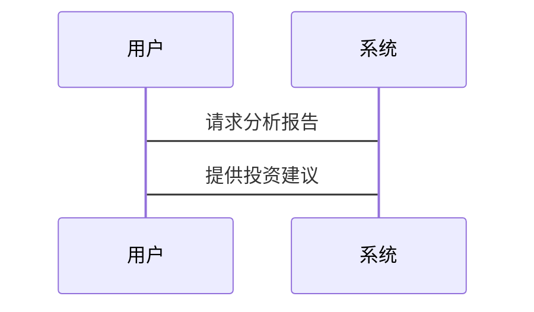

                 


# 彼得林奇的"实地调研"投资方法

## 关键词：投资方法，实地调研，彼得林奇，财务分析，投资策略，风险管理

## 摘要：本文深入探讨了彼得林奇的实地调研投资方法，分析了其核心概念、算法原理、系统架构，并通过实际案例展示其应用。文章结构清晰，逻辑严谨，语言专业，适合投资专业人士阅读。

---

## 第一部分：引言

### 第1章：投资的基本概念

#### 1.1 投资的定义与重要性

投资是指将资金投入某一领域，以期获得未来收益的行为。它在个人财务规划和经济发展中起着重要作用。投资不仅仅是资金的投入，更需要对市场、公司和经济环境有深刻的理解。

#### 1.2 为什么选择彼得林奇的投资方法

彼得·林奇是著名的投资专家，以其独特的实地调研方法闻名。他的方法强调深入研究公司基本面，寻找被市场低估的投资机会，这种方法在投资领域具有重要地位。

#### 1.3 投资的基本原则

- 长期投资：避免短期波动，关注公司长期价值。
- 风险管理：分散投资，控制风险。
- 深入研究：了解公司基本面，做出明智决策。

### 第2章：实地调研的重要性

#### 2.1 什么是实地调研

实地调研是通过亲自考察公司、与管理层交流、分析财务报表等方式，全面了解公司情况，评估其投资价值的方法。

#### 2.2 实地调研的核心要素

- 公司管理层：了解其能力和诚信。
- 财务状况：分析资产负债表、利润表和现金流量表。
- 行业地位：评估公司在行业中的位置和竞争优势。

#### 2.3 实地调研与投资的关系

实地调研是投资决策的基础，通过深入了解公司情况，投资者可以更准确地评估其价值，避免被市场情绪左右。

---

## 第二部分：实地调研的基本方法

### 第3章：如何进行公司调研

#### 3.1 公司调研的步骤

- 确定调研目标：明确调研的目的和范围。
- 收集公司信息：通过公开资料、行业报告等收集信息。
- 分析财务报表：评估公司的财务健康状况。

#### 3.2 财务报表分析

##### 3.2.1 资产负债表分析

通过分析资产负债表，评估公司的资产结构、负债情况和所有者权益。例如，计算资产负债率：

$$\text{资产负债率} = \frac{\text{总负债}}{\text{总资产}} \times 100\%$$

##### 3.2.2 利润表分析

分析收入、成本和利润，计算毛利率和净利润率：

$$\text{毛利率} = \frac{\text{营业收入} - \text{营业成本}}{\text{营业收入}} \times 100\%$$

$$\text{净利润率} = \frac{\text{净利润}}{\text{营业收入}} \times 100\%$$

##### 3.2.3 现金流量表分析

评估公司的现金流状况，确保公司有足够的现金流支持运营和发展。

#### 3.3 如何评估公司管理层

- 管理层的背景和经验：检查管理层的教育背景和工作经历。
- 管理层的决策能力：评估其在市场波动中的应对策略。
- 管理层的诚信与道德：了解其历史行为和公司治理情况。

### 第4章：行业分析与竞争地位

#### 4.1 行业分析的基本方法

- 行业生命周期：判断行业所处的阶段（幼稚期、成长期、成熟期、衰退期）。
- 行业竞争结构：分析行业内主要竞争者和市场集中度。
- 行业未来趋势：预测行业的发展方向和潜在机会。

#### 4.2 如何评估公司的竞争地位

- 市场占有率：计算公司在行业中的市场份额。
- 核心竞争力：评估公司的技术、产品、品牌等优势。
- 产品差异化：分析公司的产品与竞争对手的差异。

---

## 第三部分：实地调研的深入分析

### 第5章：财务报表分析

#### 5.1 财务健康状况评估

通过分析财务报表，评估公司的盈利能力、偿债能力和运营效率。例如，计算流动比率：

$$\text{流动比率} = \frac{\text{流动资产}}{\text{流动负债}}$$

#### 5.2 财务风险评估

评估公司是否存在财务风险，如高负债率可能导致的偿债压力。

#### 5.3 财务数据的横向和纵向比较

将公司的财务数据与行业平均水平进行比较，分析其在行业中的位置。

### 第6章：公司治理与管理层评估

#### 6.1 公司治理结构

- 股东结构：分析主要股东的持股情况。
- 董事会结构：了解董事会的组成和职责。
- 高级管理层的职责：明确高管的分工和责任。

#### 6.2 管理层的诚信与能力

- 管理层的诚信：检查是否存在财务造假等不诚信行为。
- 管理层的能力：评估其在公司发展中的决策和执行能力。

---

## 第四部分：系统分析与架构设计

### 第7章：系统分析与架构设计

#### 7.1 投资分析系统的功能设计

- 数据收集模块：收集公司财务数据、行业报告等。
- 数据分析模块：对数据进行处理和分析。
- 决策支持模块：根据分析结果提供投资建议。

#### 7.2 系统架构设计

使用mermaid架构图展示系统的整体架构：


#### 7.3 系统接口设计

定义系统接口，如API接口用于数据获取和分析结果输出。

#### 7.4 系统交互设计

使用mermaid序列图展示用户与系统的交互流程：



---

## 第五部分：项目实战

### 第8章：项目实战

#### 8.1 环境安装

安装Python和相关库（如Pandas、Matplotlib）：

```bash
pip install pandas matplotlib
```

#### 8.2 核心实现

编写代码进行财务数据分析：

```python
import pandas as pd
import matplotlib.pyplot as plt

# 读取财务数据
df = pd.read_csv('financial_data.csv')

# 计算市盈率
df['市盈率'] = df['股价'] / df['每股收益']

# 绘制市盈率分布图
df['市盈率'].hist(bins=10)
plt.title('市盈率分布图')
plt.show()
```

#### 8.3 案例分析

以苹果公司为例，分析其财务报表和行业地位，评估其投资价值。

#### 8.4 实战总结

总结项目中的关键点，如数据分析的准确性、模型的选择等。

---

## 第六部分：结论与附录

### 第9章：结论

#### 9.1 实地调研的重要性

实地调研是投资决策的核心，通过深入分析公司基本面，投资者可以更准确地评估其价值。

#### 9.2 长期投资的价值

长期投资能够降低市场波动的影响，实现资产的稳定增长。

### 第10章：附录

#### 10.1 进一步阅读材料

推荐相关书籍和文章，如彼得·林奇的《投资之道》。

#### 10.2 工具与资源

列出用于财务分析的工具和资源，如财务报表分析软件、行业报告平台等。

---

## 作者：AI天才研究院 & 禅与计算机程序设计艺术

