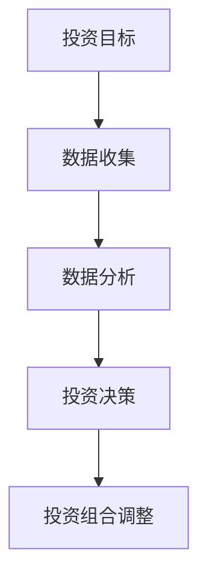
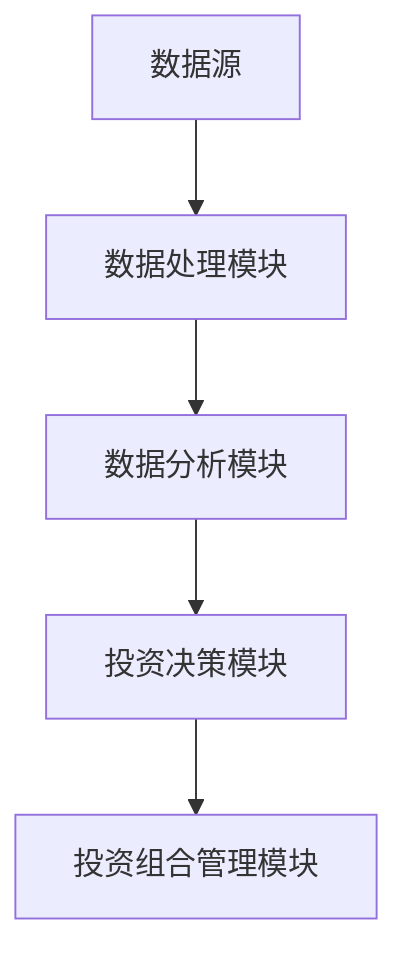
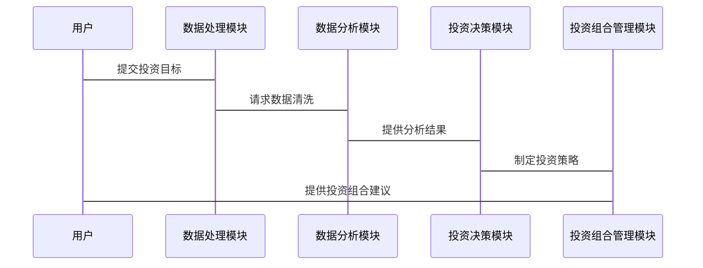

                 


# 《彼得林奇的"家庭作业"投资法》

---

## 关键词

- 彼得林奇
- 家庭作业投资法
- 投资策略
- 数据驱动投资
- 风险管理

---

## 摘要

本文深入分析了彼得林奇的“家庭作业”投资法，从其核心理念到系统化投资策略，详细探讨了如何通过数据驱动和系统化的方法进行投资决策。文章从背景介绍、核心概念、算法原理、系统架构到项目实战，层层剖析，结合实例和图表，全面揭示了这一投资方法的科学性和实用性。本文适合对投资策略和系统化方法感兴趣的读者阅读。

---

## 正文

---

## 第一部分：彼得林奇投资法的背景与核心理念

### 第1章：彼得林奇及其投资哲学

#### 1.1 彼得林奇的生平与投资成就

彼得·林奇（Peter Lynch）是全球最著名的投资者之一，曾任富达投资集团的基金经理，管理着麦哲伦基金，创造了年均29%的回报率。他的投资哲学强调长期投资、价值发现和风险管理。林奇的成功不仅在于其卓越的投资业绩，更在于他系统化的方法和对市场的深刻理解。

#### 1.2 家庭作业投资法的定义与特点

家庭作业投资法是彼得林奇提出的一种系统化投资策略，强调通过大量的数据收集和分析，结合市场趋势和公司基本面，制定科学的投资决策。与传统投资方法不同，家庭作业投资法更注重系统化和可复制性，避免了人为情绪的干扰。

#### 1.3 家庭作业投资法的核心要素

家庭作业投资法的核心要素包括：

1. **投资目标**：明确投资目标和收益预期。
2. **数据收集**：系统化地收集市场数据和公司信息。
3. **数据分析**：通过数据分析筛选出具有投资价值的标的。
4. **投资决策**：基于数据分析结果制定投资策略。
5. **投资组合管理**：动态调整投资组合，控制风险。

#### 1.4 家庭作业投资法的优势与局限性

- **优势**：
  - 系统性：通过系统化的数据收集和分析，避免了主观判断的偏差。
  - 可复制性：方法论清晰，易于学习和应用。
  - 风险控制：通过数据驱动的方法降低投资风险。

- **局限性**：
  - 信息依赖：依赖于数据的准确性和完整性。
  - 市场波动：无法完全预测市场的短期波动。

#### 1.5 本章小结

彼得林奇的家庭作业投资法是一种系统化、数据驱动的投资策略，强调通过大量数据的收集和分析，制定科学的投资决策。这种方法不仅适用于个人投资者，也适合机构投资者。

---

## 第二部分：家庭作业投资法的核心概念与联系

### 第2章：家庭作业投资法的原理与机制

#### 2.1 家庭作业投资法的原理

家庭作业投资法的核心原理是通过系统化的数据收集和分析，发现市场中的投资机会，并通过持续跟踪和调整投资组合，实现长期稳定的收益。这种方法强调数据的重要性，认为数据是投资决策的基础。

#### 2.2 家庭作业投资法的核心要素对比

以下是家庭作业投资法与其他投资方法的核心要素对比：

| 对比维度 | 家庭作业投资法 | 传统投资法 |
|----------|----------------|------------|
| 数据依赖 | 高             | 低         |
| 系统性   | 高             | 低         |
| 风险控制 | 高             | 低         |

通过 mermaid 绘制的核心要素 ER 实体关系图如下：



---

## 第三部分：家庭作业投资法的系统分析与架构设计

### 第3章：家庭作业投资法的系统分析

#### 3.1 投资场景与问题描述

在实际投资过程中，投资者面临的主要问题包括：

1. **信息过载**：市场数据繁杂，难以快速筛选出有价值的信息。
2. **决策失误**：由于情绪影响，容易做出错误的投资决策。
3. **风险控制**：缺乏系统化的风险管理方法。

#### 3.2 系统功能设计

家庭作业投资法的系统功能设计包括以下几个模块：

1. **数据收集模块**：从多种渠道收集市场数据和公司信息。
2. **数据分析模块**：对收集的数据进行清洗、整理和分析。
3. **投资决策模块**：基于数据分析结果，制定投资策略。
4. **投资组合管理模块**：动态调整投资组合，控制风险。

#### 3.3 系统架构设计

通过 mermaid 绘制的系统架构图如下：



#### 3.4 系统接口与交互

以下是系统交互流程的 mermaid 序列图：



---

## 第四部分：家庭作业投资法的项目实战

### 第4章：家庭作业投资法的项目实战

#### 4.1 环境安装

要实现家庭作业投资法，需要以下环境：

1. 数据收集工具：Python、爬虫框架（如BeautifulSoup、Scrapy）。
2. 数据分析工具：Pandas、NumPy。
3. 可视化工具：Matplotlib、Seaborn。
4. 投资组合管理工具：Excel、Python库（如Pymint）。

#### 4.2 核心代码实现

以下是家庭作业投资法的核心代码实现：

```python
import pandas as pd
import numpy as np

# 数据收集模块
def collect_data():
    # 模拟数据收集
    data = pd.DataFrame({
        '股票代码': ['AAPL', 'GOOGL', 'MSFT'],
        '股票名称': ['苹果', '谷歌', '微软'],
        '收盘价': [150, 120, 90]
    })
    return data

# 数据分析模块
def analyze_data(data):
    # 计算平均收益
    data['平均收益'] = data['收盘价'].pct_change().mean() * 100
    return data

# 投资决策模块
def make_investment_decision(data):
    # 选择平均收益最高的股票
    best_stock = data.sort_values('平均收益', ascending=False).head(1)
    return best_stock

# 投资组合管理模块
def manage_portfolio(best_stock):
    # 模拟投资组合
    portfolio = {
        '股票代码': best_stock['股票代码'].values[0],
        '投资金额': 10000
    }
    return portfolio

# 主程序
def main():
    data = collect_data()
    data = analyze_data(data)
    best_stock = make_investment_decision(data)
    portfolio = manage_portfolio(best_stock)
    print("最佳投资股票:", portfolio['股票代码'])
    print("投资金额:", portfolio['投资金额'])

if __name__ == "__main__":
    main()
```

#### 4.3 案例分析

假设我们有一个包含多只股票的数据集，通过家庭作业投资法，我们可以筛选出收益最高的股票进行投资。例如，以下代码展示了如何从数据中筛选出收益最高的股票：

```python
import pandas as pd

data = pd.DataFrame({
    '股票代码': ['AAPL', 'GOOGL', 'MSFT', 'AMZN'],
    '收盘价': [150, 120, 90, 300]
})

data['收益率'] = data['收盘价'].pct_change().mean() * 100
best_stock = data.sort_values('收益率', ascending=False).head(1)

print("最佳投资股票:", best_stock['股票代码'].values[0])
```

#### 4.4 项目小结

通过以上代码实现，我们可以看到家庭作业投资法在实际应用中的具体操作步骤。从数据收集到数据分析，再到投资决策和组合管理，整个流程清晰且系统化。

---

## 第五部分：家庭作业投资法的最佳实践与拓展

### 第5章：家庭作业投资法的最佳实践

#### 5.1 投资策略优化

- 定期复盘：定期回顾投资组合的表现，及时调整策略。
- 数据更新：保持数据的及时性和准确性。
- 风险控制：设置止损点，避免过度风险。

#### 5.2 注意事项

- 数据质量：确保数据来源可靠，避免错误决策。
- 情绪控制：避免情绪化投资，坚持系统化方法。
- 学习与更新：不断学习新的投资知识，更新投资方法。

#### 5.3 拓展阅读

- 彼得林奇的《彼得林奇选股术》
- 《投资学原理》
- 数据科学与投资分析的结合

#### 5.4 本章小结

家庭作业投资法是一种系统化、数据驱动的投资策略，通过科学的方法和持续的学习，可以帮助投资者实现长期稳定的收益。

---

## 作者信息

作者：AI天才研究院/AI Genius Institute & 禅与计算机程序设计艺术 /Zen And The Art of Computer Programming

---

* 本文为AI天才研究院（AI Genius Institute）原创文章，转载请注明出处。

