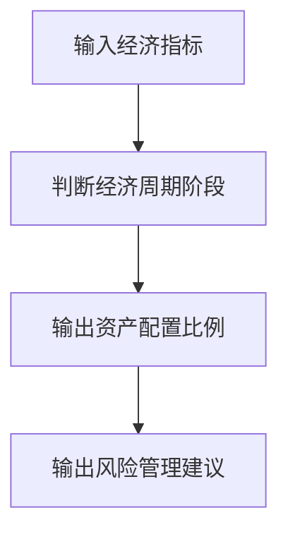
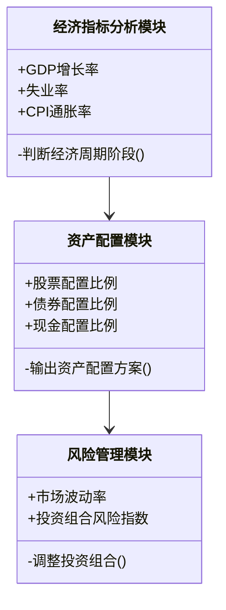

                 


# 彼得林奇的"家庭投资"在不同经济周期的资产配置

**关键词：** 彼得·林奇、家庭投资、经济周期、资产配置、投资策略、风险管理

**摘要：**  
本文深入分析了彼得·林奇的“家庭投资”理念，并探讨了其在不同经济周期下的资产配置策略。通过结合经济周期的特点，本文详细阐述了如何根据市场环境调整投资组合，以实现稳健的收益。文章还提供了基于彼得·林奇投资哲学的算法模型和系统设计，帮助读者更好地理解和应用这些策略。

---

## 第一章: 彼得·林奇的“家庭投资”概述

### 1.1 彼得·林奇的投资者背景

#### 1.1.1 彼得·林奇的生平简介  
彼得·林奇（Peter Lynch）是全球最著名的投资经理之一，曾管理富达麦哲伦基金（Fidelity Magellan Fund）长达13年，创造了年均29%的复合回报率。他的投资哲学以基本面分析和长期持有为核心，强调对企业的深入了解和对市场的敏感把握。

#### 1.1.2 彼得·林奇的投资理念  
林奇认为，投资成功的秘诀在于选择那些具有持续增长潜力的公司，并在市场低估时买入，在高估时卖出。他强调分散投资和风险控制，反对盲目跟风。

#### 1.1.3 家庭投资的核心概念  
家庭投资是指个人或家庭通过合理配置资产来实现财务目标的一种投资方式。与机构投资相比，家庭投资更注重风险控制和长期稳健收益。

---

### 1.2 家庭投资的背景与现状

#### 1.2.1 当前经济环境对家庭投资的影响  
当前全球经济波动加剧，通胀压力和市场不确定性增加，家庭投资者需要更加灵活地调整资产配置。

#### 1.2.2 家庭投资在不同经济周期中的表现  
在经济扩张期，股票和房地产表现较好；在经济衰退期，债券和现金资产更安全。

#### 1.2.3 家庭投资的潜在风险与机遇  
家庭投资需要在市场波动中把握机会，同时避免过度杠杆和盲目追涨杀跌。

---

## 第二章: 经济周期的基本概念与分类

### 2.1 经济周期的定义与特征

#### 2.1.1 经济周期的定义  
经济周期是指经济活动的波动过程，通常分为四个阶段：扩张期、衰退期、复苏期和稳定期。

#### 2.1.2 经济周期的四个阶段  
- **扩张期**：经济增长迅速，企业盈利增加，股票市场表现较好。  
- **衰退期**：经济增长放缓，企业盈利下降，债券和现金资产更安全。  
- **复苏期**：经济开始回升，股票和房地产市场逐渐恢复。  
- **稳定期**：经济保持平稳，适合长期持有各类资产。

#### 2.1.3 经济周期的衡量指标  
常用的经济指标包括GDP增长率、失业率、CPI通胀率等。

---

### 2.2 不同经济周期的资产表现

#### 2.2.1 扩张期的资产表现  
股票、房地产和高收益债券表现较好，现金资产回报率较低。

#### 2.2.2 衰退期的资产表现  
债券、现金和防御性股票（如公用事业股）表现较好。

#### 2.2.3 复苏期的资产表现  
股票和周期性股票（如工业股）表现较好，债券回报率逐渐下降。

#### 2.2.4 稳定期的资产表现  
各类资产表现相对平稳，适合长期持有。

---

### 2.3 家庭投资在不同经济周期中的策略选择

#### 2.3.1 扩张期的家庭投资策略  
- 增加股票配置，尤其是成长型企业股票。  
- 减少债券配置，但保留部分现金以应对市场波动。

#### 2.3.2 衰退期的家庭投资策略  
- 增加债券和现金配置，降低股票风险。  
- 选择防御性股票，如公用事业和医疗保健股。

#### 2.3.3 复苏期的家庭投资策略  
- 逐步增加股票配置，尤其是周期性股票。  
- 减少债券配置，但保持适度的现金储备。

#### 2.3.4 稳定期的家庭投资策略  
- 均衡配置各类资产，注重长期稳健收益。  
- 定期调整投资组合，保持风险可控。

---

## 第三章: 彼得·林奇的家庭投资策略

### 3.1 彼得·林奇的投资哲学

#### 3.1.1 价值投资的核心思想  
林奇强调买入低于市场价值的股票，并长期持有，直到市场重新评估其价值。

#### 3.1.2 长期投资的重要性  
长期投资能够平滑短期市场波动，实现资产的稳健增长。

#### 3.1.3 风险控制的策略  
通过分散投资和定期调整资产配置来降低风险。

---

### 3.2 彼得·林奇的选股方法

#### 3.2.1 选股的三大核心要素  
- **企业基本面**：关注企业的盈利能力、成长性和财务健康状况。  
- **市场情绪**：避免追高，寻找市场低估的股票。  
- **行业前景**：选择处于上升周期的行业。

#### 3.2.2 选股的量化指标  
- 市盈率（P/E）：低于行业平均水平的股票具有投资价值。  
- 市净率（P/B）：低于1的股票通常被低估。  
- 股息率：选择股息稳定的公司。

---

## 第四章: 基于彼得·林奇策略的算法模型

### 4.1 经济周期与资产配置的关系

#### 4.1.1 经济指标分析  
通过分析GDP增长率、失业率和CPI通胀率等指标，判断当前经济所处的周期阶段。

#### 4.1.2 资产权重计算  
根据经济周期阶段，动态调整各类资产的配置比例。例如：

- **扩张期**：股票60%、债券20%、现金20%。  
- **衰退期**：股票20%、债券60%、现金20%。  
- **复苏期**：股票40%、债券40%、现金20%。  
- **稳定期**：股票30%、债券30%、现金40%。

---

### 4.2 基于彼得·林奇策略的算法实现

#### 4.2.1 算法原理  
根据经济指标判断经济周期，动态调整资产配置比例。公式如下：

$$
\text{资产配置比例} = f(\text{GDP增长率}, \text{失业率}, \text{CPI通胀率})
$$

其中，$f$ 是根据经济周期阶段确定的函数。

#### 4.2.2 核心代码实现

```python
def get_economic_stage(gdp_growth, unemployment_rate, cpi_inflation):
    if gdp_growth > 3 and cpi_inflation < 2:
        return "expansion"
    elif gdp_growth < -1 and cpi_inflation > 5:
        return "recession"
    elif gdp_growth > -1 and gdp_growth < 3:
        return "recovery"
    else:
        return "stable"

def asset_allocation(economic_stage):
    if economic_stage == "expansion":
        return {"stocks": 60, "bonds": 20, "cash": 20}
    elif economic_stage == "recession":
        return {"stocks": 20, "bonds": 60, "cash": 20}
    elif economic_stage == "recovery":
        return {"stocks": 40, "bonds": 40, "cash": 20}
    else:
        return {"stocks": 30, "bonds": 30, "cash": 40}

# 示例代码
gdp_growth = 4.5
unemployment_rate = 5.0
cpi_inflation = 2.5

stage = get_economic_stage(gdp_growth, unemployment_rate, cpi_inflation)
allocation = asset_allocation(stage)
print(allocation)
```

#### 4.2.3 算法优化与风险管理  
通过动态调整资产配置比例，降低市场波动对投资组合的影响。例如，在衰退期增加债券配置，降低投资组合的波动性。

---

## 第五章: 系统分析与架构设计

### 5.1 系统功能设计

#### 5.1.1 领域模型设计  
- **经济指标分析模块**：输入经济指标，判断经济周期阶段。  
- **资产配置模块**：根据经济周期阶段，输出资产配置比例。  
- **风险管理模块**：实时监控市场波动，调整投资组合。

#### 5.1.2 功能流程图  


### 5.2 系统架构设计

#### 5.2.1 系统架构图  


---

## 第六章: 项目实战与案例分析

### 6.1 环境安装与代码实现

#### 6.1.1 环境安装  
安装Python和相关库（如pandas、numpy、matplotlib）。

#### 6.1.2 核心代码实现  
实现基于彼得·林奇策略的资产配置算法。

#### 6.1.3 代码解读与分析  
详细解释代码的功能和实现逻辑。

### 6.2 实际案例分析

#### 6.2.1 案例背景  
假设当前经济处于衰退期，GDP增长率为-2%，失业率为8%，CPI通胀率为5%。

#### 6.2.2 投资组合配置  
根据算法，资产配置为：股票20%、债券60%、现金20%。

#### 6.2.3 投资效果分析  
在衰退期，债券和现金配置能够有效降低投资组合的波动性，确保本金安全。

---

## 第七章: 最佳实践与注意事项

### 7.1 投资策略优化

#### 7.1.1 定期调整投资组合  
根据市场变化和经济指标，定期（如每季度）调整资产配置比例。

#### 7.1.2 个性化投资方案  
根据家庭的财务状况和风险承受能力，制定个性化的投资策略。

#### 7.1.3 风险管理工具  
使用止损和止盈工具，控制投资风险。

### 7.2 小结与总结

通过本文的分析，读者可以了解彼得·林奇的家庭投资理念，并掌握在不同经济周期下的资产配置策略。结合算法模型和系统设计，投资者可以更好地应对市场波动，实现稳健收益。

### 7.3 注意事项

- 投资需谨慎，建议在专业指导下进行。  
- 定期回顾和调整投资策略，以适应市场变化。  
- 避免过度杠杆和盲目跟风，注重风险控制。

### 7.4 拓展阅读

推荐阅读彼得·林奇的《彼得·林奇的成功投资》和《战胜市场的人》等书籍，深入理解其投资哲学。

---

**作者：AI天才研究院/AI Genius Institute & 禅与计算机程序设计艺术 /Zen And The Art of Computer Programming**

