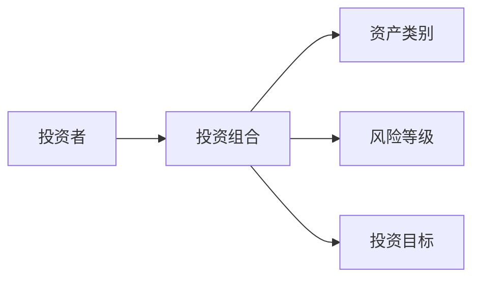
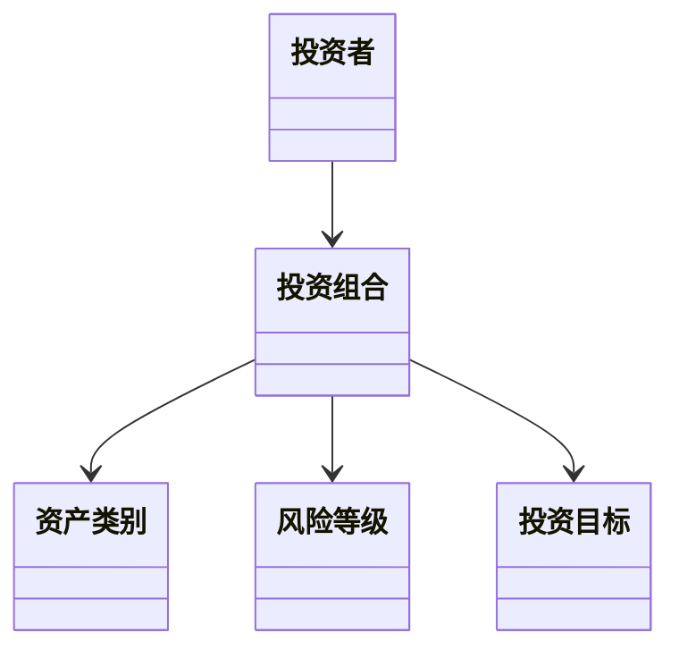
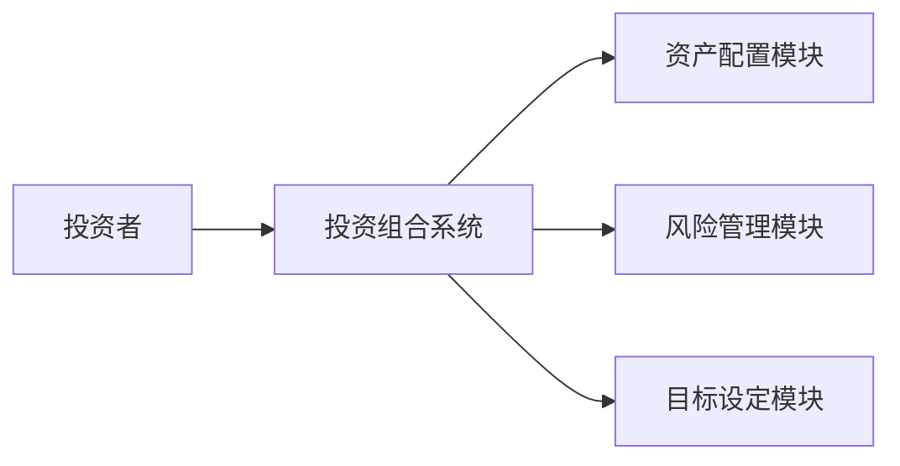

                 


# 彼得林奇的"家庭投资组合"在不同人生阶段的调整

---

## 关键词

- 彼得林奇
- 家庭投资组合
- 资产配置
- 风险管理
- 人生阶段

---

## 摘要

本文将探讨彼得林奇的家庭投资组合理念在不同人生阶段的调整策略。通过分析青年、中年和老年阶段的财务需求和投资目标，结合资产配置、风险管理等核心概念，提供实用的调整方法和数学模型，帮助读者制定个性化投资计划。

---

## 第一部分：背景介绍

### 第1章：彼得林奇与家庭投资组合概述

#### 1.1 彼得林奇的生平与投资理念

彼得·林奇是美国著名基金经理，以其在富达麦哲伦基金的卓越表现闻名。他的投资理念强调长期持有优质股票，注重基本面分析，并倡导分散投资以降低风险。

#### 1.2 家庭投资组合的基本定义

家庭投资组合是将家庭资产分配到不同资产类别（如股票、债券、房地产等）中的策略，旨在平衡风险与收益，满足家庭在不同阶段的财务需求。

#### 1.3 不同人生阶段的财务需求

- **青年阶段**：高风险高收益，注重资产增值。
- **中年阶段**：稳健配置，兼顾收益与风险。
- **老年阶段**：保守投资，注重资产保值。

---

## 第二部分：家庭投资组合的核心概念与联系

### 第2章：家庭投资组合的核心要素与属性

#### 2.1 核心概念原理

- **分散化原理**：通过投资不同资产降低风险。
- **资产配置**：根据风险承受能力分配资产比例。
- **风险与收益平衡**：高风险投资带来高收益，反之亦然。

#### 2.2 核心要素对比表格

| 要素            | 青年阶段                | 中年阶段                | 老年阶段                |
|-----------------|------------------------|------------------------|------------------------|
| 资产配置比例     | 高风险资产（股票、成长型基金） | 平衡配置（债券、股票）  | 低风险资产（债券、现金） |
| 风险承受能力     | 高                     | 中等                   | 低                     |
| 投资目标         | 资产增值               | 稳定收益               | 资产保值               |

#### 2.3 实体关系图（ER图）



---

## 第三部分：家庭投资组合的动态调整策略

### 第3章：不同人生阶段的投资组合调整

#### 3.1 青年阶段的投资策略

- **高风险资产**：股票、成长型基金占比高。
- **目标**：资产增值，为未来奠定基础。

#### 3.2 中年阶段的投资策略

- **平衡配置**：增加债券、房地产投资。
- **目标**：稳定收益，支持家庭开支。

#### 3.3 老年阶段的投资策略

- **低风险资产**：债券、现金为主。
- **目标**：资产保值，确保生活质量。

---

## 第四部分：数学模型与实例分析

### 第4章：家庭投资组合的数学模型

#### 4.1 CAPM模型

资本资产定价模型（CAPM）用于评估资产的预期收益：

$$ E(r_i) = r_f + \beta_i (E(r_m) - r_f) $$

其中，\( r_f \) 是无风险利率，\( \beta_i \) 是资产的贝塔系数，\( E(r_m) \) 是市场预期收益。

#### 4.2 实例分析

假设一个中年投资者，家庭资产为100万美元，风险承受能力中等。资产配置为60%股票、30%债券、10%房地产。

---

## 第五部分：系统分析与架构设计

### 第5章：系统架构设计

#### 5.1 领域模型类图



#### 5.2 系统架构图



---

## 第六部分：项目实战

### 第6章：家庭投资组合的实际应用

#### 6.1 环境安装

安装必要的金融分析工具，如Excel、Python（pandas库）。

#### 6.2 核心代码实现

```python
import pandas as pd

# 示例资产配置
assets = {'股票': 60, '债券': 30, '房地产': 10}
df = pd.DataFrame(assets.items(), columns=['资产', '比例'])
print(df)
```

#### 6.3 案例分析

以中年投资者为例，计算资产配置比例并优化。

---

## 第七部分：总结与展望

### 第7章：总结与最佳实践

#### 7.1 总结

彼得林奇的家庭投资组合理念强调根据人生阶段调整资产配置，平衡风险与收益。通过动态调整和风险管理，确保投资目标的实现。

#### 7.2 最佳实践 tips

- 定期评估投资组合。
- 保持分散投资，避免过度集中。
- 根据市场变化及时调整策略。

---

## 作者

作者：AI天才研究院/AI Genius Institute & 禅与计算机程序设计艺术 /Zen And The Art of Computer Programming

---

这篇文章通过详细分析彼得林奇的投资理念，结合数学模型和系统架构，为读者提供了在不同人生阶段调整家庭投资组合的实用策略。希望对您有所帮助！

