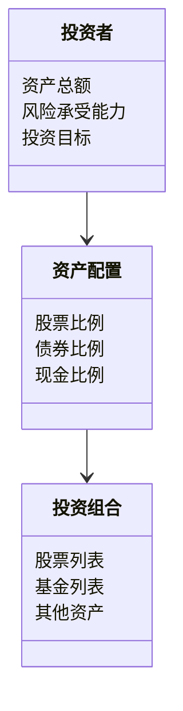

                 


# 彼得林奇的"家庭投资"风险控制方法

> 关键词：彼得林奇，家庭投资，风险控制，投资策略，资产配置，分散投资，金融风险管理

> 摘要：本文深入探讨了彼得·林奇的家庭投资风险控制方法，从核心概念、数学模型、系统架构到实战案例，详细阐述了如何通过科学的投资策略和风险管理来实现家庭财富的稳健增长。文章结合理论与实践，为读者提供了一套可操作的家庭投资方案。

---

## 第一部分: 家庭投资风险控制背景与核心概念

### 第1章: 投资与风险控制概述

#### 1.1 投资的基本概念
- **1.1.1 投资的定义与分类**
  - 投资是指将资金投入特定资产以获取收益的行为。
  - 分类：股票、债券、基金、房地产、黄金等。

- **1.1.2 风险控制的必要性**
  - 投资的本质是收益与风险的权衡。
  - 风险控制是投资成功的关键。

- **1.1.3 家庭投资的独特性**
  - 家庭投资目标通常是稳健增长，而非短期暴利。
  - 投资决策需兼顾家庭需求和风险承受能力。

#### 1.2 彼得·林奇与家庭投资方法
- **1.2.1 彼得·林奇的背景介绍**
  - 彼得·林奇是美国著名投资经理人，以价值投资闻名。
  - 他强调长期投资和分散投资的理念。

- **1.2.2 家庭投资的核心理念**
  - 价值投资：寻找被市场低估的优质资产。
  - 分散投资：避免过度集中以降低风险。

- **1.2.3 林奇投资方法的适用性**
  - 适用于个人和家庭，但需根据实际情况调整。

### 第2章: 风险控制的基本原理

#### 2.1 风险控制的核心概念
- **2.1.1 风险的定义与分类**
  - 市场风险：整体市场波动带来的风险。
  - 信用风险：债券发行人违约的风险。
  - 流动性风险：资产难以变现的风险。

- **2.1.2 投资风险的来源分析**
  - 市场波动、经济周期、公司基本面变化等。

- **2.1.3 风险与收益的平衡关系**
  - 高收益意味着高风险，反之亦然。

#### 2.2 家庭投资中的风险控制策略
- **2.2.1 分散投资的基本原理**
  - 通过投资不同类型资产降低风险。
  - 林奇建议家庭资产配置中股票、债券、现金的比例为6:3:1。

- **2.2.2 资产配置的重要性**
  - 根据家庭需求调整资产配置比例。
  - 定期审视并调整配置。

- **2.2.3 定期审视与调整投资组合**
  - 每季度复盘一次，根据市场变化和个人需求调整。
  - 例如，如果市场波动较大，增加债券比例。

---

## 第二部分: 彼得林奇的家庭投资方法

### 第3章: 家庭投资的核心要素与操作步骤

#### 3.1 林奇投资方法的核心要素
- **3.1.1 价值投资的基本原则**
  - 寻找基本面良好、估值合理的公司。
  - 例如，市盈率（P/E）低于行业平均水平。

- **3.1.2 长期投资的重要性**
  - 避免短期波动，注重长期收益。
  - 林奇建议持有优质股票至少5年以上。

- **3.1.3 股票选择的标准**
  - 行业地位：龙头企业更稳定。
  - 财务状况：低负债率、高ROE。
  - 管理团队：管理层稳定且有良好记录。

#### 3.2 家庭投资的具体操作步骤
- **3.2.1 确定投资目标与风险承受能力**
  - 投资目标：财富增值、保值。
  - 风险承受能力：根据家庭收入和支出情况确定。

- **3.2.2 制定资产配置方案**
  - 股票：60%
  - 债券：20%
  - 现金及短期存款：20%

- **3.2.3 选择合适的股票与基金**
  - 股票：选择成长股和蓝筹股。
  - 基金：指数基金和优质主动管理型基金。

- **3.2.4 定期复盘与调整投资组合**
  - 每季度复盘一次，根据市场变化和个人需求调整。
  - 例如，如果市场波动较大，增加债券比例。

### 第4章: 风险控制与投资决策的数学模型

#### 4.1 投资风险的量化分析
- **4.1.1 风险值（Volatility）的计算公式**
  - 波动率公式：
  $$ \text{波动率} = \sqrt{\frac{1}{n-1} \sum_{i=1}^{n} (x_i - \bar{x})^2} $$
  - 其中，\( x_i \) 是资产收益率，\( \bar{x} \) 是平均收益率，\( n \) 是数据点数。

- **4.1.2 风险调整后的收益计算**
  - 夏普比率公式：
  $$ \text{夏普比率} = \frac{E(r_i) - r_f}{\sigma_i} $$
  - 其中，\( E(r_i) \) 是资产的期望收益，\( r_f \) 是无风险利率，\( \sigma_i \) 是资产收益的标准差。

#### 4.2 家庭投资组合的风险控制模型
- **4.2.1 投资组合的最优配置**
  - 最优权重计算：
  $$ \text{最优权重} = \frac{w_i \times (E(r_i) - r_f)}{\sum_{j=1}^{n} w_j \times (E(r_j) - r_f)} $$
  - 其中，\( w_i \) 是资产 \( i \) 的权重，\( E(r_j) \) 是资产 \( j \) 的期望收益，\( r_f \) 是无风险利率。

- **4.2.2 风险分散的数学原理**
  - 风险分散：通过投资不同资产降低整体风险。
  - 协方差矩阵：用于衡量资产之间的相关性。

---

## 第三部分: 系统分析与架构设计

### 第5章: 家庭投资系统的功能设计

#### 5.1 系统功能设计
- **5.1.1 领域模型（Mermaid 类图）**


- **5.1.2 功能模块**
  - 用户输入：家庭资产和风险承受能力。
  - 系统计算：生成最优资产配置方案。
  - 输出结果：投资组合建议。

### 第6章: 系统架构设计

#### 6.1 系统架构设计
- **6.1.1 系统架构（Mermaid 架构图）**


- **6.1.2 关键组件**
  - 数据层：资产数据和市场数据。
  - 业务逻辑层：计算最优配置和风险评估。
  - 表现层：展示结果和操作界面。

---

## 第四部分: 项目实战

### 第7章: 家庭投资组合分析工具实现

#### 7.1 环境安装
- **7.1.1 安装Python和必要的库**
  - Python 3.8+
  - 导入库：pandas、numpy、matplotlib。

#### 7.2 核心功能实现

##### 7.2.1 资产配置计算
```python
import pandas as pd
import numpy as np

def calculate_optimal_allocation(portfolio_value, risk_tolerance):
    # 示例计算，简化模型
    stock_ratio = 0.6
    bond_ratio = 0.3
    cash_ratio = 0.1
    return {
        '股票': stock_ratio * portfolio_value,
        '债券': bond_ratio * portfolio_value,
        '现金': cash_ratio * portfolio_value
    }

# 示例调用
portfolio_value = 100000
risk_tolerance = '中等'
allocation = calculate_optimal_allocation(portfolio_value, risk_tolerance)
print(allocation)
```

##### 7.2.2 风险评估与调整
```python
def calculate_volatility(returns):
    mean = np.mean(returns)
    variance = np.sum((returns - mean)**2) / (len(returns)-1)
    volatility = np.sqrt(variance)
    return volatility

# 示例数据
returns = [0.05, 0.02, -0.03, 0.07, 0.01]
volatility = calculate_volatility(returns)
print(f"波动率: {volatility:.2f}")
```

#### 7.3 项目总结
- 工具实现了资产配置计算和风险评估功能。
- 可进一步优化，增加更多功能，如实时数据获取和回测分析。

---

## 第五部分: 最佳实践与总结

### 第8章: 家庭投资风险控制方法总结

#### 8.1 最佳实践
- **分散投资**：避免过度集中。
- **定期审视**：根据市场变化调整配置。
- **长期投资**：耐心持有优质资产。

#### 8.2 小结
- 彼得·林奇的家庭投资方法强调价值投资和分散投资。
- 通过科学的资产配置和风险控制，可以实现财富的稳健增长。

#### 8.3 注意事项
- 投资需根据个人实际情况调整。
- 避免盲目跟风，注重长期稳健。

#### 8.4 拓展阅读
- 《彼得·林奇的投资哲学》
- 《投资学基础》

---

## 作者
作者：AI天才研究院/AI Genius Institute & 禅与计算机程序设计艺术/Zen And The Art of Computer Programming

