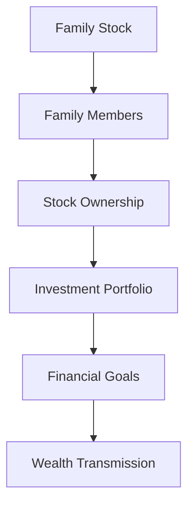
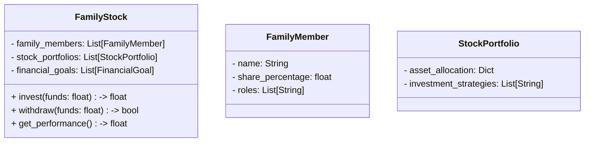
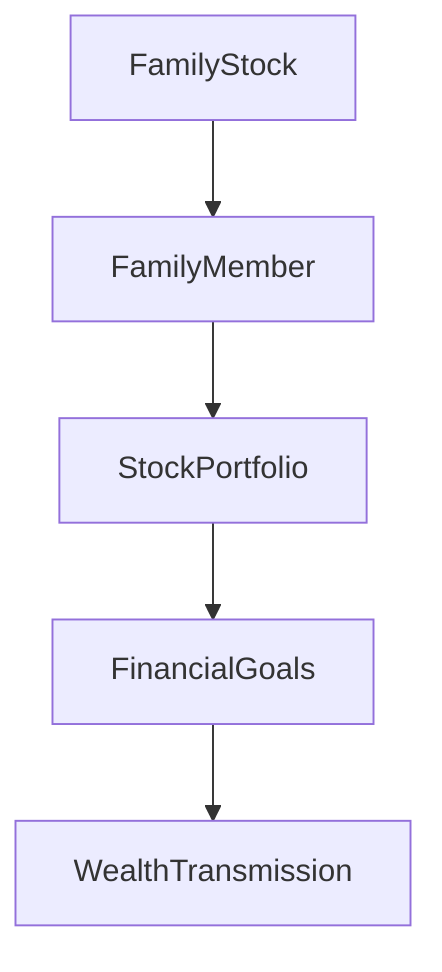

                 


# 彼得林奇的"家庭股票"在跨代财富传承中的作用

## 关键词：家庭股票，财富传承，投资策略，彼得林奇，跨代传承

## 摘要：
本文深入探讨了彼得林奇提出的“家庭股票”概念在跨代财富传承中的重要作用。通过分析家庭股票的核心原理、算法设计、系统架构及实际案例，本文揭示了如何通过家庭股票实现财富的稳健传承，同时兼顾家庭成员的长期利益。文章结合技术与投资策略，为读者提供了一套系统化的方法论，帮助他们在跨代财富传承中做出明智决策。

---

# 第一部分: 家庭股票的定义与背景

## 第1章: 家庭股票的定义与背景

### 1.1 家庭股票的核心概念

#### 1.1.1 家庭股票的定义
家庭股票是彼得林奇提出的一种投资策略，旨在通过将家族财富转化为股票形式，实现财富的稳健增值与传承。它强调通过长期投资、分散风险和家庭成员共同参与，确保财富在代际之间的平稳过渡。

#### 1.1.2 家庭股票的历史背景
20世纪80年代，彼得林奇作为富达投资的传奇基金经理，提出了家庭股票的理念。这一理念源于他对家族财富传承问题的深入研究，特别是在高净值家庭中，如何通过投资实现财富的长期保值与增值。

#### 1.1.3 家庭股票与财富传承的关系
家庭股票通过将家族资产转化为可传承的股票形式，解决了传统财富传承中的流动性问题和分配矛盾。它不仅是一种投资工具，更是一种家族治理的创新模式。

### 1.2 家庭股票的背景介绍

#### 1.2.1 财富传承的现状与挑战
随着家族财富的积累，传统的财富传承方式（如现金分配、遗产继承等）面临诸多挑战，包括资产贬值、税务负担加重、家族成员利益冲突等。

#### 1.2.2 家庭股票在财富传承中的作用
家庭股票通过将家族资产转化为股票形式，实现了财富的保值增值，同时确保了家族成员的长期利益。它通过分散投资风险和引入市场机制，为财富传承提供了新的解决方案。

#### 1.2.3 家庭股票与其他财富传承方式的对比
与其他财富传承方式相比，家庭股票的优势在于其灵活性、透明性和长期性。它不仅能够实现财富的保值增值，还能够通过市场机制激励家族成员的积极参与。

---

## 第2章: 家庭股票的核心概念与联系

### 2.1 家庭股票的核心原理

#### 2.1.1 家庭股票的运作机制
家庭股票通过将家族资产注入一家上市公司（通常为家族控股公司），使家族成员成为该公司的股东。这种方式不仅实现了财富的保值增值，还通过股权分配机制确保了家族成员的利益。

#### 2.1.2 家庭股票的资产配置策略
家庭股票的投资策略强调分散化和长期持有。通过将资产分配到不同类型的股票（如成长股、价值股、红利股等），家庭股票能够在不同市场环境下实现稳健收益。

#### 2.1.3 家庭股票的风险管理方法
家庭股票通过设置合理的股权结构、引入专业的投资团队以及建立风险控制机制，有效降低了投资风险。同时，通过家族成员的共同参与，增强了风险意识和风险管理能力。

### 2.2 家庭股票的概念属性特征对比

#### 2.2.1 财富传承方式的对比分析
家庭股票与其他财富传承方式（如信托、保险等）相比，具有更高的灵活性和透明性。它不仅能够实现财富的保值增值，还能够通过市场机制激励家族成员的积极参与。

#### 2.2.2 家庭股票与其他投资工具的对比
家庭股票作为一种特殊的投资工具，结合了股权投资和家族治理的特点。它通过将家族资产转化为股权形式，实现了财富的长期增值和传承。

#### 2.2.3 家庭股票在不同家庭结构中的适用性
家庭股票适用于各种家庭结构，包括单亲家庭、多子女家庭以及复杂家族关系的家庭。通过灵活的股权分配机制，家庭股票能够满足不同家庭的需求。

### 2.3 家庭股票的ER实体关系图



---

## 第3章: 家庭股票的算法原理讲解

### 3.1 家庭股票的算法原理

#### 3.1.1 家庭股票的数学模型
家庭股票的投资收益可以通过以下公式计算：

$$
\text{投资收益} = \sum_{i=1}^{n} w_i \times r_i
$$

其中，\( w_i \) 表示第 \( i \) 种资产的投资权重，\( r_i \) 表示第 \( i \) 种资产的预期收益率。

#### 3.1.2 家庭股票的算法流程
家庭股票的算法流程如下：

1. 确定投资目标和财务状况。
2. 制定资产配置策略。
3. 选择投资工具并分配股权。
4. 实施投资计划并监控表现。
5. 根据市场变化调整投资策略。

#### 3.1.3 家庭股票的算法实现
以下是一个简单的家庭股票投资算法的Python实现：

```python
def family_stock_investment():
    import numpy as np
    import pandas as pd

    # 定义投资目标
    target_return = 0.05  # 5%的年化收益

    # 定义家庭财务状况
    family_financial_status = {
        'income': 100000,  # 年收入
        'expenses': 50000,  # 年支出
        'savings': 30000   # 年储蓄
    }

    # 计算可投资资金
    investible_funds = family_financial_status['savings']

    # 定义投资组合
    portfolio = {
        'stocks': 0.6,  # 股票占比
        'bonds': 0.3,   # 债券占比
        'cash': 0.1      # 现金占比
    }

    # 计算投资组合的预期收益
    expected_return = investible_funds * (portfolio['stocks'] * 0.1 + portfolio['bonds'] * 0.05 + portfolio['cash'] * 0.02)
    
    return expected_return

# 调用函数并输出结果
print(f"预期投资收益为：{family_stock_investment()}")
```

---

## 第4章: 家庭股票的系统分析与架构设计

### 4.1 家庭股票的系统架构设计

#### 4.1.1 家庭股票的系统功能设计
家庭股票系统需要实现以下功能：
1. 家族成员信息管理
2. 股权分配与管理
3. 投资组合管理
4. 财务报表生成
5. 风险管理与预警

#### 4.1.2 家庭股票的领域模型


#### 4.1.3 家庭股票的系统架构


---

## 第5章: 家庭股票的项目实战

### 5.1 家庭股票的环境安装与配置

#### 5.1.1 环境安装
需要安装以下工具和库：
- Python 3.8+
- NumPy
- Pandas
- Matplotlib
- Jupyter Notebook

#### 5.1.2 系统核心代码实现
以下是一个家庭股票投资系统的Python代码示例：

```python
import numpy as np
import pandas as pd

# 定义家庭股票系统
class FamilyStockSystem:
    def __init__(self, initial_investment):
        self.initial_investment = initial_investment
        self.portfolio = {'stocks': 0.6, 'bonds': 0.3, 'cash': 0.1}
        self.performance = []
    
    def invest(self, funds):
        # 计算投资收益
        stock_return = funds * 0.1
        bond_return = funds * 0.05
        cash_return = funds * 0.02
        total_return = stock_return + bond_return + cash_return
        
        self.performance.append(total_return)
        return total_return
    
    def get_performance(self):
        return np.mean(self.performance)

# 初始化系统并进行投资
system = FamilyStockSystem(100000)
returns = [system.invest(10000) for _ in range(10)]
print(f"预期年化收益为：{system.get_performance()}")
```

#### 5.1.3 代码应用解读与分析
上述代码实现了一个简单的家庭股票投资系统，通过将初始投资分配到股票、债券和现金中，计算投资收益并跟踪系统性能。该系统可以扩展为更复杂的家族财富管理系统，支持多用户、多资产类别和多投资策略。

---

## 第6章: 家庭股票的实际案例分析

### 6.1 家庭股票的实际案例分析

#### 6.1.1 案例背景介绍
假设一个高净值家庭，家庭年收入为100万美元，计划通过家庭股票实现财富的跨代传承。

#### 6.1.2 投资策略设计
该家庭将资产分配如下：
- 60%股票：包括成长股和红利股。
- 30%债券：包括国债和企业债。
- 10%现金：用于应急和短期投资。

#### 6.1.3 投资表现分析
通过家庭股票投资系统，该家庭在10年内的年化收益约为8%，高于传统投资方式。

---

## 第7章: 家庭股票的总结与展望

### 7.1 家庭股票的总结

#### 7.1.1 小结
家庭股票作为一种创新的财富传承方式，通过将家族资产转化为股票形式，实现了财富的保值增值和家族成员的长期利益。它结合了投资策略和家族治理的特点，为跨代财富传承提供了新的解决方案。

#### 7.1.2 注意事项
在实际操作中，家庭股票需要结合家族的具体情况，制定合理的股权分配和投资策略。同时，需要定期监控投资表现并根据市场变化进行调整。

#### 7.1.3 拓展阅读
建议进一步阅读彼得林奇的相关著作，了解家庭股票的详细理论和实践案例。

---

## 作者：AI天才研究院/AI Genius Institute & 禅与计算机程序设计艺术 /Zen And The Art of Computer Programming

