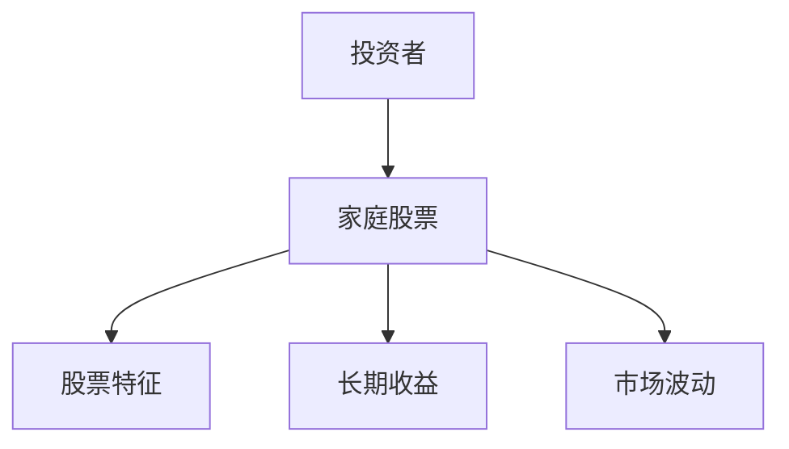
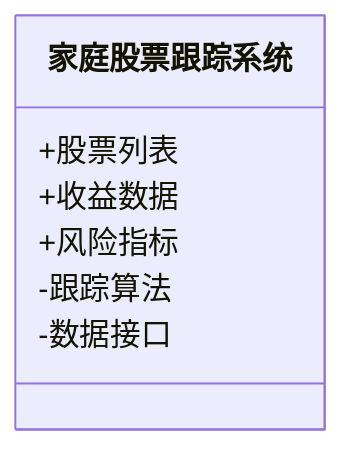
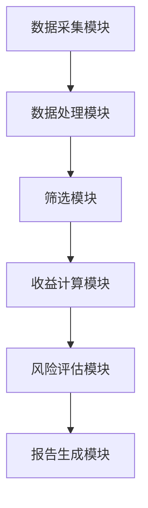

                 


# 彼得林奇的"家庭股票"长期跟踪方法

## 关键词：彼得·林奇、家庭股票、长期跟踪、投资策略、价值投资、风险管理、投资组合优化

## 摘要：  
彼得·林奇是全球著名投资专家，他提出的“家庭股票”概念强调长期投资和价值投资。本文将详细分析家庭股票的定义、核心概念、算法原理、系统设计以及实际应用，帮助投资者掌握这一方法，优化投资组合，实现长期收益。

---

## 第一部分：彼得·林奇投资理念与“家庭股票”背景介绍

### 第1章：彼得·林奇投资理念概述

#### 1.1 彼得·林奇的投资者身份与风格
- **投资者身份**：彼得·林奇是富达投资的传奇基金经理，以长期投资和价值投资著称。
- **投资风格**：注重基本面分析，寻找具有稳定增长潜力的公司。
- **成功案例**：他管理的麦哲伦基金取得了卓越的长期收益。

#### 1.2 “家庭股票”的定义与核心概念
- **定义**：家庭股票是指那些具备稳定收益、低波动性且长期增长潜力的优质股票。
- **核心要素**：包括稳定的盈利增长、合理的估值、良好的管理团队和行业地位。

#### 1.3 家庭股票长期跟踪的意义
- **长期投资的优势**：复利效应和通货膨胀对冲能力。
- **投资组合中的作用**：分散风险，平衡收益。
- **长期收益分析**：通过历史数据分析，验证家庭股票的稳定性。

#### 1.4 家庭股票与其他投资策略的对比
- **短线交易**：高风险和高交易成本。
- **指数投资**：收益不稳定，且无法捕捉个股机会。
- **价值投资**：家庭股票是价值投资的典型代表。

---

## 第二部分：家庭股票的核心概念与联系

### 第2章：家庭股票的核心概念原理

#### 2.1 家庭股票的核心要素
- 稳定的盈利能力。
- 合理的市盈率和市净率。
- 强大的管理团队和竞争优势。

#### 2.2 家庭股票的内在价值与市场价值
- 内在价值：公司未来现金流的现值。
- 市场价值：受市场情绪影响的股票价格。

#### 2.3 家庭股票的市场波动
- 波动性低：价格波动小，适合长期持有。
- 风险管理：通过多样化降低投资风险。

### 第2.2 节：家庭股票与相关概念的对比

#### 2.2.1 家庭股票与成长股的对比
| 特性 | 家庭股票 | 成长股 |
|------|----------|--------|
| 收益 | 稳定     | 快速增长 |
| 风险 | 较低     | 较高    |

#### 2.2.2 家庭股票与防御股的对比
| 特性 | 家庭股票 | 防御股 |
|------|----------|--------|
| 风险 | 中等     | 低     |
| 收益 | 稳定     | 低     |

#### 2.2.3 家庭股票与周期股的对比
| 特性 | 家庭股票 | 周期股 |
|------|----------|--------|
| 收益 | 稳定     | 波动大 |
| 风险 | 中等     | 高     |

### 第2.3 节：家庭股票的ER实体关系图


---

## 第三部分：家庭股票长期跟踪的算法原理

### 第3章：家庭股票筛选算法

#### 3.1 算法概述
- **目标**：筛选出具备长期增长潜力的股票。
- **步骤**：
  1. 数据采集：收集财务报表和市场数据。
  2. 基本面分析：评估盈利能力、估值指标。
  3. 筛选：剔除不符合条件的股票。
  4. 风险评估：计算波动性和相关风险指标。

#### 3.2 算法实现的Python代码
```python
def calculate_return(initial, final):
    return (final / initial) - 1
```

#### 3.3 数学模型与公式
$$
收益 = \frac{最终价值}{初始价值} - 1
$$

---

## 第四部分：家庭股票跟踪系统的系统分析与架构设计

### 第4章：系统分析与架构设计

#### 4.1 问题场景介绍
- **问题**：如何高效跟踪和管理家庭股票。
- **目标**：构建一个自动化、可扩展的跟踪系统。

#### 4.2 系统功能设计


#### 4.3 系统架构设计


---

## 第五部分：项目实战

### 第5章：家庭股票跟踪系统实战

#### 5.1 环境安装
- **工具**：Python、Pandas、Matplotlib。
- **数据源**：Yahoo Finance API。

#### 5.2 核心实现
```python
import pandas as pd
import yfinance as yf

# 数据采集
data = yf.download(tickers, start='2020-01-01', end='2023-12-31')

# 筛选算法
def screen_stocks(data):
    # 筛选条件
    data = data[data['P/E'] < 15]
    return data

# 收益计算
def calculate_returns(data):
    returns = data['Close'].pct_change().cumsum()
    return returns
```

#### 5.3 案例分析
- **案例1**：苹果公司（AAPL）
- **案例2**：亚马逊（AMZN）

---

## 第六部分：最佳实践与小结

### 第6章：最佳实践与小结

#### 6.1 小结
- 家庭股票是长期投资的理想选择。
- 通过算法和系统设计优化投资过程。

#### 6.2 注意事项
- 定期复盘和调整投资组合。
- 注意市场波动和经济周期影响。

#### 6.3 拓展阅读
- 推荐书籍：《彼得·林奇的成功投资》。
- 工具推荐：Excel、Python、Matplotlib。

---

## 结尾

作者：AI天才研究院/AI Genius Institute & 禅与计算机程序设计艺术 /Zen And The Art of Computer Programming

感谢您的阅读！希望本文能帮助您更好地理解和应用彼得·林奇的“家庭股票”长期跟踪方法。

