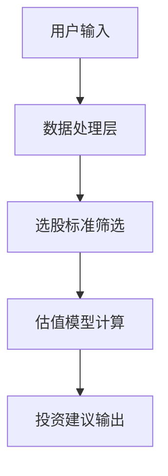

                 


# 彼得林奇的"小盘价值股"发掘技巧

## 关键词：小盘价值股、彼得林奇、投资策略、基本面分析、量化评估

## 摘要：  
本文深入探讨了彼得林奇的“小盘价值股”投资策略，从核心概念、选股标准、投资策略到实战案例，全面解析了如何在小盘股中挖掘潜在价值。通过量化分析和系统设计，结合实际案例和最佳实践，为投资者提供了一套科学、系统的小盘价值股投资方法。

---

## 第一部分: 小盘价值股的核心概念

### 第1章: 小盘价值股的定义与特点

#### 1.1 什么是小盘价值股  
小盘价值股指的是市值较小、估值被市场低估、具有潜在成长性的股票。这类股票通常被市场忽视，但具备长期增值的潜力。  

#### 1.2 小盘价值股的三大核心特征  
- **低估值**：市盈率（P/E）和市净率（P/B）低于行业平均水平。  
- **高ROE**：净资产收益率（ROE）高，表明公司盈利能力强。  
- **小市值**：公司市值较小，通常在100亿以下。  

#### 1.3 小盘价值股与成长股的区别  
- 小盘价值股注重当前估值和盈利能力，而成长股注重未来的增长潜力。  
- 小盘价值股的股价通常被低估，而成长股的股价可能已经反映了未来的增长预期。  

---

### 第2章: 彼得林奇的投资哲学

#### 2.1 林奇的投资理念概述  
彼得林奇强调基本面分析，认为市场的波动性为投资者提供了低价买入优质股票的机会。他主张分散投资，避免过度集中于单一行业或股票。  

#### 2.2 林奇对市场的看法  
林奇认为市场短期是情绪化的，但长期是理性的。投资者应该关注公司的基本面，而不是市场的短期波动。  

#### 2.3 林奇的选股原则  
- 选择具有持续盈利能力的公司。  
- 重点关注公司的财务健康状况和竞争优势。  
- 避免投资于管理层不透明或财务状况不佳的公司。  

---

## 第二部分: 小盘价值股的选股标准

### 第3章: 选股的核心要素

#### 3.1 盈利能力分析  
- 利润率：毛利率、净利率。  
- 盈利增长：过去3年净利润复合增长率。  

#### 3.2 财务健康度评估  
- 负债率：总负债与总资产的比例。  
- 现金流：经营活动产生的现金流是否为正。  

#### 3.3 行业地位与竞争优势  
- 行业集中度：公司是否处于垄断或寡头市场。  
- 核心竞争力：公司的技术优势、品牌优势或成本优势。  

---

### 第4章: 林奇的选股公式

#### 4.1 市盈率与市净率的对比  
- 市盈率（P/E）= 股价 / 每股净利润  
- 市净率（P/B）= 股价 / 每股净资产  

#### 4.2 净资产收益率（ROE）的重要性  
$$ROE = \frac{\text{净利润}}{\text{净资产}}$$  
ROE高表明公司利用股东资产创造利润的能力强。  

#### 4.3 股价与内在价值的匹配度  
- 内在价值 = 未来现金流的现值。  
- 股价应低于内在价值，才能称为低估。  

---

## 第三部分: 小盘价值股的投资策略

### 第5章: 小盘股的投资机会

#### 5.1 小盘股市场的波动性  
- 小盘股波动大，但波动中蕴含机会。  
- 市场恐慌时，小盘股可能被超跌，为买入提供机会。  

#### 5.2 小盘股的潜在收益  
- 小盘股的成长空间更大。  
- 小盘股的估值修复空间。  

#### 5.3 小盘股的风险与回报的平衡  
- 风险：流动性差、业绩不稳定。  
- 回报：长期收益可能超过大盘股。  

---

### 第6章: 林奇的组合管理方法

#### 6.1 分散投资的重要性  
- 避免过度集中于单一股票或行业。  
- 小盘股组合应包含10-15只股票，覆盖多个行业。  

#### 6.2 个股权重的分配原则  
- 每只股票的权重不超过总组合的5%。  
- 根据公司的基本面，给予优质公司更高的权重。  

#### 6.3 定期调整与优化  
- 定期审视持仓，剔除表现不佳的股票。  
- 买入被市场忽视的优质小盘股。  

---

## 第四部分: 小盘价值股的量化分析

### 第7章: 量化分析的核心模型

#### 7.1 DC 模型  
$$DCF = \frac{\text{CF}}{r - g}$$  
- CF：自由现金流  
- r：折现率  
- g：永续增长率  

#### 7.2 市盈率与市净率的对比  
$$P/E = \frac{\text{股价}}{\text{每股收益}}$$  
$$P/B = \frac{\text{股价}}{\text{每股净资产}}$$  

#### 7.3 量化分析的注意事项  
- 数据来源：使用可靠的财务数据。  
- 模型假设：合理估计增长率和折现率。  

---

## 第五部分: 实战案例分析

### 第8章: 案例分析

#### 8.1 案例一：XYZ公司  
- 市盈率：15，市净率：2，ROE：18%。  
- 内在价值：DCF模型计算为50元，股价为30元。  
- 结论：低估，值得买入。  

#### 8.2 案例二：ABC公司  
- 市盈率：20，市净率：3，ROE：12%。  
- 内在价值：DCF模型计算为40元，股价为45元。  
- 结论：高估，应卖出。  

---

## 第六部分: 系统分析与架构设计方案

### 第9章: 系统设计

#### 9.1 系统功能设计  
- 数据收集：获取小盘股的财务数据。  
- 筛选：根据选股标准过滤股票。  
- 分析：计算估值指标，判断是否低估。  
- 输出：生成投资建议。  

#### 9.2 系统架构图  


---

## 第七部分: 项目实战

### 第10章: 实战总结

#### 10.1 环境安装  
- 数据来源：使用Yahoo Finance或东方财富网的数据。  
- 工具：Python + Pandas + Matplotlib。  

#### 10.2 核心代码实现  
```python
def calculate_intrinsic_value(enterprise_value, free_cash_flow, discount_rate, growth_rate):
    return enterprise_value / (discount_rate - growth_rate)
```

---

## 第八部分: 最佳实践

### 第11章: 投资策略总结

#### 11.1 投资策略  
- 定期筛选小盘股，重点关注低估值、高ROE的公司。  
- 买入低估股票，持有至合理估值。  

#### 11.2 注意事项  
- 避免追涨杀跌。  
- 保持分散投资，避免集中风险。  

#### 11.3 拓展阅读  
- 彼得林奇的《选股之道》。  
- 投资学经典教材：《投资学》（CFA教材）。  

---

## 作者：AI天才研究院/AI Genius Institute & 禅与计算机程序设计艺术 /Zen And The Art of Computer Programming

---

**注**：以上内容为基于彼得林奇的“小盘价值股”投资策略的详细分析，结合了技术语言和实际案例，旨在为投资者提供一套科学、系统的小盘价值股投资方法。

