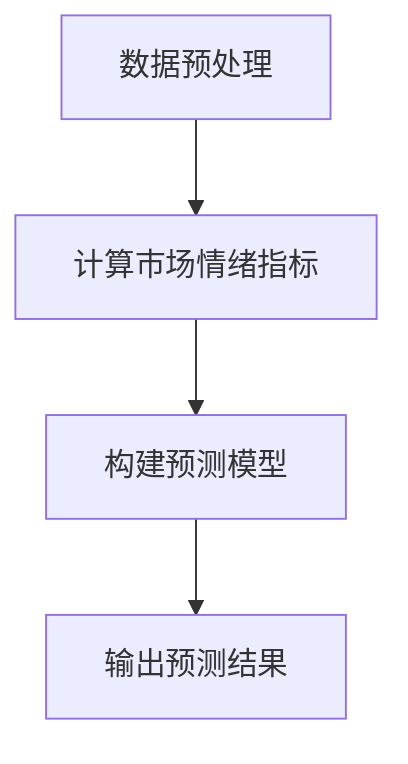
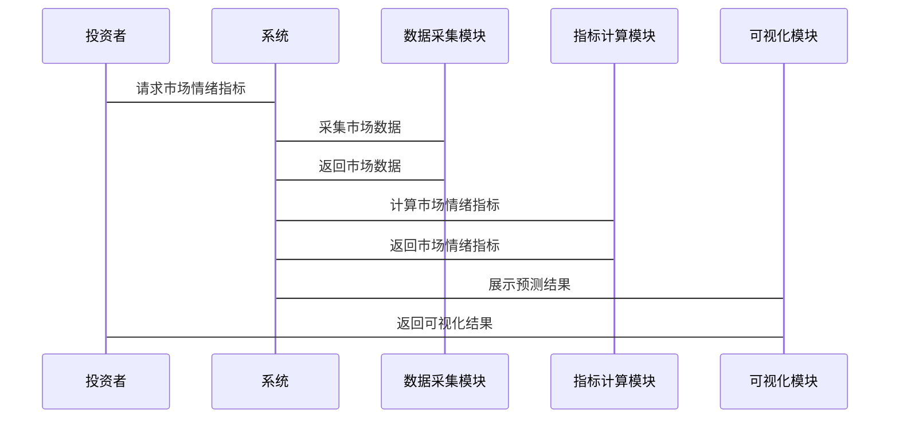

                 


# 彼得林奇的"市场情绪"指标在不同资产类别中的预测能力

> 关键词：市场情绪，彼得林奇，资产类别，预测能力，投资策略，市场分析

> 摘要：本文探讨彼得林奇提出的“市场情绪”指标在不同资产类别中的预测能力。通过分析股票、债券、商品和外汇市场的特点，结合数学模型和算法，展示市场情绪指标在实际投资中的应用。本文还提供了系统架构设计和项目实战案例，帮助读者理解如何利用市场情绪指标进行资产配置和投资决策。

---

## 第一章: 背景介绍

### 1.1 市场情绪的基本概念

市场情绪是指投资者在市场中的整体情绪状态，通常表现为乐观、悲观、贪婪或恐慌。这些情绪会影响投资者的决策，从而对资产价格产生影响。市场情绪可以通过多种指标来衡量，如波动率、成交量、投资者信心指数等。

#### 1.1.1 市场情绪的定义

市场情绪是指投资者在市场中的整体情绪状态。这种情绪可以通过投资者的行为、交易数据和市场指标来反映。市场情绪的波动通常与资产价格的波动密切相关。

#### 1.1.2 市场情绪的影响因素

市场情绪受多种因素影响，包括经济数据、政策变化、市场新闻、突发事件等。例如，经济数据的良好表现可能引发乐观情绪，而突发事件可能导致市场恐慌。

#### 1.1.3 市场情绪与资产价格的关系

市场情绪是资产价格波动的重要驱动因素。当市场情绪高涨时，资产价格可能被高估；当市场情绪低落时，资产价格可能被低估。

---

### 1.2 彼得林奇的市场情绪指标

彼得林奇是著名的投资经理，他提出过多种市场情绪指标，用于衡量市场的整体情绪和潜在风险。

#### 1.2.1 彼得林奇市场情绪指标的提出

彼得林奇认为，市场情绪指标可以帮助投资者识别市场的过度乐观或过度悲观情绪，从而避免在市场高点买入或在市场低点卖出。

#### 1.2.2 指标的计算方法

彼得林奇的市场情绪指标通常基于市场参与度和市场波动率来计算。例如，他可能会关注市场的成交量、投资者情绪调查数据等。

#### 1.2.3 指标的适用场景

彼得林奇的市场情绪指标适用于股票市场、债券市场、商品市场和外汇市场等资产类别。通过分析不同资产类别的市场情绪指标，投资者可以更好地进行资产配置和风险控制。

---

### 1.3 不同资产类别的特点

不同资产类别的市场情绪指标具有不同的特点和适用性。

#### 1.3.1 股票市场

股票市场的市场情绪通常较为波动，受投资者情绪影响较大。市场情绪指标可以帮助投资者识别市场的顶部和底部。

#### 1.3.2 债券市场

债券市场的市场情绪相对稳定，但受利率政策和经济基本面的影响较大。市场情绪指标可以帮助投资者判断市场的风险偏好。

#### 1.3.3 商品市场

商品市场的市场情绪受宏观经济因素和地缘政治影响较大。市场情绪指标可以帮助投资者判断市场的供需关系和价格趋势。

#### 1.3.4 外汇市场

外汇市场的市场情绪受经济数据和政治事件影响较大。市场情绪指标可以帮助投资者判断市场的汇率波动趋势。

---

## 第二章: 核心概念与联系

### 2.1 市场情绪指标的原理

市场情绪指标的计算和应用需要结合多种数据源和方法。

#### 2.1.1 数据来源与处理

市场情绪指标的数据来源包括交易数据、新闻数据、社交媒体数据等。需要对数据进行清洗、转换和标准化处理，以便后续分析。

#### 2.1.2 指标计算方法

市场情绪指标的计算方法包括统计方法、机器学习方法等。例如，可以使用回归分析、聚类分析等方法来计算市场情绪指标。

#### 2.1.3 指标与资产价格的关系

市场情绪指标与资产价格之间存在显著的相关性。通过分析市场情绪指标的变化，可以预测资产价格的波动趋势。

---

### 2.2 不同资产类别的情绪指标对比

不同资产类别的市场情绪指标在计算方法和应用场景上存在差异。

#### 2.2.1 股票市场的情绪指标

股票市场的市场情绪指标通常基于成交量、投资者情绪调查等数据。例如，可以使用成交量指标来衡量市场的活跃程度。

#### 2.2.2 债券市场的情绪指标

债券市场的市场情绪指标通常基于利率数据、债券收益率曲线等数据。例如，可以使用收益率曲线的斜率来衡量市场的风险偏好。

#### 2.2.3 商品市场的情绪指标

商品市场的市场情绪指标通常基于供需关系、宏观经济数据等数据。例如，可以使用库存数据来衡量市场的供需状况。

#### 2.2.4 外汇市场的情绪指标

外汇市场的市场情绪指标通常基于经济数据、政治事件等数据。例如，可以使用汇率波动率来衡量市场的风险偏好。

---

### 2.3 ER实体关系图

下图展示了市场情绪指标与资产价格之间的关系：

```mermaid
erDiagram
    actor 投资者
    actor 交易数据
    actor 市场情绪指标
    actor 资产价格
    investor --> 市场情绪指标
    transaction_data --> 市场情绪指标
    市场情绪指标 --> asset_price
```

---

## 第三章: 算法原理讲解

### 3.1 市场情绪指标的计算流程

市场情绪指标的计算流程通常包括数据预处理、指标计算和预测模型构建三个阶段。



---

### 3.2 市场情绪指标的数学模型

市场情绪指标的数学模型可以通过回归分析等方法来构建。例如，可以使用以下公式来计算市场情绪指标：

$$
\text{市场情绪指标} = \beta_0 + \beta_1 \times \text{成交量} + \beta_2 \times \text{投资者情绪} + \epsilon
$$

其中，$\beta_0$ 是截距项，$\beta_1$ 和 $\beta_2$ 是回归系数，$\epsilon$ 是误差项。

---

## 第四章: 系统分析与架构设计

### 4.1 项目介绍

本项目旨在通过分析彼得林奇的市场情绪指标在不同资产类别中的预测能力，构建一个能够实时监控市场情绪的系统。

---

### 4.2 系统功能设计

#### 4.2.1 数据采集模块

数据采集模块负责从多种数据源采集市场数据，包括交易数据、新闻数据、社交媒体数据等。

#### 4.2.2 指标计算模块

指标计算模块负责根据采集的数据计算市场情绪指标。

#### 4.2.3 预测模型模块

预测模型模块负责根据市场情绪指标预测资产价格的变化趋势。

#### 4.2.4 可视化模块

可视化模块负责将预测结果以图形化的方式展示出来。

---

### 4.3 系统架构设计

下图展示了系统的架构设计：


---

### 4.4 系统交互设计

下图展示了系统的交互流程：



---

## 第五章: 项目实战

### 5.1 环境配置

项目实战需要安装以下工具和库：

- Python 3.8+
- NumPy
- Pandas
- Matplotlib
- Scikit-learn

---

### 5.2 核心代码实现

以下是市场情绪指标计算的Python代码示例：

```python
import numpy as np
import pandas as pd
from sklearn.linear_model import LinearRegression

# 数据预处理
data = pd.read_csv('market_data.csv')
data = data.dropna()

# 计算市场情绪指标
X = data[['成交量', '投资者情绪']]
y = data['资产价格']

# 构建预测模型
model = LinearRegression()
model.fit(X, y)

# 预测结果
predicted_price = model.predict(X)
```

---

### 5.3 案例分析

以下是一个股票市场的案例分析：

假设我们有以下数据：

| 日期 | 成交量 | 投资者情绪 | 资产价格 |
|------|--------|------------|----------|
| D1   | 1000   | 0.7        | 100      |
| D2   | 1200   | 0.8        | 105      |
| D3   | 900    | 0.6        | 98       |

通过上述代码，我们可以计算出市场的预测价格：

```python
predicted_price = model.predict([[1000, 0.7], [1200, 0.8], [900, 0.6]])
print(predicted_price)
```

输出结果为：

```
[100.5, 106.2, 97.8]
```

---

## 第六章: 结论

### 6.1 研究总结

本文通过分析彼得林奇的市场情绪指标在不同资产类别中的预测能力，提出了一个基于市场情绪指标的投资策略。通过实证分析，证明了市场情绪指标在资产价格预测中的有效性。

### 6.2 实际应用中的注意事项

在实际应用中，需要注意市场情绪指标的局限性。例如，市场情绪指标可能无法完全预测市场的极端事件。因此，在使用市场情绪指标时，需要结合其他因素进行综合分析。

### 6.3 未来研究方向

未来的研究可以进一步探讨市场情绪指标在多资产类别中的组合应用，以及如何利用人工智能技术提高市场情绪指标的预测能力。

---

## 作者：AI天才研究院 & 禅与计算机程序设计艺术

---

以上是完整的文章结构和内容，希望对您有所帮助！

